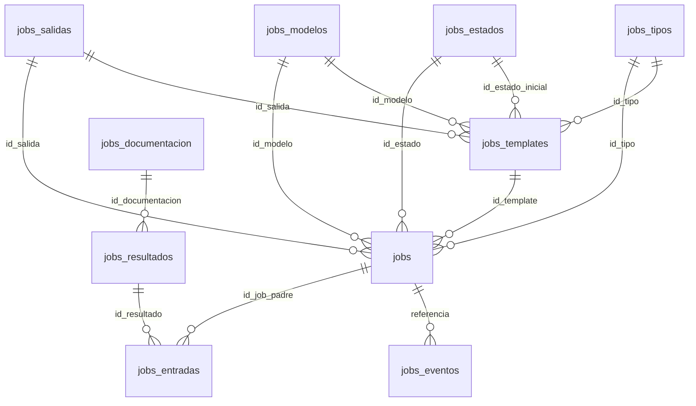
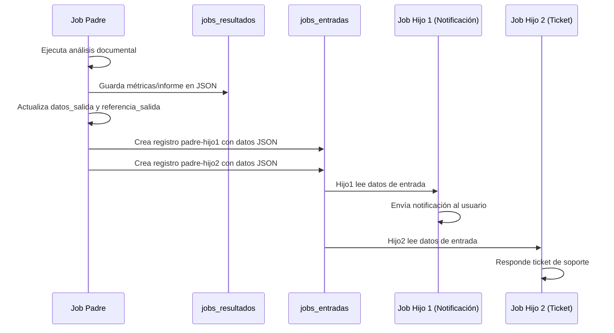

# Anewhope

Proyecto para gestionar infraestructura, aplicaciones y flujos de personalización de modelos LLM.

## Estructura principal

- `info.txt`: guía rápida para crear y activar el entorno virtual, además de notas de operación.
- `infrastructure/environments/<entorno>/protected_values.py`: variables sensibles por entorno.
- `docs/README_DEPLOYMENT.md`: guía de despliegue con verificación SQL y estructura de base de datos.
- `src/`: monorepo con organización hexagonal y dominios compartidos.
  - `main.py`: punto de entrada central para orquestar servicios.
  - `config/`: configuración compartida.
  - `tests/`: pruebas comunes.
  - `1_shared_domain/`: entidades y reglas de negocio reutilizables.
    - `entities/`
    - `business_rules/`
  - `2_shared_application/`: contratos y DTOs compartidos.
    - `interfaces/`
    - `dtos/`
    - `security/`: librería de utilidades criptográficas y secretos (`custom_cipher_lib.py`, `basesecuritypass.json`).
  - `apps/`: implementaciones específicas por servicio.
    - `3_backend/`: API REST principal (gestión y orquestación).
      - `1_domain/`
      - `2_application/`
      - `3_adapters/` (incluye `controllers/` y `mappers/`)
      - `4_infrastructure/` (`persistence/`, `web/`)
    - `4_trainer/`: servicio de entrenamiento y fine-tuning.
      - `1_domain/`
      - `2_application/`
      - `3_adapters/` (`controllers/`)
      - `4_infrastructure/` (`gpu_processor/`, `web/`)
    - `5_web_frontend/`: cliente web basado en Reflex.
      - `__init__.py`
      - `frontend_reflex/` (`__init__.py`, `components/`, `pages/`)
      - `adapters/` (`api_client.py`)
- `monorepo_llm_personalizado/`: estructura de referencia en español utilizada para planificar la migración a `src/`.
- `infrastructure/`: scripts y utilidades adicionales (pendiente de completar).
- `test/`: pruebas heredadas o de exploración.

## Sistema de Versiones

El proyecto utiliza un sistema de versionado semántico centralizado en el archivo `versions.yml` ubicado en la raíz del proyecto.

### Nomenclatura de Versiones

Todas las aplicaciones siguen el formato **`version.subversion.fix`** (ejemplo: `0.7.1`):

- **version** (major): Cambios importantes que rompen compatibilidad
- **subversion** (minor): Nuevas funcionalidades sin romper compatibilidad
- **fix** (patch): Correcciones de bugs y mejoras menores

### Archivo `versions.yml`

Contiene las versiones actuales de todas las aplicaciones del sistema:

```yaml
# Versions of software used
version_frontend: 0.7.1
version_backoffice: 0.7.1
version_middleware: 0.7.1
version_broker: 0.7.1
version_backend_core: 0.7.1
version_backend_ia: 0.7.1
version_fmanagement: 0.7.1
```

### Cómo Leer Versiones en el Código

Utiliza el módulo `version_reader` ubicado en `src/2_shared_application/utils/version_reader.py`:

```python
from utils.version_reader import get_version

# Obtener versión de una aplicación
version = get_version("frontend")  # Retorna "0.7.1"
version = get_version("backend_core")  # Retorna "0.7.1"

# Obtener información detallada
info = get_version_info("frontend")
# {'version': '0.7.1', 'major': 0, 'minor': 7, 'patch': 1}
```

### Visualización de Versiones

- **Frontend y Backoffice**: Muestran la versión en la esquina inferior izquierda del footer (formato: "Version: 0.7.1")
- **APIs y Servicios**: Cargan la versión al inicio y la registran en los logs

### Gestión de Versiones con Git

Cuando se incrementa una versión (major o minor), se debe crear un TAG en Git:

```bash
# Ejemplo: actualizar frontend a versión 0.8.0
# 1. Actualizar versions.yml
# 2. Commit de los cambios
git add versions.yml
git commit -m "chore: bump frontend version to 0.8.0"

# 3. Crear TAG
git tag -a v0.8.0-frontend -m "Release frontend 0.8.0 - [descripción de cambios]"

# 4. Push del TAG
git push origin v0.8.0-frontend
```

**Convención de TAGs:**
- `v{version}-{app}` para versiones específicas (ej: `v0.8.0-frontend`)
- `v{version}` para releases del sistema completo (ej: `v1.0.0`)

### Cuándo Incrementar Versiones

**Fix (patch) - ej: 0.7.1 → 0.7.2:**
- Corrección de bugs
- Mejoras de rendimiento
- Cambios de documentación
- No requiere TAG en Git

**Subversion (minor) - ej: 0.7.1 → 0.8.0:**
- Nuevas funcionalidades
- Mejoras significativas
- Cambios en la UI
- **Requiere TAG en Git**

**Version (major) - ej: 0.7.1 → 1.0.0:**
- Cambios que rompen compatibilidad
- Refactorización importante
- Nueva arquitectura
- **Requiere TAG en Git**

### Sincronización con fmanagement

El proyecto `fmanagement` está en un repositorio separado (`~/develop/fmanagement/`) pero comparte el sistema de versiones:

1. Copiar manualmente el archivo `versions.yml` a fmanagement
2. Usar el mismo `version_reader.py` para leer la versión
3. Mantener sincronizadas las versiones entre ambos proyectos

**Nota**: Se recomienda crear un script de sincronización automática en el futuro.

## Configuración por entorno

### Estructura de configuración

El proyecto soporta configuración personalizada por entorno usando cuatro niveles de archivos:

1. **`.envglobal`** (raíz del proyecto): Define el entorno activo globalmente
   ```
   # Configuración global del entorno
   current_environment: macbook
   ```
   Este archivo es la fuente principal para determinar qué entorno usar. Copia `.envglobal.example` 
   a `.envglobal` y modifica el valor según tu entorno de trabajo.

2. **`.env`** (raíz del proyecto): Variables de entorno adicionales (opcional)
   Puede sobrescribir el entorno definido en `.envglobal`:
   ```
   ENVIRONMENT=macbook
   ```

3. **`infrastructure/environments/<entorno>/env.yaml`**: Variables públicas y comunes
   - `storage_mode`: modo de almacenamiento (`mock`, `mock_and_db`, `db_only`)
   - `active_sync_db_jsons`: habilita/deshabilita sincronización DB→JSON (`"1"` o `"0"`)
   - `sync_database_interval_seconds`: intervalo de sincronización en segundos
   - Variables de aplicaciones (host y puerto por cada aplicación)
   - URLs de servicios internos (broker, core, middleware, fmanagement, trainer)
   - Configuración de Redis para sesión compartida

4. **`infrastructure/environments/<entorno>/protected_values.py`**: Variables sensibles
   - Credenciales de MariaDB
   - Secrets JWT
   - Claves de encriptación
   - Tokens de servicios externos

### Entornos disponibles

| Entorno | Descripción | Plataforma | Dominio interno | Dominio público |
|---------|-------------|------------|-----------------|-----------------|
| `macbook` | Desarrollo local | macOS 14.8.1 | tfmmyllm.ai | tfmmyllm.ai |
| `dev` | Desarrollo en servidor | Oracle Linux 10 (VirtualBox) | house.loc | house.loc |
| `pre` | Preproducción | Oracle Linux 10 (AWS) | anewhope.aws | getmyllm.com |
| `pro` | Producción | Oracle Linux 10 (AWS) | anewhope.aws | getmyllm.com |

**Nota sobre dominios en pre/pro:**
- **Dominio público (`getmyllm.com`):** Utilizado solo por nginx para exponer el frontend al exterior.
- **Dominio interno (`anewhope.aws`):** Utilizado para la comunicación entre servicios dentro de AWS.

**Convención de hostnames (IMPORTANTE):**

Todos los entornos, incluido macbook, usan nombres de servidor con dominio en lugar de `localhost`.
Esto garantiza coherencia entre entornos y evita errores de configuración al desplegar.

| Entorno | Formato hostname | Ejemplo |
|---------|-----------------|---------|
| `macbook` | `<servidor>.tfmmyllm.ai` | `backend.tfmmyllm.ai:8003` |
| `dev` | `<servidor>.house.loc` | `backend.house.loc:8003` |
| `pre/pro` | `<servidor>.anewhope.aws` | `backend.anewhope.aws:8003` |

En macbook, los hostnames resuelven a `127.0.0.1` mediante entradas en `/etc/hosts`:
```
127.0.0.1 frontend.tfmmyllm.ai
127.0.0.1 backend.tfmmyllm.ai
127.0.0.1 trainer.tfmmyllm.ai
```

**No usar `localhost` en ficheros de configuración.** Usar siempre el hostname del entorno correspondiente.

### Arquitectura de dominios y Vite allowedHosts

Cada entorno utiliza diferentes dominios para acceder a las aplicaciones web. Esta configuración es crítica para el funcionamiento correcto de Vite (servidor de desarrollo de Reflex) que valida el host de las peticiones HTTP entrantes.

**Variables de dominio en `env.yaml`:**

- **`public_name`**: Dominio público que el usuario escribe en el navegador
- **`private_name`**: Dominio interno usado para comunicación entre servicios (opcional, puede ser igual a public_name)

**Flujo de acceso por entorno:**

| Entorno | public_name | Flujo de acceso del navegador |
|---------|-------------|-------------------------------|
| macbook | tfmmyllm.ai | `http://tfmmyllm.ai:8005` → localhost:8005 (directo) |
| dev | house.loc | `http://anewhope.house.local` → nginx → `frontend.house.loc:8005` |
| pre | getmyllm.com | `https://www.getmyllm.com` → nginx → `frontend.anewhope.aws:8005` |
| pro | getmyllm.com | `https://www.getmyllm.com` → nginx → `frontend.anewhope.aws:8005` |

**Configuración de Vite:**

Las aplicaciones Reflex (frontend y backoffice) utilizan Vite como servidor de desarrollo. Por defecto, Vite solo acepta conexiones desde `localhost`. Para permitir acceso desde dominios personalizados, se debe configurar `allowedHosts` en `vite.config.js`.

**Scripts de parche automático:**

Los scripts `patch_vite_config.py` en cada aplicación web leen el `public_name` del archivo `env.yaml` del entorno activo y configuran automáticamente los hosts permitidos:

```javascript
// Ejemplo de configuración generada en vite.config.js
server: {
  port: process.env.PORT,
  allowedHosts: ['tfmmyllm.ai', '.tfmmyllm.ai', 'localhost'],
  hmr: true,
  // ...
}
```

**Cuándo ejecutar el parche:**

- Después de `reflex init` (regenera vite.config.js)
- Al cambiar de entorno (cambia el public_name)
- Si aparece el error: `Vite Error: Blocked request. This host ("xxx") is not allowed`

**Ejecución manual:**

```bash
# Desde la raíz del proyecto
cd src/apps/5_web_frontend && python patch_vite_config.py
cd src/apps/6_web_backoffice && python patch_vite_config.py

# O usar el script global clear_caches.sh que aplica el parche automáticamente
./clear_caches.sh
```

### Variables de aplicaciones en servidores

Cada archivo `env.yaml` define las variables de host y puerto para cada aplicación. Esto permite
que las aplicaciones conozcan la ubicación de los otros servicios en cada entorno.

**Regla de puertos:** `8000 + primer dígito del nombre de la carpeta de la aplicación`

| Aplicación | Carpeta | Puerto | Variable host | Variable puerto |
|------------|---------|--------|---------------|-----------------|
| Backend Core | `3_backend` | 8003 | `backend_core_host` | `backend_core_port` |
| Trainer (Backend IA) | `4_trainer` | 8004 | `trainer_host` | `trainer_port` |
| Web Frontend | `5_web_frontend` | 8005 | `frontend_host` | `frontend_port` |
| Web Backoffice | `6_web_backoffice` | 8006 | `backoffice_host` | `backoffice_port` |
| Middleware | `7_service_frontend` | 8007 | `middleware_host` | `middleware_port` |
| Broker | `8_service_backend` | 8008 | `broker_host` | `broker_port` |
| Fmanagement | API Go | 1666 | `fmanagement_host` | `fmanagement_port` |

**Distribución de aplicaciones en servidores por entorno (dominio interno):**

| Entorno | Servidor Frontend | Servidor Backend | Servidor Trainer |
|---------|-------------------|------------------|------------------|
| macbook | localhost | localhost | localhost |
| dev | frontend.house.loc | backend.house.loc | trainer.house.loc |
| pre | frontend.anewhope.aws | backend.anewhope.aws | trainer.anewhope.aws |
| pro | frontend.anewhope.aws | backend.anewhope.aws | trainer.anewhope.aws |

**Aplicaciones por servidor:**

- **Servidor Frontend:** `5_web_frontend`, `6_web_backoffice`, `7_service_frontend`, Redis
- **Servidor Backend:** `3_backend`, `8_service_backend`, Fmanagement, MariaDB
- **Servidor Trainer:** `4_trainer`, Ollama (IA local), ChromaDB (BD vectorial, puerto 8100)

### Endpoint de Consulta de Entorno Activo

El sistema expone endpoints para consultar el entorno activo en tiempo de ejecución.
Esto permite a los servicios (especialmente fmanagement en Go) configurarse dinámicamente.

**Endpoints disponibles:**

| Servicio | Endpoint | Puerto | Uso |
|----------|----------|--------|-----|
| Broker | `GET /config/environment` | 8008 | Fuente primaria del entorno |
| Backend Core | `GET /config/environment` | 8003 | Usado por fmanagement |

**Respuesta JSON:**

```json
{
    "environment": "macbook",
    "source": "ENVIRONMENT"
}
```

**Valores de entorno posibles:** `macbook`, `dev`, `pre`, `pro`

**Flujo de consulta para fmanagement:**

```
┌─────────────┐       GET /config/environment       ┌──────────────┐
│ fmanagement │ ─────────────────────────────────►  │ Backend Core │
│    (Go)     │                                     │   (Python)   │
│ Puerto 1666 │ ◄─────────────────────────────────  │  Puerto 8003 │
└─────────────┘   {"environment": "macbook", ...}   └──────────────┘
```

**Uso en fmanagement (Go) - inicialización:**

```go
// En init() o main()
func getActiveEnvironment() string {
    resp, err := http.Get("http://localhost:8003/config/environment")
    if err != nil {
        return "unknown"
    }
    defer resp.Body.Close()
    
    var result struct {
        Environment string `json:"environment"`
    }
    json.NewDecoder(resp.Body).Decode(&result)
    return result.Environment
}

// Uso para configurar rutas base
env := getActiveEnvironment()
switch env {
case "macbook":
    basePath = "/Users/administrator/develop/anewhope/data"
case "dev", "pre", "pro":
    basePath = "/data/files/external"
}
```

**Uso en Python (Backend Core/Broker):**

```python
import os

# Directamente desde variable de entorno
environment = os.environ.get("ENVIRONMENT", "unknown")
```

### Cómo obtener URLs de servicios en código

Las aplicaciones deben usar `get_env_value()` del módulo `env_settings.py` para obtener las URLs
de otros servicios. Esto garantiza que las variables de `env.yaml` se carguen correctamente
según el entorno activo.

**Ejemplo correcto:**

```python
# Cargar el módulo de configuración (carga dinámica por nombre numérico)
from src.2_shared_application.config import env_settings

def _get_middleware_base_url() -> str:
    """Obtiene la URL del middleware con prioridad correcta."""
    return env_settings.get_env_value("MIDDLEWARE_BASE_URL", "http://localhost:8007")
```

**Orden de prioridad al resolver valores:**

1. Variable de entorno explícita (definida con `export VARIABLE=valor`)
2. Valor en `env.yaml` del entorno activo (definido por `.envglobal`)
3. Valor por defecto proporcionado al llamar `get_env_value()`

**Variables de URL típicas:**

| Variable | Uso | Valor en macbook |
|----------|-----|------------------|
| `MIDDLEWARE_BASE_URL` | Frontend/Backoffice → Middleware | `http://localhost:8007` |
| `BROKER_BACKEND_BASE_URL` | Middleware → Broker | `http://localhost:8008` |
| `CORE_BACKEND_BASE_URL` | Broker → Backend Core | `http://localhost:8003` |
| `TRAINER_BACKEND_BASE_URL` | Broker → Trainer | `http://localhost:8004` |
| `FMANAGEMENT_BASE_URL` | Backend Core → Fmanagement | `http://localhost:1666` |

### Servicios en el servidor Trainer

El servidor trainer alberga los siguientes servicios:

| Servicio | Puerto | Descripción | Estado |
|----------|--------|-------------|--------|
| `4_trainer` | 8004 | Backend IA - gestiona entrenamientos, análisis y uso de modelos | Implementado |
| Ollama | 11434 | Servidor de modelos LLM locales (llama3, mistral, etc.) | Operativo |
| ChromaDB | 8100 | Base de datos vectorial para embeddings (RAG) | Implementado |

**Dependencias de IA instaladas en `.venv_trainer312` (Python 3.12):**

| Paquete | Versión | Propósito |
|---------|---------|-----------|
| TensorFlow | 2.16.2 | Framework de deep learning para entrenamiento de modelos |
| Keras | 3.13.2 | API de alto nivel para redes neuronales |
| ChromaDB | 1.5.0 | Base de datos vectorial para búsqueda semántica (RAG) |
| Ollama | 0.4.7 | Cliente Python para interacción con modelos LLM locales |
| python-docx | 1.1.2 | Extracción de texto de archivos `.docx` durante el chunking (fase 3 del entrenamiento RAG) |
| pypdf | 6.7.0 | Extracción de texto de archivos `.pdf` durante el chunking (fase 3 del entrenamiento RAG) |

**Flujo de comunicación:**
```
Broker (8008) → 4_trainer (8004) → Ollama (11434) → Inferencia LLM
                     ↓
              ChromaDB (8100) → Búsqueda semántica (embeddings)
```

**Arquitectura de ChromaDB:**
- El trainer arranca ChromaDB como proceso independiente al inicializarse (lifespan)
- ChromaDB funciona como servidor HTTP autónomo en el puerto 8100
- El trainer opera sobre ChromaDB mediante `chromadb.HttpClient`
- Al detenerse el trainer, ChromaDB se detiene automáticamente
- Datos persistidos en `persistence/chroma/` del servidor trainer
- Endpoint de health check: `GET /trainer/chroma/health`

**Configuración de ChromaDB por entorno:**

| Variable | macbook | dev | pre/pro |
|----------|---------|-----|---------|
| `chroma_host` | localhost | trainer.house.loc | trainer.anewhope.aws |
| `chroma_port` | 8100 | 8100 | 8100 |
| `chroma_persist_directory` | ~/data/.../persistence/chroma | /data/persistence/chroma | /data/persistence/chroma |
| `chroma_auth_token` | (en protected_values.py) | (en protected_values.py) | CAMBIAR EN PRODUCCIÓN |

### Variables protegidas por entorno (protected_values.py)

Cada entorno tiene su archivo `protected_values.py` con credenciales y URLs internas:

| Variable | macbook | dev | pre/pro |
|----------|---------|-----|---------|
| `mariadb_host` | localhost | backend.house.loc | backend.anewhope.aws |
| `broker_backend_base_url` | http://localhost:8008 | http://backend.house.loc:8008 | http://backend.anewhope.aws:8008 |
| `core_backend_base_url` | http://localhost:8003 | http://backend.house.loc:8003 | http://backend.anewhope.aws:8003 |
| `mariadb_cli_path` | /usr/local/opt/mariadb@10.6/bin/mysql | /usr/bin/mariadb | /usr/bin/mariadb |
| `chroma_auth_token` | chroma-dev-token-macbook-2026 | chroma-dev-token-house-2026 | CAMBIAR EN PRODUCCIÓN |

**Importante:** En producción (`pro`), todas las contraseñas, claves JWT y tokens de ChromaDB deben cambiarse antes del despliegue.

### Orden de carga y prioridad

Las aplicaciones cargan la configuración en este orden:

1. **`.envglobal`** → Define el entorno base (`current_environment`)
2. **`.env`** → Puede sobrescribir con `ENVIRONMENT=<entorno>`
3. **`env.yaml`** del entorno → Variables públicas
4. **`protected_values.py`** del entorno → Variables sensibles

**Prioridad para determinar el entorno:**
1. Variable de entorno `ENVIRONMENT` (definida en `.env` o shell)
2. `current_environment` en `.envglobal`
3. Valor por defecto: `macbook`

### Uso en código

Todas las aplicaciones deben usar el helper centralizado para cargar configuración:

```python
from src.2_shared_application.config.env_settings import (
    get_environment_name,
    get_env_value,
    get_protected_value,
    get_environment_paths,
    load_protected_settings,
    print_environment_info,
)

# Obtener el entorno activo
env = get_environment_name()  # "macbook", "dev", "pre", "pro"

# Leer variable pública
storage_mode = get_env_value("storage_mode", "mock")

# Leer variable sensible
db_password = get_protected_value("writer_password")

# Obtener todas las rutas de configuración
paths = get_environment_paths()
# paths = {
#     "root": Path("/Users/.../anewhope"),
#     "env_yaml": Path(".../infrastructure/environments/macbook/env.yaml"),
#     "protected_values": Path(".../infrastructure/environments/macbook/protected_values.py"),
#     "envglobal": Path(".../anewhope/.envglobal"),
#     "environment": "macbook"
# }

# Diagnóstico de configuración (útil para debugging)
print_environment_info()
# Output:
# Entorno activo: macbook
#   Root: /Users/.../anewhope
#   env.yaml: .../env.yaml (existe: True)
#   protected_values: .../protected_values.py (existe: True)
#   .envglobal: .../anewhope/.envglobal (existe: True)

# O cargar todos los valores protegidos
settings = load_protected_settings()
```

### Exportador de variables

Para generar un archivo de variables de entorno compatible con scripts shell o Docker:

```bash
# Formato shell
python infrastructure/export_env.py --environment macbook

# Formato envfile para Docker
python infrastructure/export_env.py --environment macbook --format envfile
```

## Entornos y plataformas

- `macbook`: desarrollo local en macOS 14.8.1 (equipo único que asume util01, frontend, backend, trainer).
- `dev`: virtualización en VirtualBox con Oracle Linux 10 (util01, frontend, backend, trainer).
- `pre` y `pro`: instancias en AWS con Oracle Linux 10 (util01, frontend, backend, trainer).

## Infraestructura de almacenamiento y datos

El proyecto utiliza una estructura de carpetas específica para organizar logs, datos de clientes, modelos generados y persistencia de bases de datos.

### Estructura base por entorno

| Entorno | Ruta base | Descripción |
|---------|-----------|-------------|
| **macbook** | `~/data/anewhope/files/` | Desarrollo local con subdirectorios por tipo de servidor |
| **dev/pre/pro** | `/data/` | Producción - cada servidor tiene su propia estructura en `/data/` |

### Organización por servidor

**Backend Server** (`backend.house.loc` / `backend.anewhope.aws`):
```
/data/
├── backend_core/logs/       # Logs de backend_core (puerto 8003)
├── service_backend/logs/    # Logs de broker (puerto 8008)
├── fmanagement/logs/        # Logs de fmanagement (puerto 1666)
├── external/                # Contenido de clientes (ORG#####/PRJ#####/v###/)
├── internal/                # Contenido generado (models/, reports/)
├── Mariadb/                 # Persistencia de MariaDB
└── images/                  # Imágenes Docker (tar.gz)
```

**Frontend Server** (`frontend.house.loc` / `frontend.anewhope.aws`):
```
/data/
├── frontend/logs/           # Logs de frontend (puerto 8005)
├── backoffice/logs/         # Logs de backoffice (puerto 8006)
├── middleware/logs/         # Logs de middleware (puerto 8007)
├── persistence/redis/       # Persistencia de Redis
└── images/                  # Imágenes Docker (tar.gz)
```

**Trainer Server** (`trainer.house.loc` / `trainer.anewhope.aws`):
```
/data/
├── backend_ia/logs/         # Logs de backend_ia (puerto 8004)
├── external/                # Contenido sincronizado desde backend
├── internal/                # Modelos y reports generados
├── persistence/chroma/      # Persistencia de Chroma DB (vectorial)
└── images/                  # Imágenes Docker (tar.gz)
```

### External vs Internal

| Carpeta | Contenido | Acceso | Sincronización |
|---------|-----------|--------|----------------|
| **external** | Documentos/imágenes de clientes | Frontend → fmanagement → Backend | Backend → Trainer (bajo demanda con `transferversion`) |
| **internal** | Modelos LLM y reportes generados | Solo sistema | Trainer → Backend (automático cada 5 min) |

**Estructura de external:**
- Jerarquía: `ORG#####/PRJ#####/v###/` (los usuarios pueden crear cualquier estructura dentro de cada versión)
- Ejemplo: `external/ORG00001/PRJ00001/v001/images/logo.png`

**Estructura de internal:**
- Carpetas fijas: `models/` y `reports/`
- Jerarquía: `ORG#####/PRJ#####/v###/` (igual que external)
- Ejemplo: `internal/models/ORG00001/PRJ00001/v001/model_llm.tar.gz`
- Ejemplo: `internal/reports/ORG00001/PRJ00001/v001/training_report.md`

### Variables de configuración

Todas las rutas se configuran en `infrastructure/environments/{entorno}/fmanagement_paths.yml`:

```yaml
# External (contenido de clientes)
backend_core_base_storage: /data/external              # dev/pre/pro
backend_ia_base_storage: /data/external                # dev/pre/pro

# Internal (contenido generado por sistema)
backend_core_internal_storage: /data/internal
backend_ia_internal_storage: /data/internal
backend_core_models_storage: /data/internal/models
backend_core_reports_storage: /data/internal/reports

# Logs por servicio
backend_core_logs_path: /data/backend_core/logs
frontend_logs_path: /data/frontend/logs
middleware_logs_path: /data/middleware/logs

# Persistencia
mariadb_data_path: /data/Mariadb
redis_data_path: /data/persistence/redis
chroma_data_path: /data/persistence/chroma

# Versiones de imágenes Docker
backend_core_image_version: 1.0.0
frontend_image_version: 1.0.0
```

### Scripts de gestión

| Script | Descripción | Uso |
|--------|-------------|-----|
| `scripts/setup_data_structure.sh` | Crear toda la jerarquía de carpetas | `./scripts/setup_data_structure.sh macbook` |
| `scripts/generate_docker_env.sh` | Generar `.env` desde YAML para docker-compose | `./scripts/generate_docker_env.sh dev backend` |
| `scripts/verify_fmanagement_sync.sh` | Verificar sincronización de configuración | `./scripts/verify_fmanagement_sync.sh` |

**Crear estructura de carpetas:**
```bash
# Desarrollo local (macbook)
./scripts/setup_data_structure.sh macbook

# Producción (ejecutar en cada servidor)
./scripts/setup_data_structure.sh dev backend    # En backend server
./scripts/setup_data_structure.sh dev frontend   # En frontend server
./scripts/setup_data_structure.sh dev trainer    # En trainer server
```

**Generar archivos .env para Docker:**
```bash
# Generar .env para todos los servicios de un servidor
./scripts/generate_docker_env.sh dev backend
# Genera: infrastructure/environments/dev/.env.backend

# Los archivos .env se utilizan en docker-compose.yml:
# docker-compose --env-file .env.backend up -d
```

### Sincronización rsync (dev/pre/pro)

Entre backend y trainer servers se sincroniza contenido automáticamente:

| Contenido | Dirección | Frecuencia |
|-----------|-----------|------------|
| `external/` | Backend → Trainer | Bajo demanda (`transferversion`) |
| `internal/models/` | Trainer → Backend | Automático (cada 5 min) |
| `internal/reports/` | Trainer → Backend | Automático (cada 5 min) |

**Configuración SSH:**
```yaml
# En fmanagement_paths.yml
trainer_ssh_host: trainer.house.loc
trainer_ssh_user: rsync_user
trainer_ssh_key_path: /opt/anewhope/keys/rsync_key
rsync_automatic_interval: 300  # 5 minutos
```

**NO se sincronizan:**
- `logs/` - Cada servidor mantiene sus propios logs
- `persistence/` - Cada base de datos es independiente
- `images/` - Las imágenes Docker son específicas de cada servidor

### Flujo de Informes (Reports)

Los informes generados durante el entrenamiento siguen un flujo específico de creación, sincronización y lectura:

**1. Generación en Trainer Server:**
```
Ruta: {backend_ia_internal_storage}/ORG#####/PRJ#####/v###/*.md
Ejemplo macbook: ~/data/anewhope/files/trainer_server/internal/ORG00001/PRJ00001/v001/
Ejemplo prod: /data/files/internal/ORG00001/PRJ00001/v001/
```

Los informes se generan como archivos markdown con formato de timestamp:
- `2026_01_30_225100_tabla_de_resultados.md`
- `2026_01_30_230500_metricas_de_entrenamiento.md`

**2. Sincronización automática (rsync over SSH):**
```bash
# Trainer → Backend (cada 5 minutos)
rsync -avz --delete \
  {trainer_internal}/ORG#####/PRJ#####/v###/ \
  {backend_internal}/ORG#####/PRJ#####/v###/
```

**3. Lectura por Visor de Informes:**
```
Ruta: {backend_core_internal_storage}/ORG#####/PRJ#####/v###/*.md
Ejemplo macbook: ~/data/anewhope/files/backend_server/internal/ORG00001/PRJ00001/v001/
Ejemplo prod: /data/files/internal/ORG00001/PRJ00001/v001/
```

**Variables de configuración relevantes:**
```yaml
# Generación (Trainer)
backend_ia_internal_storage: /data/files/internal

# Lectura (Backend - Visor de Informes)
backend_core_internal_storage: /data/files/internal
```

**Componente del visor:**
- Frontend: `src/apps/5_web_frontend/components/informes.py`
- Backoffice: `src/apps/6_web_backoffice/components/informes.py`
- Gestor: `src/2_shared_application/informes_manager.py`

### Diferencias macbook vs producción

| Aspecto | Macbook | Dev/Pre/Pro |
|---------|---------|-------------|
| Ruta base | `~/data/anewhope/files/{servidor}/` | `/data/` |
| Servidores | 3 subdirectorios en misma máquina | 3 servidores físicos separados |
| Sincronización | No necesaria | rsync over SSH |
| Docker | No se usa (ejecutar con `run.sh`) | docker-compose por servidor |

**Documentación completa:**
- Variables por entorno: `infrastructure/environments/{entorno}/fmanagement_paths.yml`
- Reglas de infraestructura: `AGENTS.md` sección 5.3.1
- Sincronización fmanagement: `infrastructure/environments/README_FMANAGEMENT_SYNC.md`

## Bases de Datos - Schema y Despliegue

### Schema Canónico

Los ficheros de schema canónico de MariaDB se encuentran en `infrastructure/database/schema/`:

| Fichero | Contenido |
|---|---|
| `000_create_myllm_core_db.sql` | 14 tablas + 7 vistas (auth, users, orgs, sessions, permissions) |
| `000_create_myllm_projects_db.sql` | 50 tablas + 11 triggers + 12 vistas (proyectos, entrenamientos, jobs, tickets) |
| `000_create_routines.sql` | 1 función + 4 stored procedures |

Estos ficheros representan la estructura completa de PRE y son la referencia para inicializar cualquier entorno.

### Migraciones

Las migraciones incrementales están en `infrastructure/database/migrations/` y se ejecutan en orden alfabético. Son idempotentes (pueden ejecutarse varias veces sin error).

### Inicialización por Entorno

| Entorno | Método | Comando |
|---|---|---|
| **macbook** | Schema manual | `mariadb -u root -p'<pass>' < infrastructure/database/schema/000_create_myllm_core_db.sql` (repetir con projects_db y routines) |
| **dev** | Schema via Ansible | `./deploy_custom.sh --env dev --server backend --tags mariadb,users,schema-init` |
| **pre** | Full dump + migraciones | `export_mariadb_from_macbook.sh pre` + `migrate_mariadb.yml` |
| **pro** | Full dump + migraciones | `export_mariadb_from_macbook.sh pro` + `migrate_mariadb.yml` |

### Actualización Incremental (todos los entornos)

```bash
# Via Ansible (dev/pre/pro)
./deploy_custom.sh --env <env> --server backend --tags code,migrations

# Manual (macbook)
for f in infrastructure/database/migrations/*.sql; do mariadb -u myllm_admin -p'<pass>' < "$f"; done
```

### Exportar Schema Actual de PRE

Cuando PRE tenga cambios de estructura:

```bash
cd /Users/administrator/develop/anh_ansible_environments
./scripts/export_mariadb_schema.sh pre --to-anewhope
```

### Bases de Datos del Sistema

| Base de datos | Tipo | Puerto | Ubicación |
|---|---|---|---|
| MariaDB (`myllm_core_db`, `myllm_projects_db`) | Relacional | 3306 | Backend |
| Redis | Clave-valor (sesiones) | 6379 | Frontend |
| ChromaDB | Vectorial (embeddings) | 8100 | Trainer |

Documentación detallada: `infrastructure/database/schema/README.md`

## Estrategia de Dockerfiles y despliegue

### Dockerfiles por aplicación

Cada aplicación en `src/apps/*` tiene su propio `Dockerfile` y un script `docker_execution.sh` 
que facilita la construcción y ejecución del contenedor:

- `src/apps/3_backend/Dockerfile` y `docker_execution.sh`
- `src/apps/5_web_frontend/Dockerfile` y `docker_execution.sh`
- `src/apps/6_web_backoffice/Dockerfile` y `docker_execution.sh`
- `src/apps/7_service_frontend/Dockerfile` y `docker_execution.sh`
- `src/apps/8_service_backend/Dockerfile` y `docker_execution.sh`

El script `docker_execution.sh` de cada aplicación:
1. Carga las variables de entorno desde `.env` y `env.yaml` del entorno activo
2. Construye la imagen Docker con `docker build`
3. Ejecuta el contenedor exponiendo el puerto fijo de la aplicación

Ejemplo de uso:
```bash
cd src/apps/7_service_frontend
bash docker_execution.sh
```

### Docker Compose por servidor

Los archivos `docker-compose.yml` están organizados por servidor en `infrastructure/servers/*` 
y agrupan los servicios que se ejecutarán juntos en cada servidor:

- `infrastructure/servers/frontend/docker-compose.yml`: `nginx`, `5_web_frontend`, 
  `6_web_backoffice`, `7_service_frontend`
- `infrastructure/servers/backend/docker-compose.yml`: `8_service_backend`, `3_backend`, 
  `fmanagement` (Go API), `mariadb`
- `infrastructure/servers/trainer/docker-compose.yml`: `4_trainer` (Backend IA), 
  `keras_service` (placeholder para servicio Keras)
- `infrastructure/servers/macbook/docker-compose.yml`: solo aplicaciones internas 
  (MariaDB y Keras nativos)

### Servidor frontend (Linux)

- `infrastructure/servers/frontend/docker-compose.yml`: `nginx`, `5_web_frontend`,
  `6_web_backoffice`, `7_service_frontend`.
- Plantilla Nginx para ansible:
  `infrastructure/servers/frontend/nginx/nginx.conf.template`.

### Servidor backend (Linux)

- `infrastructure/servers/backend/docker-compose.yml`: `8_service_backend`,
  `3_backend`, `fmanagement` (imagen externa), `mariadb`.

### Servidor trainer (Linux)

- `infrastructure/servers/trainer/docker-compose.yml`: `4_trainer` (placeholder),
  `keras_service` (placeholder).
- En macOS se instalará TensorFlow CPU en un venv ` .env_trainer` y Keras 2.15
  con TensorFlow 2.15. [Keras getting started](https://keras.io/getting_started/)

### Macbook (local)

- `infrastructure/servers/macbook/docker-compose.yml` solo contiene aplicaciones internas.
- MariaDB se usa nativa (instalada).
- **Redis se usa nativo (instalado con Homebrew)** para sesión compartida.
- Nginx se instala con Homebrew y se configura con:
  `infrastructure/servers/macbook/nginx/nginx.conf`.

#### Redis para sesión compartida

**Instalación en macbook:**

Redis se usa como backend de sesión compartida entre frontend y backoffice, permitiendo que ambas aplicaciones Reflex compartan el state del usuario de forma nativa.

```bash
# Instalar Redis con Homebrew
brew install redis

# Iniciar Redis (automático en cada boot)
brew services start redis

# O iniciar manualmente con configuración específica
redis-server infrastructure/redis/macbook/redis.conf

# O usar configuración por defecto del sistema
redis-server /usr/local/etc/redis.conf

# Verificar estado
./scripts/manage_redis.sh status

# Ver sesiones activas
./scripts/monitor_redis_sessions.py

# Monitoreo continuo
./scripts/monitor_redis_sessions.py --continuous
```

**Configuración:**

Redis está configurado con:
- **Host**: `localhost` (solo conexiones locales)
- **Puerto**: `6379` (estándar)
- **Base de datos**: `0` (compartida entre frontend y backoffice)
- **Password**: Almacenado en `protected_values.py` de cada entorno
- **Persistencia AOF**: Activada para durabilidad de datos
- **TTL sesiones**: 3600 segundos (1 hora, configurable en `env.yaml`)
- **Archivo de configuración**: `infrastructure/redis/macbook/redis.conf`

**Variables de configuración:**

En `infrastructure/environments/<entorno>/env.yaml`:
```yaml
redis_host: localhost
redis_port: "6379"
redis_db: "0"
redis_token_expiration: "3600"
redis_lock_expiration: "10000"
redis_lock_warning_threshold: "1000"
```

En `infrastructure/environments/<entorno>/protected_values.py`:
```python
redis_password = "PassRedis2025"
```

**Gestión del servicio:**

```bash
# Script de gestión
./scripts/manage_redis.sh {install|start|stop|restart|status|cli|flush|sessions|monitor}

# Ejemplos
./scripts/manage_redis.sh install    # Instalar Redis
./scripts/manage_redis.sh start      # Iniciar servicio
./scripts/manage_redis.sh status     # Ver estado
./scripts/manage_redis.sh sessions   # Listar sesiones activas
./scripts/manage_redis.sh cli        # Abrir Redis CLI
```

**Arquitectura de sesión compartida:**

```
┌─────────────┐         ┌──────────────┐
│   Frontend  │←────────┤  Redis Server│
│  (Puerto    │  State  │  (Puerto     │
│   8005)     │ Shared  │   6379)      │
└─────────────┘         └──────────────┘
                              ↑
┌─────────────┐               │
│  Backoffice │───────────────┘
│  (Puerto    │    State Shared
│   8006)     │
└─────────────┘
```

Ambas aplicaciones (frontend y backoffice) comparten automáticamente:
- Datos del usuario
- Permisos de bajo nivel
- Tokens JWT
- Estado de navegación

**Monitoreo:**

```bash
# Ver todas las sesiones en tiempo real
./scripts/monitor_redis_sessions.py

# Salida ejemplo:
# 📊 MONITOR DE SESIONES REDIS - 2026-01-26 10:30:15
# ✅ Sesiones activas: 2
# 
# 🔑 Session Key: reflex:session:abc123...
# ⏱️  TTL: 3456 segundos (57 minutos)
# 👤 Usuario:
#    ID: 1
#    Nombre: adminone
#    Email: adminone@tfmmyllm.ai
# 🔐 Permisos Críticos:
#    training_create: ✅
# 🔧 Acceso Backoffice: ✅ SÍ
```

**Limpieza de sesiones:**

```bash
# Limpiar sesiones expiradas manualmente
./scripts/monitor_redis_sessions.py --cleanup

# Limpiar TODAS las sesiones (⚠️ CUIDADO)
redis-cli -a $(grep redis_password infrastructure/environments/macbook/protected_values.py | cut -d'"' -f2) FLUSHALL
```

**Documentación completa:**
- **ADRs (Decisiones arquitectónicas):**
  - `src/docs/stack_of_technologies.adr` - ADR: Sesión Compartida Frontend/Backoffice usando Redis
  - `src/docs/stack_of_technologies.adr` - ADR: Compatibilidad Redis 5.2.1 con Reflex 0.8.25
- **Implementación técnica:**
  - Implementación: `docs/REDIS_IMPLEMENTATION.md`
  - Estado de implementación: `docs/REDIS_IMPLEMENTATION_STATUS.md`
  - **Despliegue Docker (dev/pre/pro):** `docs/REDIS_DOCKER_DEPLOYMENT.md` ✅ NUEVO
  - Diseño de conmutación: `docs/SWITCHING_DESIGN.md`
  - Guía de instalación macbook: `infrastructure/redis/macbook/INSTALATION_GUIDE.md`
  - Configuraciones por entorno: `infrastructure/redis/{macbook,dev,pre,pro}/`
  - **Docker Compose:** `infrastructure/servers/frontend/docker-compose.yml` ✅ ACTUALIZADO
  - **Guía servidor frontend:** `infrastructure/servers/frontend/README.md` ✅ NUEVO
- **Código:**
  - **Estado compartido:** `src/2_shared_application/reflex_shared/shared_session_state.py`
  - Tests de integración: `src/apps/{5_web_frontend,6_web_backoffice}/tests/test_redis_integration.py`
- **Automatización Docker:**
  - Scripts por entorno: `infrastructure/redis/{dev,pre,pro}/build_and_run_docker.sh` ✅ NUEVO
  - Dockerfiles: `infrastructure/redis/{dev,pre,pro}/Dockerfile` ✅ NUEVO

**SharedSessionState:**

El estado de sesión se gestiona mediante la clase `SharedSessionState` que hereda de `rx.State`:

```python
from src.2_shared_application.reflex_shared import SharedSessionState

class FrontendState(SharedSessionState):
    """Hereda automáticamente 13 campos de usuario, 45 permisos, tokens JWT y metadata."""
    pass
```

**Características:**
- ✅ 13 campos de usuario (`user_id`, `organization_id`, `user_name`, `user_email`, etc.)
- ✅ 45 permisos de bajo nivel (`can_data_read`, `can_folder_create`, `can_training_create`, etc.)
- ✅ 2 tokens JWT (`access_token`, `session_token`)
- ✅ 4 campos de metadata (`session_id`, `login_time`, `last_activity`, `current_app`)
- ✅ Métodos: `load_user_data()`, `clear_session()`, `go_to_backoffice()`, `go_to_frontend()`, `logout()`
- ✅ Propiedades: `can_access_backoffice`, `user_display_name`, `user_display_email`

**Ejemplos de uso:**
- Frontend: `docs/examples/frontend_state_with_shared_session.py`
- Backoffice: `docs/examples/backoffice_state_with_shared_session.py`
- **Validación de permisos en UI:** `docs/examples/permission_validation_example.py`

**Validación de permisos en componentes UI:**

Los permisos de bajo nivel (`low_level_permissions`) están disponibles como campos booleanos
en el estado compartido. Ejemplo para mostrar/ocultar una opción de "Renombrar carpeta":

```python
# En un componente Reflex
def folder_context_menu(state):
    return rx.menu.content(
        # La opción solo se muestra si el usuario tiene permiso folder_rename
        rx.cond(
            state.can_folder_rename,  # ← Permiso cargado desde sesión/JWT
            rx.menu.item("Renombrar carpeta", on_click=state.rename_folder),
            rx.fragment(),  # No renderiza nada si no tiene permiso
        ),
        rx.cond(
            state.can_folder_delete,
            rx.menu.item("Eliminar carpeta", on_click=state.delete_folder),
            rx.fragment(),
        ),
    )
```

**Validación en backend (complementaria):**

El middleware valida permisos con `has_low_level_permission(session, "folder_rename")`:

```python
# En el middleware o backend
if not router.has_low_level_permission(session, "folder_rename"):
    raise HTTPException(status_code=403, detail="Sin permiso")
```

**Aplicaciones creadas:**
- ✅ `5_web_frontend`: Puerto 8005, VE `.venv_frontend313`, URL `https://tfmmyllm.ai`
- ✅ `6_web_backoffice`: Puerto 8006, VE `.venv_backoffice313`, URL `https://tfmmyllm.ai/backoffice`

**Script de clonación:** `scripts/clone_frontend_to_backoffice.sh`
- Clona automáticamente `5_web_frontend` → `6_web_backoffice`
- Renombra carpetas, actualiza imports, cambia colores verde→naranja
- Crea `rxconfig.py` con configuración Redis completa
- Actualiza `run.sh` para puerto 8006 y entorno `.venv_backoffice313`

**Estado de implementación:**
- ✅ **Fases 1-7 completadas (100%)** - Redis + SharedSessionState + Integración completa
- ✅ **Frontend integrado** con herencia de SharedSessionState
- ✅ **Backoffice integrado** con herencia de SharedSessionState
- ✅ **Verificación exitosa** de compilación en ambas apps
- 📚 **Guía completa:** `docs/REDIS_IMPLEMENTATION_STATUS.md`
- 📋 **Testing:** `docs/INTEGRATION_COMPLETED.md`
- 🔍 **Script verificación:** `scripts/verify_redis_integration.sh`
- Actualiza `run.sh` para puerto 8006 y entorno `.venv_backoffice313`

### Estilos visuales diferenciados (Frontend vs Backoffice)

Las aplicaciones web tienen **estilos de renderizado markdown diferenciados** para proporcionar
identidad visual única a cada aplicación:

| Aplicación | Estilo Markdown | Tamaño de fuente | Uso |
|------------|-----------------|------------------|-----|
| `5_web_frontend` | **Zoom aumentado** | h1: 9, h2: 7, h3: 5, p/li: 1.15em | Orientado a usuarios finales, lectura cómoda |
| `6_web_backoffice` | **Tamaño estándar** | h1: 7, h2: 5, h3: 4, p/li: 1em | Orientado a administradores, densidad de información |

**Archivos de contenido markdown (secciones públicas):**
- `presentation.md` - Presentación de la empresa
- `services.md` - Catálogo de servicios
- `proyectos.md` - Metodología de proyectos
- `contacto.md` - Información de contacto
- `soporte.md` - Servicios de soporte

**Implementación técnica:**
- El renderizado usa `rx.markdown()` con `component_map` personalizado
- Frontend: fuentes aumentadas (~15% más grandes) para mejor legibilidad
- Backoffice: fuentes estándar para mayor densidad de información
- Ambos usan el mismo contenido markdown pero con estilos diferenciados
- La función `load_menu_content()` carga automáticamente `.md` con fallback a `.txt`

**Archivos de configuración:**
- `src/apps/5_web_frontend/web_frontend/web_frontend.py` (función `info_panel()`)
- `src/apps/6_web_backoffice/web_backoffice/web_backoffice.py` (función `info_panel()`)

#### Prerrequisitos para Nginx en macbook

**Herramientas necesarias (se verifican automáticamente):**
- **Homebrew**: Gestor de paquetes para macOS
  ```bash
  # Instalar si no está disponible
  /bin/bash -c "$(curl -fsSL https://raw.githubusercontent.com/Homebrew/install/HEAD/install.sh)"
  ```

- **OpenSSL**: Ya instalado en el sistema (OpenSSL 3.5.4)
  - Ubicación: `/opt/local/bin/openssl`
  - Usado para generar certificados SSL/TLS autofirmados

**Herramientas recomendadas para desarrollo local:**
- **mkcert**: Genera certificados locales de confianza automáticamente
  ```bash
  # Instalar con Homebrew
  brew install mkcert nss
  
  # Instalar la CA local (solo una vez)
  mkcert -install
  ```

##### Generación de certificado SSL para tfmmyllm.ai (desarrollo local)

**Prerequisito obligatorio: Instalar mkcert**

Si mkcert no está instalado en tu sistema, debes instalarlo primero:

```bash
# Instalar mkcert y nss con Homebrew
brew install mkcert nss

# Instalar la Certificate Authority (CA) local
mkcert -install
```

Este paso es **obligatorio** antes de generar certificados. El comando `mkcert -install` instalará una CA local confiable en tu sistema, permitiendo que los navegadores acepten los certificados sin advertencias de seguridad.

---

**Paso 1: Preparar el directorio de certificados**
```bash
# Crear directorio para almacenar certificados
mkdir -p infrastructure/certificates/macbook
```

**Paso 2: Configurar /etc/hosts (si no está configurado)**
```bash
# Añadir entrada al archivo hosts
echo "127.0.0.1       tfmmyllm.ai" | sudo tee -a /etc/hosts
```

**Paso 3: Generar certificado con mkcert**

**Opción A - Usar el script automatizado (recomendado):**
```bash
# Ejecutar el script de generación
cd infrastructure/certificates/macbook
./generate_certs.sh
```

El script verificará las dependencias, generará los certificados y mostrará información detallada.

**Opción B - Comando manual:**
```bash
# Navegar al directorio de certificados
cd infrastructure/certificates/macbook

# Generar certificado para tfmmyllm.ai y wildcard
mkcert -key-file tfmmyllm.ai-key.pem \
       -cert-file tfmmyllm.ai.pem \
       tfmmyllm.ai "*.tfmmyllm.ai" localhost 127.0.0.1 ::1
```

**Archivos generados:**
- `tfmmyllm.ai.pem` - Certificado público
- `tfmmyllm.ai-key.pem` - Clave privada

**Dominios incluidos en el certificado:**
- `tfmmyllm.ai` (dominio principal)
- `*.tfmmyllm.ai` (wildcard para subdominios: www, api, backoffice, etc.)
- `localhost`, `127.0.0.1`, `::1` (aliases locales)

**Paso 4: Verificar el certificado generado**
```bash
# Ver información del certificado
openssl x509 -in tfmmyllm.ai.pem -text -noout | grep -A 2 "Subject:"

# Ver fecha de expiración
openssl x509 -in tfmmyllm.ai.pem -noout -dates

# Ver todos los dominios incluidos (SANs)
openssl x509 -in tfmmyllm.ai.pem -noout -text | grep -A 1 "Subject Alternative Name"
```

**Validez del certificado:**
- mkcert genera certificados con validez predeterminada según su versión
- Versiones recientes: ~10 años (3650 días)
- La validez exacta depende de la versión instalada de mkcert

**Renovación del certificado:**

Si el certificado expira o necesitas regenerarlo:

```bash
# Opción 1: Regenerar con el mismo comando
cd infrastructure/certificates/macbook
mkcert -key-file tfmmyllm.ai-key.pem \
       -cert-file tfmmyllm.ai.pem \
       tfmmyllm.ai "*.tfmmyllm.ai" localhost 127.0.0.1 ::1

# Opción 2: Reinstalar la CA de mkcert (si hay problemas de confianza)
mkcert -uninstall
mkcert -install
# Luego regenerar el certificado con el comando anterior

# Opción 3: Verificar y actualizar mkcert
brew upgrade mkcert
mkcert -install
```

**Después de regenerar, reiniciar nginx:**
```bash
./scripts/deploy_nginx_macbook.sh
```

**Notas importantes:**
- Los certificados de mkcert son automáticamente confiables en navegadores
- No generan advertencias de seguridad en desarrollo local
- Los archivos de certificados NO deben commiterse a git (ya están en `.gitignore`)
- Para producción, usar certificados de Let's Encrypt o una CA comercial

**Configuración de nginx con SSL:**

Los certificados se almacenan en la ruta del proyecto y nginx los referencia mediante rutas absolutas:

**Ubicación de los certificados:**
```
/Users/administrator/develop/anewhope/infrastructure/certificates/macbook/
├── tfmmyllm.ai.pem           # Certificado público
└── tfmmyllm.ai-key.pem       # Clave privada
```

**Configuración en nginx:**

El archivo `infrastructure/servers/macbook/nginx/nginx.conf` referencia los certificados con rutas absolutas:

```nginx
http {
    # Configuración SSL global
    ssl_protocols TLSv1.2 TLSv1.3;
    ssl_ciphers HIGH:!aNULL:!MD5;
    ssl_prefer_server_ciphers on;

    # Servidor HTTP (puerto 8080) - Redirección a HTTPS
    server {
        listen 8080;
        server_name tfmmyllm.ai *.tfmmyllm.ai;
        return 301 https://$host$request_uri;
    }

    # Servidor HTTPS (puerto 443)
    server {
        listen 443 ssl;
        server_name tfmmyllm.ai *.tfmmyllm.ai;
        
        # Certificados SSL (rutas absolutas)
        ssl_certificate /Users/administrator/develop/anewhope/infrastructure/certificates/macbook/tfmmyllm.ai.pem;
        ssl_certificate_key /Users/administrator/develop/anewhope/infrastructure/certificates/macbook/tfmmyllm.ai-key.pem;
        
        # Configuración SSL adicional
        ssl_session_cache shared:SSL:10m;
        ssl_session_timeout 10m;
        
        # Proxy al frontend
        location / {
            proxy_pass http://127.0.0.1:8005;
            proxy_set_header Host $host;
            proxy_set_header X-Real-IP $remote_addr;
            proxy_set_header X-Forwarded-For $proxy_add_x_forwarded_for;
            proxy_set_header X-Forwarded-Proto $scheme;
        }
        
        # Proxy al backoffice
        location /backoffice/ {
            proxy_pass http://127.0.0.1:8006;
            proxy_set_header Host $host;
            proxy_set_header X-Real-IP $remote_addr;
            proxy_set_header X-Forwarded-For $proxy_add_x_forwarded_for;
            proxy_set_header X-Forwarded-Proto $scheme;
        }
    }
}
```

**Características de la configuración:**

1. **Puerto 8080 (HTTP)**: Redirige automáticamente a HTTPS
2. **Puerto 443 (HTTPS)**: Conexión segura con certificados SSL
3. **Rutas absolutas**: Los certificados se referencian con la ruta completa del proyecto
4. **Wildcard support**: Acepta `tfmmyllm.ai` y subdominios (`*.tfmmyllm.ai`)
5. **Headers proxy**: Incluye `X-Forwarded-Proto` para que las aplicaciones detecten HTTPS
6. **Protocolos modernos**: TLSv1.2 y TLSv1.3 únicamente
7. **Caché de sesión SSL**: Mejora el rendimiento de las conexiones HTTPS

**Acceso después de configurar:**
- HTTP: `http://tfmmyllm.ai:8080` → Redirige a HTTPS
- HTTPS: `https://tfmmyllm.ai` (puerto 443 por defecto)
- Backoffice: `https://tfmmyllm.ai/backoffice/`

**Generación de certificados SSL con OpenSSL (alternativa no recomendada):**
```bash
# Crear directorio para certificados
mkdir -p /usr/local/etc/nginx/ssl

# Generar certificado autofirmado (válido por 365 días)
openssl req -x509 -nodes -days 365 -newkey rsa:2048 \
  -keyout /usr/local/etc/nginx/ssl/localhost.key \
  -out /usr/local/etc/nginx/ssl/localhost.crt \
  -subj "/C=ES/ST=Madrid/L=Madrid/O=TFM MyLLM/CN=localhost"
```

**Nota sobre certificados autofirmados:**
Los certificados generados con OpenSSL mostrarán advertencias de seguridad en el navegador.
Para desarrollo local sin advertencias, se recomienda usar `mkcert`.

#### Prerrequisitos para Python 3.12 en servidor trainer

El servicio `4_trainer` (Backend IA) requiere **Python 3.12** debido a la compatibilidad con 
dependencias de IA como TensorFlow y Keras. Esta es la única excepción a la regla general 
de Python 3.13 del proyecto.

**Instalación en macOS (macbook):**

```bash
# Instalar Python 3.12 con Homebrew
brew install python@3.12

# Verificar instalación
python3.12 --version
# Esperado: Python 3.12.x

# Verificar ubicación
which python3.12
# Esperado: /usr/local/bin/python3.12
```

**Instalación en Oracle Linux 10 (servidor trainer):**

```bash
# Actualizar repositorios
sudo dnf update -y

# Instalar Python 3.12 desde AppStream
sudo dnf install python3.12 python3.12-pip python3.12-devel -y

# Verificar instalación
python3.12 --version
# Esperado: Python 3.12.x

# Si no está disponible en AppStream, instalar desde fuente:
sudo dnf groupinstall "Development Tools" -y
sudo dnf install openssl-devel bzip2-devel libffi-devel zlib-devel -y

# Descargar y compilar Python 3.12
cd /tmp
curl -O https://www.python.org/ftp/python/3.12.8/Python-3.12.8.tgz
tar xzf Python-3.12.8.tgz
cd Python-3.12.8
./configure --enable-optimizations --prefix=/usr/local
make -j$(nproc)
sudo make altinstall

# Verificar
/usr/local/bin/python3.12 --version
```

**Creación del entorno virtual `.venv_trainer312`:**

```bash
# Desde la raíz del proyecto
cd /Users/administrator/develop/anewhope  # macOS
# o
cd /opt/anewhope  # Linux

# Crear entorno virtual con Python 3.12
python3.12 -m venv .venv_trainer312

# Activar entorno
source .venv_trainer312/bin/activate

# Instalar dependencias del trainer
pip install --upgrade pip
pip install -r src/apps/4_trainer/requirements.txt

# Verificar versión de Python en el entorno
python --version
# Esperado: Python 3.12.x
```

**Notas importantes:**
- El script `src/apps/4_trainer/run.sh` activa automáticamente `.venv_trainer312`
- El `Dockerfile` de `4_trainer` usa la imagen `python:3.12-slim`
- Este entorno es exclusivo para el Backend IA; otros servicios usan Python 3.13
- Ver ADR completo en `src/docs/stack_of_technologies.adr`

**Dependencias de IA del trainer (Python 3.12):**

| Paquete | Versión | Uso |
|---------|---------|-----|
| TensorFlow | 2.16.2 | Entrenamiento de modelos de deep learning |
| Keras | 3.13.2 | API de alto nivel para redes neuronales |
| ChromaDB | 1.5.0 | Servidor de base de datos vectorial (embeddings para RAG) |
| Ollama | 0.4.7 | Interacción con modelos LLM locales |
| Jinja2 | 3.1.6 | Plantillas para generación de informes |

**Nota sobre conflicto de protobuf:** TensorFlow requiere protobuf <5.0.0, mientras que
ChromaDB (vía opentelemetry) prefiere protobuf >=5.0. Se usa protobuf 4.25.8 como compromiso;
ambas librerías funcionan correctamente con esta versión.

#### Despliegue de Nginx en macbook

Para desplegar y configurar nginx en el entorno macbook, se proporciona el script `scripts/deploy_nginx_macbook.sh`:

```bash
./scripts/deploy_nginx_macbook.sh
```

**Funcionalidades del script:**
- Verifica e instala nginx con Homebrew solo si no está instalado
- Copia la configuración desde `infrastructure/servers/macbook/nginx/nginx.conf`
- Valida la sintaxis del archivo de configuración con `nginx -t`
- Inicia nginx si está detenido o lo reinicia si ya está en ejecución
- Muestra el estado final y la URL de acceso

**Configuración de nginx:**
- **Puerto 8080 (HTTP)**: Redirige automáticamente a HTTPS
- **Puerto 443 (HTTPS)**: Conexión segura con certificados SSL
- **Frontend principal**: `https://tfmmyllm.ai/` → Proxy a `5_web_frontend` (puerto 8005)
- **Backoffice**: `https://tfmmyllm.ai/backoffice/` → Proxy a `6_web_backoffice` (puerto 8006)

**URLs de acceso:**
- Producción (HTTPS): `https://tfmmyllm.ai`
- Backoffice: `https://tfmmyllm.ai/backoffice/`
- HTTP (redirige): `http://tfmmyllm.ai:8080` → `https://tfmmyllm.ai`

**Flujo completo de despliegue:**

```bash
# 1. Instalar mkcert (si no está instalado) - OBLIGATORIO
# Verificar si mkcert está instalado
if ! command -v mkcert &> /dev/null; then
    echo "mkcert no está instalado. Instalando..."
    brew install mkcert nss
    mkcert -install
else
    echo "mkcert ya está instalado"
fi

# 2. Generar certificados SSL
brew install mkcert nss
mkcert -install

# 2. Generar certificados SSL
cd infrastructure/certificates/macbook
./generate_certs.sh
cd ../../..

# 3. Desplegar nginx con la configuración SSL
./scripts/deploy_nginx_macbook.sh

# 4. Verificar que nginx está corriendo
curl -I https://tfmmyllm.ai
```

**Verificación de certificados en nginx:**
```bash
# Ver información del certificado usado por nginx
echo | openssl s_client -connect tfmmyllm.ai:443 2>/dev/null | openssl x509 -noout -dates -subject

# Verificar que los certificados están en la ubicación correcta
ls -lh infrastructure/certificates/macbook/
```

### Solución de problemas (Troubleshooting)

#### Problema 1: Error "Not Found" (404) al acceder a https://tfmmyllm.ai

**Síntoma:**
Al acceder a `https://tfmmyllm.ai` en el navegador, aparece el mensaje "Not Found" en texto plano.

**Causa:**
El frontend de Reflex no ha cargado correctamente las rutas, o necesita ser reiniciado después de configurar nginx con HTTPS.

**Solución:**

```bash
# Paso 1: Detener el proceso actual del frontend
# Encuentra el proceso de Reflex
ps aux | grep "reflex run" | grep -v grep

# Si hay un proceso corriendo, detenerlo (Ctrl+C en la terminal o usar kill)
ps aux | grep "reflex run" | grep -v grep | awk '{print $2}' | xargs kill -9

# Paso 2: Reiniciar el frontend
cd src/apps/5_web_frontend
bash run.sh

# Paso 3: Esperar a que Reflex compile (~30 segundos)
# Verás mensajes como:
# "Compiling:  ✓ (100%)"
# "App running at: http://localhost:8005"

# Paso 4: Verificar que funciona
curl -I http://127.0.0.1:8005
# Debería devolver: HTTP/1.1 200 OK

# Paso 5: Acceder desde el navegador
# https://tfmmyllm.ai
```

**Verificación:**
- ✅ Nginx está corriendo: `brew services list | grep nginx`
- ✅ Frontend está corriendo: `lsof -i :8005`
- ✅ Puerto 443 escucha: `lsof -i :443 | grep nginx`
- ✅ Ruta funciona directamente: `curl -I http://127.0.0.1:8005`

**Nota:** Si el acceso directo al puerto 8005 devuelve 404, el problema es del frontend, no de nginx. Reinicia el frontend siguiendo los pasos anteriores.

---

#### Problema 2: Error "Connection refused" o "ERR_CONNECTION_REFUSED"

**Síntoma:**
El navegador no puede conectar a `https://tfmmyllm.ai`.

**Causa:**
Nginx no está corriendo o no está escuchando en el puerto 443.

**Solución:**

```bash
# Verificar estado de nginx
brew services list | grep nginx

# Si no está corriendo, iniciarlo
./scripts/deploy_nginx_macbook.sh

# Verificar que escucha en puerto 443
lsof -i :443 | grep nginx

# Ver logs de nginx para errores
tail -f /usr/local/var/log/nginx/error.log
```

---

#### Problema 3: Advertencia de certificado no confiable

**Síntoma:**
El navegador muestra advertencias de seguridad sobre el certificado SSL.

**Causa:**
La Certificate Authority (CA) de mkcert no está instalada en el sistema.

**Solución:**

```bash
# Reinstalar la CA de mkcert
mkcert -uninstall
mkcert -install

# Regenerar los certificados
cd infrastructure/certificates/macbook
./generate_certs.sh

# Reiniciar nginx
cd ../../..
./scripts/deploy_nginx_macbook.sh

# Reiniciar el navegador completamente
# (cierra todas las ventanas y vuelve a abrir)
```

---

#### Problema 4: Error "Address already in use" en puerto 443 o 8005

**Síntoma:**
Al iniciar nginx o el frontend aparece el error "Address already in use".

**Solución:**

```bash
# Para puerto 443 (nginx)
lsof -i :443
# Si hay un proceso que no es nginx, detenerlo:
kill -9 <PID>

# Para puerto 8005 (frontend)
lsof -i :8005
# Si hay un proceso viejo de Reflex, detenerlo:
kill -9 <PID>

# Reiniciar los servicios
./scripts/deploy_nginx_macbook.sh
cd src/apps/5_web_frontend && bash run.sh
```

---

#### Problema 5: Nginx muestra "502 Bad Gateway"

**Síntoma:**
Nginx responde pero con error "502 Bad Gateway".

**Causa:**
El frontend no está corriendo o no responde en el puerto 8005.

**Solución:**

```bash
# Verificar que el frontend está corriendo
lsof -i :8005

# Si no está corriendo, iniciarlo
cd src/apps/5_web_frontend
bash run.sh

# Verificar que responde
curl -I http://127.0.0.1:8005

# Ver logs de nginx
tail -f /usr/local/var/log/nginx/error.log
```

---

#### Problema 6: No se encuentra el dominio tfmmyllm.ai

**Síntoma:**
El navegador dice que no puede encontrar el servidor `tfmmyllm.ai`.

**Causa:**
El archivo `/etc/hosts` no tiene la entrada para el dominio.

**Solución:**

```bash
# Verificar si la entrada existe
grep tfmmyllm.ai /etc/hosts

# Si no existe, añadirla
echo "127.0.0.1       tfmmyllm.ai" | sudo tee -a /etc/hosts

# Verificar que se añadió correctamente
grep tfmmyllm.ai /etc/hosts

# Limpiar caché DNS (macOS)
sudo dscacheutil -flushcache
sudo killall -HUP mDNSResponder
```

---

#### Problema 7: Error de WebSocket "Cannot connect to server: websocket error"

**Síntoma:**
El frontend carga correctamente, pero aparece un mensaje de error: "Cannot connect to server: websocket error. Check if server is reachable at wss://tfmmyllm.ai/_event"

**Causas comunes:**

1. **El frontend no está recogiendo la configuración de `api_url`**: El frontend necesita ser reconstruido desde cero cuando se cambia la configuración en `rxconfig.py`.

2. **Cache del build del frontend**: Los assets compilados pueden tener cacheada una URL anterior.

3. **Los servicios no están sincronizados**: El frontend y el backend pueden estar corriendo en modos diferentes.

**Solución completa:**

```bash
# Paso 1: Detener todos los procesos de Reflex
ps aux | grep -E "(reflex|node.*3001|python.*8005)" | grep -v grep | awk '{print $2}' | xargs kill -9

# Paso 2: Limpiar completamente el build del frontend
cd src/apps/5_web_frontend
rm -rf .web public

# Paso 3: Activar el entorno virtual
source ../../../.venv_frontend313/bin/activate

# Paso 4: Verificar que rxconfig.py tiene la configuración correcta
# Debe contener:
# api_url="https://tfmmyllm.ai"
# env=rx.Env.PROD
# backend_port=8005

# Paso 5: Exportar el frontend desde cero
reflex export --no-zip

# Paso 6: Reiniciar Reflex en modo producción
reflex run --env prod

# Paso 7: Esperar a que compile (verás "App Running" en los logs)
# Frontend debería estar en http://0.0.0.0:3001/
# Backend debería estar en http://0.0.0.0:8005

# Paso 8: Reiniciar nginx para asegurar configuración
cd ../../..
./scripts/deploy_nginx_macbook.sh

# Paso 9: Verificar puertos
lsof -i :3001 -i :8005 | grep LISTEN

# Paso 10: Probar acceso directo
curl -I http://127.0.0.1:3001  # Frontend
curl -I http://127.0.0.1:8005/_event  # Backend WebSocket

# Paso 11: Probar a través de Nginx
curl -I https://tfmmyllm.ai  # Debería devolver 200 OK

# Paso 12: Limpiar caché del navegador
# - Abrir Developer Tools (F12)
# - Click derecho en el botón de recargar
# - Seleccionar "Empty Cache and Hard Reload"
# O simplemente usar el modo incógnito

# Paso 13: Acceder desde el navegador
# https://tfmmyllm.ai
```

**Verificación:**
- ✅ `rxconfig.py` tiene `api_url="https://tfmmyllm.ai"`
- ✅ Frontend en puerto 3001: `lsof -i :3001`
- ✅ Backend en puerto 8005: `lsof -i :8005`
- ✅ Nginx escuchando en 443: `lsof -i :443 | grep nginx`
- ✅ Nginx proxying a 3001: Ver `/usr/local/etc/nginx/nginx.conf` location `/`
- ✅ Nginx proxying `/_event` a 8005: Ver `nginx.conf` location `/_event`

**Nota importante:** En modo producción, Reflex compila los assets del frontend con el valor de `api_url` embebido. Si cambias este valor, debes limpiar el build completo (`rm -rf .web public`) y exportar de nuevo (`reflex export --no-zip`).

---

#### Problema 8: "Blocked request. This host is not allowed" en Vite

**Síntoma:**
Al arrancar el frontend, aparece el error:
```
Blocked request. This host ("tfmmyllm.ai") is not allowed.
To allow this host, add "tfmmyllm.ai" to `server.allowedHosts` in vite.config.js.
```

**Causa:**
A partir de Vite 6.0.9, el servidor de desarrollo valida los hosts entrantes por motivos de seguridad (CVE-2025-30208). Los hosts que no estén explícitamente permitidos son bloqueados.

Reflex genera automáticamente el archivo `.web/vite.config.js`, pero no incluye `allowedHosts` por defecto.

**Solución:**

El proyecto incluye un script de parche automático que se ejecuta al arrancar el frontend:

```bash
# El parche se aplica automáticamente al ejecutar:
cd src/apps/5_web_frontend
./run.sh
```

**Solución manual (si el parche automático no funciona):**

1. Editar el archivo `.web/vite.config.js`
2. Localizar la sección `server: { ... }`
3. Añadir la línea `allowedHosts`:

```javascript
server: {
  port: process.env.PORT,
  hmr: true,
  allowedHosts: ['tfmmyllm.ai', '.tfmmyllm.ai', 'localhost'],  // ← Añadir esta línea
  watch: {
    // ...
  },
},
```

**Archivos relacionados:**
- `src/apps/5_web_frontend/patch_vite_config.py`: Script de parche automático
- `src/apps/5_web_frontend/.web/vite.config.js`: Configuración de Vite (auto-generada)
- `src/apps/6_web_backoffice/patch_vite_config.py`: Script equivalente para backoffice

**Nota:** Si ejecutas `reflex init` y se regenera `.web/`, el parche se volverá a aplicar automáticamente la próxima vez que ejecutes `./run.sh`.

---

#### Comandos útiles de diagnóstico

**Script automatizado:**
```bash
./scripts/diagnose_system.sh
```

Este script verifica el estado completo del sistema: nginx, frontend, middleware, backend core, broker backend, certificados, /etc/hosts y logs recientes.

**Comandos manuales:**
```bash
# Estado completo del sistema
echo "=== Estado de Nginx ==="
brew services list | grep nginx
lsof -i :443 | grep nginx

echo "=== Estado del Frontend ==="
lsof -i :8005

echo "=== Verificar certificados ==="
ls -lh infrastructure/certificates/macbook/

echo "=== Test de conectividad ==="
curl -I https://tfmmyllm.ai 2>&1 | head -5

echo "=== Test directo al frontend ==="
curl -I http://127.0.0.1:8005

echo "=== Verificar /etc/hosts ==="
grep tfmmyllm.ai /etc/hosts
```

**Logs importantes:**
- Nginx error log: `/usr/local/var/log/nginx/error.log`
- Nginx access log: `/usr/local/var/log/nginx/access.log`
- Frontend log: `src/apps/5_web_frontend/logs/frontend_secure.log`
- Middleware log: `src/apps/7_service_frontend/logs/middleware_activiy.log`

## Diagrama de arquitectura (Mermaid)

El esquema de arquitectura está definido en `context/schemas/mermaid-ai-diagram-myllm.mmd`.
Resume la relación entre roles de usuario, servidores (frontend, backend y trainer),
el middleware (`7_service_frontend`), el backend (`3_backend`), el servicio backend
(`8_service_backend`), y los componentes compartidos (`1_shared_domain`, `2_shared_application`),
además de las dependencias con Nginx y MariaDB.

### Relación entre servicios (interpretación)

- Dos interfaces web consumen el middleware: `5_web_frontend` y `6_web_backoffice`.
- El middleware (`7_service_frontend`) enruta hacia el broker backend (`8_service_backend`),
  que reparte peticiones entre el backend core y el backend IA.
- El broker decide el destino:
  - **Operaciones de datos** (MariaDB/MySQL y sistema de ficheros): las atiende el backend core `3_backend`
    ejecutado en el servidor backend.
  - **Operaciones de IA** (uso interno y entrenamiento): las atiende `4_trainer`, que tendrá API REST y se
    ejecutará en el servidor trainer con ChromaDB (BD vectorial) y Ollama (LLM) para entrenamientos.
- La capa de dominio común vive en `src/1_shared_domain/`.
- La capa de aplicación compartida vive en `src/2_shared_application/`.

### Flujo obligatorio de peticiones (CRÍTICO)

**REGLA FUNDAMENTAL:** Todas las peticiones de los frontales web (frontend y backoffice) 
DEBEN seguir el flujo completo a través de la arquitectura de servicios.

#### Flujo para operaciones de datos (MariaDB)

```
┌─────────────────┐    ┌────────────────┐    ┌────────────────┐    ┌─────────────────┐    ┌──────────┐
│  5_web_frontend │───▶│ 7_middleware   │───▶│ 8_broker       │───▶│ 3_backend_core  │───▶│ MariaDB  │
│  6_web_backoffice│   │ (apife.py)     │    │ (routerbroker) │    │ (routercore.py) │    │          │
└─────────────────┘    └────────────────┘    └────────────────┘    └─────────────────┘    └──────────┘
        │                      │                      │                      │                   │
        │ HTTP (REST)          │ HTTP (REST)          │ HTTP (REST)          │ SQLAlchemy        │
        │ Puerto 8007          │ Puerto 8008          │ Puerto 8003          │ Puerto 3306       │
        └──────────────────────┴──────────────────────┴──────────────────────┴───────────────────┘
```

#### Flujo para operaciones de IA (Entrenamiento)

```
┌─────────────────┐    ┌────────────────┐    ┌────────────────┐    ┌─────────────────┐
│  5_web_frontend │───▶│ 7_middleware   │───▶│ 8_broker       │───▶│ 4_trainer       │
│  6_web_backoffice│   │ (apife.py)     │    │ (routerbroker) │    │ (API REST + IA) │
└─────────────────┘    └────────────────┘    └────────────────┘    └─────────────────┘
        │                      │                      │                      │
        │ HTTP (REST)          │ HTTP (REST)          │ HTTP (REST)          │
        │ Puerto 8007          │ Puerto 8008          │ Puerto 8004          │
        └──────────────────────┴──────────────────────┴──────────────────────┘
```

#### Reglas del flujo

1. **Frontend/Backoffice → Middleware:** SIEMPRE. Nunca acceder directamente al broker o backend.
2. **Middleware → Broker:** SIEMPRE para operaciones de datos o IA. El middleware NO debe acceder directamente a MariaDB.
3. **Broker → Backend Core:** Para operaciones de datos (usuarios, organizaciones, permisos, etc.).
4. **Broker → Trainer:** Para operaciones de IA (entrenamiento, modelos, métricas).
5. **Backend Core → MariaDB:** Solo el backend core accede a la base de datos.

#### Ejemplo: Habilitar/Deshabilitar usuario

```
1. Frontend: Clic en botón "Deshabilitar"
   └─▶ State.disable_user(user_id)
   
2. Frontend → Middleware:
   └─▶ PATCH /users/{user_id}/status {"active": false}
   
3. Middleware → Broker:
   └─▶ broker_client.update_user_status(user_id, active, requester_org_id)
   └─▶ PATCH http://localhost:8008/users/{user_id}/status
   
4. Broker → Backend Core:
   └─▶ core_client.update_user_status(user_id, active, requester_org_id)
   └─▶ PATCH http://localhost:8003/users/{user_id}/status
   
5. Backend Core → MariaDB:
   └─▶ UPDATE users SET active = 0 WHERE user_id = ?
   
6. Respuesta regresa por el mismo camino:
   └─▶ Backend Core → Broker → Middleware → Frontend
```

#### Archivos involucrados en el flujo

| Capa | Archivo | Función |
|------|---------|---------|
| Frontend | `adapters/api_client.py` | `update_user_status()` |
| Middleware API | `apife.py` | `@app.patch("/users/{user_id}/status")` |
| Middleware Router | `routermiddleware.py` | `update_user_active_status()` |
| Middleware → Broker | `broker_backend_client.py` | `update_user_status()` |
| Broker API | `apibe.py` | `@app.patch("/users/{user_id}/status")` |
| Broker Router | `routerbroker.py` | `update_user_status()` |
| Broker → Core | `interfacetocore.py` | `update_user_status()` |
| Backend Core API | `apicore.py` | `@app.patch("/users/{user_id}/status")` |
| Backend Core Router | `routercore.py` | `update_user_status()` |

### Control de acceso por identity_type_id (SEGURIDAD)

El sistema utiliza `identity_type_id` para controlar qué operaciones puede realizar cada usuario.
Esta restricción se aplica en **dos niveles** para garantizar **Defense in Depth**:

1. **UI (Frontend/Backoffice)**: Ocultar elementos para los que el usuario no tiene permisos
2. **API (Middleware)**: Rechazar peticiones no autorizadas con HTTP 403

#### Matriz de permisos por identity_type_id

| identity_type_id | Rol | Gestionar usuarios | Gestionar proyectos | Acceso backoffice |
|------------------|-----|-------------------|--------------------|--------------------|
| 1 | SuperAdmin | ✅ Sí | ✅ Sí | ✅ Sí |
| 2 | Admin de Organización | ✅ Sí | ✅ Sí | ✅ Sí |
| 3 | Editor | ❌ No | ✅ Editar | ✅ Sí |
| 4 | Lector | ❌ No | ❌ Solo lectura | ❌ No |
| 5 | Auditor | ❌ No | ❌ Solo lectura | ❌ No |
| 10 | Agente Admin | ✅ Sí | ✅ Sí | ✅ Sí |
| 11 | Agente Editor | ❌ No | ✅ Editar | ✅ Sí |
| 12 | Agente Lector | ❌ No | ❌ Solo lectura | ❌ No |
| 13 | Agente Auditor | ❌ No | ❌ Solo lectura | ❌ No |

#### Implementación en UI (Reflex)

```python
# Propiedad computada en el State
@rx.var
def can_manage_org_users(self) -> bool:
    """Solo SuperAdmin, Admin Org, y Agente Admin pueden gestionar usuarios."""
    return self.identity_type_id in (1, 2, 10)

# En el componente, usar rx.cond para mostrar/ocultar
rx.cond(
    State.can_manage_org_users,
    rx.button("Eliminar usuario", on_click=State.delete_user(user_id)),
    rx.fragment(),  # No mostrar nada si no tiene permisos
)
```

#### Implementación en API (Middleware)

```python
@app.patch("/users/{user_id}/status")
async def update_user_status_endpoint(
    user_id: int,
    session: SessionContext = Depends(get_session_context),
):
    # VALIDACIÓN OBLIGATORIA: Verificar permisos antes de ejecutar
    allowed_identity_types = (1, 2, 10)  # SuperAdmin, Admin Org, Agente Admin
    if session.identity_type_id not in allowed_identity_types:
        raise HTTPException(
            status_code=status.HTTP_403_FORBIDDEN,
            detail=f"Sin permisos (identity_type_id={session.identity_type_id})",
        )
    # ... ejecutar operación
```

#### Reglas para nuevas funcionalidades

Al implementar nuevas funcionalidades que requieran control de acceso:

1. ✅ Definir qué `identity_type_id` pueden realizar la operación
2. ✅ Añadir propiedad computada `can_<operacion>` en el State
3. ✅ Usar `rx.cond()` en la UI para mostrar/ocultar elementos
4. ✅ Añadir validación en el endpoint del middleware ANTES de ejecutar
5. ✅ Retornar HTTP 403 si el usuario no tiene permisos
6. ✅ Documentar en esta sección y en AGENTS.md

#### Menú Internal en Backoffice

El **Backoffice** incluye un menú especializado llamado "**Internal**" con herramientas internas para gestión avanzada del sistema.

**Ubicación:** Panel lateral derecho del backoffice, debajo del menú principal "Menú"

**Visibilidad:** Solo visible para usuarios autenticados (`is_logged_in == true`)

##### Opciones del menú Internal

| Opción | Requisito de acceso | Descripción |
|--------|---------------------|-------------|
| **Asignaciones** | `identity_type_id == 1` (SuperAdmin) | Gestión de asignaciones de recursos y tareas (solo super administradores) |
| Estado Proyectos | Todos los usuarios autenticados | Panel de seguimiento del estado de proyectos |
| Análisis Documentación | Todos los usuarios autenticados | Panel de análisis de documentación |
| Entrenamientos | Todos los usuarios autenticados | Gestión de entrenamientos de modelos |
| Análisis Resultados | Todos los usuarios autenticados | Análisis de resultados de entrenamiento |
| Crear LLM | Todos los usuarios autenticados | Creación y configuración de LLMs |
| Asistente | Todos los usuarios autenticados | Asistente inteligente |

##### Restricción especial: Asignaciones

La opción "**Asignaciones**" tiene una restricción adicional de seguridad:

```python
# Implementación en web_backoffice.py
rx.cond(
    item == "asignaciones",
    rx.cond(
        State.identity_type_id == 1,  # Solo SuperAdmin
        rx.button(...),
        rx.fragment(),  # Ocultar para otros roles
    ),
    rx.button(...),  # Otras opciones siempre visibles
)
```

**Justificación:** La gestión de asignaciones es una operación crítica que solo debe estar disponible para super administradores (`identity_type_id == 1`) que tienen control total sobre el sistema.

**Comportamiento:**
- ✅ Si `identity_type_id == 1`: La opción "Asignaciones" aparece en el menú
- ❌ Si `identity_type_id != 1`: La opción "Asignaciones" está completamente oculta

**Archivo:** `src/apps/6_web_backoffice/web_backoffice/web_backoffice.py` - función `internal_menu()`

#### Sistema de Asignaciones Jerárquicas (Organizaciones y Proyectos)

El módulo de **Asignaciones** del backoffice permite gestionar permisos de usuarios internos a dos niveles: organización y proyecto. Este sistema es crítico para el control de acceso y solo está disponible para SuperAdministradores (`identity_type_id == 1`).

##### Estructura Jerárquica de Permisos

El sistema implementa una jerarquía de permisos en dos niveles:

```
Nivel 1: ORGANIZACIÓN (prerequisito obligatorio)
    ↓
Nivel 2: PROYECTOS (opcional, requiere rol en organización)
```

**Regla fundamental:** Un usuario DEBE tener un rol activo en una organización ANTES de poder asignarle roles en proyectos de esa organización.

##### Bases de Datos y Tablas Involucradas

**Base de datos: `myllm_core_db`**
- `users`: Usuarios del sistema
- `organizations`: Organizaciones del sistema
- `low_level_permissions`: Permisos de bajo nivel (relación 1:1 con `users.identity_type_id`)

**Base de datos: `myllm_projects_db`**
- `proyectos`: Proyectos del sistema
- `proyectos_roles_base`: Catálogo de roles disponibles para proyectos
- `proyectos_roles`: Asignaciones de usuarios a proyectos con roles específicos
- `asignaciones_organizaciones_internas`: Asignaciones de usuarios internos a organizaciones

##### Estructura de las Tablas de Asignaciones

**Tabla `asignaciones_organizaciones_internas` (myllm_projects_db)**:
```sql
CREATE TABLE asignaciones_organizaciones_internas (
    id INT PRIMARY KEY AUTO_INCREMENT,
    id_usuario INT NOT NULL,          -- FK a myllm_core_db.users.user_id
    id_organizacion INT NOT NULL,     -- FK a myllm_core_db.organizations.organization_id
    id_rol INT NOT NULL,              -- FK a catálogo de roles de organización
    active BOOLEAN DEFAULT TRUE,      -- Habilitar/deshabilitar sin borrar
    created_at TIMESTAMP DEFAULT CURRENT_TIMESTAMP,
    updated_at TIMESTAMP DEFAULT CURRENT_TIMESTAMP ON UPDATE CURRENT_TIMESTAMP
);
```

**Tabla `proyectos_roles` (myllm_projects_db)**:
```sql
CREATE TABLE proyectos_roles (
    id INT PRIMARY KEY AUTO_INCREMENT,
    id_usuario INT NOT NULL,          -- FK a myllm_core_db.users.user_id
    id_organizacion INT NOT NULL,     -- FK a myllm_core_db.organizations.organization_id
    id_proyecto INT NOT NULL,         -- FK a proyectos.id_proyecto
    id_rol INT NOT NULL,              -- FK a proyectos_roles_base.id
    active BOOLEAN DEFAULT TRUE,      -- Habilitar/deshabilitar sin borrar
    created_at TIMESTAMP DEFAULT CURRENT_TIMESTAMP,
    updated_at TIMESTAMP DEFAULT CURRENT_TIMESTAMP ON UPDATE CURRENT_TIMESTAMP
);
```

##### Usuarios Internos

Los usuarios que pueden recibir asignaciones se filtran por el permiso de bajo nivel `training_create`:

```sql
SELECT u.user_id, u.user_name, u.user_email
FROM users u
INNER JOIN low_level_permissions llp ON u.identity_type_id = llp.id_permissions
WHERE llp.training_create = TRUE;
```

Estos usuarios son considerados "usuarios internos" con capacidad de participar en entrenamientos y gestión de proyectos.

##### Interfaz de Usuario (Tabs)

La página de Asignaciones se divide en dos tabs:

**Tab 1: Roles por Organización**
- Selectores:
  - Usuario (filtrado por `training_create = true`)
  - Organización
  - Rol de Organización
- Botones:
  - **Asignar**: Crea registro en `asignaciones_organizaciones_internas` con `active=true`
  - **Desasignar**: Elimina registro de `asignaciones_organizaciones_internas` (DELETE)
  - **Habilitar**: Actualiza `active=true`
  - **Deshabilitar**: Actualiza `active=false`
- Visor: Tabla con asignaciones actuales mostrando:
  - Nombre de usuario
  - Nombre de organización
  - Nombre de rol
  - Estado (Activo/Inactivo)

**Tab 2: Roles por Proyecto**
- **Prerequisito**: El usuario debe tener al menos un rol activo en la organización
- Selectores:
  - Usuario (filtrado por `training_create = true`)
  - Organización
  - Proyecto (solo proyectos de la organización seleccionada)
  - Rol de Proyecto (de `proyectos_roles_base`)
- Botones:
  - **Asignar**: Crea registro en `proyectos_roles` con `active=true`
  - **Desasignar**: Elimina registro de `proyectos_roles` (DELETE)
  - **Habilitar**: Actualiza `active=true`
  - **Deshabilitar**: Actualiza `active=false`
- Visor: Tabla con asignaciones actuales mostrando:
  - Nombre de usuario
  - Nombre de organización
  - Nombre de proyecto
  - Nombre de rol
  - Estado (Activo/Inactivo)

##### Operaciones CRUD

**Nivel Organización** (`asignaciones_organizaciones_internas`):
- `CREATE`: `POST /organizations/assignments` - Asignar usuario a organización
- `READ`: `GET /organizations/{org_id}/assignments` - Ver asignaciones de una organización
- `UPDATE`: `PATCH /organizations/assignments/{id}` - Habilitar/deshabilitar asignación
- `DELETE`: `DELETE /organizations/assignments/{id}` - Eliminar asignación

**Nivel Proyecto** (`proyectos_roles`):
- `CREATE`: `POST /projects/assignments` - Asignar usuario a proyecto
- `READ`: `GET /projects/{project_id}/assignments` - Ver asignaciones de un proyecto
- `UPDATE`: `PATCH /projects/assignments/{id}` - Habilitar/deshabilitar asignación
- `DELETE`: `DELETE /projects/assignments/{id}` - Eliminar asignación

##### Flujo de Datos

```
Backoffice UI (SuperAdmin)
       │
       ▼
    Middleware (apife.py)
       │
       ▼
    Broker (routerbroker.py)
       │
       ▼
    Backend Core (routercore.py)
       │
       ▼
    MariaDB (myllm_projects_db)
```

##### Casos de Uso

**Caso 1: Asignar usuario a organización**
1. SuperAdmin selecciona usuario interno
2. Selecciona organización
3. Selecciona rol de organización
4. Clic en "Asignar"
5. Sistema crea registro en `asignaciones_organizaciones_internas`

**Caso 2: Asignar usuario a proyecto específico**
1. SuperAdmin selecciona usuario interno (que ya tiene rol en org)
2. Selecciona organización
3. Selecciona proyecto de esa organización
4. Selecciona rol de proyecto
5. Clic en "Asignar"
6. Sistema crea registro en `proyectos_roles`

**Caso 3: Deshabilitar acceso temporal**
- Usar botón "Deshabilitar" para marcar `active=false`
- Mantiene el registro histórico
- Se puede reactivar con "Habilitar"

**Caso 4: Eliminar asignación permanentemente**
- Usar botón "Desasignar" para DELETE del registro
- No se puede recuperar, debe crearse de nuevo

##### Validaciones del Sistema

1. **No duplicados**: No se permite asignar el mismo usuario + organización + rol dos veces
2. **Prerequisito de organización**: No se puede asignar a proyecto sin rol en organización
3. **Solo usuarios internos**: Solo usuarios con `training_create=true` son asignables
4. **Solo SuperAdmin**: Solo `identity_type_id == 1` puede acceder al módulo
5. **Conversión de IDs a nombres**: Los visores muestran nombres legibles, no IDs numéricos

##### Archivos Relacionados

**Backend Core:**
- `src/apps/3_backend/3_adapters/controllers/assignments_controller.py`
- `src/apps/3_backend/2_application/services/assignments_service.py`
- `src/apps/3_backend/4_infrastructure/persistence/assignments_repository.py`

**Broker:**
- `src/apps/8_service_backend/routerbroker.py` - Routing de asignaciones

**Middleware:**
- `src/apps/7_service_frontend/apife.py` - Endpoints de asignaciones
- `src/apps/7_service_frontend/routermiddleware.py` - Lógica de middleware

**Backoffice:**
- `src/apps/6_web_backoffice/web_backoffice/web_backoffice.py` - UI del módulo
- `src/apps/6_web_backoffice/adapters/api_client.py` - Cliente HTTP

**Shared:**
- `src/2_shared_application/dtos/assignments_dtos.py` - DTOs compartidos
- `src/1_shared_domain/entities/assignment.py` - Entidades de dominio (si aplica)

### Borrado lógico de usuarios (IMPORTANTE)

El sistema implementa **borrado LÓGICO** de usuarios, no borrado físico. Esto significa:

- **Borrar usuario**: Actualiza `active = false` en la tabla `users`
- **Habilitar usuario**: Actualiza `active = true` en la tabla `users`
- **El registro NUNCA se elimina** de la base de datos

#### Comportamiento por aplicación

| Aplicación | Parámetro | Usuarios visibles | Acciones disponibles |
|------------|-----------|-------------------|----------------------|
| **Frontend** | `active_only=true` | Solo activos | Borrar (→ inactivo) |
| **Backoffice** | `active_only=false` | Todos | Habilitar, Deshabilitar, Borrar |

#### Flujo de datos

```
Frontend/Backoffice
       │
       ▼
    Middleware (update_user_status)
       │
       ▼
    Broker Backend
       │
       ▼
    Backend Core
       │
       ▼
    MariaDB: UPDATE users SET active = 0/1 WHERE user_id = ?
```

#### Endpoint utilizado

```
PUT /users/{user_id}/status
{
    "active": true/false
}
```

#### Indicadores visuales

- **Badge "Activo"** (verde): Usuario con `active = true`
- **Badge "Inactivo"** (rojo): Usuario con `active = false`

#### Botones de acción (Backoffice)

| Botón | Icono | Acción | Resultado |
|-------|-------|--------|-----------|
| Habilitar usuario | `user-check` | `active = true` | Usuario puede iniciar sesión |
| Deshabilitar usuario | `user-x` | `active = false` | Usuario no puede iniciar sesión |
| Borrar usuario | `trash-2` | `active = false` | Igual que deshabilitar |

**Nota**: "Borrar" y "Deshabilitar" tienen el mismo efecto (borrado lógico).
La diferencia es semántica: "Borrar" sugiere permanencia, "Deshabilitar" sugiere temporalidad.

#### Permisos requeridos

Solo usuarios con `identity_type_id` en `(1, 2, 10)` pueden gestionar usuarios:
- `1`: SuperAdmin
- `2`: Administrador de Organización
- `10`: Agente Administrador

### Gestión de ficheros (fmanagement)

Las operaciones sobre carpetas y ficheros se delegan desde `3_backend` a la API externa
`fmanagement` (Go). Esta API usa permisos de bajo nivel y trabaja sobre un volumen
de datos en el servidor backend.

Ruta de almacenamiento esperada en producción: `/data/files/external`.

Estructura esperada:
```
/data/files/external/
  ORG00001/
    PRJ00001/
      v001/
      v002/
```

En desarrollo existe un ejemplo en `fmanagement/example`, pero la implementación final
no debe depender de esa ruta.

#### Endpoints de fmanagement

- `GET /fmo`: operaciones sobre fichero/carpeta con `operation=view|delete|rename|create`.
  Parámetros clave: `iduser`, `basepath`, `orgpath`, `prjpath`, `versionpath`,
  `subfolders`, `filename`, `extfile`, `new_filename`, `new_extfile`.
- `POST /fmo`: subida de fichero (`operation=upload`, `multipart/form-data` con `file`).
  Parámetros clave: `iduser`, `basepath`, `orgpath`, `prjpath`, `versionpath`,
  `subfolders`, `filename`, `extfile`.
- `GET /fmo/list`: listado recursivo de directorios (estructura).
  Parámetros clave: `iduser`, `basepath`, `orgpath`, `prjpath`, `versionpath`, `subfolders`.
- `POST /fmo/newversion`: clona una versión a la siguiente (`v001` → `v002`).
  Parámetros clave: `iduser`, `basepath`, `orgpath`, `prjpath`, `versionpath`.
- `GET /fmo/diffversion`: compara dos versiones.
  Parámetros clave: `iduser`, `basepath`, `orgpath`, `prjpath`,
  `versionpath`, `compare_versionpath`.
- `POST /fmo/transferversion`: transfiere una versión entre servidores (backend ↔ trainer).
  Parámetros clave: `iduser`, `orgpath`, `prjpath`, `versionpath`, `target_type`,
  `identity_type_id`.

Headers requeridos para permisos:
- `Authorization: Bearer <access_token>`
- `X-Session-Token: <session_token>`

En modo `db_only` es obligatorio incluir `identity_type_id` (query param).

#### Transferencia de versiones (Backend Core ↔ Trainer)

La transferencia de versiones permite replicar una versión de proyecto desde el servidor
backend al servidor trainer (o viceversa) para su uso en entrenamiento de modelos de IA.

**Flujo:**
```
Backend Core → fmanagement → rsync/SSH → Servidor Trainer
                              (o copia local en macbook)
```

**Modos de transferencia:**
- **Local** (`TRANSFER_MODE=local`): Copia directa entre carpetas (desarrollo)
- **Remoto** (`TRANSFER_MODE=remote`): rsync over SSH (producción)

**Variables de entorno (añadir a env.yaml):**
```yaml
# Rutas de almacenamiento
backend_core_base_storage: /data/files/external
backend_ia_base_storage: /data/files/trainer

# Configuración de transferencia
transfer_mode: local  # "local" o "remote"
trainer_ssh_host: trainer.internal
trainer_ssh_user: rsync_user
trainer_ssh_key_path: /opt/anewhope/keys/rsync_key
trainer_ssh_port: "22"
```

**Endpoint de Backend Core:**
```
POST /fmo/transferversion
{
    "id_user": 1,
    "id_organization": 1,
    "id_project": 1,
    "version_path": "v001",
    "target_type": "trainer",  // o "core"
    "identity_type_id": 2
}
```

**Permisos requeridos:** `version_create`

**Script de configuración (macbook):**
```bash
./scripts/setup_transfer_environment.sh
```

#### Integración de Permisos Backend Core ↔ fmanagement

El sistema de permisos entre Backend Core y fmanagement está completamente implementado, permitiendo que fmanagement valide los permisos de los usuarios autenticados en Frontend/Backoffice mediante consultas en tiempo real al Backend Core.

**Estado:** ✅ **FUNCIONAL Y EN PRODUCCIÓN**

**Flujo de Permisos:**

```
Frontend/Backoffice (usuario logado)
  ↓ Authorization + X-Session-Token + user_id + identity_type_id
Backend Core
  ├─ Valida permisos localmente
  └─ Llama a fmanagement con parámetros:
     • iduser (user_id)
     • identity_type_id (rol del usuario)
     • operation (createfolder, readfile, etc.)
     ↓
fmanagement
  ├─ Extrae iduser + identity_type_id de query params
  ├─ Consulta: GET /permissions?identity_type_id=X
  │  Headers: Authorization + X-Session-Token
  │  → Backend Core responde con low_level_permissions
  ├─ Valida permisos requeridos para la operación
  └─ Si OK: ejecuta operación
     Si NO: HTTP 403 Forbidden
```

**Configuración de fmanagement (db_only mode):**

Archivo: `/Users/administrator/develop/fmanagement/env/<entorno>/.env`

```env
# Modo de validación: "db_only" (consulta directa al Backend Core)
PERMISSIONS_SOURCE=db_only

# URL del Backend Core
CORE_BACKEND_BASE_URL=http://localhost:8003

# Rutas de almacenamiento
BACKEND_CORE_BASE_STORAGE=/Users/administrator/data/anewhope/files/backend_server/external
BACKEND_IA_BASE_STORAGE=/Users/administrator/data/anewhope/files/trainer_server/external
TRANSFER_MODE=local
```

**Permisos Implementados (44+ permisos granulares):**

| Categoría | Permisos |
|-----------|----------|
| **Carpetas** | `folder_create`, `folder_delete`, `folder_rename`, `folder_read`, `folder_list` |
| **Archivos** | `file_create`, `file_read`, `file_update`, `file_delete`, `file_list` |
| **Versiones** | `version_create`, `version_read`, `version_update`, `version_delete`, `version_list` |
| **Proyectos** | `project_create`, `project_read`, `project_update`, `project_delete`, `project_list` |
| **Training** | `training_create`, `training_read`, `training_update`, `training_delete`, `training_start`, `training_stop` |
| **Otros** | `parameters_*`, `notifications_*`, `user_*` (create/read/update/delete) |

**Mapeo de Operaciones a Permisos:**

| Operación fmanagement | Permission Key |
|----------------------|----------------|
| `POST /fmo/createfolder` | `folder_create` |
| `DELETE /fmo/deletefolder` | `folder_delete` |
| `PATCH /fmo/renamefolder` | `folder_rename` |
| `GET /fmo/readfolder` | `folder_list`, `file_list` |
| `POST /fmo/createfile` | `file_create` |
| `GET /fmo/readfile` | `file_read` |
| `PUT /fmo/updatefile` | `file_update` |
| `DELETE /fmo/deletefile` | `file_delete` |
| `POST /fmo/newversion` | `version_create` |
| `GET /fmo/diffversion` | `version_read` |
| `POST /fmo/transferversion` | `version_create` |

**Endpoint de Consulta de Permisos (Backend Core):**

```
GET /permissions?identity_type_id=<id>
Headers:
  - Authorization: Bearer <access_token>
  - X-Session-Token: <session_token>

Response:
{
  "identity_type_id": 1,
  "user_id": 1,
  "permissions": [...],
  "low_level_permissions": {
    "folder_create": true,
    "folder_delete": true,
    "file_read": true,
    "file_create": true,
    ...
  }
}
```

**Validación Doble de Seguridad:**

1. **Backend Core:** Valida permisos ANTES de llamar a fmanagement
2. **fmanagement:** Valida permisos de nuevo al recibir la petición

Esto asegura que incluso si se bypasea Backend Core, fmanagement valida independientemente.

**Logs de fmanagement:**

Ubicación: `/Users/administrator/develop/fmanagement/logs/file_management_operations.log`

Ejemplo de logs:
```
[Mon, 03 Feb 2026 10:15:32] REQUEST: op=readfolder UserID=1 IP=127.0.0.1
[Mon, 03 Feb 2026 10:15:32] PERMISSION: UserID=1 checking folder_list, file_list
[Mon, 03 Feb 2026 10:15:32] PERMISSION: UserID=1 ALLOWED
[Mon, 03 Feb 2026 10:15:32] SUCCESS: readfolder completed
```

Si permisos denegados:
```
[Mon, 03 Feb 2026 10:15:32] FORBIDDEN: UserID=4 denied op='deletefolder' reason='folder_delete=false'
```

**Script de Verificación:**

Para verificar que el flujo de permisos funciona correctamente:

```bash
cd /Users/administrator/develop/anewhope
python scripts/verify_permissions_flow.py
```

Este script verifica:
- ✅ Backend Core corriendo (puerto 8003)
- ✅ fmanagement corriendo (puerto 1666)
- ✅ Login exitoso
- ✅ Endpoint `/permissions` responde
- ✅ fmanagement puede consultar permisos
- ✅ Operaciones validan permisos correctamente

**Documentación Detallada:**

Para información completa sobre la arquitectura de permisos, configuración, troubleshooting y mejoras futuras, consulta:

📄 [`docs/INTEGRACION_PERMISOS_FMANAGEMENT.md`](docs/INTEGRACION_PERMISOS_FMANAGEMENT.md)

**Archivos Clave:**

- Backend Core:
  - `src/apps/3_backend/apicore.py:768-799` - Endpoint `/permissions`
  - `src/apps/3_backend/routercore.py:781-815` - Lógica de permisos
  - `src/2_shared_application/moks/low_level_permisions.json` - Definición de permisos
- fmanagement:
  - `main.go:246-268` - Función `checkPermissions()`
  - `main.go:270-300` - Función `fetchLowLevelPermissions()`
  - `env/macbook/.env` - Configuración de permisos

### Flujo de Creación de Versiones

El flujo de creación de versiones es **la funcionalidad más importante** para los usuarios, permitiendo gestionar el contenido de las versiones de los proyectos de su organización. Este proceso va desde el click en el botón "Crear nueva versión" en el frontend hasta la creación física de carpetas en fmanagement.

#### Arquitectura del Flujo

```
Frontend (Reflex)
    ↓ HTTP POST /proyectos/{id}/versiones/crear-completa
Middleware (7_service_frontend)
    ↓ HTTP POST a Broker
Broker (8_service_backend)
    ↓ HTTP POST a Backend Core
Backend Core (3_backend)
    ├──→ MariaDB (bases de datos: versiones, estado, eventos)
    └──→ fmanagement (API Go) → Sistema de archivos físico
```

#### Casos de Uso

**1. Primera versión (v001) - Crear estructura vacía**

Cuando un proyecto no tiene versiones previas:
- **Acción**: Usuario hace click en "Crear nueva versión"
- **Backend**: Detecta que `version_id = 1`
- **fmanagement**: Crea estructura base con `POST /fmo/createfolder`
- **Resultado**: `ORG00001/PRJ00001/v001/` con carpetas: `datos/`, `modelos/`, `evaluaciones/`, `resultados/`

**2. Versión subsecuente (v002+) - Clonar versión anterior**

Cuando ya existe al menos una versión:
- **Acción**: Usuario hace click en "Crear nueva versión" con v001 seleccionada
- **Backend**: Calcula `version_id = 2`, determina `clone_from = "v001"`
- **fmanagement**: Clona recursivamente con `POST /fmo/newversion`
- **Resultado**: `ORG00001/PRJ00001/v002/` con copia completa de v001

**3. Clonar versión específica (v007 desde v003)**

Cuando el usuario quiere clonar una versión específica:
- **Acción**: Usuario selecciona v003, hace click en "Crear nueva versión"
- **Frontend**: Envía `clone_from_version_id = 3`
- **Backend**: Calcula `version_id = 7` (siguiente disponible), determina `clone_from = "v003"`
- **fmanagement**: Clona desde v003 → pero crea v004 (LIMITACIÓN, ver abajo)

#### Flujo Detallado

**Paso 1: Frontend → Middleware**

Archivo: `src/apps/5_web_frontend/adapters/api_client.py:create_version_full()`

```python
POST /proyectos/{project_id}/versiones/crear-completa
Headers:
  - Authorization: Bearer {access_token}
  - X-Session-Token: {session_token}
Body:
  {
    "id_organizacion": 1,
    "nombre_version": "v002",  # Opcional, calculado automáticamente
    "user_id": 123,
    "user_name": "usuario@example.com",
    "descripcion": "Nueva versión", # Opcional
    "clone_from_version_id": 1,  # Opcional: clonar desde esta versión
    "initial_state": "Abierta",
    "protected": false,
    "final_c": false,
    "final_i": false
  }
```

**Paso 2: Middleware → Broker → Backend Core**

El middleware valida tokens y reenvía al broker, que añade traceability y reenvía al backend core.

**Paso 3: Backend Core - Procesamiento**

Archivo: `src/apps/3_backend/routercore.py:create_version_full()`

1. **Calcular siguiente versión**:
   ```sql
   SELECT COALESCE(MAX(id_version), 0) + 1 as next_version
   FROM versiones
   WHERE id_proyecto = :project_id AND id_organizacion = :org_id
   ```
   Resultado: `version_id = 3` → `version_folder = "v003"`

2. **Insertar en tabla versiones**:
   ```sql
   INSERT INTO versiones (id_version, id_proyecto, id_organizacion)
   VALUES (:id_version, :project_id, :org_id)
   ```

3. **Determinar estrategia de creación**:
   ```python
   if version_id == 1:
       # Primera versión: crear vacía con estructura base
       clone_from = None
   elif clone_from_version is not None:
       # Clonar desde versión específica
       clone_from = f"v{clone_from_version:03d}"
   else:
       # Clonar desde versión anterior (por defecto)
       clone_from = f"v{(version_id - 1):03d}"
   ```

4. **Crear estructura física en fmanagement**:

   Archivo: `src/apps/3_backend/clients/fmanagement_client.py`

   **Caso A - Crear versión vacía (v001)**:
   ```python
   client._create_empty_version(
       orgpath="ORG00001",
       prjpath="PRJ00001",
       versionpath="v001",
       identity_type_id=10,
       iduser=123
   )
   # → POST /fmo/createfolder (múltiples veces)
   # Crea: v001/datos/, v001/modelos/, v001/evaluaciones/, v001/resultados/
   ```

   **Caso B - Clonar versión (v002+)**:
   ```python
   client._clone_version(
       orgpath="ORG00001",
       prjpath="PRJ00001",
       source_version="v002",  # Versión ORIGEN (a clonar)
       identity_type_id=10,
       iduser=123
   )
   # → POST /fmo/newversion
   # fmanagement calcula automáticamente next_version = v003
   ```

5. **Crear estado inicial**:
   ```sql
   INSERT INTO version_states (
       id_organizacion, id_proyecto, id_version,
       state, protected, size_bytes, final_c, final_i,
       updated_by_user_id
   ) VALUES (
       :org_id, :project_id, :version_id,
       'Abierta', FALSE, 0, FALSE, FALSE,
       :user_id
   )
   ```

6. **Registrar evento**:
   ```sql
   INSERT INTO version_events (
       id_organizacion, id_proyecto, id_version,
       evento, mensaje, user_id, user_name
   ) VALUES (
       :org_id, :project_id, :version_id,
       'VERSION_CREADA',
       'Versión v003 creada desde Proyecciones (clonada desde v002)',
       :user_id,
       :user_name
   )
   ```

**Paso 4: fmanagement - Operaciones en Disco**

Aplicación: `~/develop/fmanagement` (Go)

Base de archivos: `/tmp/tfmmyllm/files/default/` (configurable en macbook)

**Crear versión vacía (v001)**: Endpoint `POST /fmo/createfolder` (múltiples llamadas)

**Clonar versión (v002+)**: Endpoint `POST /fmo/newversion`

Request:
```json
{
  "iduser": 123,
  "basepath": "default",
  "orgpath": "ORG00001",
  "prjpath": "PRJ00001",
  "versionpath": "v002",  // Versión ORIGEN (a clonar)
  "identity_type_id": 10
}
```

Proceso interno en fmanagement:
1. Recibe `versionpath = "v002"` (origen)
2. Calcula automáticamente `next_version = "v003"` con `incrementVersion()`
3. Clona recursivamente: `ORG.../PRJ.../v002/` → `ORG.../PRJ.../v003/`

Response:
```json
{
  "status": "success",
  "message": "New version created successfully",
  "old_version": "v002",
  "new_version": "v003",
  "path": "/tmp/tfmmyllm/files/default/ORG00001/PRJ00001/v003"
}
```

#### Limitaciones Actuales

**1. No se pueden saltar versiones**

**Problema**: fmanagement siempre calcula la siguiente versión secuencial.

**Ejemplo**: Si existe v001, v002, v003, y quieres crear v007 clonando desde v002:
- Backend calcula correctamente `version_id = 4` (siguiente en DB)
- Backend pasa `versionpath="v002"` a fmanagement
- fmanagement crea `v003` (siguiente a v002), no `v004`

**Impacto**: Hay desalineación entre DB y filesystem.

**Solución propuesta**: Modificar fmanagement para aceptar `target_version` como parámetro.

**2. No hay rollback de filesystem en caso de error**

**Problema**: Si la transacción DB falla después de crear carpetas en fmanagement, las carpetas quedan huérfanas.

**Solución propuesta**: Implementar rollback físico usando endpoint `/fmo/deletefolder` en caso de error.

#### Tablas de Base de Datos Involucradas

**versiones**:
```sql
CREATE TABLE versiones (
    id INT AUTO_INCREMENT PRIMARY KEY,
    id_proyecto INT NOT NULL,
    id_organizacion INT NOT NULL,
    id_version INT NOT NULL,  -- Número secuencial 1, 2, 3...
    fecha_lanzamiento DATE NOT NULL,
    descripcion TEXT,
    archivo_bloqueo BLOB,
    creado_at TIMESTAMP DEFAULT CURRENT_TIMESTAMP,
    actualizado_at TIMESTAMP DEFAULT CURRENT_TIMESTAMP ON UPDATE CURRENT_TIMESTAMP,
    UNIQUE KEY (id_proyecto, id_organizacion, id_version)
);
```

**version_states**: Guarda el estado de cada versión con gestión de ciclo de vida completo.

#### Estados de Versiones

El sistema gestiona 4 estados de versiones con flujos diferenciados para cliente y backoffice:

| Estado | Descripción | Campos DB | Reversible | Visible en |
|--------|-------------|-----------|------------|------------|
| **Abierta** | Versión en desarrollo activo | `state="Abierta"`, `protected=false`, `final_c=false`, `final_i=false` | Sí | Frontend + Backoffice |
| **Bloqueada** | Versión temporalmente bloqueada | `state="Bloqueada"`, `protected=true`, `final_c=false`, `final_i=false` | Sí | Frontend + Backoffice |
| **Entrenar** | Cliente solicita entrenamiento | `state="Entrenar"`, `protected=true`, `final_c=true`, `final_i=false` | Solo Backoffice | Frontend (terminal) + Backoffice |
| **Final** | Versión lista para entrenamiento | `state="Final"`, `protected=true`, `final_c=true`, `final_i=true` | Solo Backoffice | Frontend + Backoffice |

**Flujo de Estados - Frontend (Cliente):**
```
Abierta ⟷ Bloqueada → Entrenar (TERMINAL)
                       ↓
                   (Solo Backoffice puede cambiar)
```

**Flujo de Estados - Backoffice (Usuario Interno):**
```
Abierta ⟷ Bloqueada ⟷ Entrenar ⟷ Final
(Puede cambiar entre TODOS los estados)
```

**Trigger Automático:**
Cuando una versión alcanza el estado "Final" (`final_c=1 AND final_i=1`), el trigger `trg_estado_version_auto_entrenamiento` activa automáticamente:
```sql
entrenamiento_inicial_solicitado = true
```
Esto añade la versión a la cola de entrenamiento del sistema.

**Registro de Cambios:**
Todos los cambios de estado se registran automáticamente en la tabla `cambios` con formato:
```
tipo_cambio: "Entrenar" | "Finalizar" | "Abrir" | "Bloquear"
descripcion: "Versión v001 del proyecto 'Mi Proyecto' [acción]"
fecha_cambio: CURDATE()
```
Estos registros son visibles en el componente Calendario para clientes y backoffice.

**version_events**: Auditoría de eventos técnicos (VERSION_CREADA, VERSION_CLONADA, etc.).

#### Testing

**Test Manual**:
```bash
# 1. Crear primera versión (v001)
curl -X POST http://localhost:8000/proyectos/1/versiones/crear-completa \
  -H "Authorization: Bearer TOKEN" \
  -H "Content-Type: application/json" \
  -d '{
    "id_organizacion": 1,
    "user_id": 1,
    "user_name": "test@example.com",
    "identity_type_id": 10
  }'

# 2. Crear segunda versión clonando v001
curl -X POST http://localhost:8000/proyectos/1/versiones/crear-completa \
  -H "Authorization: Bearer TOKEN" \
  -H "Content-Type: application/json" \
  -d '{
    "id_organizacion": 1,
    "user_id": 1,
    "user_name": "test@example.com",
    "identity_type_id": 10,
    "clone_from_version_id": 1
  }'
```

**Verificar Resultado**:
```bash
# Verificar en DB
mysql -u myllm_writer -p myllm_projects_db \
  -e "SELECT * FROM versiones WHERE id_proyecto = 1"

# Verificar en filesystem
ls -la /tmp/tfmmyllm/files/default/ORG00001/PRJ00001/
```

#### Referencias

- **fmanagement API**: `~/develop/fmanagement/README.md`
- **fmanagement Swagger**: `~/develop/fmanagement/swagger.yaml`
- **Backend Core Router**: `src/apps/3_backend/routercore.py:3291-3336`
- **Cliente fmanagement**: `src/apps/3_backend/clients/fmanagement_client.py:368-522`
- **Frontend API Client**: `src/apps/5_web_frontend/adapters/api_client.py:1582-1656`
- **Documentación completa**: `docs/FLUJO_CREACION_VERSIONES.md` (400+ líneas con detalles exhaustivos)

## ADRs (Architecture Decision Records)

El proyecto documenta decisiones arquitectónicas importantes en:

**`src/docs/stack_of_technologies.adr`** - Contiene 3 ADRs fundamentales:

1. **Python 3.13**: Justifica el uso de Python 3.13 y el downgrade temporal desde 3.14 
   por incompatibilidades con Pydantic y PyO3.
   - **Fecha:** 2026-01-19
   - **Decisión:** Adoptar Python 3.13 como versión base del proyecto
   - **Razón:** Python 3.14 tiene incompatibilidades con pydantic-core

2. **Compatibilidad Redis 5.2.1 con Reflex 0.8.25**: Documenta la actualización de la 
   librería redis-py para cumplir con los requisitos de Reflex.
   - **Fecha:** 2026-01-26
   - **Decisión:** Actualizar de `redis==5.0.1` a `redis==5.2.1`
   - **Razón:** Reflex 0.8.25 requiere `redis>=5.2.1,<8.0`
   - **Impacto:** Compatibilidad garantizada con el state manager de Reflex

3. **Sesión Compartida Frontend/Backoffice usando Redis**: Documenta el análisis de 
   alternativas y la decisión de usar Redis como backend de sesión compartida.
   - **Fecha:** 2026-01-24 a 2026-01-26
   - **Decisión:** Usar Redis con `StateManagerRedis` nativo de Reflex
   - **Alternativas analizadas:** MariaDB, JSON en disco, Memcached, JWT stateless
   - **Razón:** Integración nativa con Reflex, alto rendimiento, TTL automático, 
     locks distribuidos
   - **Impacto:** Usuarios navegan entre frontend y backoffice sin re-autenticación

**Consultar el ADR completo para detalles de:**
- Contexto y problema técnico
- Análisis exhaustivo de alternativas
- Justificación de decisiones
- Consecuencias y trade-offs
- Verificación y testing
- Referencias y documentación relacionada

## Entornos virtuales dedicados

El proyecto usa **Python 3.13** como versión base. Para evitar conflictos de dependencias y 
garantizar aislamiento entre servicios, cada aplicación tiene su propio entorno virtual dedicado 
en la raíz del proyecto.

### Matriz de entornos virtuales por aplicación

| Entorno Virtual | Puerto | Aplicaciones | Uso |
|-----------------|--------|--------------|-----|
| `.venv_frontend313` | 8005 | `5_web_frontend`, `2_shared_application` | Frontend web principal y capa compartida |
| `.venv_backoffice313` | 8006 | `6_web_backoffice` | Interfaz administrativa |
| `.venv_middleware313` | 8007 | `7_service_frontend`, `8_service_backend`, `3_backend` | Servicios middleware y backend |
| `.venv_backend313` | 8003 | `3_backend` (alternativa) | Backend core en desarrollo aislado |
| `.venv_trainer312` | 8004 | `4_trainer` | Backend IA - **Python 3.12** (compatibilidad TensorFlow/Keras) |
| `.venv_broker313` | 8008 | `8_service_backend` (alternativa) | Broker backend en desarrollo aislado |

**Nota:** El `4_trainer` usa Python 3.12 (no 3.13) debido a compatibilidad con TensorFlow y Keras.
Ver `src/docs/stack_of_technologies.adr` para detalles de la decisión arquitectónica.

**Reglas de uso:**

1. ✅ **Cada aplicación usa SOLO su entorno virtual asignado**
2. ✅ **No se comparten entornos virtuales entre aplicaciones**
3. ✅ **Los scripts `run.sh` activan automáticamente el entorno correcto**
4. ✅ **Los tests deben ejecutarse en el entorno virtual correspondiente**
5. ✅ **Los contenedores Docker usan dependencias instaladas en la imagen**

**Verificación de entornos:**

```bash
# Verificar configuración de entornos virtuales
./scripts/verify_environments.sh

# Verificar configuración de tests
./scripts/verify_tests_environments.sh
```

Estos scripts validan que cada aplicación tiene su propio entorno virtual y que no hay compartición.

**Documentación completa:**

- **Auditoría de entornos:** `docs/VIRTUAL_ENVIRONMENTS_AUDIT.md` - Análisis detallado de cada aplicación
- **Guía de tests:** `docs/TESTING_VIRTUAL_ENVIRONMENTS.md` - Reglas y buenas prácticas para tests
- **Resumen ejecutivo:** `docs/SUMMARY_ENVIRONMENTS_TESTING.md` - Resumen de la implementación
- **Reglas de agentes:** `AGENTS.md` (sección 5.1) - Reglas para tests y entornos virtuales

### Creación de entornos virtuales

```bash
# Frontend
python3.13 -m venv .venv_frontend313
source .venv_frontend313/bin/activate
pip install -r src/apps/5_web_frontend/requirements.txt
deactivate

# Middleware
python3.13 -m venv .venv_middleware313
source .venv_middleware313/bin/activate
pip install -r src/apps/7_service_frontend/requirements.txt
deactivate

# Backend Core
python3.13 -m venv .venv_backend313
source .venv_backend313/bin/activate
pip install -r src/apps/3_backend/requirements.txt
deactivate

# Broker Backend
python3.13 -m venv .venv_broker313
source .venv_broker313/bin/activate
pip install -r src/apps/8_service_backend/requirements.txt
deactivate
```

### Ejecución de servicios

Cada aplicación en `src/apps/*` incluye un script `run.sh` que activa automáticamente 
su entorno virtual dedicado antes de iniciar el servicio:

```bash
# Backend Core
cd src/apps/3_backend && bash run.sh

# Broker Backend
cd src/apps/8_service_backend && bash run.sh

# Middleware
cd src/apps/7_service_frontend && bash run.sh

# Frontend
cd src/apps/5_web_frontend && bash run.sh
```

## Scripts útiles

### full_test.sh

Script de ejecución de tests que valida todos los módulos del proyecto con salida detallada:

```bash
./full_test.sh
```

**Características:**
- Ejecuta tests de forma secuencial por módulo
- Muestra cada test individual con su estado (PASSED/FAILED)
- Usa entornos virtuales dedicados automáticamente:
  - `.venv_frontend313` para `2_shared_application` y `5_web_frontend`
  - `.venv_middleware313` para `7_service_frontend`, `8_service_backend` y `3_backend`
- Proporciona separadores visuales entre grupos de tests
- Salida verbose (`-v`) para máxima trazabilidad

**Módulos testeados:**
1. `src/2_shared_application/tests` (14 tests): DTOs, helpers, validaciones
2. `src/apps/5_web_frontend/tests` (23 tests): componentes web, integración middleware
3. `src/apps/7_service_frontend/tests` (8 tests): middleware, sesiones, permisos
4. `src/apps/8_service_backend/tests` (1 test): broker backend, routing
5. `src/apps/3_backend/tests` (1 test): backend core, endpoints

### clear_caches.sh

Script de limpieza de caches de Reflex y herramientas de desarrollo:

```bash
./clear_caches.sh
```

**Limpia:**
- Caches de Reflex: `.web`, `.states`
- Caches de tooling: `__pycache__`, `.pytest_cache`, `.mypy_cache`, `.ruff_cache`, `.coverage`, `.hypothesis`

### diagnose_system.sh

Script de diagnóstico completo del sistema para verificar el estado de todos los servicios y configuraciones:

```bash
./scripts/diagnose_system.sh
```

**Verifica:**
- Estado de nginx y puerto 443
- Estado del frontend (puerto 8005)
- Estado del middleware (puerto 8007)
- Estado del backend core (puerto 8003)
- Estado del broker backend (puerto 8008)
- Existencia y validez de certificados SSL
- Conectividad HTTPS y HTTP
- Configuración de `/etc/hosts`
- Logs recientes de nginx

**Uso recomendado:**
Ejecutar este script cuando se presenten problemas de conectividad o después de cambios en la configuración para verificar que todo está funcionando correctamente.

### renewall_fernet_key.sh

Script de seguridad para renovar la clave Fernet y re-encriptar todos los valores cifrados
(contraseñas de usuarios) con la nueva clave:

```bash
./scripts/renewall_fernet_key.sh [--dry-run] [--backup-only]
```

**Opciones:**
- `--dry-run`: Simula la operación sin modificar archivos (recomendado para verificar)
- `--backup-only`: Solo crea backups sin renovar la clave
- `--help`, `-h`: Muestra la ayuda

**Proceso de renovación:**
1. Verifica que existan los archivos requeridos (`basesecuritypass.json`, `users.json`)
2. Crea backups automáticos en `backups/fernet_rotation/`
3. Carga la clave Fernet antigua
4. Genera una nueva clave Fernet
5. Para cada usuario con contraseña cifrada:
   - Descifra con la clave antigua
   - Re-encripta con la clave nueva
6. Guarda la nueva clave y los usuarios actualizados

**Archivos afectados:**
- `src/2_shared_application/security/basesecuritypass.json` (clave Fernet)
- `src/2_shared_application/moks/users.json` (contraseñas de usuarios)

**IMPORTANTE - Antes de ejecutar:**
1. Detener todos los servicios que usen cifrado (frontend, backoffice, middleware)
2. Verificar con `--dry-run` que no hay errores
3. Ejecutar sin flags para aplicar los cambios
4. Reiniciar todos los servicios
5. Verificar que el login funciona correctamente

**Ejemplo de uso:**
```bash
# 1. Verificar primero (sin cambios)
./scripts/renewall_fernet_key.sh --dry-run

# 2. Aplicar la renovación
./scripts/renewall_fernet_key.sh

# 3. Reiniciar servicios y verificar
```

**Cuándo usar este script:**
- Después de detectar exposición de la clave Fernet (como en commits accidentales)
- Como parte de una política de rotación periódica de credenciales
- Antes de un despliegue en producción con claves nuevas

### Seguridad de la clave Fernet en despliegue

#### Análisis de riesgo y criticidad

La clave Fernet almacenada en `basesecuritypass.json` fue expuesta en el historial de Git
durante el desarrollo. Sin embargo, la **criticidad es reducida** por las siguientes razones:

1. **`protected_values.py` nunca fue expuesto**: El archivo `protected_values.py` que contiene
   la clave privada base para derivar secretos siempre estuvo en `.gitignore` desde el inicio
   del proyecto.

2. **Aislamiento por entorno**: Cada entorno (macbook, dev, pre, pro) debe usar claves
   diferentes definidas en su propio `protected_values.py`.

3. **Entorno de desarrollo**: La clave expuesta solo se usaba en el entorno de desarrollo
   local (macbook) y no tiene acceso a datos sensibles de producción.

4. **Uso limitado**: La clave Fernet se usa principalmente para cifrar contraseñas de
   usuarios en el mock de desarrollo, no datos críticos de negocio.

#### Eliminación del historial de Git (opcional)

Es posible eliminar la clave del historial usando herramientas especializadas:

| Herramienta | Descripción | Complejidad |
|-------------|-------------|-------------|
| `git filter-repo` | Recomendada, moderna y eficiente | Media |
| `BFG Repo-Cleaner` | Simple para archivos específicos | Baja |
| `git filter-branch` | Tradicional pero lenta | Alta |

**⚠️ Implicaciones de reescribir el historial:**
- Cambian todos los hashes de commits posteriores al archivo eliminado
- Todos los colaboradores deben ejecutar `git fetch && git reset --hard origin/<branch>`
- Requiere `git push --force` al repositorio remoto
- Puede romper referencias en PRs, issues y CI/CD

**Recomendación**: Dado que la criticidad es reducida y `protected_values.py` nunca fue
expuesto, es preferible **rotar la clave Fernet** en lugar de reescribir el historial.

#### Proceso obligatorio en despliegue (dev/pre/pro)

**⚠️ CRÍTICO**: Al desplegar en cualquier entorno que no sea macbook, es **OBLIGATORIO**
ejecutar el proceso de renovación de la clave Fernet:

```bash
# 1. Configurar valores únicos en protected_values.py del entorno
vim infrastructure/environments/<entorno>/protected_values.py
# Cambiar TODOS los valores sensibles:
# - jwt_access_secret
# - jwt_session_secret
# - writer_password
# - reader_password
# - redis_password
# - (otros secretos específicos del entorno)

# 2. Generar nueva clave Fernet y re-encriptar contraseñas
./scripts/renewall_fernet_key.sh --dry-run  # Verificar primero
./scripts/renewall_fernet_key.sh            # Aplicar cambios

# 3. Verificar que el sistema funciona con las nuevas claves
# Reiniciar todos los servicios y probar login
```

**Checklist de despliegue seguro:**

- [ ] `protected_values.py` tiene valores únicos para el entorno
- [ ] `basesecuritypass.json` tiene una clave Fernet nueva (generada con el script)
- [ ] Contraseñas en `users.json` re-encriptadas con la nueva clave
- [ ] Login funciona correctamente después del cambio
- [ ] Backups creados antes de la renovación

#### Valores que deben ser únicos por entorno

El archivo `infrastructure/environments/<entorno>/protected_values.py` debe contener
valores **DIFERENTES** para cada entorno:

```python
# Ejemplo de protected_values.py para un entorno
jwt_access_secret = "VALOR_UNICO_GENERADO_PARA_ESTE_ENTORNO"
jwt_session_secret = "OTRO_VALOR_UNICO_GENERADO"
writer_password = "PASSWORD_BD_ESCRITURA_UNICO"
reader_password = "PASSWORD_BD_LECTURA_UNICO"
redis_password = "PASSWORD_REDIS_UNICO"
# ... otros valores sensibles
```

**Generación de secretos seguros:**

```bash
# Generar un secreto aleatorio de 32 bytes en base64
python3 -c "import secrets; print(secrets.token_urlsafe(32))"

# Generar una clave Fernet válida
python3 -c "from cryptography.fernet import Fernet; print(Fernet.generate_key().decode())"
```

**IMPORTANTE**: Nunca reutilices valores de un entorno a otro. Cada entorno debe ser
completamente independiente en términos de credenciales y secretos.

## Servicio frontend en contenedor

El servicio `7_service_frontend` puede ejecutarse de forma independiente en Docker
usando el compose del servidor frontend.

```bash
docker compose -f infrastructure/servers/frontend/docker-compose.yml up --build
```

Para inyectar variables por entorno, se recomienda generar un envfile con:
`python infrastructure/export_env.py --environment <entorno> --format envfile`.

Variables relevantes (ver `src/apps/7_service_frontend/.env.example`):
- `JWT_ACCESS_SECRET`
- `JWT_SESSION_SECRET`
- `JWT_ALGORITHM`
- `BACKEND_BASE_URL`
- `SERVICE_HOST`
- `SERVICE_PORT`
- `SERVICE_RELOAD`
- `USERS_DATA_PATH`
- `ORGANIZATIONS_DATA_PATH`
- `SESSIONS_DATA_PATH` (opcional, sobrescribe `src/2_shared_application/moks/sessions.json`)
- `FERNET_KEY_PATH`
- `ACTIVITY_LOG_PATH` (opcional, sobrescribe la ruta de `middleware_activiy.log`)
- `STORAGE_MODE` (modos: `mock`, `mock_and_db`, `db_only`)
- `BROKER_BACKEND_BASE_URL` (URL del broker backend)
- `SYNC_DATABASE_INTERVAL_SECONDS` (intervalo de sincronización DB/JSON)
- `ACTIVE_SYNC_DB_JSONS` (switch de sincronización DB/JSON)

Dependencias del servicio (pip):
- `src/apps/7_service_frontend/requirements.txt`

### Modos de almacenamiento (storage_mode)

El sistema puede operar con tres modos configurables mediante `storage_mode` en `env.yaml`:

| Modo | Descripción | Uso recomendado |
|------|-------------|-----------------|
| `mock` | Solo archivos JSON | Pruebas sin base de datos |
| `mock_and_db` | JSON + sincronización con MariaDB | Desarrollo híbrido |
| `db_only` | Solo MariaDB (lectura/escritura) | **Desarrollo normal y producción** |

**Flujo de datos con `db_only`:**
```
Frontend/Backoffice → Middleware → Broker → Backend Core → MariaDB
```

Cuando el modo es `mock_and_db` o `db_only`, el middleware delega persistencia en el
broker backend (`8_service_backend`) mediante `BROKER_BACKEND_BASE_URL`.

#### Gestión del Cache JSON en modo db_only

**GARANTÍA ARQUITECTÓNICA:** En modo `db_only`, **TODAS las operaciones de lectura consultan EXCLUSIVAMENTE MariaDB**, nunca los archivos JSON locales.

**Comportamiento del cache JSON:**

1. **Lectura (autenticación, consultas):**
   - El middleware consulta MariaDB vía broker: `_load_users() → broker.fetch_users() → MariaDB`
   - Los datos obtenidos se usan directamente para autenticación
   - El JSON se actualiza como cache, pero **NUNCA se lee** para decisiones de autenticación
   - Referencia: `routermiddleware.py:872-901`

2. **Escritura (OTP rotation, bloqueos):**
   - El middleware escribe a MariaDB vía broker: `_store_users() → broker.store_users() → MariaDB`
   - Después sincroniza el cache JSON local con los mismos datos
   - Esto garantiza consistencia inmediata entre MariaDB y JSON
   - Referencia: `routermiddleware.py:903-970`

**¿Por qué mantener el cache JSON actualizado en db_only?**

- **Cambios de modo:** Permite cambiar entre modos (`mock`, `mock_and_db`, `db_only`) sin datos desactualizados
- **Debugging:** El JSON es útil para inspección manual del estado del sistema
- **Consistencia:** Evita divergencias entre fuentes de datos al cambiar configuración

**Diagrama del flujo de autenticación en db_only:**
```
Login Request
    ↓
_load_users()
    ↓
broker.fetch_users() → MariaDB ✓ (fuente de verdad)
    ↓
datos_db = [user1, user2, ...]
    ↓
    ├──→ JSON cache actualizado (solo para debugging)
    └──→ RETURN datos_db ✓ (usados para autenticación)
         ↓
authenticate_user(datos_db)
    ↓
Comparación OTP/password con datos de MariaDB ✓
```

### Sincronización DB → JSON (active_sync_db_jsons)

La variable `active_sync_db_jsons` controla la sincronización periódica de MariaDB a JSON:

| Valor | Descripción | Entornos permitidos |
|-------|-------------|---------------------|
| `"1"` | Habilitada - copia datos de MariaDB a JSON cada N segundos | macbook, dev, pre |
| `"0"` | Deshabilitada | **pro (obligatorio)** |

**CRÍTICO para producción:**
- En producción (`ENVIRONMENT=pro`), la sincronización está **deshabilitada por seguridad**
- No se deben exponer datos en archivos JSON en producción
- El código valida automáticamente y bloquea la sincronización en producción

### Seguridad en producción (entorno pro)

El entorno de producción tiene restricciones especiales:

1. **storage_mode obligatorio:** Solo se permite `db_only`
2. **Sincronización deshabilitada:** `active_sync_db_jsons` debe ser `"0"`
3. **Sin archivos moks:** Los Dockerfiles eliminan automáticamente la carpeta `moks`
4. **Validación en código:** El middleware fuerza `db_only` si detecta otro modo en producción

**Build de Docker para producción:**
```bash
docker build --build-arg ENVIRONMENT=pro -t mi-app:pro .
```

Esto automáticamente:
- Establece `ENVIRONMENT=pro` en el contenedor
- Elimina la carpeta `src/2_shared_application/moks`
- El middleware valida y fuerza `db_only`

### Base de datos de proyectos (sin mocks)

La base de datos `myllm_projects_db` **no** tiene espejo en ficheros JSON de
`src/2_shared_application/moks`. Todas las operaciones contra esta base de datos
se realizan **directamente en MariaDB**, sin fallback ni sincronización con mocks.

Notas de UX y trazabilidad (Flujos):
- El selector de proyectos **solo** muestra el nombre del proyecto; el `id` se usa
  internamente y puede registrarse en logs para trazabilidad.
- El selector de versiones **sí** muestra el `id_version` (visible para el usuario),
  ya que es el identificador usado en consultas a `versiones` y `estado`.

### Configuración de permisos MariaDB (CRÍTICO)

El Backend Core utiliza **dos usuarios de MariaDB** según el tipo de operación:

| Usuario | Propósito | Operaciones |
|---------|-----------|-------------|
| `myllm_reader` | Solo lectura | SELECT |
| `myllm_writer` | Escritura | INSERT, UPDATE, DELETE, EXECUTE |

#### Script de permisos completo

Ejecutar como root en MariaDB antes de usar las funcionalidades de proyectos y roles:

```sql
-- ============================================================================
-- PERMISOS PARA myllm_writer EN myllm_projects_db
-- ============================================================================

-- Tablas: SELECT, INSERT, UPDATE, DELETE
GRANT SELECT, INSERT, UPDATE, DELETE ON myllm_projects_db.proyectos TO 'myllm_writer'@'localhost';
GRANT SELECT, INSERT, UPDATE, DELETE ON myllm_projects_db.proyectos_roles TO 'myllm_writer'@'localhost';
GRANT SELECT, INSERT ON myllm_projects_db.cambios TO 'myllm_writer'@'localhost';
GRANT SELECT, INSERT, UPDATE ON myllm_projects_db.estado TO 'myllm_writer'@'localhost';
GRANT SELECT ON myllm_projects_db.flujos TO 'myllm_writer'@'localhost';
GRANT SELECT ON myllm_projects_db.proyectos_roles_base TO 'myllm_writer'@'localhost';

-- Stored Procedures: EXECUTE
GRANT EXECUTE ON PROCEDURE myllm_projects_db.sp_registrar_cambio_proyecto TO 'myllm_writer'@'localhost';

-- ============================================================================
-- PERMISOS PARA myllm_reader EN myllm_projects_db (solo lectura)
-- ============================================================================

GRANT SELECT ON myllm_projects_db.proyectos TO 'myllm_reader'@'localhost';
GRANT SELECT ON myllm_projects_db.proyectos_roles TO 'myllm_reader'@'localhost';
GRANT SELECT ON myllm_projects_db.cambios TO 'myllm_reader'@'localhost';
GRANT SELECT ON myllm_projects_db.estado TO 'myllm_reader'@'localhost';
GRANT SELECT ON myllm_projects_db.flujos TO 'myllm_reader'@'localhost';
GRANT SELECT ON myllm_projects_db.proyectos_roles_base TO 'myllm_reader'@'localhost';

-- ============================================================================
-- PERMISOS PARA myllm_writer EN myllm_core_db
-- ============================================================================

GRANT SELECT, UPDATE ON myllm_core_db.users TO 'myllm_writer'@'localhost';

-- ============================================================================
-- Aplicar cambios
-- ============================================================================

FLUSH PRIVILEGES;
```

#### Stored Procedure requerido

Si el SP no existe, crearlo:

```sql
USE myllm_projects_db;

DROP PROCEDURE IF EXISTS sp_registrar_cambio_proyecto;

DELIMITER //

CREATE PROCEDURE sp_registrar_cambio_proyecto(
    IN p_id_proyecto INT,
    IN p_id_organizacion INT,
    IN p_tipo_cambio VARCHAR(100),
    IN p_descripcion VARCHAR(255),
    IN p_id_usuario INT
)
BEGIN
    DECLARE v_fecha_actual TIMESTAMP DEFAULT NOW();
    DECLARE v_id_version INT DEFAULT 1;
    
    SELECT COALESCE(MAX(id_version), 1) INTO v_id_version
    FROM estado 
    WHERE id_proyecto = p_id_proyecto AND id_organizacion = p_id_organizacion;
    
    INSERT INTO cambios (
        id_version, fecha_cambio, tipo_cambio, descripcion, 
        creado_at, id_proyecto, id_organizacion
    ) VALUES (
        v_id_version, v_fecha_actual, p_tipo_cambio, p_descripcion,
        v_fecha_actual, p_id_proyecto, p_id_organizacion
    );
    
    SELECT LAST_INSERT_ID() AS id_cambio, 'Cambio registrado' AS mensaje;
END //

DELIMITER ;

-- Otorgar permiso
GRANT EXECUTE ON PROCEDURE sp_registrar_cambio_proyecto TO 'myllm_writer'@'localhost';
FLUSH PRIVILEGES;
```

#### Verificar permisos

```sql
SHOW GRANTS FOR 'myllm_writer'@'localhost';
SHOW GRANTS FOR 'myllm_reader'@'localhost';
SHOW PROCEDURE STATUS WHERE Db = 'myllm_projects_db';
```

#### Archivos de migración

Las migraciones SQL están en `infrastructure/database/migrations/`:

| Archivo | Contenido |
|---------|-----------|
| `001_create_flujos_table.sql` | Catálogo de flujos de trabajo |
| `002_flujo_historico_y_trigger.sql` | Historial de cambios de flujo |
| `003_triggers_proyecto_estado_cambios.sql` | Triggers y SP para automatización |
| `004_proyectos_roles_table.sql` | Tabla de asignación usuario-proyecto-rol |
| `005_proyectos_roles_base_table.sql` | Catálogo maestro de roles de proyecto |

### Sincronización OTP (frontend y middleware)

Cuando se actualiza el OTP de un usuario, el cambio se persiste **en JSON y en
MariaDB de forma sincrónica** (modo `mock_and_db` o `db_only`). Se añade una
validación de consistencia que compara los OTP entre `users.json` y la tabla
`users`, registrando el resultado en:

- `src/apps/5_web_frontend/logs/frontend_secure.log`

### Mensajes de Error de Autenticación

El sistema propaga mensajes de error específicos desde el middleware hasta el frontend, permitiendo que el usuario comprenda exactamente qué falló durante el login.

#### Arquitectura de Propagación de Errores

```
Middleware (7_service_frontend)
    ↓ BusinessRuleError con mensaje específico
    ↓ HTTPException 400 con {"detail": "mensaje"}
API Client (frontend/backoffice)
    ↓ Captura HTTPError y extrae "detail"
    ↓ Retorna {"error": true, "detail": "mensaje"}
Frontend State (web_frontend.py)
    ↓ Verifica response.get("error")
    ↓ Muestra response.get("detail") al usuario
```

#### Implementación

**Middleware (`routermiddleware.py`):**
```python
# Líneas 1379-1391, 1407-1421, 1434-1448
if not user_record.active or user_record.blocked:
    raise BusinessRuleError("El usuario no está habilitado")

if decrypted_password != password:
    raise BusinessRuleError("Usuario o credenciales inválidas")

if str(user_record.user_otp) != str(otp):
    raise BusinessRuleError("OTP inválido")
```

**API Client (`api_client.py`):**
```python
# Frontend: src/apps/5_web_frontend/adapters/api_client.py:272-291
# Backoffice: src/apps/6_web_backoffice/adapters/api_client.py:217-236

except urllib.error.HTTPError as exc:
    error_payload = exc.read().decode("utf-8")
    error_data = json.loads(error_payload)
    error_message = error_data.get("detail", "Error desconocido")
    return {"error": True, "detail": error_message, "status_code": exc.code}
```

**Frontend State (`web_frontend.py`):**
```python
# src/apps/5_web_frontend/web_frontend/web_frontend.py:1675-1680

response = login_user(self.user_username, self.user_password, self.user_otp)

# Verificar si hay un error específico del middleware
if response.get("error"):
    error_detail = response.get("detail", "Error desconocido")
    self.login_error = error_detail
    return
```

#### Mensajes de Error por Situación

| Situación | Código HTTP | Mensaje al Usuario | Código Error |
|-----------|-------------|-------------------|--------------|
| **Usuario bloqueado** | 400 | "El usuario no está habilitado" | `USER_BLOCKED` |
| **Usuario inactivo** | 400 | "El usuario no está habilitado" | `USER_BLOCKED` |
| **Contraseña incorrecta** | 400 | "Usuario o credenciales inválidas" | `INVALID_PASSWORD` |
| **OTP inválido** | 400 | "OTP inválido" | `INVALID_OTP` |
| **Usuario no existe** | 400 | "Usuario o credenciales inválidas" | `USER_NOT_FOUND` |
| **Demasiados intentos** | 400 | "Usuario bloqueado por intentos fallidos" | `TOO_MANY_ATTEMPTS` |
| **Error de conexión** | - | "No se pudo contactar con el middleware" | - |
| **Respuesta inválida** | - | "Respuesta inválida del servidor" | - |

**Notas de seguridad:**
- Los mensajes para "usuario no existe" y "contraseña incorrecta" son **idénticos** para evitar enumeration attacks
- El sistema registra el `error_code` específico en logs para debugging, pero no lo expone al usuario
- Después de 3 intentos fallidos, el usuario se bloquea automáticamente

#### Logs de Auditoría

Todos los intentos de login se registran con detalles completos:

**Ubicación:** `src/apps/7_service_frontend/logs/middleware_secure.log`

**Ejemplo de log de usuario bloqueado:**
```
2026-02-03 13:45:12 | WARNING | routermiddleware | LOGIN ATTEMPT FAILED
  user_name=adminone
  event=login_attempt
  status=failed
  error_code=USER_BLOCKED
  details=Usuario bloqueado o inactivo
  ip_address=127.0.0.1
  user_agent=Mozilla/5.0
```

#### Desbloqueo de Usuarios

Si un usuario está bloqueado, un administrador puede desbloquearlo:

**Desde la base de datos (desarrollo):**
```bash
# Desbloquear usuario en MariaDB
/usr/local/opt/mariadb@10.6/bin/mysql -u myllm_writer -p'<mariadb_writer_password>' \
  -D myllm_core_db \
  -e "UPDATE users SET blocked = 0 WHERE user_name = 'adminone';"

# La sincronización DB→JSON lo actualizará automáticamente
```

**Desde el backoffice (producción):**
- Ir a "Gestión de Usuarios"
- Buscar el usuario bloqueado (badge rojo "Inactivo")
- Click en "Habilitar usuario"

#### Referencias

- **Middleware Router**: `src/apps/7_service_frontend/routermiddleware.py:1379-1448`
- **API Client Frontend**: `src/apps/5_web_frontend/adapters/api_client.py:272-291`
- **API Client Backoffice**: `src/apps/6_web_backoffice/adapters/api_client.py:217-236`
- **Frontend State**: `src/apps/5_web_frontend/web_frontend/web_frontend.py:1675-1680`

### Envío de SMS con verificación de entrega (Infobip)

El sistema utiliza la API de **Infobip** para enviar mensajes SMS (códigos OTP).
A partir de ahora, la aplicación **verifica automáticamente el estado final de entrega**
de cada mensaje SMS para garantizar que llegó al dispositivo del destinatario.

#### Estados de entrega

Infobip devuelve múltiples estados durante el ciclo de vida de un SMS:

| Estado | Tipo | Descripción |
|--------|------|-------------|
| `PENDING_ACCEPTED` | Intermedio | Mensaje aceptado por Infobip y enviado al operador móvil |
| `PENDING` | Intermedio | Mensaje en tránsito |
| `DELIVERED_TO_HANDSET` | **Final** | ✅ Mensaje entregado exitosamente al dispositivo |
| `DELIVERED_TO_NETWORK` | **Final** | ✅ Mensaje entregado a la red del operador |
| `REJECTED` | **Final** | ❌ Mensaje rechazado por el operador |
| `REJECTED_NETWORK` | **Final** | ❌ Mensaje rechazado por la red |
| `UNDELIVERABLE` | **Final** | ❌ Mensaje no se pudo entregar |
| `EXPIRED` | **Final** | ❌ Mensaje expiró antes de entregarse |

**Importante**: El estado `PENDING_ACCEPTED` NO significa que el mensaje fue entregado.
Solo indica que fue aceptado por Infobip y enviado al operador. La entrega real puede
tardar entre 3 y 30 segundos adicionales.

#### Verificación automática de entrega

La función `send_message_by_sms()` en `src/2_shared_application/security/common_security.py`
ahora detecta automáticamente estados intermedios (`PENDING_*`) y consulta el **delivery report**
de Infobip para obtener el estado final:

```python
# En common_security.py
from .sms_delivery_checker import check_sms_delivery_status

# Si recibe estado intermedio, verifica el delivery status final
delivered, final_status, delivery_report = check_sms_delivery_status(
    message_id=message_id,
    api_url=sms_api_url,
    api_key=sms_api_key,
    max_wait_seconds=30,  # Espera hasta 30 segundos
    check_interval=5,      # Consulta cada 5 segundos
)
```

El proceso completo:
1. **Envío inicial**: Se envía el SMS a Infobip vía `POST /sms/2/text/advanced`
2. **Respuesta inmediata**: Infobip devuelve `PENDING_ACCEPTED` con un `messageId`
3. **Verificación automática**: Si el estado es intermedio, se activa el verificador
4. **Polling**: Consulta `GET /sms/3/reports?messageId={id}` cada 5 segundos
5. **Estado final**: Cuando Infobip devuelve `DELIVERED_TO_HANDSET`, se confirma la entrega
6. **Logging**: Se registra el estado final en `frontend_secure.log`

#### Módulo `sms_delivery_checker.py`

Ubicación: `src/2_shared_application/security/sms_delivery_checker.py`

**Función principal**:

```python
def check_sms_delivery_status(
    message_id: str,
    api_url: str,
    api_key: str,
    max_wait_seconds: int = 30,
    check_interval: int = 5,
) -> Tuple[bool, str, Optional[Dict[str, Any]]]:
    """
    Verifica el estado final de entrega de un mensaje SMS.

    Returns:
        Tupla de (delivered, status_name, full_report):
        - delivered (bool): True si el mensaje fue entregado exitosamente
        - status_name (str): Nombre del estado final (ej: "DELIVERED_TO_HANDSET")
        - full_report (dict): Delivery report completo de Infobip
    """
```

**Uso standalone**:

```python
from src.2_shared_application.security.sms_delivery_checker import check_sms_delivery_status

delivered, status, report = check_sms_delivery_status(
    message_id="4700646034707951434964",
    api_url="https://pdy6d3.api.infobip.com",
    api_key="your-api-key",
    max_wait_seconds=30,
    check_interval=5,
)

if delivered:
    print(f"✅ SMS entregado: {status}")
    print(f"Enviado: {report['sentAt']}")
    print(f"Entregado: {report['doneAt']}")
else:
    print(f"❌ SMS no entregado: {status}")
```

#### Configuración

Las credenciales de Infobip deben estar configuradas en
`infrastructure/environments/{entorno}/protected_values.py`:

```python
# API de Infobip para envío de SMS
sms_api_url = "https://pdy6d3.api.infobip.com"
sms_api_key = "tu-api-key-de-infobip"
sms_from = "InfoSMS"  # Sender ID
```

#### Testing

**Test manual con script**:

```bash
cd /Users/administrator/develop/anewhope
python test_sms_with_verification.py
```

Este script:
1. Envía un SMS de prueba al número configurado
2. Muestra el estado inicial (normalmente `PENDING_ACCEPTED`)
3. Verifica automáticamente el delivery status
4. Muestra el estado final (`DELIVERED_TO_HANDSET` si todo va bien)
5. Muestra el tiempo total de entrega (típicamente 3-6 segundos)

**Test automatizado**:

```bash
cd src/apps/5_web_frontend
source .venv_frontend313/bin/activate
pytest tests/test_change_password.py::test_request_otp_for_adminone_user -v
```

Este test:
- Simula una solicitud de OTP para el usuario `adminone`
- Verifica que el SMS se envía correctamente
- Confirma que el estado final es `DELIVERED_TO_HANDSET`
- Valida que el OTP se guardó en la base de datos

#### Logs

Los envíos de SMS se registran en:

```
src/apps/5_web_frontend/logs/frontend_secure.log
```

Ejemplo de log exitoso:

```
2026-02-02 20:36:43 | INFO     | common_security | 📤 SMS enviado - Status: PENDING_ACCEPTED, MessageId: 4700664472197950960814
2026-02-02 20:36:43 | INFO     | common_security | ⏳ Estado intermedio detectado (PENDING_ACCEPTED). Verificando delivery status final...
2026-02-02 20:36:46 | INFO     | sms_delivery_checker | Delivery report obtenido - MessageId: 4700664472197950960814, Status: DELIVERED_TO_HANDSET
2026-02-02 20:36:46 | INFO     | common_security | ✅ Estado final verificado: DELIVERED_TO_HANDSET - ✅ Mensaje entregado exitosamente al dispositivo
```

#### Troubleshooting

**Problema**: SMS marcado como "enviado" pero no llega al móvil

**Diagnóstico**:
1. Verificar el log en `frontend_secure.log`
2. Buscar el `messageId` del mensaje
3. Verificar el estado final registrado

**Causas comunes**:

| Estado Final | Causa | Solución |
|--------------|-------|----------|
| `REJECTED` | Número inválido o bloqueado | Verificar formato del número (+34...) |
| `REJECTED_NETWORK` | Operador rechazó el mensaje | Verificar sender ID y cuenta Infobip |
| `EXPIRED` | Mensaje no entregado en tiempo límite | El móvil estuvo apagado o sin cobertura |
| `TIMEOUT` | No se obtuvo estado final en 30s | Red lenta o problema en Infobip |

**Verificación manual en Infobip**:
1. Acceder a https://portal.infobip.com
2. Ir a "Logs" → "SMS Logs"
3. Buscar el `messageId`
4. Revisar el "Delivery Report" completo

**Problema**: Error "requests module not found"

**Solución**:
```bash
source src/apps/5_web_frontend/.venv_frontend313/bin/activate
pip install requests
```

### Agentes automáticos por proyecto

Al crear un proyecto, el sistema genera **4 agentes automáticos** asociados a la
organización y al proyecto, con nombres `agente_rol_organizacion_proyecto` y roles:

- `identity_type_id=10`: administrador
- `identity_type_id=11`: editor
- `identity_type_id=12`: lector
- `identity_type_id=13`: auditor

Estos agentes se almacenan en `users.json` y en la tabla `users` para asegurar
trazabilidad. El email se construye como `{nombre}@tfmmyllm.ai` y el OTP se genera
con 4 dígitos.

### Sincronización periódica DB/JSON (middleware)

Cuando `STORAGE_MODE` es `mock_and_db` o `db_only`, el middleware ejecuta una
sincronización periódica entre las tablas de MariaDB (vía broker backend) y los
ficheros JSON locales. Ante diferencias, **prevalece la base de datos** y se
reescriben los JSON para mantener coherencia.

Configuración:
- `SYNC_DATABASE_INTERVAL_SECONDS`: intervalo de sincronización en segundos
  (por defecto `300`, mínimo `30`).

Logs:
- `src/apps/7_service_frontend/logs/sync_database_and_jsons.log` registra los
  cambios detectados y las acciones aplicadas para regularizar datos.

Recomendación para producción:
- `ACTIVE_SYNC_DB_JSONS=0`
- `STORAGE_MODE="db_only"` en `.env`

### Broker backend y backend core

El broker backend (`8_service_backend`) recibe operaciones desde el middleware y
las reenvía al backend core (`3_backend`) cuando se trata de datos o filesystem.
Por ahora, el backend core usa los mocks JSON, pero su capa de infraestructura está
lista para conectar con MariaDB y la API externa `fmanagement` en futuras iteraciones.

Variables relevantes (broker):
- `CORE_BACKEND_BASE_URL`
- `BROKER_ACTIVITY_LOG_PATH` (opcional, ruta del log de actividad)

Variables relevantes (core):
- `CORE_ACTIVITY_LOG_PATH` (opcional, ruta del log de actividad)
- `USERS_DATA_PATH`, `ORGANIZATIONS_DATA_PATH`, `ROLES_DATA_PATH`,
  `BASIC_PERMISSIONS_PATH`, `LOW_LEVEL_PERMISSIONS_PATH`,
  `MANAGE_ROLES_BY_ORG_PATH` (mocks JSON)

### Ejemplos de despliegue en servidores (contenedores)

Servidor **Frontend** (web + middleware):

```bash
cd /Users/administrator/develop/anewhope
docker compose -f src/apps/5_web_frontend/docker-compose.yml up --build -d
docker compose -f src/apps/7_service_frontend/docker-compose.yml up --build -d
```

Servidor **Backend** (broker + core):

```bash
cd /Users/administrator/develop/anewhope
docker compose -f src/apps/3_backend/docker-compose.yml up --build -d
docker compose -f src/apps/8_service_backend/docker-compose.yml up --build -d
```

Ejemplo de configuración en el middleware para trabajar con el broker:

```bash
export STORAGE_MODE=db_only
export BROKER_BACKEND_BASE_URL=http://<ip-backend>:8008
```

Ejemplo de configuración en el broker para apuntar al core:

```bash
export CORE_BACKEND_BASE_URL=http://<ip-backend>:8003
```

### Sesiones y auditoría (middleware)

El middleware mantiene un registro temporal de sesiones y auditoría en
`src/2_shared_application/moks/sessions.json` (estructura `sessions` y `auth_logs`).
Se añade `jti` y `session_id` a los JWT (HS256) para validar que la sesión está activa
y no ha sido revocada, y para cerrar sesiones de forma explícita.
Estados soportados: `active`, `inactive`, `revoked`, `expired`.

Regla de seguridad: tres intentos de login fallidos consecutivos dentro de una ventana de 10 minutos
registran el bloqueo del usuario en el mock de usuarios (`blocked=true`) hasta nueva intervención.

Endpoint relevante:
- `POST /logout` invalida la sesión actual (marca `inactive`).

Directiva **security by design**: los tokens no se aceptan si no están vinculados a una sesión activa
en `sessions.json` con `session_id` y `jti` coincidentes. Al cerrar sesión se invalida la sesión y
se rechazan tokens antiguos, evitando reutilización si son filtrados.

Directiva **security by default**: cualquier token emitido queda invalidado tras logout; si el usuario
quiere acceder de nuevo, debe autenticarse con credenciales y OTP para generar una nueva sesión válida.

#### Renovación automática de tokens y sincronización Redis

**Problema resuelto**: El sistema experimentaba expiración de tokens durante el uso activo, obligando al usuario a re-autenticarse frecuentemente. Además, al alternar entre frontend (puerto 8005) y backoffice (puerto 8006), las sesiones no se sincronizaban correctamente, perdiendo el estado de autenticación.

**Solución implementada** (2026-02-06):

##### 1. Background loop de renovación automática
Ambas aplicaciones (frontend y backoffice) ejecutan un loop en background que:
- **Frecuencia**: Verifica tokens cada 2 minutos (120 segundos)
- **Umbral de renovación**: Renueva access_token si expira en menos de 3 minutos (180 segundos)
- **Sincronización Redis**: Antes de renovar, verifica si hay tokens más recientes en Redis (escritos por la otra app)
- **Failsafe**: Si session_token expira (TTL 45 min), cierra sesión automáticamente

Implementación en `SharedSessionState.check_token_expiration()`:
```python
def check_token_expiration(self) -> dict[str, any]:
    """Verifica si los tokens están próximos a expirar."""
    now = int(time.time())
    seconds_until_access_expires = max(0, self.access_token_expires_at - now)
    seconds_until_session_expires = max(0, self.session_token_expires_at - now)
    RENEWAL_THRESHOLD = 180  # 3 minutes
    return {
        "needs_renewal": seconds_until_access_expires < RENEWAL_THRESHOLD and seconds_until_access_expires > 0,
        "seconds_until_access_expires": seconds_until_access_expires,
        "seconds_until_session_expires": seconds_until_session_expires,
        "session_expired": seconds_until_session_expires <= 0,
    }
```

Loop de renovación en `auto_renew_tokens_loop()`:
```python
@rx.event(background=True)
async def auto_renew_tokens_loop(self):
    """Loop en background que verifica y renueva tokens automáticamente cada 2 minutos."""
    while True:
        async with self:
            # PASO 1: Sincronizar con Redis (tokens más recientes de la otra app)
            tokens_updated_from_redis = self._load_tokens_from_redis()

            # PASO 2: Verificar estado de los tokens
            check_result = self.check_token_expiration()

            # PASO 3: Cerrar sesión si session_token expiró
            if check_result["session_expired"]:
                self.clear_session()
                break

            # PASO 4: Renovar si access_token está próximo a expirar
            if check_result["needs_renewal"]:
                success = self.ensure_tokens_valid()
                if not success:
                    break

        await asyncio.sleep(120)  # Check every 2 minutes
```

##### 2. Sincronización de tokens via Redis
Los tokens renovados se propagan automáticamente entre frontend y backoffice usando Redis DB 0:

**Estructura en Redis**:
- **Key**: `session_tokens:{session_id}`
- **TTL**: 2700 segundos (45 minutos, igual que session_token)
- **Payload** (JSON):
  ```json
  {
    "access_token": "eyJ...",
    "session_token": "eyJ...",
    "access_expires_at": 1707234567,
    "session_expires_at": 1707236367,
    "updated_at": "2026-02-06T10:30:15",
    "user_id": 123,
    "organization_id": 45
  }
  ```

**Flujo de sincronización**:
1. App A renueva tokens → guarda en Redis con `_save_tokens_to_redis()`
2. App B verifica tokens cada 2 min → detecta `updated_at` más reciente en Redis
3. App B carga tokens desde Redis con `_load_tokens_from_redis()` → actualiza state local
4. Ambas apps mantienen tokens sincronizados sin re-autenticación

Métodos implementados en `SharedSessionState`:
```python
def _save_tokens_to_redis(self):
    """Guarda los tokens actualizados en Redis para sincronización entre apps."""
    if not self.session_id:
        return
    redis_key = f"session_tokens:{self.session_id}"
    r.setex(redis_key, 2700, json.dumps(tokens_data))

def _load_tokens_from_redis(self) -> bool:
    """Carga tokens desde Redis si hay una versión más reciente."""
    redis_key = f"session_tokens:{self.session_id}"
    data = json.loads(r.get(redis_key))
    # Compara updated_at y actualiza tokens si son más recientes
    return True  # if updated
```

##### 3. Seguridad mejorada en alternancia entre apps
**Problema anterior**: Los tokens completos (access_token + session_token) se pasaban en la URL al alternar entre apps, exponiéndolos en el historial del navegador.

**Solución**: Solo se pasa `session_id` en la URL; los tokens se recuperan desde Redis.

**Métodos modificados**:
- `SharedSessionState.go_to_frontend()`: URL query params = `?session_id=...&user_id=...&org_id=...`
- `SharedSessionState.go_to_backoffice()`: URL query params = `?session_id=...&user_id=...&org_id=...`
- `State.on_page_load()` (frontend): Lee `session_id` y carga tokens con `_load_tokens_from_redis()`
- `State.on_page_load()` (backoffice): Lee `session_id` y carga tokens con `_load_tokens_from_redis()`

**Modos soportados**:
1. **Modo seguro** (recomendado): Solo `session_id` en URL → tokens desde Redis
2. **Modo legacy**: `access_token` + `session_token` en URL → compatibilidad con código antiguo

Ejemplo de implementación en `on_page_load()`:
```python
def on_page_load(self):
    params = self.router.page.params
    session_id = params.get("session_id", "")  # Modo seguro
    access_token = params.get("access_token", "")  # Legacy
    session_token = params.get("session_token", "")  # Legacy

    # PRIORIDAD 1: Modo seguro (session_id → Redis)
    if session_id:
        self.session_id = session_id
        tokens_loaded = self._load_tokens_from_redis()
        if tokens_loaded:
            self.is_logged_in = True
            return self.auto_renew_tokens_loop()  # Iniciar loop

    # PRIORIDAD 2: Modo legacy (tokens directos)
    elif access_token and session_token:
        self.access_token = access_token
        self.session_token = session_token
        self.is_logged_in = True
        return self.auto_renew_tokens_loop()  # Iniciar loop
```

##### 4. Logging y auditoría
Todos los eventos de renovación y sincronización se registran en:
- **Consola del servidor**: Logs con prefijo `[TOKEN AUTO-RENEW]`, `[REDIS SYNC]`
- **activity.log** (backoffice): Operaciones de sesión con `activity_log.log_session_activity()`

Ejemplos de logs:
```
[REDIS SYNC] Tokens guardados en Redis: session_tokens:abc123
[TOKEN AUTO-RENEW] Access token expira en 120s, renovando...
[TOKEN AUTO-RENEW] Tokens renovados exitosamente
[TOKEN AUTO-RENEW] Tokens sincronizados desde Redis
[TOKEN AUTO-RENEW] Session token expirado, cerrando sesión
```

##### 5. Tiempos de expiración
- **access_token**: 15 minutos (900 segundos)
- **session_token**: 45 minutos (2700 segundos)
- **Redis TTL**: 45 minutos (sincronizado con session_token)
- **Check interval**: 2 minutos (120 segundos)
- **Renewal threshold**: 3 minutos (180 segundos antes de expiración)

**Resultado**: El usuario puede trabajar indefinidamente mientras esté activo, con renovación silenciosa cada ~12 minutos. Al alternar entre frontend y backoffice, la sesión se mantiene sincronizada vía Redis sin pérdida de estado.

#### Corrección de race condition en renovación de tokens (2026-02-07)

**Problema crítico identificado**: El middleware experimentaba un bug donde renovaciones consecutivas de tokens fallaban con error "La sesión no está registrada". Esto causaba que los usuarios fueran expulsados del sistema después de la primera renovación exitosa, impactando especialmente en operaciones largas como entrenamientos de modelos LLM.

**Análisis de la causa raíz**:

El problema era una race condition lógica en el método `refresh_tokens()` del middleware (`routermiddleware.py`):

1. **Flujo problemático**:
   ```
   refresh_tokens()
     ├─ Carga sessions.json (V1 con JTIs antiguos)
     ├─ Llama issue_tokens()
     │   ├─ Carga sessions.json DE NUEVO (V1)
     │   ├─ Genera NUEVOS JTIs
     │   ├─ Actualiza su copia local de sessions.json
     │   └─ Guarda sessions.json (V2 con JTIs nuevos)
     └─ Guarda sessions.json con su copia antigua (V1) ← ⚠️ SOBRESCRIBE V2

   Resultado: Los JTIs nuevos se pierden, siguiente renovación falla
   ```

2. **Estructura de sessions.json**:
   ```json
   {
     "sessions": [
       {
         "session_id": "xxx-xxx-xxx",  # Estable durante toda la sesión
         "user_id": 1,
         "tokens": {
           "access_token_jti": "jti-A",  # Cambia con cada renovación
           "session_token_jti": "jti-B"  # Cambia con cada renovación
         },
         "status": "active"
       }
     ]
   }
   ```

3. **Por qué fallaba**:
   - `_validate_tokens()` busca sesiones por coincidencia EXACTA de JTIs
   - Si el archivo contiene JTIs antiguos, los tokens renovados no se reconocen
   - Error: "La sesión no está registrada"

**Solución implementada**:

1. **Eliminación del guardado duplicado** en `refresh_tokens()` (línea 1602):
   ```python
   # ANTES (PROBLEMÁTICO):
   tokens = self.issue_tokens(...)
   self._store_sessions_data(sessions_path, sessions_data)  # Guardaba copia antigua
   return tokens

   # DESPUÉS (CORRECTO):
   tokens = self.issue_tokens(...)  # Ya guarda internamente
   return tokens  # Sin guardado adicional
   ```

2. **Logging detallado** para auditoría y debugging:
   ```python
   # En refresh_tokens():
   self._logger.info(
       "Renovación de tokens: session_id=%s user_id=%s old_jti=%s",
       session_id, user_id, session_jti
   )
   # ... renovación ...
   self._logger.info(
       "Tokens renovados exitosamente: session_id=%s new_jti=%s",
       session_id, new_jti
   )

   # En issue_tokens():
   self._logger.info(
       "Generando tokens: session_id=%s access_jti=%s session_jti=%s",
       session_id, access_jti, session_jti
   )
   self._logger.info(
       "Guardando sesión actualizada: session_id=%s total_sessions=%d",
       session_id, len(sessions)
   )

   # En _validate_tokens() (cuando falla):
   self._logger.error(
       "Sesión no encontrada: session_id=%s access_jti=%s session_jti=%s",
       session_id, access_jti, session_jti
   )
   self._logger.error("Sesiones registradas: %s", [...])
   ```

3. **Manejo robusto de fallos** en el loop de renovación:
   ```python
   # En auto_renew_tokens_loop() (frontend y backoffice):
   if not success:
       if self.login_error and "expirado" in self.login_error.lower():
           # Error FATAL: Sesión realmente expirada
           self.clear_session()
           break
       else:
           # Error TEMPORAL: Continuar con tokens actuales
           # El usuario puede seguir trabajando
           self.login_error = ""
   ```

**Arquitectura de sesiones robusta**:

```
┌─────────────────────────────────────────────────────────────┐
│ CAPA CLIENTE (Frontend/Backoffice)                          │
│ - Loop auto-renovación cada 2 minutos                       │
│ - Sincronización Redis entre apps                           │
│ - Manejo graceful de errores temporales                     │
└──────────────────┬──────────────────────────────────────────┘
                   │ HTTP + JWT Headers
                   ▼
┌─────────────────────────────────────────────────────────────┐
│ MIDDLEWARE (7_service_frontend)                             │
│ - Validación de tokens JWT                                  │
│ - Gestión de sesiones en sessions.json                      │
│ - Renovación de tokens SIN race conditions                  │
│ - Logging completo para auditoría                           │
└──────────────────┬──────────────────────────────────────────┘
                   │ Propagación de headers
                   ▼
┌─────────────────────────────────────────────────────────────┐
│ BROKER (8_service_backend)                                  │
│ - Propagación transparente de tokens                        │
│ - set_security_context() a backend core y IA                │
└──────────────────┬──────────────────────────────────────────┘
                   │
        ┌──────────┴─────────────┐
        ▼                        ▼
┌──────────────────┐    ┌──────────────────┐
│ BACKEND CORE     │    │ BACKEND IA       │
│ (8003)           │    │ (8004)           │
│ - No valida      │    │ - No valida      │
│ - Confía en      │    │ - Confía en      │
│   middleware     │    │   middleware     │
└──────────────────┘    └──────────────────┘
```

**Garantías del sistema**:

1. ✅ **Renovaciones consecutivas funcionan correctamente**
2. ✅ **Sesiones persistentes durante operaciones largas** (entrenamientos LLM)
3. ✅ **Logging completo** para debugging y auditoría
4. ✅ **Manejo graceful** de errores temporales del middleware
5. ✅ **Sincronización** entre frontend y backoffice vía Redis
6. ✅ **Security by Design**: validación centralizada en el middleware

**Impacto en operaciones largas**:

Para operaciones que pueden durar horas (ej: entrenamiento de modelos):
- ✅ Loop de renovación continúa en background
- ✅ Tokens se renuevan cada ~12 minutos automáticamente
- ✅ Si el middleware falla temporalmente, el usuario NO es expulsado
- ✅ Solo se cierra sesión si el session_token realmente expira (45 min sin renovación exitosa)

**Archivos modificados**:
- `/Users/administrator/develop/anewhope/src/apps/7_service_frontend/routermiddleware.py` (líneas 760-795, 844-875, 1591-1620)
- `/Users/administrator/develop/anewhope/src/apps/5_web_frontend/adapters/api_client.py` (líneas 421-437)
- `/Users/administrator/develop/anewhope/src/apps/6_web_backoffice/adapters/api_client.py` (líneas 336-356)
- `/Users/administrator/develop/anewhope/src/apps/5_web_frontend/web_frontend/web_frontend.py` (líneas 1901-1920)
- `/Users/administrator/develop/anewhope/src/apps/6_web_backoffice/web_backoffice/web_backoffice.py` (líneas 1660-1685)

#### Entidades compartidas de sesión

Para reutilizar la lógica de sesión y permisos entre aplicaciones, se añaden entidades
compartidas en `src/1_shared_domain/entities/session.py` y DTOs en
`src/2_shared_application/dtos/session_dtos.py`:

- `SessionStatus`: estados de sesión (`active`, `inactive`, `revoked`, `expired`).
- `SessionTokenBinding`: JTIs asociados a la sesión.
- `Session`: entidad principal de sesión con `session_id`, usuario, estado y expiración.
- `UserSessionContext`: contexto mínimo para validar permisos en otras capas.

El acceso a persistencia se estandariza con el repositorio `SessionRepository` en
`src/2_shared_application/interfaces/session_repository.py`.

## Web frontend (Reflex)

Regla de puertos: cada aplicación usa **8000 + el primer número del nombre de la carpeta**.

- `3_backend` → **8003** (Backend Core - datos, usuarios, permisos)
- `4_trainer` → **8004** (Backend IA - entrenamiento, modelos, métricas)
- `5_web_frontend` → **8005**
- `6_web_backoffice` → **8006** (reservado)
- `7_service_frontend` → **8007**
- `8_service_backend` → **8008** (Broker - enruta a Core e IA)

La aplicación web (`5_web_frontend`) usa **puerto backend fijo 8005** para el servidor interno de Reflex. Esto se configura en `src/apps/5_web_frontend/rxconfig.py` con `backend_port=8005` y no debe cambiarse para evitar conflictos con el middleware.

## TODO

- Evaluar migración a Python 3.14 cuando `pydantic-core` y Reflex certifiquen compatibilidad.
- Tests verificados con `./full_test.sh` en Python 3.13 sin warning de Pydantic (2026-01-19).

## Modelo de Dominio

El módulo `src/1_shared_domain/entities/domain_models.py` contiene las entidades centrales del sistema, diseñadas siguiendo principios de Domain-Driven Design (DDD).

### Entidades principales

#### `Organization`
Representa una organización en el sistema. Múltiples usuarios pueden pertenecer a la misma organización.

**Atributos:**
- `organization_id`: Identificador único
- `organization_name`: Nombre de la organización
- `organization_email`: Email de contacto (validado)
- `organization_tlf`: Teléfono de contacto
- `organization_address`: Dirección física
- `organization_country`: País
- `organization_state`: Estado/Provincia

**Características:**
- Validación de email en constructor y setters
- Métodos: `update_contact_info()`, `is_valid()`
- Comparación por ID (`__eq__`, `__hash__`)

#### `IdentityGlobal`
Define tipos de identidad con roles y permisos asociados. Se relaciona con `User` a través de `identity_type_id`.

**Atributos:**
- `identity_type_id`: Identificador único
- `identity_type_name`: Nombre del tipo (ej: "Admin", "Usuario")
- `identity_type_rol`: Rol asociado
- `identity_type_group_permissions`: Lista de objetos `Permissions`

**Características:**
- Gestión de permisos: `add_permission()`, `remove_permission()`, `has_permission()`
- Validaciones en todos los setters
- Comparación por ID (`__eq__`, `__hash__`)

#### `Permissions`
Representa un permiso con operaciones CRUD y acciones específicas.

**Atributos:**
- `id_permission`: Identificador único
- `permission_name`: Nombre del permiso
- `permission_description`: Descripción
- `enable`: Estado habilitado/deshabilitado
- `create`, `read`, `write`, `delete`, `execute`: Operaciones permitidas
- `log`: Indica si se registra en log
- `expired`: Fecha de expiración (`datetime | None`)

**Características:**
- Métodos: `is_expired()`, `is_active()`, `has_crud_permissions()`, `can_perform_action()`
- Validación de fecha de expiración
- Comparación por ID (`__eq__`, `__hash__`)

#### `User`
Entidad central que representa un usuario del sistema.

**Atributos:**
- `id`: Identificador único
- `organization_id`: Relación con `Organization`
- `identity_type_id`: Relación con `IdentityGlobal`
- `user_name`, `user_password`, `user_email`, `user_mobile`, `user_otp`
- `active`, `blocked`: Estados del usuario

**Invariantes:**
- Un usuario no puede estar activo y bloqueado simultáneamente
- Email debe tener formato válido
- Contraseña mínimo 8 caracteres
- OTP debe tener exactamente 4 dígitos

**Características:**
- Métodos: `activate_user()`, `deactivate_user()`, `block_user()`, `unblock_user()`, `can_perform_action()`, `generate_otp()`
- Validaciones completas en todos los setters
- Comparación por ID (`__eq__`, `__hash__`)

#### `Session`
Entidad que representa la sesión activa del usuario y su vínculo con tokens.

**Atributos:**
- `session_id`: Identificador único de sesión
- `user_id`, `organization_id`, `identity_type_id`
- `tokens`: JTIs asociados (`access_token_jti`, `session_token_jti`)
- `status`: Estado de sesión (`active`, `inactive`, `revoked`, `expired`)
- `created_at`, `last_activity`, `expires_at`

**Características:**
- Validación de estructura y expiración
- Métodos: `is_active()`, `is_expired()`, `mark_inactive()`, `mark_revoked()`

#### `UserExtended`
Extiende `User` con información de contacto adicional.

**Atributos adicionales:**
- `contact_info`: Objeto `ContactInfo` (inmutable)
- `billing_info`: Objeto `ContactInfo` para facturación

#### `UserGoogle`
Extiende `User` con autenticación OAuth de Google.

**Atributos adicionales:**
- `google_auth_info`: Objeto `GoogleAuthInfo` con tokens y datos de Google

**Características:**
- Métodos: `is_token_expired()`, `update_tokens()`
- Gestión automática de expiración de tokens

### Value Objects

#### `ContactInfo`
Value Object inmutable para información de contacto.

**Atributos:** `first_name`, `sur_name`, `country`, `state`, `zip_code`, `address`

#### `GoogleAuthInfo`
Value Object para datos de autenticación Google OAuth.

**Atributos:** `google_id`, `google_access_token`, `google_refresh_token`, `google_token_expires_at`, `google_picture_url`, `google_verified_email`

### Relaciones del modelo

```
Organization (1) ──< (N) User
IdentityGlobal (1) ──< (N) User
IdentityGlobal (1) ──< (N) Permissions
User (1) ──< (1) UserExtended
User (1) ──< (1) UserGoogle
```

### Características de diseño

- **Encapsulación:** Todos los atributos son privados con getters/setters
- **Validaciones:** Invariantes de dominio validadas en constructores y setters
- **Excepciones de dominio:** `DomainError` para errores de negocio
- **Comportamiento rico:** Métodos de dominio en lugar de simples DTOs
- **Inmutabilidad:** Value Objects como `ContactInfo` son inmutables
- **Comparación:** Entidades comparables por ID (`__eq__`, `__hash__`)

### Uso

```python
from src.1_shared_domain.entities.domain_models import (
    Organization, IdentityGlobal, Permissions, User, UserExtended, UserGoogle
)

# Crear organización
org = Organization(
    organization_id=1,
    organization_name="Mi Empresa",
    organization_email="contacto@empresa.com",
    organization_tlf="+1234567890",
    organization_address="Calle Principal 123",
    organization_country="España",
    organization_state="Madrid"
)

# Crear permisos
perm = Permissions(
    id_permission=1,
    permission_name="read_users",
    permission_description="Permite leer usuarios"
)

# Crear tipo de identidad con permisos
identity = IdentityGlobal(
    identity_type_id=1,
    identity_type_name="Admin",
    identity_type_rol="Administrator",
    identity_type_group_permissions=[perm]
)

# Crear usuario
user = User(
    user_id=1,
    organization_id=org.organization_id,
    identity_type_id=identity.identity_type_id,
    user_name="jdoe",
    password="securepass123",
    email="jdoe@empresa.com",
    mobile="+1234567890",
    otp="1234"
)
```

## Gestión de Proyectos

El sistema de gestión de proyectos permite crear, modificar y controlar proyectos de la organización
siguiendo el flujo de trabajo de generación de modelos LLM.

### Crear Proyecto (UI)

El botón "Crear proyecto" en la página Organización abre un modal con los siguientes campos:

| Campo | Tipo | Obligatorio | Descripción |
|-------|------|-------------|-------------|
| Nombre | texto | Sí | Nombre del proyecto |
| Descripción | texto largo | No | Descripción del proyecto |

**Campos automáticos (enviados por el sistema):**
- `id_organizacion`: de la sesión de usuario
- `created_at`: fecha actual del sistema
- `active`: True (proyecto activo)
- `id_flujo`: 1 (Propuesta Cliente - primer paso)

### Flujo de creación

```
┌─────────────────┐      ┌──────────────┐      ┌────────┐      ┌──────────────┐      ┌──────────┐
│    Frontend     │ ──►  │  Middleware  │ ──►  │ Broker │ ──►  │ Backend Core │ ──►  │ MariaDB  │
│ save_new_project│      │ POST /projects│     │  route │      │ INSERT INTO  │      │ TRIGGERS │
└─────────────────┘      └──────────────┘      └────────┘      │  proyectos   │      └──────────┘
                                                                └──────────────┘           │
                                                                                           ▼
┌──────────────────────────────────────────────────────────────────────────────────────────────┐
│ TRIGGERS AUTOMÁTICOS:                                                                         │
│ 1. tr_proyecto_after_insert → Crea registro en 'estado' (versión 1, campos según id_flujo=1)│
│ 2. tr_proyecto_after_insert → Crea registro en 'cambios' (tipo="Alta proyecto")              │
└──────────────────────────────────────────────────────────────────────────────────────────────┘
```

### Tipos de cambio registrados

La tabla `cambios` registra automáticamente (vía triggers) o manualmente (vía Backend Core):

| Tipo de cambio | Origen | Descripción |
|----------------|--------|-------------|
| Alta proyecto | Trigger INSERT | Al crear un nuevo proyecto |
| Modificación proyecto | Trigger UPDATE | Al cambiar nombre/descripción |
| Cambio de flujo | Trigger UPDATE | Al cambiar el paso del flujo |
| Borrado de proyecto | Trigger DELETE | Al eliminar un proyecto |
| Bloquear proyecto | Trigger UPDATE | Al bloquear un proyecto |
| Desbloquear proyecto | Trigger UPDATE | Al desbloquear un proyecto |
| Asignación usuario | Backend Core | Al asignar usuario al proyecto |
| Quitar usuario | Backend Core | Al quitar usuario del proyecto |
| Solicitud soporte proyecto | Backend Core | Al solicitar soporte técnico |
| Respuesta soporte proyecto | Backend Core | Al responder solicitud de soporte |

### Tabla `estado` (sincronizada automáticamente)

Cuando se crea un proyecto, el trigger crea un registro en `estado` con:

- `id_organizacion`: del proyecto
- `id_proyecto`: del proyecto creado
- `id_version`: 1 (primera versión)
- `creado_at`: fecha de creación
- `actualizado_at`: NULL (en alta)
- Campos booleanos del flujo: calculados según `id_flujo` (solo el paso actual y anteriores = TRUE)

**Función auxiliar:** `fn_get_estado_por_flujo(id_flujo, campo)` calcula si un campo debe estar a TRUE.

### Migraciones SQL

| Archivo | Descripción |
|---------|-------------|
| `001_create_flujos_table.sql` | Catálogo de pasos del flujo |
| `002_flujo_historico_y_trigger.sql` | Histórico de cambios de flujo |
| `003_triggers_proyecto_estado_cambios.sql` | Triggers para estado y cambios |

### Ejemplo de uso (SQL)

```sql
-- Ver proyectos con su estado actual
SELECT * FROM view_proyectos_completo WHERE id_organizacion = 1;

-- Ver cambios recientes
SELECT * FROM view_cambios_recientes WHERE id_proyecto = 1;

-- Avanzar proyecto al siguiente paso del flujo
UPDATE proyectos SET id_flujo = 2 WHERE id = 1;  -- El trigger actualiza estado y cambios
```

### Endpoints de API para Proyectos

El sistema expone endpoints REST en cada capa para gestionar proyectos:

| Endpoint | Método | Descripción | Permiso requerido |
|----------|--------|-------------|-------------------|
| `/projects/organization/{org_id}` | GET | Listar proyectos de organización | project_read |
| `/projects` | POST | Crear nuevo proyecto | project_create |
| `/projects/{project_id}` | PATCH | Actualizar proyecto | project_update |
| `/projects/{project_id}` | DELETE | Eliminar proyecto | project_delete |
| `/projects/{project_id}/support` | POST | Solicitar soporte | (ninguno) |

**Flujo completo de cada endpoint:**

```
Frontend (api_client.py)
    │
    ▼
Middleware (apife.py + routermiddleware.py)
    │ Valida permisos (Security by Design)
    ▼
Broker (apibe.py + routerbroker.py)
    │ Enruta a Backend Core
    ▼
Backend Core (apicore.py + routercore.py)
    │ Ejecuta operación en BD
    ▼
MariaDB (myllm_projects_db)
    │ Triggers automáticos
    ▼
estado + cambios (registros auditados)
```

**Ejemplo de uso desde Frontend (Python):**

```python
from adapters.api_client import (
    get_organization_projects,
    create_organization_project,
    update_project_status,
    delete_organization_project,
    request_project_support_api,
)

# Listar proyectos
projects = get_organization_projects(
    organization_id=1,
    access_token=token,
    session_token=session,
)

# Crear proyecto
result = create_organization_project(
    organization_id=1,
    project_name="Nuevo LLM",
    project_description="Modelo de lenguaje personalizado",
    access_token=token,
    session_token=session,
)

# Bloquear proyecto
update_project_status(
    project_id=result["project_id"],
    locked=True,
    access_token=token,
    session_token=session,
)

# Solicitar soporte
request_project_support_api(
    project_id=result["project_id"],
    access_token=token,
    session_token=session,
)

# Eliminar proyecto
delete_organization_project(
    project_id=result["project_id"],
    access_token=token,
    session_token=session,
)
```

## Gestión de Tecnologías

El sistema permite asignar tecnologías de IA a los proyectos de la organización. Cada proyecto puede
tener una única tecnología asignada que define el enfoque de procesamiento del modelo LLM.

### Tabla de Tecnologías

Base de datos: `myllm_projects_db`, tabla: `tecnologia`

| Campo | Tipo | Descripción |
|-------|------|-------------|
| `id` | INT | Identificador único de la tecnología |
| `name` | VARCHAR | Nombre de la tecnología (RAG, Fine-tuning, etc.) |
| `descripcion` | TEXT | Descripción detallada de la tecnología |
| `active` | TINYINT | 1=Activa, 0=Inactiva (visible pero no seleccionable) |

### Tecnologías disponibles

| ID | Nombre | Descripción | Activa |
|----|--------|-------------|--------|
| 1 | RAG | Generación Aumentada por Recuperación - combina LLM con datos externos | Sí |
| 2 | Knowledge Graphs | Conecta datos mediante nodos y relaciones (metadatos complejos) | No |
| 3 | Long Context Windows | Inyecta estructura documental directamente en el prompt | No |
| 4 | Agentic RAG | Agentes que deciden cómo buscar según metadatos | No |
| 5 | Semantic Caching | Cache semántico para consultas frecuentes | No |
| 6 | DSPy | Optimización automática de uso de documentos | No |
| 7 | Fine-tuning | Especialización del modelo en dominio específico | No |
| 8 | Creación de Agentes | Agentes de IA autónomos para alcanzar objetivos | No |

### Tabla de Asignación Proyecto-Tecnología

Base de datos: `myllm_projects_db`, tabla: `proyectos_tecnologia`

| Campo | Tipo | Descripción |
|-------|------|-------------|
| `id` | INT | Identificador único de la asignación |
| `id_proyecto` | INT | ID del proyecto (UNIQUE - un proyecto solo tiene una tecnología) |
| `id_tecnologia` | INT | ID de la tecnología asignada |
| `coste_base` | VARCHAR | Coste base del proyecto (default: "17% sobre base") |

### Reglas de Negocio

| Regla | Descripción |
|-------|-------------|
| **Una tecnología por proyecto** | Cada proyecto solo puede tener una tecnología asignada (constraint UNIQUE en `id_proyecto`) |
| **Frontend: asignar una vez** | El frontend solo permite asignar tecnología si el proyecto no tiene ninguna asignada |
| **Backoffice: modificar siempre** | El backoffice puede cambiar la tecnología asignada en cualquier momento |
| **Tecnologías inactivas** | Las tecnologías con `active=0` se muestran en la lista pero aparecen deshabilitadas |
| **Coste base por defecto** | Si no se especifica, el coste base es "17% sobre base" |

### Flujo de Asignación

```
┌─────────────────┐      ┌──────────────┐      ┌────────┐      ┌──────────────┐      ┌──────────┐
│    Frontend     │ ──►  │  Middleware  │ ──►  │ Broker │ ──►  │ Backend Core │ ──►  │ MariaDB  │
│ POST (primera)  │      │     /api     │      │  8008  │      │     8003     │      │          │
│ (sin tech prev) │      └──────────────┘      └────────┘      └──────────────┘      └──────────┘
└─────────────────┘                                                                        │
                                                                                           ▼
┌─────────────────┐      ┌──────────────┐      ┌────────┐      ┌──────────────┐      ┌──────────┐
│   Backoffice    │ ──►  │  Middleware  │ ──►  │ Broker │ ──►  │ Backend Core │ ──►  │ MariaDB  │
│ PATCH (siempre) │      │     /api     │      │  8008  │      │     8003     │      │          │
│ (puede cambiar) │      └──────────────┘      └────────┘      └──────────────┘      └──────────┘
```

### Endpoints de API

| Método | Endpoint | Descripción | Cliente |
|--------|----------|-------------|---------|
| GET | `/tecnologias` | Lista todas las tecnologías (activas e inactivas) | Frontend/Backoffice |
| GET | `/proyectos/{id}/tecnologia` | Obtiene la tecnología asignada a un proyecto | Frontend/Backoffice |
| POST | `/proyectos/{id}/tecnologia` | Asigna tecnología a proyecto (primera vez) | Frontend |
| PATCH | `/proyectos/{id}/tecnologia` | Actualiza tecnología de proyecto | Backoffice |

### Request de Asignación/Actualización

```json
{
  "id_tecnologia": 1,
  "coste_base": "17% sobre base"
}
```

### Response de Tecnología Asignada

```json
{
  "success": true,
  "asignacion": {
    "id": 1,
    "id_proyecto": 5,
    "id_tecnologia": 1,
    "coste_base": "17% sobre base",
    "tecnologia_name": "RAG"
  }
}
```

### Uso en Frontend (Reflex)

```python
# Cargar tecnologías
from adapters.api_client import get_tecnologias, get_proyecto_tecnologia, asignar_tecnologia

# Obtener lista de tecnologías
result = get_tecnologias(access_token=token, session_token=session)
tecnologias = result.get("tecnologias", [])

# Verificar si proyecto tiene tecnología
result = get_proyecto_tecnologia(project_id=5, access_token=token, session_token=session)
if result.get("asignacion"):
    # Proyecto ya tiene tecnología - mostrar info y deshabilitar cambio
    pass
else:
    # Proyecto sin tecnología - permitir asignar
    pass

# Asignar tecnología (solo si no tiene)
result = asignar_tecnologia(
    project_id=5,
    id_tecnologia=1,
    access_token=token,
    session_token=session,
)
```

### Uso en Backoffice (Reflex)

```python
from adapters.api_client import actualizar_tecnologia

# Cambiar tecnología (siempre permitido en backoffice)
result = actualizar_tecnologia(
    project_id=5,
    id_tecnologia=2,  # Nueva tecnología
    coste_base="20% sobre base",
    access_token=token,
    session_token=session,
)
```

### Tests

Los tests de tecnologías se encuentran en:

| Archivo | Entorno Virtual | Descripción |
|---------|-----------------|-------------|
| `src/apps/3_backend/tests/test_tecnologias_api.py` | `.venv_middleware313` | Tests de DTOs, validación y lógica de negocio |
| `src/apps/7_service_frontend/tests/test_tecnologias_middleware.py` | `.venv_middleware313` | Tests de estructuras y reglas de negocio |

Ejecutar tests:
```bash
./full_test.sh
# O individualmente:
source .venv_middleware313/bin/activate
pytest -v src/apps/3_backend/tests/test_tecnologias_api.py
pytest -v src/apps/7_service_frontend/tests/test_tecnologias_middleware.py
```

---

## Gestión de Versiones de Proyectos (Proyecciones)

El sistema permite administrar las versiones de los proyectos y organizar el repositorio de contenidos
para el entrenamiento de modelos LLM. Cada proyecto puede tener múltiples versiones numeradas secuencialmente.

### Tabla de Versiones

Base de datos: `myllm_projects_db`, tabla: `versiones`

| Campo | Tipo | Descripción |
|-------|------|-------------|
| `id_version` | INT | Número de versión dentro del proyecto (1, 2, 3, ...) |
| `id_proyecto` | INT | ID del proyecto al que pertenece |
| `id_organizacion` | INT | ID de la organización (para aislamiento) |

**Constraint UNIQUE**: (`id_proyecto`, `id_version`) - Cada proyecto tiene sus versiones numeradas desde 1.

### Formato de Carpetas

El sistema utiliza identificadores formateados para organizar el sistema de archivos:

| Entidad | Función Helper | Formato | Ejemplo |
|---------|----------------|---------|---------|
| Organización | `get_folder_by_id_organization(1)` | `ORG#####` | `ORG00001` |
| Proyecto | `get_folder_by_id_project(2)` | `PRJ#####` | `PRJ00002` |
| Versión | `get_folder_by_id_version(3)` | `v###` | `v003` |

**Helper disponible**: `src/2_shared_application/storage_access_structure.py`

### Componente UI (3 Capas)

La página de Proyecciones está dividida en 3 capas funcionales:

#### Capa 1: Selector de Proyecto
- Dropdown con proyectos activos y existentes de la organización
- Al seleccionar un proyecto, se generan automáticamente:
  - `proyecciones_org_folder`: Ej. `ORG00001`
  - `proyecciones_prj_folder`: Ej. `PRJ00002`
- Se cargan las versiones asociadas al proyecto

#### Capa 2: Selector de Versión + Botón Crear
- Dropdown con versiones del proyecto formateadas: `v001`, `v002`, `v003`, ...
- Botón "Crear nueva versión" que:
  - Calcula el siguiente `id_version` (MAX + 1)
  - Inserta en tabla `versiones`
  - Recarga la lista automáticamente
- Al seleccionar una versión, se genera:
  - `proyecciones_version_folder`: Ej. `v003`

#### Capa 3: Explorador de Archivos (Placeholder)
- Recibe contexto completo: `ORG00001` / `PRJ00002` / `v003`
- Componente complejo a implementar próximamente
- Permitirá navegar y gestionar archivos de la versión

### Flujo de Creación de Versión

```
┌─────────────────┐      ┌──────────────┐      ┌────────┐      ┌──────────────┐      ┌──────────┐
│ Frontend/       │ ──►  │  Middleware  │ ──►  │ Broker │ ──►  │ Backend Core │ ──►  │ MariaDB  │
│ Backoffice      │      │     /api     │      │  8008  │      │     8003     │      │          │
│ POST /versiones │      └──────────────┘      └────────┘      └──────────────┘      └──────────┘
└─────────────────┘                                                                        │
                                                                                           ▼
                   1. Backend Core calcula: SELECT MAX(id_version) + 1 WHERE id_proyecto=X
                   2. Inserta nueva versión: INSERT INTO versiones (id_version, id_proyecto, id_organizacion)
                   3. Retorna versión creada con version_folder formateado
```

### Endpoints de API

| Método | Endpoint | Descripción | Cliente |
|--------|----------|-------------|---------|
| GET | `/proyectos/{id}/versiones?org_id={org_id}` | Lista versiones de un proyecto | Frontend/Backoffice |
| POST | `/proyectos/{id}/versiones` | Crea nueva versión (auto-incrementa) | Frontend/Backoffice |

### Request de Creación de Versión

```json
{
  "id_proyecto": 2,
  "id_organizacion": 5
}
```

### Response de Lista de Versiones

```json
{
  "versiones": [
    {
      "id_version": 1,
      "id_proyecto": 2,
      "id_organizacion": 5,
      "version_folder": "v001"
    },
    {
      "id_version": 2,
      "id_proyecto": 2,
      "id_organizacion": 5,
      "version_folder": "v002"
    }
  ],
  "total": 2
}
```

### Response de Creación de Versión

```json
{
  "success": true,
  "version": {
    "id_version": 3,
    "id_proyecto": 2,
    "id_organizacion": 5,
    "version_folder": "v003"
  },
  "mensaje": "Versión v003 creada correctamente"
}
```

### Uso en Frontend/Backoffice (Reflex)

```python
from adapters.api_client import get_project_versions, create_project_version

# Obtener versiones de un proyecto
versiones = get_project_versions(
    project_id=2,
    access_token=token,
    session_token=session,
)

# Versiones retornadas: [{"id_version": 1, "version_folder": "v001"}, ...]

# Crear nueva versión (calcula automáticamente el siguiente id_version)
result = create_project_version(
    project_id=2,
    organization_id=5,
    access_token=token,
    session_token=session,
)

if result.get("success"):
    nueva_version_folder = result["version"]["version_folder"]  # "v003"
    nueva_version_id = result["version"]["id_version"]  # 3
```

### Estado en Reflex (Componente de 3 capas)

```python
# Estado para gestión de proyecciones
proyecciones_project_id: int = 0          # ID del proyecto seleccionado
proyecciones_project_name: str = ""       # Nombre del proyecto
proyecciones_versions: list[dict] = []    # Lista de versiones del proyecto
proyecciones_version_id: int = 0          # ID de versión seleccionada
proyecciones_version_folder: str = ""     # Carpeta formateada (v001, v002, etc.)
proyecciones_org_folder: str = ""         # Carpeta de organización (ORG00001)
proyecciones_prj_folder: str = ""         # Carpeta de proyecto (PRJ00002)
```

### Helpers de Formato

```python
from storage_access_structure import (
    get_folder_by_id_organization,
    get_folder_by_id_project,
    get_folder_by_id_version,
)

# Generar identificadores formateados
org_folder = get_folder_by_id_organization(1)  # "ORG00001"
prj_folder = get_folder_by_id_project(2)       # "PRJ00002"
ver_folder = get_folder_by_id_version(3)       # "v003"

# Ruta completa para el explorador de archivos
# /data/files/external/ORG00001/PRJ00002/v003/
```

### Tests

Los tests de versiones se encuentran en:

| Archivo | Entorno Virtual | Descripción |
|---------|-----------------|-------------|
| `src/apps/3_backend/tests/test_versiones_api.py` | `.venv_middleware313` | Tests de DTOs, numeración automática, aislamiento por org |
| `src/apps/7_service_frontend/tests/test_versiones_middleware.py` | `.venv_middleware313` | Tests de estructuras, reglas de negocio, seguridad |

Ejecutar tests:
```bash
./full_test.sh
# O individualmente:
source .venv_middleware313/bin/activate
pytest -v src/apps/3_backend/tests/test_versiones_api.py
pytest -v src/apps/7_service_frontend/tests/test_versiones_middleware.py
```

---

## Estado de Proyectos - Gestión del Ciclo de Vida (DDD)

El sistema de Estado de Proyectos gestiona el ciclo de vida completo de versiones de proyectos, desde la propuesta inicial hasta la notificación de descarga del modelo LLM generado. Implementa una arquitectura **Domain-Driven Design (DDD)** con separación clara entre dominio, aplicación e infraestructura.

### Arquitectura DDD

```
┌─────────────────────────────────────────────────────────────────┐
│                   DOMAIN LAYER (1_shared_domain)                │
│  ┌───────────────────────────────────────────────────────────┐ │
│  │  ProjectVersionState (Aggregate Root)                     │ │
│  │  ├─ ProposalPhase (Value Object)                          │ │
│  │  ├─ TrainingPhase (Value Object)                          │ │
│  │  ├─ EvaluationPhase (Value Object)                        │ │
│  │  ├─ GenerationPhase (Value Object)                        │ │
│  │  └─ NotificationPhase (Value Object)                      │ │
│  │                                                            │ │
│  │  Enumerations:                                            │ │
│  │  ├─ StateInternal (15 estados del workflow)              │ │
│  │  └─ ExplorerState (para componente explorador)           │ │
│  └───────────────────────────────────────────────────────────┘ │
└─────────────────────────────────────────────────────────────────┘
                             ↓
┌─────────────────────────────────────────────────────────────────┐
│              APPLICATION LAYER (2_shared_application)           │
│  ┌───────────────────────────────────────────────────────────┐ │
│  │  ProjectVersionStateRepository (Protocol)                 │ │
│  │  └─ Contrato para persistencia                            │ │
│  │                                                            │ │
│  │  ProjectVersionStateService                               │ │
│  │  ├─ Validación de permisos                                │ │
│  │  ├─ Coordinación de casos de uso                          │ │
│  │  └─ Delegación a entidades de dominio                     │ │
│  └───────────────────────────────────────────────────────────┘ │
└─────────────────────────────────────────────────────────────────┘
                             ↓
┌─────────────────────────────────────────────────────────────────┐
│            INFRASTRUCTURE LAYER (Adapters)                      │
│  ┌───────────────────────────────────────────────────────────┐ │
│  │  MariaDBProjectVersionStateRepository                     │ │
│  │  └─ Implementación con SQLAlchemy + MariaDB               │ │
│  └───────────────────────────────────────────────────────────┘ │
└─────────────────────────────────────────────────────────────────┘
```

### 5 Fases del Ciclo de Vida

El sistema modela el flujo completo de generación de modelos LLM a través de 5 fases secuenciales con bucles internos:

#### **Fase 1: Propuesta y Revisión**
Bucle colaborativo entre cliente e interno para consensuar la propuesta.

**Estados**:
- `propuesta_cliente` - Cliente propone/solicita (estado inicial)
- `revision_interna` - Revisión interna en curso
- `propuesta_mejoras` - Propuesta de mejoras generada
- `aceptacion_cliente` - Cliente acepta (final_c)
- `aceptacion_interna` - Interno acepta (final_i)

**Salida del bucle**: Doble aceptación (final_c=1 AND final_i=1)

#### **Fase 2: Entrenamiento Inicial**
Entrenamiento del modelo base con los datasets aprobados.

**Estados**:
- `entrenamiento_inicial` - Entrenamiento en curso
- `entrenamiento_inicial_completado` - Entrenamiento finalizado

**Trigger automático**: Se activa cuando final_c=1 AND final_i=1
**Campos**: `entrenamiento_inicial_solicitado`, `entrenamiento_inicial_completado`, `entrenamiento_inicial_fecha`

#### **Fase 3: Evaluación y Reentrenamiento**
Bucle de evaluación, reentrenamiento y optimización hasta aprobar calidad.

**Estados**:
- `evaluacion_entrenamiento` - Evaluación en curso
- `reentrenamiento` - Reentrenamiento en curso
- `optimizacion` - Optimización en curso
- `aprobacion_calidad` - Control de calidad aprobado

**Salida del bucle**: `control_calidad_aprobado=1`

#### **Fase 4: Generación del Modelo LLM**
Generación del fichero del modelo listo para descarga.

**Estados**:
- `generacion_llm` - Generación en curso
- `generacion_llm_completada` - Modelo generado

**Prerequisito**: `control_calidad_aprobado=1`
**Campos**: `generacion_llm_solicitada`, `generacion_llm_completada`, `generacion_llm_fecha`, `ruta_fichero_modelo`

#### **Fase 5: Notificación de Descarga**
Notificación al cliente de que el modelo está listo.

**Estados**:
- `notificacion_descarga` - Notificación enviada

**Prerequisito**: `generacion_llm_completada=1`
**Campos**: `notificacion_descarga_enviada`, `notificacion_descarga_fecha`

### Base de Datos

#### Tabla Principal: `estado_version`

Base de datos: `myllm_projects_db`

**Campos clave**:
```sql
-- Identificación
id INT PRIMARY KEY AUTO_INCREMENT
id_organizacion INT
id_proyecto INT
id_version INT

-- Estados
state VARCHAR(50)              -- Para explorador (stable/unstable/deprecated)
state_internal VARCHAR(50)     -- Para backoffice (15 estados del workflow)

-- Fase 1: Propuesta/Revisión
final_c TINYINT(1)             -- Aceptación cliente
final_i TINYINT(1)             -- Aceptación interna
revision_interna TINYINT(1)
propuesta_mejoras TINYINT(1)

-- Fase 2: Entrenamiento
entrenamiento_inicial_solicitado TINYINT(1)
entrenamiento_inicial_completado TINYINT(1)
entrenamiento_inicial_fecha DATETIME

-- Fase 3: Evaluación
evaluacion_entrenamiento TINYINT(1)
reentrenamiento TINYINT(1)
optimizacion TINYINT(1)
control_calidad_aprobado TINYINT(1)

-- Fase 4: Generación
generacion_llm_solicitada TINYINT(1)
generacion_llm_completada TINYINT(1)
generacion_llm_fecha DATETIME
ruta_fichero_modelo VARCHAR(500)

-- Fase 5: Notificación
notificacion_descarga_enviada TINYINT(1)
notificacion_descarga_fecha DATETIME

-- Metadatos
protected TINYINT(1)
size INT
created_at DATETIME
updated_at DATETIME
updated_by INT                 -- ID del usuario que hizo el cambio
```

**Índices**:
- `idx_state_internal` - Búsquedas por estado
- `idx_fase_entrenamiento` - Búsquedas por fase
- `idx_control_calidad` - Búsquedas por calidad
- `idx_generacion_llm` - Búsquedas por generación
- `idx_updated_by` - Búsquedas por usuario

**Vista**: `view_estado_version_completo` - Join con `proyectos` para nombres legibles

#### Sincronización con tabla `estado`

El sistema mantiene sincronización bidireccional con la tabla legacy `estado` mediante triggers:

```sql
-- Trigger 1: Crear registro en estado al insertar en estado_version
CREATE TRIGGER trg_estado_version_after_insert

-- Trigger 2: Sincronizar cambios de estado_version a estado
CREATE TRIGGER trg_estado_version_after_update

-- Trigger 3: Automatizar transición a entrenamiento
CREATE TRIGGER trg_estado_version_auto_entrenamiento
-- Lógica: Si final_c=1 AND final_i=1 → entrenamiento_inicial_solicitado=1

-- Trigger 4: Actualizar state_internal automáticamente
CREATE TRIGGER trg_estado_version_auto_state_internal
-- Lógica: Actualiza según fase más avanzada activa

-- Trigger 5: Validar transiciones y actualizar fechas
CREATE TRIGGER trg_estado_version_validacion_transiciones
-- Validaciones:
--   - No permitir generación sin calidad aprobada
--   - No permitir notificación sin generación completada
--   - Actualizar fechas automáticamente
```

### API Endpoints

Los endpoints están disponibles en 3 capas (Backend Core → Broker → Middleware):

#### **Consultas**

| Método | Endpoint | Descripción |
|--------|----------|-------------|
| GET | `/project-version-states/{state_id}` | Obtiene estado por ID |
| GET | `/project-version-states/version/{org_id}/{project_id}/{version_id}` | Obtiene estado de versión específica |
| GET | `/project-version-states?user_id={uid}&identity_type_id={tid}&organization_id={oid}&limit={l}&offset={o}` | Lista estados por asignaciones |

**Query Parameters**:
- `user_id` (requerido): ID del usuario solicitante
- `identity_type_id` (requerido): Tipo de identidad (1=SuperAdmin, 2=Admin, etc.)
- `organization_id` (opcional): Filtrar por organización
- `limit` (opcional): Número máximo de resultados (default: 100)
- `offset` (opcional): Offset para paginación (default: 0)

#### **Actualizaciones por Fase**

| Método | Endpoint | Payload | Descripción |
|--------|----------|---------|-------------|
| PATCH | `/project-version-states/{state_id}/proposal` | `{"aceptacion_cliente": bool, "aceptacion_interna": bool}` | Actualiza Fase 1 |
| PATCH | `/project-version-states/{state_id}/training` | `{"completado": bool}` | Actualiza Fase 2 |
| PATCH | `/project-version-states/{state_id}/evaluation` | `{"evaluacion": bool, "reentrenamiento": bool, "optimizacion": bool, "calidad_aprobada": bool}` | Actualiza Fase 3 |
| PATCH | `/project-version-states/{state_id}/generation` | `{"solicitada": bool, "completada": bool, "ruta_fichero": "string"}` | Actualiza Fase 4 |
| PATCH | `/project-version-states/{state_id}/notification` | `{"enviada": bool}` | Actualiza Fase 5 |

**Respuestas**:
- `200 OK`: Operación exitosa
  ```json
  {
    "success": true,
    "state": {
      "id": 42,
      "organization_id": 2,
      "project_id": 15,
      "version_id": 3,
      "state_internal": "entrenamiento_inicial",
      "state_internal_display": "Entrenamiento Inicial",
      "progress_percentage": 40.0,
      "current_phase_number": 2,
      "proposal": { "is_approved": true, ... },
      "training": { "completado": false, ... },
      ...
    }
  }
  ```
- `403 Forbidden`: Sin permisos (rol Auditor/Lector o sin asignación)
- `404 Not Found`: Estado no encontrado
- `400 Bad Request`: Error de validación de negocio

### Control de Permisos

El sistema implementa **Security by Design** con validación en múltiples niveles:

#### **Permisos de Lectura**
- ✅ **SuperAdmin** (identity_type_id=1): Ve todos los estados
- ✅ **Admin/Editor/Auditor/Lector** (2/3/5/4): Solo estados de organizaciones/proyectos asignados
- ❌ **Sin asignación**: No puede ver ningún estado

#### **Permisos de Escritura**
- ✅ **SuperAdmin** (identity_type_id=1): Puede editar todos los estados
- ✅ **Admin** (identity_type_id=2): Puede editar estados de organizaciones/proyectos asignados
- ✅ **Editor** (identity_type_id=3): Puede editar estados de proyectos asignados
- ❌ **Auditor** (identity_type_id=5): **Solo lectura**
- ❌ **Lector** (identity_type_id=4): **Solo lectura**

**Validación en capas**:
1. **Backend Core**: `ProjectVersionStateService` valida permisos antes de cada operación
2. **Base de datos**: Queries filtran por `asignaciones_organizaciones_internas` y `proyectos_roles`
3. **Triggers**: Validan transiciones según reglas de negocio

### Interfaz de Usuario (Backoffice)

#### Página "Estado de Proyectos"
Ubicación: `/src/apps/6_web_backoffice/pages/estado_proyectos.py`

**Características**:
- ✅ Selectores jerárquicos: Organización → Proyecto → Versión
- ✅ Vista resumida: Estado actual + progreso en %
- ✅ 5 tarjetas colapsables (una por fase)
- ✅ Switches para editar flags booleanos
- ✅ Deshabilitación automática para roles Auditor/Lector
- ✅ Mensajes de error/éxito con dismiss
- ✅ Actualización en tiempo real (triggers actualizan state_internal)

**Tarjetas por Fase**:
1. **Fase 1**: Switches para `revision_interna`, `propuesta_mejoras`, `final_c`, `final_i`
2. **Fase 2**: Indicador de "Solicitado" (automático) + switch para `completado`
3. **Fase 3**: Switches para `evaluacion`, `reentrenamiento`, `optimizacion`, `calidad_aprobada`
4. **Fase 4**: Switches para `solicitada`, `completada` + display de `ruta_fichero`
5. **Fase 5**: Switch para `enviada` + display de `fecha_envio`

#### Página "Flujos" (Refactorizada)
Ubicación: `/src/apps/6_web_backoffice/pages/flujos.py`

**Cambios DDD**:
- ✅ Migrada de tabla `estado` → `estado_version`
- ✅ Usa campos extendidos (final_c, final_i, entrenamiento_inicial_completado, etc.)
- ✅ Mantiene compatibilidad visual (misma animación)
- ✅ Sincronización automática con `estado` mediante triggers

**Mapeo de campos**:
```python
# Antes (tabla estado)          # Después (tabla estado_version)
propuesta_cliente                1 (hardcoded)
aceptacion_cliente               final_c
aceptacion_interna               final_i
entrenamiento_inicial            entrenamiento_inicial_completado
aprobacion_calidad               control_calidad_aprobado
generacion_llm                   generacion_llm_completada
notificacion_descarga            notificacion_descarga_enviada
```

### Flujo de Datos Completo

```
┌──────────────────────────────────────────────────────────────────┐
│  1. Usuario Backoffice (Reflex) - estado_proyectos.py           │
│     → Selecciona versión y hace click en switch                  │
└────────────────────┬─────────────────────────────────────────────┘
                     │ (Actualmente: SQL directo con _run_mysql_update)
                     │ (Futuro: HTTP request a Middleware)
                     ↓
┌──────────────────────────────────────────────────────────────────┐
│  2. Middleware API (apife.py) - Puerto 8007                      │
│     → GET/PATCH /project-version-states/...                      │
│     → Extrae SessionContext (user_id, identity_type_id)          │
└────────────────────┬─────────────────────────────────────────────┘
                     │ HTTP (BrokerBackendClient)
                     ↓
┌──────────────────────────────────────────────────────────────────┐
│  3. Broker API (apibe.py) - Puerto 8001                          │
│     → GET/PATCH /project-version-states/...                      │
│     → Propaga user_id, identity_type_id como query params        │
└────────────────────┬─────────────────────────────────────────────┘
                     │ HTTP (InterfaceToCore)
                     ↓
┌──────────────────────────────────────────────────────────────────┐
│  4. Backend Core API (apicore.py) - Puerto 8000                  │
│     → GET/PATCH /project-version-states/...                      │
│     → BackendCoreRouter.get/update_...(state_id, user_id, ...)  │
└────────────────────┬─────────────────────────────────────────────┘
                     │
                     ↓
┌──────────────────────────────────────────────────────────────────┐
│  5. Application Service (DDD)                                    │
│     → ProjectVersionStateService                                 │
│     → Valida permisos (SuperAdmin o asignación activa)           │
│     → Delega lógica de negocio a ProjectVersionState            │
└────────────────────┬─────────────────────────────────────────────┘
                     │
                     ↓
┌──────────────────────────────────────────────────────────────────┐
│  6. Domain Entity (DDD)                                          │
│     → ProjectVersionState.approve_quality(user_id)               │
│     → Validaciones de invariantes (ej: no generar sin calidad)   │
│     → Construye nuevo estado con Value Objects inmutables        │
└────────────────────┬─────────────────────────────────────────────┘
                     │
                     ↓
┌──────────────────────────────────────────────────────────────────┐
│  7. Repository (Infrastructure)                                  │
│     → MariaDBProjectVersionStateRepository                       │
│     → UPDATE estado_version SET ... WHERE id = ?                 │
│     → Convierte entidad → SQL row                                │
└────────────────────┬─────────────────────────────────────────────┘
                     │ SQL (SQLAlchemy)
                     ↓
┌──────────────────────────────────────────────────────────────────┐
│  8. MariaDB (myllm_projects_db)                                  │
│     → Ejecuta UPDATE en estado_version                           │
│     → Triggers actualizan automáticamente:                       │
│       - state_internal (según fase activa)                       │
│       - Fechas (completado, generado, enviado)                   │
│       - Tabla estado (sincronización)                            │
│     → Triggers validan transiciones:                             │
│       - No generación sin calidad                                │
│       - No notificación sin generación                           │
└────────────────────┬─────────────────────────────────────────────┘
                     │
                     ↓
┌──────────────────────────────────────────────────────────────────┐
│  9. Response propagado de vuelta por todas las capas             │
│     → JSON con estado completo actualizado                       │
│     → UI se actualiza reactivamente con nuevos valores           │
└──────────────────────────────────────────────────────────────────┘
```

### Archivos del Sistema

#### **Domain Layer** (1_shared_domain)
- `entities/project_version_state.py` (~850 líneas)
  - `ProjectVersionState` - Aggregate root
  - `ProposalPhase`, `TrainingPhase`, `EvaluationPhase`, `GenerationPhase`, `NotificationPhase` - Value Objects
  - `StateInternal`, `ExplorerState` - Enumeraciones
  - `ProjectVersionStateError` - Excepciones de dominio

#### **Application Layer** (2_shared_application)
- `interfaces/project_version_state_repository.py` (~150 líneas)
  - `ProjectVersionStateRepository` - Protocol/Contrato
- `services/project_version_state_service.py` (~400 líneas)
  - `ProjectVersionStateService` - Coordinador de casos de uso
  - Validación de permisos
  - Delegación a dominio
- `adapters/mariadb_project_version_state_repository.py` (~670 líneas)
  - `MariaDBProjectVersionStateRepository` - Implementación con SQLAlchemy

#### **Backend Core**
- `src/apps/3_backend/routercore.py` (+~600 líneas)
  - 8 métodos para gestión de estados
  - Conversión entidad → dict serializable
- `src/apps/3_backend/apicore.py` (+~300 líneas)
  - 5 DTOs (UpdateProposalPhaseDto, etc.)
  - 8 endpoints FastAPI

#### **Broker**
- `src/apps/8_service_backend/interfacetocore.py` (+~140 líneas)
  - 8 métodos HTTP client
- `src/apps/8_service_backend/routerbroker.py` (+~150 líneas)
  - 8 métodos pass-through
- `src/apps/8_service_backend/apibe.py` (+~200 líneas)
  - 8 endpoints FastAPI

#### **Middleware**
- `src/apps/7_service_frontend/broker_backend_client.py` (+~140 líneas)
  - 8 métodos HTTP client
- `src/apps/7_service_frontend/routermiddleware.py` (pendiente)
  - 8 métodos con SessionContext
- `src/apps/7_service_frontend/apife.py` (pendiente)
  - 8 endpoints FastAPI

#### **Backoffice**
- `src/apps/6_web_backoffice/pages/estado_proyectos.py` (~850 líneas)
  - Página completa de gestión
  - EstadoProyectosState (Reflex State)
  - 5 tarjetas de fases con switches
- `src/apps/6_web_backoffice/pages/flujos.py` (refactorizada)
  - Migrada a estado_version
  - Mantiene compatibilidad visual

#### **Base de Datos**
- `infrastructure/database/migrations/008_estado_version_extension.sql`
  - Extensión de tabla estado_version
  - 24 campos nuevos
  - Índices y vista
- `infrastructure/database/migrations/009_estado_triggers.sql`
  - 6 triggers de sincronización y automatización

### Testing

#### **Unit Tests**
- `tests/test_project_version_state_entity.py` - Tests de entidades de dominio
- `tests/test_project_version_state_service.py` - Tests de servicio de aplicación
- `tests/test_mariadb_repository.py` - Tests de repositorio

#### **Integration Tests**
- `tests/test_estado_proyectos_flow.py` - Test de flujo completo
- `tests/test_backend_core_endpoints.py` - Tests de endpoints

### Migraciones de Base de Datos

#### Aplicar migraciones:
```bash
# Migración 008: Extensión de estado_version
mysql -u root -p < infrastructure/database/migrations/008_estado_version_extension.sql

# Migración 009: Triggers
mysql -u root -p < infrastructure/database/migrations/009_estado_triggers.sql
```

#### Verificar aplicación:
```sql
USE myllm_projects_db;

-- Ver columnas agregadas
DESCRIBE estado_version;

-- Ver triggers creados
SHOW TRIGGERS LIKE 'estado_version';

-- Ver vista creada
DESCRIBE view_estado_version_completo;
```

### Ejemplo de Uso

#### **1. Obtener estado de una versión**
```bash
curl -X GET "http://localhost:8000/project-version-states/version/2/15/3?user_id=5&identity_type_id=2"
```

**Response**:
```json
{
  "id": 42,
  "organization_id": 2,
  "project_id": 15,
  "version_id": 3,
  "state": "stable",
  "state_internal": "entrenamiento_inicial",
  "state_internal_display": "Entrenamiento Inicial",
  "progress_percentage": 40.0,
  "current_phase_number": 2,
  "is_completed": false,
  "proposal": {
    "propuesta_cliente": true,
    "revision_interna": false,
    "propuesta_mejoras": false,
    "aceptacion_cliente": true,
    "aceptacion_interna": true,
    "is_approved": true
  },
  "training": {
    "solicitado": true,
    "completado": false,
    "fecha_completado": null,
    "is_completed": false
  },
  "evaluation": {
    "evaluacion_en_curso": false,
    "reentrenamiento_en_curso": false,
    "optimizacion_en_curso": false,
    "calidad_aprobada": false,
    "is_approved": false
  },
  "generation": {
    "solicitada": false,
    "completada": false,
    "fecha_completado": null,
    "ruta_fichero": null,
    "is_completed": false
  },
  "notification": {
    "enviada": false,
    "fecha_envio": null,
    "is_sent": false
  },
  "created_at": "2026-02-06T10:30:00Z",
  "updated_at": "2026-02-07T14:22:00Z",
  "updated_by": 5
}
```

#### **2. Aprobar propuesta (doble aceptación)**
```bash
curl -X PATCH "http://localhost:8000/project-version-states/42/proposal?user_id=5&identity_type_id=2" \
  -H "Content-Type: application/json" \
  -d '{
    "aceptacion_cliente": true,
    "aceptacion_interna": true
  }'
```

**Response**:
```json
{
  "success": true,
  "state": {
    "id": 42,
    "state_internal": "entrenamiento_inicial",
    "proposal": {
      "aceptacion_cliente": true,
      "aceptacion_interna": true,
      "is_approved": true
    },
    "training": {
      "solicitado": true,
      "completado": false
    }
  }
}
```

**Efectos automáticos** (triggers):
- ✅ `entrenamiento_inicial_solicitado` se pone a `1`
- ✅ `state_internal` cambia a `"entrenamiento_inicial"`
- ✅ Tabla `estado` se sincroniza automáticamente

#### **3. Completar entrenamiento**
```bash
curl -X PATCH "http://localhost:8000/project-version-states/42/training?user_id=5&identity_type_id=2" \
  -H "Content-Type: application/json" \
  -d '{"completado": true}'
```

**Efectos automáticos** (triggers):
- ✅ `entrenamiento_inicial_fecha` se pone a NOW()
- ✅ `state_internal` cambia a `"entrenamiento_inicial_completado"`
- ✅ `progress_percentage` sube a 40%

---

## Jerarquía de Trabajo y Roles de Proyecto

El sistema implementa una jerarquía de trabajo que determina la visibilidad y acceso de los usuarios.

### Jerarquía de acceso

```
┌─────────────────────────────────────────────────────────────────────────────┐
│                    JERARQUÍA DE TRABAJO DEL USUARIO                          │
├─────────────────────────────────────────────────────────────────────────────┤
│                                                                              │
│   Organización  ──►  Proyectos  ──►  Versiones  ──►  Contenido              │
│        │                  │                │                │                │
│   id_organizacion    id_proyecto      id_version      archivos/datos        │
│                          │                                                   │
│                    ┌─────▼─────┐                                            │
│                    │ FILTRO DE │                                            │
│                    │VISIBILIDAD│                                            │
│                    └─────┬─────┘                                            │
│                          │                                                   │
│            ┌─────────────┴─────────────┐                                    │
│            │   proyectos_roles         │                                    │
│            │   (id_usuario, id_rol,    │                                    │
│            │    id_proyecto, active)   │                                    │
│            └───────────────────────────┘                                    │
│                                                                              │
└─────────────────────────────────────────────────────────────────────────────┘
```

### Reglas de visibilidad de proyectos

Un usuario **SOLO puede ver** un proyecto si cumple **TODAS** las condiciones:

| Condición | Requerido | Descripción |
|-----------|-----------|-------------|
| Registro existe | ✅ | Debe existir registro en `proyectos_roles` para el usuario y proyecto |
| `active = TRUE` | ✅ | El registro debe estar activo |
| `id_rol > 0` | ✅ | El rol NO puede ser "Sin asignar" (id=0) |

**Si cualquier condición falla → El usuario NO VE el proyecto.**

### Catálogo de roles de proyecto (proyectos_roles_base)

| ID | Nombre | Descripción | Visibilidad |
|----|--------|-------------|-------------|
| 0 | Sin asignar | Usuario sin rol asignado | ❌ No ve el proyecto |
| 3 | Editor | Puede crear, modificar y eliminar contenido | ✅ Ve el proyecto |
| 4 | Lector | Solo puede ver el contenido (lectura) | ✅ Ve el proyecto |
| 5 | Auditor | Acceso limitado para auditoría y revisión | ✅ Ve el proyecto |

### Tabla proyectos_roles_base

```sql
-- Base de datos: myllm_projects_db
CREATE TABLE proyectos_roles_base (
    id INT NOT NULL PRIMARY KEY,           -- 0, 3, 4, 5
    nombre_rol VARCHAR(50) NOT NULL,       -- "Sin asignar", "Editor", "Lector", "Auditor"
    descripcion VARCHAR(255) DEFAULT NULL, -- Descripción del rol
    created_at TIMESTAMP DEFAULT CURRENT_TIMESTAMP,
    updated_at TIMESTAMP DEFAULT CURRENT_TIMESTAMP ON UPDATE CURRENT_TIMESTAMP
);
```

### Endpoint para consultar roles base

```
GET /project-roles-base
```

**Flujo:** Frontend → Middleware → Broker → Backend Core → MariaDB

**Respuesta:**
```json
{
  "roles": [
    {"id": 0, "nombre_rol": "Sin asignar", "descripcion": "Usuario sin rol asignado"},
    {"id": 3, "nombre_rol": "Editor", "descripcion": "Puede modificar contenido"},
    {"id": 4, "nombre_rol": "Lector", "descripcion": "Solo lectura"},
    {"id": 5, "nombre_rol": "Auditor", "descripcion": "Acceso limitado"}
  ],
  "total": 4
}
```

### Uso en selectores (Frontend)

```python
# Cargar roles base desde API
from adapters.api_client import get_project_roles_base

roles = get_project_roles_base(access_token=token, session_token=session)
# Resultado: [{"id": 0, "nombre_rol": "Sin asignar", ...}, ...]

# En selectores, excluir "Sin asignar" (id=0)
roles_para_selector = [r["nombre_rol"] for r in roles if r["id"] > 0]
# Resultado: ["Editor", "Lector", "Auditor"]
```

### Migración SQL

Archivo: `infrastructure/database/migrations/005_proyectos_roles_base_table.sql`

## Sistema de Permisos (Security by Design)

El proyecto implementa un sistema de permisos centralizado basado en el principio **Security by Design**.
La tabla `low_level_permissions` es el **CORE del concepto Security by Default**.

### Modelo de Datos de Permisos

El sistema de permisos se basa en una relación directa **1 a 1** entre el rol del usuario y sus permisos:

```
┌─────────────────────────────────────────────────────────────────────────────┐
│                    MODELO DE DATOS DE PERMISOS                               │
├─────────────────────────────────────────────────────────────────────────────┤
│                                                                              │
│   SESIÓN                    TABLA users              TABLA low_level_permissions
│   ┌──────────┐              ┌──────────────────┐     ┌────────────────────────┐
│   │ user_id  │──────────────│ user_id          │     │ id_permissions         │
│   └──────────┘              │ identity_type_id │─────│ folder_create (bool)   │
│                             └──────────────────┘     │ folder_delete (bool)   │
│                                    │                 │ folder_rename (bool)   │
│                                    │                 │ folder_read (bool)     │
│                                    │                 │ file_create (bool)     │
│                                    ▼                 │ file_read (bool)       │
│                           identity_type_id           │ ...                    │
│                                  =                   │ user_create (bool)     │
│                           id_permissions             │ user_enable (bool)     │
│                             (RELACIÓN 1:1)           └────────────────────────┘
│                                                                              │
└─────────────────────────────────────────────────────────────────────────────┘
```

### Consulta SQL de Permisos

Para obtener **TODOS los permisos** de un usuario logado:

```sql
-- Desde el user_id de la sesión, obtener todos los permisos
SELECT llp.*
FROM users u
INNER JOIN low_level_permissions llp 
    ON u.identity_type_id = llp.id_permissions
WHERE u.user_id = :user_id_from_session;
```

**Ejemplo práctico:**

```sql
-- Usuario con user_id = 42, identity_type_id = 2 (Administrador)
SELECT llp.folder_create, llp.folder_delete, llp.user_create, llp.training_start
FROM users u
INNER JOIN low_level_permissions llp ON u.identity_type_id = llp.id_permissions
WHERE u.user_id = 42;

-- Resultado:
-- folder_create | folder_delete | user_create | training_start
-- 1             | 1             | 1           | 1
```

**Para verificar un permiso específico:**

```sql
-- ¿El usuario 42 puede crear usuarios?
SELECT llp.user_create
FROM users u
INNER JOIN low_level_permissions llp ON u.identity_type_id = llp.id_permissions
WHERE u.user_id = 42;
-- Resultado: 1 (true) → tiene permiso
```

### Vista SQL Recomendada

Para simplificar las consultas, se puede crear una vista:

```sql
CREATE OR REPLACE VIEW view_user_permissions AS
SELECT 
    u.user_id,
    u.user_name,
    u.organization_id,
    u.identity_type_id,
    llp.*
FROM users u
INNER JOIN low_level_permissions llp 
    ON u.identity_type_id = llp.id_permissions;

-- Uso:
SELECT folder_create, user_create FROM view_user_permissions WHERE user_id = 42;
```

### Flujo de Consulta de Permisos en el Código

```
┌────────────────────────────────────────────────────────────────────────────┐
│                    FLUJO: SESIÓN → PERMISOS                                 │
├────────────────────────────────────────────────────────────────────────────┤
│                                                                             │
│  1. Usuario logado → sesión contiene user_id                                │
│                           │                                                 │
│  2. Consulta tabla users  │ SELECT identity_type_id FROM users              │
│     con user_id           │ WHERE user_id = :session_user_id               │
│                           ▼                                                 │
│  3. Obtiene identity_type_id (ej: 2 = Admin, 5 = Auditor)                   │
│                           │                                                 │
│  4. JOIN con low_level_permissions                                          │
│     WHERE id_permissions = identity_type_id                                 │
│                           ▼                                                 │
│  5. Obtiene 40 permisos booleanos:                                          │
│     - folder_create = true/false                                            │
│     - file_delete = true/false                                              │
│     - user_create = true/false                                              │
│     - training_start = true/false                                           │
│     - ... (40 campos en total)                                              │
│                                                                             │
└────────────────────────────────────────────────────────────────────────────┘
```

### Uso de Permisos en el Sistema

Los permisos obtenidos se utilizan en **TODAS las capas** del sistema:

| Capa | Uso | Ejemplo |
|------|-----|---------|
| **Frontend/Backoffice** | Mostrar/ocultar elementos UI | `rx.cond(state.can_user_create, boton_crear_usuario)` |
| **Middleware** | Validar antes de procesar requests | `if not has_permission("user_create"): raise HTTP 403` |
| **Broker** | Validar antes de enrutar | `if not can_perform("training_start"): reject request` |
| **Backend Core** | Validar antes de ejecutar lógica | `validate_permission(identity_type_id, "file_delete")` |
| **Backend IA** | Validar antes de operaciones IA | `if not has_permission("training_start"): deny` |

### Interpretación de Valores

| Valor en BD | Valor Python | Significado |
|-------------|--------------|-------------|
| `1` | `True` | Usuario **TIENE** el permiso |
| `0` | `False` | Usuario **NO TIENE** el permiso |

### Arquitectura de permisos

```
┌─────────────────────────────────────────────────────────────────────────┐
│                        Flujo de Validación de Permisos                  │
├─────────────────────────────────────────────────────────────────────────┤
│                                                                         │
│  Usuario → Login → JWT (identity_type_id)                               │
│                          ↓                                              │
│               roles.json → identity_type_group_permissions              │
│                          ↓                                              │
│            low_level_permissions.json → permisos específicos            │
│                          ↓                                              │
│  ┌───────────────────────────────────────────────────────────────┐     │
│  │                   Validación en TODAS las capas                │     │
│  ├───────────────────────────────────────────────────────────────┤     │
│  │ Frontend/Backoffice │ SharedSessionState.can_*                 │     │
│  │ Middleware          │ router.has_low_level_permission()        │     │
│  │ Backend Core        │ PermissionValidationService              │     │
│  │ fmanagement         │ Valida via Backend Core                  │     │
│  └───────────────────────────────────────────────────────────────┘     │
│                                                                         │
└─────────────────────────────────────────────────────────────────────────┘
```

### Componentes del sistema

| Componente | Ubicación | Función |
|------------|-----------|---------|
| **low_level_permissions.json** | `src/2_shared_application/moks/` | Fuente de permisos por rol |
| **SharedSessionState** | `src/2_shared_application/reflex_shared/` | Estado de sesión con 40 permisos |
| **PermissionValidationService** | `src/2_shared_application/services/` | Servicio centralizado de validación |
| **Project/Version entities** | `src/1_shared_domain/entities/` | Entidades de dominio con estados |
| **Adaptadores JSON** | `src/2_shared_application/adapters/` | Implementaciones de repositorios |

### Permisos disponibles (40 campos)

| Categoría | Permisos |
|-----------|----------|
| **Carpetas** | `folder_create`, `folder_delete`, `folder_rename`, `folder_read`, `folder_list` |
| **Ficheros** | `file_create`, `file_read`, `file_update`, `file_delete`, `file_list` |
| **Proyectos** | `project_create`, `project_read`, `project_update`, `project_delete`, `project_list` |
| **Versiones** | `version_create`, `version_read`, `version_update`, `version_delete`, `version_list` |
| **Entrenamiento** | `training_create`, `training_read`, `training_update`, `training_delete`, `training_start`, `training_stop` |
| **Parámetros** | `parameters_create`, `parameters_read`, `parameters_update`, `parameters_delete` |
| **Notificaciones** | `notifications_create`, `notifications_read`, `notifications_update`, `notifications_delete` |
| **Usuarios** | `user_create`, `user_read`, `user_update`, `user_delete`, `user_enable`, `user_disable` |

### PermissionValidationService (servicio centralizado)

Ubicación: `src/2_shared_application/services/permission_validation_service.py`

```python
from src.2_shared_application.services.permission_validation_service import (
    PermissionValidationService,
    PermissionContext,
    get_permission_service,
)

# Obtener instancia singleton
service = get_permission_service()

# Validar un permiso
service.can_perform_action(identity_type_id=2, permission_key="folder_rename")  # → bool

# Validar con contexto (para auditoría)
context = PermissionContext(user_id=1, organization_id=5, identity_type_id=2)
result = service.validate_permission(context, "folder_rename")
if not result.allowed:
    logger.warning(result.reason)

# Métodos de conveniencia
service.can_manage_folders(identity_type_id)    # ¿Puede gestionar carpetas?
service.can_manage_files(identity_type_id)      # ¿Puede gestionar archivos?
service.can_manage_training(identity_type_id)   # ¿Puede gestionar entrenamiento?
service.can_access_backoffice(identity_type_id) # ¿Puede acceder al backoffice?
```

### Ejemplo: Validación de notificaciones por rol

```python
# En UI (Frontend/Backoffice)
def chat_notifications(state):
    return rx.box(
        rx.cond(
            state.can_notifications_read,  # Solo mostrar si puede leer
            rx.vstack(
                rx.foreach(state.notifications, notification_item),
                rx.cond(
                    state.can_notifications_create,  # Crear solo si tiene permiso
                    rx.input(on_submit=state.send_notification),
                ),
            ),
        ),
    )

# En Middleware (validación obligatoria)
if not router.has_low_level_permission(session, "notifications_create"):
    raise HTTPException(status_code=403, detail="Sin permiso")

# En Backend Core
self.validate_permission(identity_type_id, "notifications_create")
```

### Roles por defecto

| identity_type_id | Rol | Descripción |
|------------------|-----|-------------|
| 1 | SuperAdmin | Todos los permisos |
| 2 | Administrador Org | CRUD completo en su organización |
| 3 | Editor | Crear/editar sin eliminar |
| 4 | Lector | Solo lectura |
| 5 | Auditor | Solo lectura de logs/config |
| 10-13 | Agentes proyecto | Permisos según tipo de agente |

### Entidades de dominio: Project y Version

El sistema incluye entidades de dominio para proyectos y versiones con estados de ciclo de vida.

**Archivos:**
- `src/1_shared_domain/entities/project.py` - Entidad Project
- `src/1_shared_domain/entities/version.py` - Entidad Version
- `src/2_shared_application/dtos/project_dtos.py` - DTOs
- `src/2_shared_application/interfaces/project_repository.py` - Contrato
- `src/2_shared_application/interfaces/version_repository.py` - Contrato

**Estados de versión:**
```
draft → in_review → approved_client → approved_myllm → ready_for_training → training → trained
```

**Uso:**
```python
from src.1_shared_domain.entities.project import Project, ProjectStatus
from src.1_shared_domain.entities.version import Version, VersionStatus

project = Project.from_dict({"project_id": 1, "status": "active", ...})
if project.can_create_version():
    version = Version.from_dict({"version_id": 1, "status": "draft", ...})
    if version.can_start_training():
        iniciar_entrenamiento()
```

### Archivos de permisos (mock)

- `src/2_shared_application/moks/roles.json`: define roles. El atributo
  `identity_type_group_permissions` contiene un único permiso básico (relación 1 a 1).
- `src/2_shared_application/moks/basic_permissions.json`: catálogo de permisos básicos.
- `src/2_shared_application/moks/low_level_permisions.json`: permisos de bajo nivel
  asociados 1 a 1 con `basic_permissions.json`.
- `src/2_shared_application/moks/manage_roles_by_org.json`: asigna roles a
  usuarios dentro de una organización.

En la gestión de permisos del token JWT se incluyen `user_id`, `organization_id`
e `identity_type_id` para resolver los permisos asociados.

Estructura de `manage_roles_by_org.json`:
```
{
  "id_user": 1,
  "id_organization": 1,
  "identity_type_id": 2,
  "create_date": "18/01/26-10:30",
  "modification_date": "",
  "id_modifier_user": 1,
  "active": true
}
```

El campo `identity_type_id` permite consultar los permisos del rol en
`basic_permissions.json`.

### Dominio y DTOs (roles por organización)

- **Dominio**: `ManagedRoleByOrg` y `ManageRolesByOrg` en `src/1_shared_domain/security_hierarchy.py`.
  La entidad expone `user_id`, `organization_id`, `identity_type_id` y metadatos de auditoría.
- **DTOs**: `ManageRoleByOrgDto` en `src/2_shared_application/dtos/security_dtos.py` mapea los campos
  `id_user`, `id_organization`, `identity_type_id`, `create_date`, `modification_date`,
  `id_modifier_user`, `active` hacia la entidad de dominio.

Este mapeo garantiza que el atributo `identity_type_id` del mock se preserve al cruzar capas.

### Persistencia (mock y MariaDB)

- **Mock JSON**: `src/2_shared_application/moks/manage_roles_by_org.json` es la fuente primaria para
  desarrollo y pruebas en modo `mock`.
- **MariaDB**: la tabla `user_organization_management` (definida en
  `anh_ansible_environments/env/macbook/files/init_myllm_core_db.sql`) refleja el mismo concepto con
  columnas `user_id`, `organization_id`, `identity_type_id`, `created_by_user_id`, `active`.
- **Carga**: el script de inicialización inserta desde JSON usando `JSON_TABLE()` y transforma
  `create_date` → `created_at`.

Estado verificado en BD (local): la tabla `user_organization_management` contiene 5 registros y
respeta los valores de `identity_type_id` del mock.

### Permisos básicos (dominio, DTO, mock y BD)

- **Dominio**: `BasicPermission` y `BasicPermissions` en `src/1_shared_domain/security_hierarchy.py`.
  El dominio consume `id`, `PermissionName`, `PermissionDescription` y valida su estructura.
- **DTOs**: `BasicPermissionDto` en `src/2_shared_application/dtos/security_dtos.py` mapea
  `id` → `permission_id`, `PermissionName` → `permission_name` y
  `PermissionDescription` → `permission_description`.
- **Mock JSON**: `src/2_shared_application/moks/basic_permissions.json` es la fuente principal.
  `PermissionName` se utiliza en el código para verificaciones, y `PermissionDescription`
  se usa para documentación y mensajes administrativos.
- **MariaDB**: los datos se cargan en la tabla `permissions` (script
  `anh_ansible_environments/env/macbook/files/init_myllm_core_db.sql`) mediante `JSON_TABLE()`.
  La relación entre `identity_types` y `permissions` es **1 a 1** y se controla con
  claves únicas en `identity_type_permissions`.

Estado verificado en BD (local): la tabla `permissions` contiene 13 registros y conserva los
`PermissionName`/`PermissionDescription` del mock.

### Permisos de bajo nivel (dominio, DTO, mock y BD)

- **Dominio**: `LowLevelPermission` y `LowLevelPermissions` en `src/1_shared_domain/security_hierarchy.py`.
  Cada registro utiliza `id_permissions` y flags booleanos por recurso/acción.
- **DTOs**: `LowLevelPermissionDto` en `src/2_shared_application/dtos/security_dtos.py`.
- **Mock JSON**: `src/2_shared_application/moks/low_level_permisions.json` exportado desde
  MariaDB. El `id_permissions` coincide 1 a 1 con `basic_permissions.json` y `roles.json`.
- **MariaDB**: tabla `low_level_permissions` con relación 1 a 1 con `permissions`.

Uso previsto: el token aporta `identity_type_id`; con ese ID se resuelve el permiso base,
su descripción y los flags de bajo nivel en la misma cadena de seguridad.

Ejemplo de plantilla para validar una acción concreta desde sesión/JWT:

```python
def can_rename_folder(session: SessionContext) -> bool:
    """Valida si el usuario puede renombrar carpetas."""

    permissions = router.get_permissions(session)
    return bool(permissions.get("low_level_permissions", {}).get("folder_rename"))
```

### Flujo entre APIs (permisos básicos)

- `7_service_frontend` carga permisos vía JSON o broker (`/basic-permissions`) según `STORAGE_MODE`.
- `8_service_backend` expone `GET /basic-permissions` y delega al core.
- `3_backend` expone `GET /basic-permissions` y devuelve los permisos desde el almacenamiento.

### Flujo entre APIs (permisos de bajo nivel)

- `7_service_frontend` carga permisos vía JSON o broker (`/low-level-permissions`) según `STORAGE_MODE`.
- `8_service_backend` expone `GET /low-level-permissions` y delega al core.
- `3_backend` expone `GET /low-level-permissions` y devuelve los permisos desde el almacenamiento.

### Trazabilidad X-Client-App

El sistema implementa trazabilidad de peticiones entre servicios mediante el header `X-Client-App`.
Este header permite identificar el origen de cada petición a través de toda la cadena de servicios.

**Flujo de propagación:**

```
Frontend/Backoffice → Middleware → Broker → Backend Core → fmanagement
     [frontend]        [middleware]  [broker]   [core]     [fmanagement]
```

**Valores soportados:**
| Origen | Header X-Client-App |
|--------|---------------------|
| `5_web_frontend` | `frontend` |
| `6_web_backoffice` | `backoffice` |
| `7_service_frontend` | `middleware` |
| `8_service_backend` | `broker` |

**Implementación por servicio:**

1. **Frontend/Backoffice** (`adapters/api_client.py`):
   ```python
   request_headers = {
       "Content-Type": "application/json",
       "X-Client-App": "frontend",  # o "backoffice"
   }
   ```

2. **Middleware** (`apife.py`, `broker_backend_client.py`):
   - Extrae el header con `get_client_app()` como dependencia
   - Inyecta el valor al `BrokerBackendClient` via `get_router_middleware()`
   - Lo propaga al broker en peticiones salientes

3. **Broker** (`apibe.py`, `interfacetocore.py`):
   - Extrae el header de peticiones entrantes
   - Registra en logs: `[frontend] Consulta permisos role_id=2`
   - Lo propaga al backend core

4. **Backend Core** (`apicore.py`, `fmanagement_client.py`):
   - Extrae el header de peticiones entrantes
   - Lo propaga a fmanagement

**Formato de logs:**
```
2026-01-27 10:30:45 | INFO | [frontend] | user_id=1 | action=login
2026-01-27 10:30:46 | INFO | [backoffice] | user_id=2 | action=create_training
```

### Arquitectura de Seguridad para Operaciones de Archivos

El sistema implementa un modelo de seguridad basado en **aislamiento absoluto por organización** para todas las operaciones de archivos (subida/descarga). Este es un principio de seguridad fundamental del sistema.

#### Modelo de Aislamiento por Organización

**Principio CRÍTICO de seguridad:**
- Las organizaciones están **completamente aisladas** entre sí
- Los clientes de una organización **NUNCA** pueden acceder al contenido de otra organización
- Solo los usuarios de backoffice pueden acceder a todas las organizaciones
- El super administrador (`identity_type_id=1`) controla qué usuarios internos pueden acceder a qué organizaciones

**Control de acceso:**
- Las asignaciones de organización para usuarios internos se almacenan en la base de datos `myllm_core_db`
- La tabla `user_organization_management` define qué usuarios tienen acceso a qué organizaciones
- Los usuarios de frontend están restringidos a su propia organización (`users.organization_id`)
- Los usuarios de backoffice pueden acceder a múltiples organizaciones según sus asignaciones

**Futuro:** El backoffice incluirá un selector de organización que permitirá a usuarios autorizados "impersonar" organizaciones específicas para ayudar a los clientes, manteniendo siempre la trazabilidad de las acciones.

#### Estructura de Archivos en Disco

Todos los archivos del sistema siguen una estructura jerárquica estricta:

```
/ORG{id_organizacion:5 dígitos}/PRJ{id_proyecto:5 dígitos}/v{id_version:3 dígitos}/{ruta_relativa}/{archivo}
```

**Ejemplos:**
```
/ORG00001/PRJ00001/v001/documentos/manual.pdf
/ORG00001/PRJ00001/v012/src/main.py
/ORG00002/PRJ00003/v005/data/dataset.csv
```

**Rutas base por entorno:**

Las rutas base se definen en archivos de configuración específicos por entorno en `~/develop/fmanagement/env/<environment>/`:

- **Desarrollo local:** `~/develop/fmanagement/env/local/`
- **Pre-producción:** `~/develop/fmanagement/env/prepro/`
- **Producción:** `~/develop/fmanagement/env/pro/`

Cada archivo de configuración debe definir la ruta raíz del almacenamiento para ese entorno.

#### Arquitectura de Conexión Directa para Archivos

Para operaciones de subida y descarga de archivos, el sistema utiliza una arquitectura de **Conexión Directa con Validación de Token**:

```
┌────────────────────────────────────────────────────────────────────┐
│              Flujo: Subida/Descarga de Archivos                    │
├────────────────────────────────────────────────────────────────────┤
│                                                                     │
│  1. Usuario solicita subida/descarga                                │
│     Frontend/Backoffice                                             │
│           │                                                         │
│           ▼                                                         │
│  2. Solicita token de acceso                                        │
│     POST /api/files/generate-upload-token                           │
│     → Middleware (7_service_frontend)                               │
│           │                                                         │
│           ▼                                                         │
│  3. Valida permisos y genera token JWT temporal                     │
│     - Verifica identity_type_id y permisos de archivo              │
│     - Valida organización del usuario                               │
│     - Genera JWT con: user_id, organization_id, project_id,        │
│       version_id, operation, expiration (5 min)                     │
│           │                                                         │
│           ▼                                                         │
│  4. Frontend recibe token y ruta del endpoint                       │
│     {                                                               │
│       "upload_token": "eyJhbG...",                                  │
│       "upload_url": "http://localhost:1666/upload",                │
│       "expires_in": 300                                             │
│     }                                                               │
│           │                                                         │
│           ▼                                                         │
│  5. CONEXIÓN DIRECTA a fmanagement                                  │
│     POST http://localhost:1666/upload                               │
│     Headers: Authorization: Bearer {upload_token}                   │
│     Body: multipart/form-data con el archivo                        │
│           │                                                         │
│           ▼                                                         │
│  6. fmanagement valida token y procesa archivo                      │
│     - Decodifica y valida JWT                                       │
│     - Verifica expiración (max 5 minutos)                           │
│     - Verifica organización en el token vs ruta del archivo         │
│     - Construye ruta: /ORG{org_id}/PRJ{prj_id}/v{ver_id}/...      │
│     - Guarda archivo en disco                                       │
│     - Retorna confirmación                                          │
│                                                                     │
└────────────────────────────────────────────────────────────────────┘
```

**Ventajas de este enfoque:**
- Transferencia directa de archivos sin pasar por múltiples capas
- Tokens JWT de corta duración (5 minutos) minimizan ventana de riesgo
- Validación de organización en cada capa
- No sobrecarga el middleware/broker con transferencia de archivos grandes
- Trazabilidad completa de quién generó el token y realizó la operación

**Validaciones de seguridad en fmanagement:**
1. Token JWT válido y no expirado
2. Organización en el token coincide con la organización de la ruta del archivo
3. Usuario tiene permisos para la operación (create/read según low_level_permissions)
4. La ruta del archivo respeta la estructura esperada
5. El archivo no excede límites de tamaño configurados

#### Implementación Pendiente

Las siguientes acciones requieren implementación siguiendo esta arquitectura:

**Acciones de carpeta:**
- Subir archivo (requiere conexión directa a fmanagement)
- Descargar (requiere conexión directa a fmanagement)
- Crear Carpeta
- Renombrar
- Eliminar
- Propiedades

**Acciones de archivo:**
- Descargar (requiere conexión directa a fmanagement)
- Renombrar
- Eliminar
- Propiedades

Todas estas acciones deben:
1. Verificar permisos via `low_level_permissions` antes de generar tokens
2. Validar que el usuario tiene acceso a la organización del proyecto
3. Generar tokens JWT de corta duración para operaciones directas
4. Registrar todas las operaciones en logs con trazabilidad completa

## Autenticación y Gestión Automática de Tokens

### Sistema de Tokens JWT

El proyecto utiliza un sistema de autenticación basado en JWT con dos tipos de tokens:

- **Access Token**: Token de corta duración (15 minutos) para autenticar requests HTTP
- **Session Token**: Token de larga duración (45 minutos) para mantener la sesión del usuario

### Renovación Automática de Tokens (Auto-Refresh)

Para garantizar una experiencia de usuario sin interrupciones, se implementó un sistema de **renovación automática de tokens** que opera en dos niveles:

#### 1. Renovación Proactiva (en cada request)

Cuando el cliente realiza un request HTTP:
- El `api_client.py` verifica si el access token expira en **menos de 2 minutos**
- Si está próximo a expirar, automáticamente lo refresca **antes** de enviar el request
- Esto previene errores 401 y asegura que los requests siempre usen tokens válidos

```python
# En api_client.py - _build_auth_headers()
if time_until_expiry < 120:  # 2 minutos
    logger.info("[AUTO-REFRESH] Token expira pronto, refrescando proactivamente...")
    new_tokens = _refresh_access_token_internal(session_token)
    # Actualizar tokens y continuar con el request
```

#### 2. Renovación en Background (timer cada 2 minutos)

Para usuarios con sesiones inactivas, se ejecuta un **timer de background** que:
- Se ejecuta cada **2 minutos** en segundo plano
- Verifica si el access token expira en menos de 2 minutos
- Renueva automáticamente los tokens sin intervención del usuario
- Se ejecuta mientras el usuario está logueado, independientemente de su actividad

```python
# En web_frontend.py - State.auto_renew_tokens_loop()
@rx.event(background=True)
async def auto_renew_tokens_loop(self):
    """Loop en background que verifica y renueva tokens cada 2 minutos."""
    while True:
        await asyncio.sleep(120)  # 2 minutos
        if self.is_logged_in:
            check_result = self.check_token_expiration()
            if check_result["needs_renewal"]:
                self.ensure_tokens_valid()  # Renovar automáticamente
```

### Flujo de Renovación Automática

```
┌─────────────────────────────────────────────────────────────────────────┐
│                   RENOVACIÓN AUTOMÁTICA DE TOKENS                        │
├─────────────────────────────────────────────────────────────────────────┤
│                                                                          │
│  1. RENOVACIÓN PROACTIVA (en cada HTTP request)                         │
│     Usuario hace acción → api_client verifica expiración →              │
│     Si expira en <2min → Refresca antes de enviar request               │
│                                                                          │
│  2. RENOVACIÓN EN BACKGROUND (timer cada 2 minutos)                     │
│     Timer ejecuta cada 2min → Verifica expiración →                     │
│     Si expira en <2min → Refresca automáticamente                       │
│                                                                          │
│  RESULTADO: Sesión activa hasta 45 minutos sin relogin                  │
│                                                                          │
└─────────────────────────────────────────────────────────────────────────┘
```

### Beneficios

✅ **Sin interrupciones**: El usuario puede trabajar sin pensar en expiraciones
✅ **Sesiones largas**: Hasta 45 minutos de sesión continua sin relogin
✅ **Proactivo**: Los tokens se renuevan antes de expirar, no después
✅ **Resiliente**: Funciona tanto con actividad como con inactividad del usuario
✅ **Seguro**: Los tokens de corta duración minimizan ventanas de exposición

### Configuración de Tiempos

Los tiempos de expiración se configuran en `/infrastructure/environments/<entorno>/env.yaml`:

```yaml
jwt_access_expiration_seconds: 900   # 15 minutos
jwt_session_expiration_seconds: 2700 # 45 minutos
```

**Nota**: El timer de background verifica cada 2 minutos y renueva cuando quedan menos de 2 minutos. Para sesiones más largas, aumentar `jwt_session_expiration_seconds` (max recomendado: 60 minutos).

Ver: **ADR-008: Renovación Automática de Tokens JWT** para detalles técnicos de la decisión de diseño.

## Acceso Remoto a Fmanagement

### Problema: Acceso desde Dispositivos en la Red

Cuando usuarios acceden a la aplicación desde dispositivos diferentes al servidor (Windows, tablets, etc.), la **subida y descarga de archivos** requiere que el navegador pueda conectarse directamente a fmanagement.

**Contexto técnico:**
- El navegador ejecuta JavaScript que hace `fetch()` directamente a fmanagement
- No pasa por nginx ni por el middleware
- Si la URL usa `localhost`, el navegador intenta conectarse a su propio localhost (no al servidor)

### Solución Implementada

#### 1. Variable `public_ip` en env.yaml

Se agregó la variable `public_ip` para cada entorno que define la IP accesible desde la red:

```yaml
# infrastructure/environments/macbook/env.yaml
public_name: tfmmyllm.ai
private_name: localhost
public_ip: 192.168.0.39  # IP del servidor en la red local
```

#### 2. Configuración de fmanagement_base_url

La URL de fmanagement **debe usar la IP pública** (no localhost) para permitir acceso desde otros dispositivos:

```yaml
# CORRECTO - Accesible desde cualquier dispositivo en la red
fmanagement_base_url: http://192.168.0.39:1666

# INCORRECTO - Solo funciona desde el propio servidor
fmanagement_base_url: http://localhost:1666
```

**Razón:** El middleware devuelve esta URL al frontend, que la usa en JavaScript del navegador. Si el navegador está en Windows y la URL es `localhost:1666`, intentará conectarse al Windows (donde no hay nada escuchando).

#### 3. Flujo de Conexión Directa

```
┌────────────────────────────────────────────────────────────────────┐
│  FLUJO DE SUBIDA DE ARCHIVOS CON ACCESO REMOTO                    │
├────────────────────────────────────────────────────────────────────┤
│                                                                     │
│  1. Usuario en Windows accede a: https://tfmmyllm.ai               │
│     (Nginx redirige a Frontend en el servidor)                     │
│                                                                     │
│  2. Usuario selecciona "Subir archivo"                             │
│     Frontend → Middleware → Solicita token de subida               │
│                                                                     │
│  3. Middleware responde con:                                       │
│     {                                                              │
│       "token": "eyJhbG...",                                        │
│       "fmanagement_url": "http://192.168.0.39:1666"  ← IP PÚBLICA │
│     }                                                              │
│                                                                     │
│  4. JavaScript en el navegador hace:                               │
│     fetch('http://192.168.0.39:1666/upload', {                    │
│       method: 'POST',                                              │
│       headers: { 'Authorization': 'Bearer eyJhbG...' },            │
│       body: formData                                               │
│     })                                                             │
│                                                                     │
│  5. El navegador del Windows se conecta DIRECTAMENTE al servidor   │
│     192.168.0.39:1666 (puerto de fmanagement)                      │
│                                                                     │
│  6. fmanagement valida token y guarda el archivo                   │
│                                                                     │
└────────────────────────────────────────────────────────────────────┘
```

### Consideraciones de Seguridad

#### Mixed Content (HTTP vs HTTPS)

**Problema:** Los navegadores modernos bloquean peticiones HTTP desde páginas HTTPS (Mixed Content Policy).

**Escenarios:**

| Aplicación | Fmanagement | Estado |
|------------|-------------|--------|
| `http://tfmmyllm.ai` | `http://192.168.0.39:1666` | ✅ Funciona |
| `https://tfmmyllm.ai` | `http://192.168.0.39:1666` | ❌ Bloqueado |
| `https://tfmmyllm.ai` | `https://192.168.0.39:1666` | ✅ Funciona |

**Solución para producción:**
1. Configurar certificado SSL para fmanagement
2. Actualizar `fmanagement_base_url` a usar HTTPS
3. O usar proxy inverso a través de nginx (ver opción alternativa)

#### CORS (Cross-Origin Resource Sharing)

Fmanagement ya tiene configurado CORS para permitir peticiones desde cualquier origen:

```go
// En fmanagement/main.go
router.Use(cors.New(cors.Config{
    AllowOrigins:     []string{"*"},
    AllowMethods:     []string{"GET", "POST", "PUT", "DELETE", "OPTIONS"},
    AllowHeaders:     []string{"Origin", "Content-Type", "Authorization"},
    AllowCredentials: true,
}))
```

**Verificación en logs:**
```
[GIN] 2026/02/08 - 20:58:42 | 204 | OPTIONS "/upload"        ← Preflight CORS
[GIN] 2026/02/08 - 20:58:42 | 200 | POST    "/upload"        ← Upload real
```

### Configuración por Entorno

Cada entorno debe definir su `public_ip` según su infraestructura:

| Entorno | public_ip | Descripción |
|---------|-----------|-------------|
| `macbook` | `192.168.0.39` | IP del MacBook en la red local |
| `dev` | `192.168.1.100` | IP del servidor dev en VirtualBox |
| `pre` | `<AWS_PUBLIC_IP>` | IP elástica de AWS o dominio con SSL |
| `pro` | `<AWS_PUBLIC_IP>` | IP elástica de AWS o dominio con SSL |

**Para pre/pro:** Considerar usar un dominio específico para fmanagement (ej: `files.getmyllm.com`) con certificado SSL válido.

### Opción Alternativa: Proxy a través de Nginx

Para evitar exponer fmanagement directamente, se puede configurar nginx como proxy:

```nginx
# Agregar en nginx.conf
location /fmanagement/ {
    proxy_pass http://fmanagement:1666/;
    proxy_set_header Host $host;
    proxy_set_header X-Real-IP $remote_addr;
    client_max_body_size 100M;  # Permitir archivos grandes
}
```

**Ventajas:**
- Todo el tráfico pasa por HTTPS (si nginx usa SSL)
- No exponer puerto 1666 externamente
- Centralización de logs y seguridad

**Desventajas:**
- Mayor latencia para archivos grandes
- Más complejidad en la configuración
- Requiere modificar `fmanagement_base_url` y el código del frontend

### Troubleshooting

#### Error: "failed to fetch" al subir archivos

**Síntomas:**
- La consola del navegador muestra: `Failed to load resource: net::ERR_CONNECTION_REFUSED`
- Logs de fmanagement no muestran ninguna petición POST

**Diagnóstico:**
1. Verificar que `fmanagement_base_url` en env.yaml usa la IP pública (no localhost)
2. Verificar que todos los servicios se reiniciaron después del cambio de configuración:
   - Middleware (puerto 8007) - **CRÍTICO**
   - Broker (puerto 8008)
   - Backend Core (puerto 8003)
   - Frontend (puerto 8005)
   - Backoffice (puerto 8006)

**Cómo verificar la configuración actual:**
```bash
# Ver qué URL está usando el middleware
curl -H "Authorization: Bearer <token>" \
  http://localhost:8007/files/generate-token \
  -X POST -d '{"project_id":1,"version_id":1,"operation":"upload"}'

# Respuesta debe incluir:
# "fmanagement_url": "http://192.168.0.39:1666"  ← IP PÚBLICA, NO LOCALHOST
```

**Cómo monitorear logs de fmanagement:**
```bash
tail -f ~/develop/fmanagement/fmanagement.log

# Petición exitosa debe mostrar:
# [GIN] ... | 192.168.0.17 | POST "/upload"
#            ^^^^^^^^^^^^^ IP del cliente (Windows/tablet/etc)
```

#### Error: Mixed Content bloqueado

**Síntomas:**
- Error en consola: `Mixed Content: The page at 'https://...' was loaded over HTTPS, but requested an insecure XMLHttpRequest endpoint 'http://...'`

**Solución:**
- Acceder a la aplicación vía HTTP en desarrollo: `http://tfmmyllm.ai`
- O configurar SSL para fmanagement y usar HTTPS en ambos

### Referencias

- Variable `public_ip`: `infrastructure/environments/<entorno>/env.yaml`
- Configuración fmanagement: `~/develop/fmanagement/env/<entorno>/.env`
- Generación de tokens: `src/apps/7_service_frontend/apife.py:2746-2795`
- Upload en frontend: `src/apps/5_web_frontend/components/explorador.py:905-1006`

## Estructura de almacenamiento (helpers)

En `src/2_shared_application/storage_access_structure.py` se definen helpers
para construir los nombres de carpetas en disco a partir de IDs numéricos:

```python
get_folder_by_id_organization(1)  # "ORG00001"
get_folder_by_id_project(1)       # "PRJ00001"
```

Estos helpers deben usarse de forma consistente en todas las capas cuando se
trabaje con rutas del storage (`/data/files/external`).

## Interfaces compartidas (aplicación)

Los contratos en `src/2_shared_application/interfaces/` desacoplan el acceso a
las entidades de dominio de la infraestructura (JSON hoy, MariaDB mañana).

**Repositorios de seguridad:**
- `basic_permissions_repository.py`: `BasicPermissionsRepository`
- `low_level_permissions_repository.py`: `LowLevelPermissionsRepository`
- `manage_roles_by_org_repository.py`: `ManageRolesByOrgRepository`
- `roles_repository.py`: `RolesRepository`

**Repositorios de entidades principales:**
- `user_repository.py`: `UserRepository`
- `organization_repository.py`: `OrganizationRepository`
- `project_repository.py`: `ProjectRepository` ← **NUEVO**
- `version_repository.py`: `VersionRepository` ← **NUEVO**
- `session_repository.py`: `SessionRepository`

**Repositorios auxiliares:**
- `identity_global_repository.py`: `IdentityGlobalRepository`
- `permissions_repository.py`: `PermissionsRepository`
- `tenant_repository.py`: `TenantRepository`
- `dataset_repository.py`: `DatasetRepository`
- `model_version_repository.py`: `ModelVersionRepository`

### Adaptadores JSON (implementaciones)

Los adaptadores implementan los contratos de repositorio usando JSON como almacenamiento:

- `src/2_shared_application/adapters/json_user_repository.py`: `JsonUserRepository`
- `src/2_shared_application/adapters/json_organization_repository.py`: `JsonOrganizationRepository`

**Uso:**
```python
from src.2_shared_application.adapters import JsonUserRepository, JsonOrganizationRepository

user_repo = JsonUserRepository()
user = user_repo.get_by_email("admin@example.com")
if user_repo.exists_by_email("nuevo@email.com"):
    print("Email ya existe")

org_repo = JsonOrganizationRepository()
org = org_repo.get_by_id(1)
org_repo.save({"organization_name": "Nueva Org"})
```

### Ejemplos de implementación en adaptadores

Ejemplos simplificados (sin datos reales) para implementar repositorios desde
JSON o desde MariaDB usando DTOs. Los adaptadores viven en la capa de
infraestructura y transforman datos externos a entidades de dominio.

```python
from __future__ import annotations

import json
from pathlib import Path
from typing import Iterable

from src.1_shared_domain.security_hierarchy import Roles
from src.2_shared_application.interfaces.roles_repository import RolesRepository


class RolesJsonRepository(RolesRepository):
    """Repositorio basado en JSON para roles (solo ejemplo)."""

    def __init__(self, json_path: Path) -> None:
        self._json_path = json_path

    def fetch_roles(self) -> Roles:
        records = _read_json_list(self._json_path)
        # El dominio valida estructura al construir
        return Roles.from_records(records)


def _read_json_list(json_path: Path) -> list[dict[str, object]]:
    """Lee una lista JSON de forma segura."""

    with json_path.open("r", encoding="utf-8") as file_handler:
        data = json.load(file_handler)
    if not isinstance(data, list):
        raise ValueError("El JSON debe contener una lista")
    return data
```

```python
from __future__ import annotations

from dataclasses import dataclass
from typing import Protocol

from src.1_shared_domain.entities.domain_models import User
from src.2_shared_application.interfaces.user_repository import UserRepository


@dataclass(frozen=True)
class UserDto:
    """DTO simulado retornado por MariaDB."""

    id: int
    organization_id: int
    identity_type_id: int
    user_name: str
    user_password: str
    user_email: str
    user_mobile: str
    user_otp: str
    active: bool
    blocked: bool


class UsersMariaDbAdapter(UserRepository):
    """Repositorio simulado que mapea DTOs a entidad de dominio."""

    def __init__(self, gateway: "UserQueryGateway") -> None:
        self._gateway = gateway

    def get_by_id(self, user_id: int) -> User | None:
        dto = self._gateway.fetch_by_id(user_id)
        if dto is None:
            return None
        return _map_user(dto)

    def get_by_email(self, user_email: str) -> User | None:
        dto = self._gateway.fetch_by_email(user_email)
        if dto is None:
            return None
        return _map_user(dto)

    def get_by_name(self, user_name: str) -> User | None:
        dto = self._gateway.fetch_by_name(user_name)
        if dto is None:
            return None
        return _map_user(dto)

    def exists_by_email(self, user_email: str) -> bool:
        return self._gateway.exists_by_email(user_email)

    def exists_by_mobile(self, user_mobile: str) -> bool:
        return self._gateway.exists_by_mobile(user_mobile)

    def exists_by_name(self, user_name: str) -> bool:
        return self._gateway.exists_by_name(user_name)

    def save(self, user: User) -> User:
        dto = self._gateway.insert_user(user)
        return _map_user(dto)

    def update_password_and_otp(
        self, user_email: str, new_password: str, new_otp: str
    ) -> bool:
        return self._gateway.update_password_and_otp(
            user_email, new_password, new_otp
        )


class UserQueryGateway(Protocol):
    """Gateway simulado hacia MariaDB."""

    def fetch_by_id(self, user_id: int) -> UserDto | None:
        """Obtiene un usuario por id."""

    def fetch_by_email(self, user_email: str) -> UserDto | None:
        """Obtiene un usuario por email."""

    def fetch_by_name(self, user_name: str) -> UserDto | None:
        """Obtiene un usuario por nombre."""

    def exists_by_email(self, user_email: str) -> bool:
        """Verifica existencia por email."""

    def exists_by_mobile(self, user_mobile: str) -> bool:
        """Verifica existencia por teléfono."""

    def exists_by_name(self, user_name: str) -> bool:
        """Verifica existencia por nombre."""

    def insert_user(self, user: User) -> UserDto:
        """Inserta y retorna el DTO persistido."""

    def update_password_and_otp(
        self, user_email: str, new_password: str, new_otp: str
    ) -> bool:
        """Actualiza contraseña y OTP en base de datos."""


def _map_user(dto: UserDto) -> User:
    """Convierte un DTO en entidad de dominio."""

    return User(
        user_id=dto.id,
        organization_id=dto.organization_id,
        identity_type_id=dto.identity_type_id,
        user_name=dto.user_name,
        password=dto.user_password,
        email=dto.user_email,
        mobile=dto.user_mobile,
        otp=dto.user_otp,
        active=dto.active,
        blocked=dto.blocked,
    )
```

```python
from __future__ import annotations

import json
from pathlib import Path

from src.1_shared_domain.entities.session import Session, SessionStatus
from src.2_shared_application.interfaces.session_repository import SessionRepository


class SessionJsonRepository(SessionRepository):
    """Repositorio basado en JSON para sesiones (solo ejemplo)."""

    def __init__(self, json_path: Path) -> None:
        self._json_path = json_path

    def get_by_session_id(self, session_id: str) -> Session | None:
        records = _read_json_dict(self._json_path).get("sessions", [])
        for record in records:
            if record.get("session_id") == session_id:
                return Session.from_record(record)
        return None

    def list_by_user_id(self, user_id: int) -> tuple[Session, ...]:
        records = _read_json_dict(self._json_path).get("sessions", [])
        sessions = [
            Session.from_record(record)
            for record in records
            if int(record.get("user_id", 0)) == user_id
        ]
        return tuple(sessions)

    def save(self, session: Session) -> Session:
        payload = _read_json_dict(self._json_path)
        sessions = payload.get("sessions", [])
        sessions.append(session.to_record())
        payload["sessions"] = sessions
        _write_json_dict(self._json_path, payload)
        return session

    def update_status(
        self, session_id: str, status: SessionStatus, updated_at=None
    ) -> bool:
        payload = _read_json_dict(self._json_path)
        sessions = payload.get("sessions", [])
        for record in sessions:
            if record.get("session_id") == session_id:
                record["status"] = status.value
                return True
        return False

    def update_activity(self, session_id: str, last_activity) -> bool:
        payload = _read_json_dict(self._json_path)
        sessions = payload.get("sessions", [])
        for record in sessions:
            if record.get("session_id") == session_id:
                record["last_activity"] = last_activity
                return True
        return False


def _read_json_dict(json_path: Path) -> dict[str, object]:
    """Lee un JSON tipo dict de forma segura."""

    if not json_path.exists():
        return {}
    with json_path.open("r", encoding="utf-8") as file_handler:
        data = json.load(file_handler)
    if not isinstance(data, dict):
        raise ValueError("El JSON debe contener un objeto")
    return data


def _write_json_dict(json_path: Path, payload: dict[str, object]) -> None:
    """Escribe un JSON tipo dict de forma segura."""

    json_path.parent.mkdir(parents=True, exist_ok=True)
    with json_path.open("w", encoding="utf-8") as file_handler:
        json.dump(payload, file_handler, ensure_ascii=False, indent=2)
```

## Logging de seguridad

Las escrituras de logs de seguridad se realizan en el middleware (`7_service_frontend`).
El frontend solo envía la acción al endpoint `/security/log`.

Archivo de log (middleware):
- `src/apps/7_service_frontend/logs/middleware_secure.log`

## Logging de actividad (middleware)

El middleware registra la actividad de las APIs en un log dedicado para trazabilidad.
Este log captura acciones como autenticación, validaciones y operaciones CRUD.

Archivo de log (middleware):
- `src/apps/7_service_frontend/logs/middleware_activiy.log`

## Logging de actividad (broker y core)

Cada API registra su actividad en logs locales:

- `src/apps/8_service_backend/logs/broker_backend_activity.log`
- `src/apps/3_backend/logs/backend_core_activity.log`

## Sistema de logging unificado (console.log)

Todas las aplicaciones escriben simultáneamente a un archivo `console.log` unificado en su 
directorio `logs/`. Este archivo está diseñado para facilitar la trazabilidad y el diagnóstico 
de incidencias por parte de técnicos de soporte.

### Archivos console.log por aplicación

| Aplicación | Ruta del archivo |
|------------|------------------|
| Backend Core | `src/apps/3_backend/logs/console.log` |
| Trainer (Backend IA) | `src/apps/4_trainer/logs/console.log` |
| Frontend | `src/apps/5_web_frontend/logs/console.log` |
| Backoffice | `src/apps/6_web_backoffice/logs/console.log` |
| Middleware | `src/apps/7_service_frontend/logs/console.log` |
| Broker | `src/apps/8_service_backend/logs/console.log` |

### Formato de logs

Todos los logs usan un formato unificado legible para soporte técnico:

```
YYYY-MM-DD HH:MM:SS | LEVEL    | APP_NAME        | MENSAJE
```

Ejemplo:
```
2026-01-28 10:30:45 | INFO     | backend_core    | APPLICATION STARTUP | listening on 0.0.0.0:8003
2026-01-28 10:30:46 | INFO     | middleware      | AUTH LOGIN | SUCCESS | user=adminone | user_id=1
2026-01-28 10:30:47 | WARNING  | broker          | PERMISSION folder_delete | DENIED | user_id=4
```

### Captura de logs de uvicorn

Las aplicaciones FastAPI (3_backend, 4_trainer, 7_service_frontend, 8_service_backend) capturan
automáticamente los logs de uvicorn en `console.log`. Esto incluye:

- **Logs de acceso HTTP:** Peticiones entrantes con IP, método, ruta y código de respuesta
- **Logs de errores:** Excepciones y errores del servidor
- **Logs de inicio/parada:** Mensajes de arranque y cierre del servidor

Los loggers configurados son:
- `uvicorn`: Logger principal de uvicorn
- `uvicorn.access`: Logger de peticiones HTTP (método, ruta, status)
- `uvicorn.error`: Logger de errores y excepciones

### Rotación de logs

Los archivos `console.log` implementan rotación automática:
- **Tamaño máximo:** 10 MB por archivo
- **Backups:** 5 archivos (`console.log.1`, `console.log.2`, etc.)
- **Codificación:** UTF-8

### Módulo compartido de logging

El sistema usa el módulo `src/2_shared_application/console_logger.py` que proporciona:

```python
from src.2_shared_application.console_logger import create_console_logger

# En el punto de entrada de cada aplicación
logger = create_console_logger("mi_app", logs_dir)

# Métodos disponibles
logger.startup(host="0.0.0.0", port=8003)   # Inicio de aplicación
logger.shutdown()                             # Cierre de aplicación
logger.request("GET", "/api/users")           # Petición HTTP
logger.response("GET", "/api/users", 200)     # Respuesta HTTP
logger.operation("create_user", success=True) # Operación de negocio
logger.auth("LOGIN", username="admin")        # Evento de autenticación
logger.permission("CHECK", "folder_rename")   # Verificación de permisos
logger.data("CREATE", "user", entity_id=1)    # Operación CRUD
logger.connection("MariaDB", "OK")            # Estado de conexión
logger.config("API_URL", "http://...")        # Configuración cargada
```

### Uso para diagnóstico de incidencias

**Seguimiento de flujo entre componentes:**

```bash
# Ver actividad reciente en todos los servicios
tail -f src/apps/*/logs/console.log

# Buscar errores en todo el sistema
grep "ERROR" src/apps/*/logs/console.log

# Seguir una petición específica por user_id
grep "user_id=1" src/apps/*/logs/console.log | sort

# Ver solo el middleware y broker
tail -f src/apps/{7_service_frontend,8_service_backend}/logs/console.log
```

**Correlación de eventos:**

1. Identificar el timestamp del error
2. Buscar en todos los `console.log` con ese timestamp
3. Seguir el flujo: Frontend → Middleware → Broker → Backend Core

### Estructura JWT (middleware)

El middleware emite dos tokens:
- **Access Token** (15 min)
- **Session Token** (45 min)

Payload mínimo común en ambos:
```
{
  "user_id": 1,
  "organization_id": 1,
  "identity_type_id": 2,
  "iat": 1700000000,
  "exp": 1700000900
}
```

## Gestión de Usuarios de Organización

### Alta de usuarios dentro de una organización

El sistema permite que usuarios autorizados (administradores de organización) creen nuevos usuarios dentro de su propia organización. Esta funcionalidad está disponible desde la página **"Organización"** tanto en el frontend (`5_web_frontend`) como en el backoffice (`6_web_backoffice`).

#### Flujo de creación de usuario

```
Usuario (Frontend/Backoffice)
    ↓ Click en "Crear usuario"
    ↓ Completar formulario: user_name, user_email, user_mobile
    ↓ Click en "Guardar"
    ↓
API Client (create_organization_user)
    ↓ Genera OTP aleatorio (4 dígitos)
    ↓ Genera password temporal cifrada (Fernet)
    ↓ Prepara payload completo
    ↓
POST /users → Middleware (7_service_frontend)
    ↓ Según STORAGE_MODE:
    │   - mock: Solo JSON local
    │   - mock_and_db: JSON + Broker
    │   - db_only: Solo Broker
    ↓
POST /users → Broker (8_service_backend)
    ↓
POST /users → Backend Core (3_backend)
    ↓ Persiste en: users, user_contact_info, user_billing_info
    ↓
Respuesta: { user_id, organization_id, identity_type_id }
```

#### Datos generados automáticamente

| Campo | Origen |
|-------|--------|
| `user_id` | Autoincremental (asignado por el sistema) |
| `organization_id` | Extraído del JWT/sesión del usuario que crea |
| `identity_type_id` | **Siempre `5` (auditor)** - ver regla de roles abajo |
| `user_password` | Generada aleatoriamente y cifrada con Fernet |
| `user_otp` | OTP aleatorio de 4 dígitos |
| `active` | `true` |
| `blocked` | `false` |
| `created_at` | Timestamp actual |
| `contact_info.first_name` | Nombre ingresado en el formulario |
| `contact_info.sur_name` | "Usuario de la organizacion" |
| `billing_info.first_name` | Nombre ingresado en el formulario |
| `billing_info.sur_name` | "Usuario de la organizacion" |

#### Regla de roles para usuarios de organización

**IMPORTANTE**: Los usuarios creados desde el panel "Gestión de Usuarios" de la página Organización **SIEMPRE** reciben `identity_type_id = 5` (auditor).

| identity_type_id | Rol | Descripción |
|------------------|-----|-------------|
| 1 | SuperAdmin | Administrador global del sistema (solo myllm) |
| 2 | Administrador de Organización | **Único por organización** - Se asigna automáticamente al primer usuario |
| 3 | Editor | Puede crear/editar contenido |
| 4 | Lector | Solo lectura |
| 5 | **Auditor** | **Rol por defecto para usuarios creados desde el panel** |

**Razones de esta regla:**

1. **Seguridad por defecto**: Los usuarios nuevos tienen permisos restringidos hasta que se les asignen roles específicos en proyectos.
2. **Un administrador por organización**: Solo puede haber UN usuario con `identity_type_id = 2` por organización (el que la creó).
3. **Roles por proyecto**: Los usuarios pueden tener roles adicionales (editor, lector) asignados en tablas relacionadas con proyectos específicos.
4. **Principio de mínimo privilegio**: Comenzar con permisos mínimos y escalar según necesidad.

#### Primer acceso del nuevo usuario

El usuario creado debe seguir estos pasos para configurar su contraseña:

1. Ir a la página de login
2. Click en **"Recordar contraseña"**
3. Ingresar su `user_name`
4. Recibir OTP en el teléfono configurado (`user_mobile`)
5. Configurar su nueva contraseña

#### Archivos involucrados

| Capa | Archivo | Función |
|------|---------|---------|
| Frontend | `adapters/api_client.py` | `create_organization_user()` |
| Frontend | `web_frontend/web_frontend.py` | `State.save_new_user()`, modal UI |
| Backoffice | `adapters/api_client.py` | `create_organization_user()` |
| Backoffice | `web_backoffice/web_backoffice.py` | `State.save_new_user()`, modal UI |
| Middleware | `routermiddleware.py` | `RouterMiddleware.create_user()` |
| Broker | `routerbroker.py` | `BrokerBackendRouter.create_user()` |
| Backend Core | `routercore.py` | `BackendCoreRouter.create_user()` |

#### Configuración de STORAGE_MODE

El comportamiento de persistencia depende de la variable de entorno `STORAGE_MODE`:

```yaml
# infrastructure/environments/<env>/env.yaml
storage_mode: "db_only"  # Producción: solo base de datos
storage_mode: "mock_and_db"  # Desarrollo: JSON + base de datos
storage_mode: "mock"  # Testing: solo JSON
```

#### Permisos requeridos

Para crear usuarios, el usuario que realiza la operación debe tener el permiso `user_create` en su `identity_type_id`. Este permiso se valida en:

- **Frontend/Backoffice**: `rx.cond(State.can_user_create, ...)` para mostrar/ocultar botón
- **Middleware**: Validación antes de procesar la petición
- **Backend Core**: Validación adicional antes de persistir

### Tests de creación de usuarios

El sistema incluye tests de integración para validar el flujo de creación de usuarios.

#### Ubicación del test

```
src/apps/7_service_frontend/tests/test_admin_create_user_integration.py
```

#### Ejecutar el test individualmente

```bash
# Activar entorno virtual del middleware
source .venv_middleware313/bin/activate

# Ejecutar test específico
pytest -v src/apps/7_service_frontend/tests/test_admin_create_user_integration.py

# Ejecutar con salida detallada
pytest -v -s src/apps/7_service_frontend/tests/test_admin_create_user_integration.py
```

#### Casos de test incluidos

| Test | Descripción |
|------|-------------|
| `test_admin_can_create_user_successfully` | Valida creación completa: persistencia, contraseña cifrada con Fernet, OTP aleatorio |
| `test_admin_creates_multiple_users_with_incremental_ids` | Valida que los user_id se asignan incrementalmente |
| `test_created_user_has_correct_default_values` | Valida valores por defecto (active=True, blocked=False) y contraseña cifrada |
| `test_user_creation_registers_in_manage_roles` | Valida que se registra la entrada en manage_roles_by_org |
| `test_user_email_is_stored_lowercase` | Valida normalización del email a minúsculas |
| `test_user_name_is_trimmed` | Valida eliminación de espacios en el nombre |

**Nota sobre seguridad**: Todos los tests utilizan contraseñas cifradas con Fernet (como en producción). Se genera una clave Fernet temporal para cada ejecución de test, lo que garantiza que los tests validan el comportamiento real del sistema.

#### Validaciones realizadas

El test `test_admin_can_create_user_successfully` valida:

1. **user_id autoincremental**: El nuevo usuario recibe ID = 2 (siguiente al admin)
2. **Persistencia en users.json**:
   - user_name, user_email, user_mobile correctos
   - organization_id heredado
   - active = True, blocked = False
3. **Contraseña cifrada con Fernet**:
   - La contraseña NO se guarda en texto plano
   - Se genera una contraseña temporal aleatoria con `secrets.token_urlsafe(16)`
   - Se cifra usando Fernet antes de persistir
   - El test verifica que la contraseña comienza con `gAAAAA` (header Fernet base64)
   - El test verifica que se puede descifrar correctamente
4. **OTP generado aleatoriamente**:
   - OTP de 4 dígitos generado con `secrets.randbelow(10000)`
5. **contact_info y billing_info**:
   - first_name = nombre del usuario
   - sur_name = "Usuario de la organizacion"
6. **Registro en manage_roles_by_org.json**:
   - id_user = ID del usuario creado
   - id_organization = ID de la organización
   - active = True
   - create_date con formato DD/MM/YY-HH:MM

#### Ejecutar todos los tests

```bash
./full_test.sh
```

El script `full_test.sh` incluye automáticamente el test de creación de usuarios como parte de la suite completa.

## Sistema de Tickets de Soporte

### Arquitectura de datos

El sistema de tickets utiliza dos tablas en `myllm_projects_db`:

**Tabla `tickets` (cabecera):**
- `id`: ID autoincremental
- `titulo`: Motivo del ticket (máx 200 chars)
- `cliente_id`: ID del usuario que crea el ticket
- `estado`: abierto | en_espera | resuelto | cerrado (default: abierto)
- `prioridad`: baja | media | alta | urgente (default: media)
- `fecha_creacion`: Timestamp automático
- `fecha_actualizacion`: Timestamp de última modificación

**Tabla `ticket_interacciones` (detalle):**
- `id`: ID autoincremental
- `ticket_id`: FK a tickets
- `autor_consulta_id`: ID del usuario que hace la consulta (Frontend)
- `autor_respuesta_id`: ID del usuario que responde (Backoffice)
- `consulta`: Texto de la consulta (MEDIUMTEXT)
- `respuesta`: Texto de la respuesta (MEDIUMTEXT)
- `fecha_consulta`: Timestamp de la consulta
- `fecha_respuesta`: Timestamp de la respuesta

### Flujo de operaciones

**Desde Frontend:**
1. Usuario hace clic en "Solicitud de soporte" en un proyecto
2. Se abre modal con: Motivo (obligatorio), Consulta (obligatorio)
3. Estado y Prioridad son informativos (abierto, media)
4. Al guardar: crea ticket + primera interacción

**Desde Backoffice:**
1. Panel "Gestión de Tickets" muestra tickets de la organización
2. Puede cambiar estado (selector) y prioridad (selector)
3. Puede añadir respuesta a la consulta
4. Los cambios actualizan `fecha_actualizacion` y `fecha_respuesta`

### Endpoints de la API

| Método | Endpoint | Descripción | Origen |
|--------|----------|-------------|--------|
| POST | `/tickets` | Crear ticket con consulta inicial | Frontend |
| GET | `/tickets/organization/{org_id}` | Listar tickets de la organización | Ambos |
| GET | `/tickets/{ticket_id}` | Detalle de un ticket | Ambos |
| PATCH | `/tickets/{ticket_id}` | Actualizar estado/prioridad | Backoffice |
| POST | `/tickets/{ticket_id}/respuesta` | Añadir respuesta | Backoffice |

### Registro de cambios

Cada operación genera un registro en la tabla `cambios`:

| Operación | tipo_cambio | descripcion |
|-----------|-------------|-------------|
| Crear ticket | "Solicitud soporte proyecto" | "Ticket #{id}: {titulo}" |
| Añadir respuesta | "Respuesta soporte proyecto" | "Respuesta a ticket #{id}" |
| Cambiar estado | "Actualización soporte proyecto" | "Ticket #{id}: estado → {nuevo}" |
| Cambiar prioridad | "Actualización soporte proyecto" | "Ticket #{id}: prioridad → {nueva}" |

### SQL de creación de tablas

```sql
USE myllm_projects_db;

CREATE TABLE IF NOT EXISTS tickets (
    id INT AUTO_INCREMENT PRIMARY KEY,
    titulo VARCHAR(200) NOT NULL,
    cliente_id INT NOT NULL,
    estado ENUM('abierto', 'en_espera', 'resuelto', 'cerrado') DEFAULT 'abierto',
    prioridad ENUM('baja', 'media', 'alta', 'urgente') DEFAULT 'media',
    fecha_creacion TIMESTAMP DEFAULT CURRENT_TIMESTAMP,
    fecha_actualizacion TIMESTAMP DEFAULT CURRENT_TIMESTAMP ON UPDATE CURRENT_TIMESTAMP,
    INDEX (cliente_id),
    INDEX (estado)
) ENGINE=InnoDB;

CREATE TABLE IF NOT EXISTS ticket_interacciones (
    id INT AUTO_INCREMENT PRIMARY KEY,
    ticket_id INT NOT NULL,
    autor_consulta_id INT NOT NULL,
    autor_respuesta_id INT DEFAULT NULL,
    consulta MEDIUMTEXT NOT NULL,
    respuesta MEDIUMTEXT DEFAULT NULL,
    fecha_consulta TIMESTAMP DEFAULT CURRENT_TIMESTAMP,
    fecha_respuesta TIMESTAMP NULL DEFAULT NULL,
    CONSTRAINT fk_ticket_rel FOREIGN KEY (ticket_id) 
        REFERENCES tickets(id) ON DELETE CASCADE,
    INDEX (ticket_id)
) ENGINE=InnoDB;

-- Permisos
GRANT SELECT, INSERT, UPDATE, DELETE ON myllm_projects_db.tickets TO 'myllm_writer'@'localhost';
GRANT SELECT, INSERT, UPDATE, DELETE ON myllm_projects_db.ticket_interacciones TO 'myllm_writer'@'localhost';
GRANT SELECT ON myllm_projects_db.tickets TO 'myllm_reader'@'localhost';
GRANT SELECT ON myllm_projects_db.ticket_interacciones TO 'myllm_reader'@'localhost';
FLUSH PRIVILEGES;
```

## Infraestructura de Despliegue con Ansible

El sistema se despliega usando Ansible gestionado desde 4 repositorios coordinados.

### Repositorios del sistema

| Repositorio | Ruta local | Propósito |
|-------------|-----------|-----------|
| **anh_ansible** | `/Users/administrator/develop/anh_ansible` | Roles de Ansible reutilizables |
| **anh_ansible_environments** | `/Users/administrator/develop/anh_ansible_environments` | Playbooks y planes de despliegue por entorno |
| **myllm_apps (anewhope)** | `/Users/administrator/develop/anewhope` | Aplicaciones Python + configuración por entorno |
| **fmanagement** | `/Users/administrator/develop/fmanagement` | API Go de gestión de ficheros |

### Servidores y planes de despliegue

| Servidor | IP (dev) | FQDN (dev) | Playbook | Servicios |
|----------|----------|------------|----------|-----------|
| **util01** | 192.168.0.240 | util01.house.loc | `util01.yml` | Ansible, DNS (BIND), NTP, Postfix, Docker |
| **frontend** | 192.168.0.241 | frontend.house.loc | `frontend.yml` | Redis, Nginx, Frontend, Backoffice, Middleware |
| **backend** | 192.168.0.242 | backend.house.loc | `backend.yml` | MariaDB, Backend Core, Broker, fmanagement |
| **trainer** | 192.168.0.243 | trainer.house.loc | `trainer.yml` | Ollama (nativo), ChromaDB, Trainer (Backend IA) |

### Roles de Ansible disponibles

| Rol | Descripción | Servidor destino |
|-----|-------------|------------------|
| `nginx` | Servidor web + reverse proxy | frontend |
| `redis` | Cache y sesiones compartidas (dentro del playbook) | frontend |
| `mariadb` | Base de datos relacional | backend |
| `ollama` | LLM runner nativo para Oracle Linux 10 | trainer |
| `python3-venv` | Entornos virtuales Python | frontend, backend, trainer |
| `chronyd` | Sincronización NTP | util01 |
| `bind` | DNS autoritativo | util01 |
| `postfix` | Servidor de correo | util01 |

### Variable dinámica `deploy_env`

Se pasa al ejecutar ansible-playbook para seleccionar el entorno:

```bash
ansible-playbook -i env/dev/host frontend.yml -e deploy_env=dev
ansible-playbook -i env/pre/host backend.yml -e deploy_env=pre
ansible-playbook -i env/pro/host trainer.yml -e deploy_env=pro
```

### Tags de despliegue

| Tag | Descripción | Ejemplo |
|-----|-------------|---------|
| `native` | Instalación directa en servidor (sin contenedores) | `--tags native` |
| `docker` | Despliegue con contenedores Docker individuales | `--tags docker` |
| `docker-compose` | Despliegue con docker-compose por servidor | `--tags docker-compose` |

### Distribución de datos con tar.gz

Cada servidor recibe su carpeta de datos comprimida en `/data`:

| Servidor | Carpeta origen (macbook) | Destino |
|----------|--------------------------|---------|
| frontend | `~/data/anewhope/files/frontend_server/` | `/data/` |
| backend | `~/data/anewhope/files/backend_server/` | `/data/` |
| trainer | `~/data/anewhope/files/trainer_server/` | `/data/` |

### Replicación rsync entre servidores

| Dirección | Contenido | Trigger | Intervalo |
|-----------|-----------|---------|-----------|
| Backend → Trainer | `/data/external/` (contenido de clientes) | Bajo demanda (fmanagement `transferversion`) | Manual |
| Trainer → Backend | `/data/internal/models/`, `/data/internal/reports/` | Automático (cron) | 5 minutos |

### Configuración de Nginx (servidor frontend)

| Entorno | Certificado SSL | Dominio público |
|---------|----------------|-----------------|
| macbook | Auto-firmado (tfmmyllm.ai) | tfmmyllm.ai |
| dev | Auto-firmado (house.loc) | house.loc |
| pre | Let's Encrypt | getmyllm.com |
| pro | Let's Encrypt | getmyllm.com |

### Despliegue de Ollama (servidor trainer)

Ollama se instala nativamente en Oracle Linux 10 usando el rol `anh_ansible/roles/ollama`.

Los modelos a descargar se obtienen de la tabla `myllm_projects_db.jobs_modelos`:

| Modelo | Tag | Familia | Tamaño aprox. |
|--------|-----|---------|---------------|
| gemma3:4b | 4b | gemma | 3.3 GB |
| llama-pro:latest | latest | llama | 4.7 GB |
| qwen2.5:7b | 7b | qwen | 4.7 GB |
| deepseek-coder:6.7b | 6.7b | deepseek-coder | 3.8 GB |
| qwen2.5-coder:1.5b-base | 1.5b-base | qwen-coder | 986 MB |
| nomic-embed-text:latest | latest | nomic | 274 MB |
| llama3.1:8b | 8b | llama | 4.9 GB |
| deepseek-r1:1.5b | 1.5b | deepseek | 1.1 GB |
| deepseek-r1:8b | 8b | deepseek | 5.2 GB |

### Integración con ficheros de configuración

Los playbooks cargan automáticamente las variables desde anewhope:

```yaml
vars_files:
  - "env/{{ deploy_env }}/frontend.yml"
  - ../anewhope/infrastructure/environments/{{ deploy_env }}/env.yaml
  - ../anewhope/infrastructure/environments/{{ deploy_env }}/protected_values.py
  - ../anewhope/infrastructure/environments/{{ deploy_env }}/fmanagement_paths.yml
```

### Servidor util01 (gestión centralizada)

El servidor util01 actúa como nodo de despliegue centralizado:
- Contiene los 4 repositorios clonados
- Tiene Ansible instalado
- Accede a todos los servidores por SSH (usuario `ansible`, clave RSA)
- Ejecuta los playbooks para desplegar en frontend, backend y trainer

### Proxy Squid en util01 (acceso a internet para servidores internos)

Los servidores `frontend`, `backend` y `trainer` están ubicados en una subred privada (10.0.2.0/24) de la VPC de AWS sin acceso directo a internet. Para que estos servidores puedan descargar paquetes del sistema (dnf), dependencias Python (pip), modelos de IA y otros recursos externos, se utiliza un proxy Squid instalado en `util01`.

**Arquitectura de red:**

```
Internet ← util01 (10.0.1.96, subred pública) ← Squid :3128
                                                    ↑
                         frontend (10.0.2.180) ─────┤
                         backend  (10.0.2.77)  ─────┤
                         trainer  (10.0.2.194) ─────┘
                         (subred privada 10.0.2.0/24)
```

**Configuración del proxy:**

| Componente | Detalle |
|------------|---------|
| Servidor proxy | util01 (10.0.1.96) |
| Puerto | 3128 |
| Software | Squid |
| Redes permitidas | 10.0.0.0/8 |
| Security Group | `anewhope-pre-util` (regla TCP 3128 desde 10.0.0.0/16) |

**Configuración en servidores cliente:**

El proxy se configura automáticamente durante el despliegue Ansible (tag `proxy`) en tres niveles:

1. **DNF** (`/etc/dnf/dnf.conf`): Permite instalar y actualizar paquetes del sistema operativo.
2. **Shell** (`/etc/profile.d/proxy.sh`): Variables `HTTP_PROXY`, `HTTPS_PROXY` y `NO_PROXY` para sesiones de terminal, scripts y herramientas como `pip`, `curl`, `wget`.
3. **Systemd** (`/etc/systemd/system.conf.d/10-proxy.conf`): Variables de entorno para servicios gestionados por systemd.

**Variables de entorno aplicadas:**

```bash
HTTP_PROXY=http://10.0.1.96:3128
HTTPS_PROXY=http://10.0.1.96:3128
NO_PROXY=localhost,127.0.0.1,10.0.0.0/8,169.254.169.254,.anewhope.aws
```

El `NO_PROXY` excluye el tráfico interno (comunicación entre servicios vía `*.anewhope.aws`) y el servicio de metadatos de AWS (169.254.169.254).

**Despliegue del proxy:**

```bash
# 1. Instalar Squid en util01
./deploy_custom.sh --env pre --server util01 --tags squid --yes

# 2. Configurar proxy en los servidores cliente
./deploy_custom.sh --env pre --server backend --tags proxy --yes
./deploy_custom.sh --env pre --server trainer --tags proxy --yes
./deploy_custom.sh --env pre --server frontend --tags proxy --yes
```

**Verificación:**

```bash
# Desde cualquier servidor de la subred privada:
ssh pre-trainer "source /etc/profile.d/proxy.sh && curl -s -o /dev/null -w '%{http_code}' https://google.com"
# Resultado esperado: 301

# Verificar que dnf descarga paquetes:
ssh pre-backend "sudo dnf check-update --refresh 2>&1 | head -5"
```

**Rol Ansible:** `roles/squid-proxy/` en el repositorio `anh_ansible_environments`.

**Configuración de la variable:** `proxy_url` y `proxy_no_proxy` en `infrastructure/environments/pre/env.yaml`.

## Roles y automatización (referencia)

Los roles Ansible importados se encuentran en el repositorio `anh_ansible`. Incluyen BIND, NTPD, NTPDATE, MariaDB, Nginx, Postfix, Ollama, entre otros, y sirven como apoyo para el despliegue de la plataforma.

### Sistema de Permisos del Explorador

El componente Explorador implementa un **sistema de permisos específicos por proyecto** que determina qué acciones puede realizar cada usuario en los menús contextuales de carpetas y archivos. Los permisos se cargan dinámicamente desde la base de datos basándose en el rol del usuario en cada proyecto.

#### Arquitectura de Permisos

**Principio fundamental:** Cada usuario puede tener **diferentes roles en diferentes proyectos**.

```
Usuario "juan"
  ├─ Proyecto A: Editor (puede crear, editar, eliminar)
  ├─ Proyecto B: Lector (solo lectura)
  └─ Proyecto C: Auditor (lectura limitada para auditoría)
```

#### Tablas Involucradas

**1. `myllm_projects_db.proyectos_roles`**

Almacena la asignación de roles por usuario y proyecto:

| Campo | Tipo | Descripción |
|-------|------|-------------|
| `id_usuario` | INT | ID del usuario |
| `id_proyecto` | INT | ID del proyecto |
| `id_organizacion` | INT | ID de la organización |
| `id_rol` | INT | ID del rol (3=Editor, 4=Lector, 5=Auditor) |
| `active` | TINYINT | Si la asignación está activa |

**2. `myllm_core_db.low_level_permissions`**

Define los permisos granulares por rol:

| Campo | Tipo | Descripción |
|-------|------|-------------|
| `id_permissions` | INT | ID del rol (PK) |
| `folder_create` | TINYINT | Puede crear carpetas |
| `folder_delete` | TINYINT | Puede eliminar carpetas |
| `folder_rename` | TINYINT | Puede renombrar carpetas |
| `folder_read` | TINYINT | Puede ver propiedades de carpetas |
| `folder_list` | TINYINT | Puede listar contenido de carpetas |
| `file_create` | TINYINT | Puede subir archivos |
| `file_read` | TINYINT | Puede descargar archivos |
| `file_update` | TINYINT | Puede modificar archivos |
| `file_delete` | TINYINT | Puede eliminar archivos |
| `file_list` | TINYINT | Puede listar archivos |
| `version_create` | TINYINT | Puede crear versiones (admin) |

#### Flujo de Carga de Permisos

```
1. Usuario selecciona un proyecto en el explorador
   └─> ExploradorState.init_page(project_id)

2. Cargar perfil de seguridad
   └─> ExploradorState.load_security_profile()
       ├─> Obtener user_id, organization_id del MainState
       └─> Llamar _load_permissions_from_database()

3. Consultar rol del usuario en el proyecto
   └─> Query: proyectos_roles WHERE user_id AND project_id AND org_id
       └─> Obtener: id_rol

4. Consultar permisos del rol
   └─> Query: low_level_permissions WHERE id_permissions = id_rol
       └─> Obtener: {folder_create: true, file_create: true, ...}

5. Actualizar matriz de permisos en memoria
   └─> ExploradorState.permisos = {...}

6. Los menús contextuales usan rx.cond() para mostrar opciones
   └─> rx.cond(ExploradorState.can_folder_create, mostrar_opcion, ocultar)
```

#### Permisos por Defecto (Fallback)

Si no se pueden cargar permisos desde la base de datos (por ejemplo, en modo desarrollo o si faltan datos), el explorador usa **permisos por defecto** con todos los permisos habilitados:

```python
def _set_default_permissions(self):
    """Establece permisos por defecto para desarrollo."""
    self.permisos = {
        "folder_create": True,
        "folder_delete": True,
        "folder_rename": True,
        "folder_read": True,
        "folder_list": True,
        "file_create": True,
        "file_read": True,
        "file_update": True,
        "file_delete": True,
        "file_list": True,
        "version_create": True,
    }
    self.is_admin = True
```

**Casos en los que se usan permisos por defecto:**

- ✅ No se puede obtener `user_id` del estado principal
- ✅ No hay configuración de base de datos disponible
- ✅ Usuario no tiene asignación en `proyectos_roles`
- ✅ Rol no existe en `low_level_permissions`
- ✅ Error de conexión a la base de datos

#### Matriz de Permisos por Rol

| Permiso | Editor (3) | Lector (4) | Auditor (5) |
|---------|------------|------------|-------------|
| **Carpetas** |
| `folder_create` | ✅ Sí | ❌ No | ❌ No |
| `folder_delete` | ✅ Sí | ❌ No | ❌ No |
| `folder_rename` | ✅ Sí | ❌ No | ❌ No |
| `folder_read` | ✅ Sí | ✅ Sí | ✅ Sí |
| `folder_list` | ✅ Sí | ✅ Sí | ✅ Sí |
| **Archivos** |
| `file_create` | ✅ Sí | ❌ No | ❌ No |
| `file_read` | ✅ Sí | ✅ Sí | ✅ Sí |
| `file_update` | ✅ Sí | ❌ No | ❌ No |
| `file_delete` | ✅ Sí | ❌ No | ❌ No |
| `file_list` | ✅ Sí | ✅ Sí | ✅ Sí |
| **Versiones** |
| `version_create` | ✅ Sí | ❌ No | ❌ No |

#### Menús Contextuales según Permisos

Los menús contextuales del explorador usan `rx.cond()` para mostrar opciones solo si el usuario tiene el permiso correspondiente:

**Para versiones (depth == 1):**

```python
rx.context_menu.content(
    # Siempre visible (acciones básicas)
    rx.context_menu.item("Abrir", on_click=...),
    rx.context_menu.item("Bloquear", on_click=...),
    
    # Condicional según permisos
    rx.cond(
        ExploradorState.can_file_create,
        rx.context_menu.item("Subir archivo", on_click=...),
    ),
)
```

**Para carpetas:**

```python
rx.context_menu.content(
    # Crear carpeta (solo si tiene permiso)
    rx.cond(
        ExploradorState.can_folder_create & ~item.is_blocked,
        rx.context_menu.item("Crear Carpeta", on_click=...),
    ),
    
    # Subir archivo (solo si tiene permiso)
    rx.cond(
        ExploradorState.can_file_create & ~item.is_blocked,
        rx.context_menu.item("Subir archivo", on_click=...),
    ),
    
    # Renombrar (solo si tiene permiso y no está protegida)
    rx.cond(
        ExploradorState.can_folder_rename & ~item.is_protected & ~item.is_blocked,
        rx.context_menu.item("Renombrar", on_click=...),
    ),
    
    # Eliminar (solo si tiene permiso y no está protegida)
    rx.cond(
        ExploradorState.can_folder_delete & ~item.is_protected & ~item.is_blocked,
        rx.context_menu.item("Eliminar", on_click=...),
    ),
    
    # Propiedades (siempre visible si puede leer)
    rx.cond(
        ExploradorState.can_folder_read,
        rx.context_menu.item("Propiedades", on_click=...),
    ),
)
```

**Para archivos:**

```python
rx.context_menu.content(
    # Descargar (solo si puede leer)
    rx.cond(
        ExploradorState.can_file_read,
        rx.context_menu.item("Descargar", on_click=...),
    ),
    
    # Renombrar (solo si puede actualizar)
    rx.cond(
        ExploradorState.can_file_update,
        rx.context_menu.item("Renombrar", on_click=...),
    ),
    
    # Eliminar (solo si puede eliminar)
    rx.cond(
        ExploradorState.can_file_delete,
        rx.context_menu.item("Eliminar", on_click=...),
    ),
    
    # Propiedades (siempre visible si puede leer)
    rx.cond(
        ExploradorState.can_file_read,
        rx.context_menu.item("Propiedades", on_click=...),
    ),
)
```

#### Propiedades Computadas de Permisos

El `ExploradorState` expone los permisos como propiedades computadas (`@rx.var`) que pueden usarse directamente en los componentes:

```python
@rx.var
def can_folder_create(self) -> bool:
    """Permiso para crear carpetas."""
    return self.permisos.get("folder_create", False)

@rx.var
def can_folder_rename(self) -> bool:
    """Permiso para renombrar carpetas."""
    return self.permisos.get("folder_rename", False)

@rx.var
def can_folder_delete(self) -> bool:
    """Permiso para eliminar carpetas."""
    return self.permisos.get("folder_delete", False)

@rx.var
def can_file_create(self) -> bool:
    """Permiso para subir archivos."""
    return self.permisos.get("file_create", False)

@rx.var
def can_file_read(self) -> bool:
    """Permiso para descargar archivos."""
    return self.permisos.get("file_read", False)

@rx.var
def can_file_update(self) -> bool:
    """Permiso para modificar archivos."""
    return self.permisos.get("file_update", False)

@rx.var
def can_file_delete(self) -> bool:
    """Permiso para eliminar archivos."""
    return self.permisos.get("file_delete", False)
```

#### Actualización de Permisos al Cambiar de Proyecto

Cuando el usuario cambia de proyecto, los permisos se recargan automáticamente:

```python
def reload_project_with_tokens(self, project_id: int, org_id: int, ...):
    """Recarga el explorador con un nuevo proyecto."""
    # Actualizar IDs
    self.id_proyecto = project_id
    self.id_organizacion = org_id
    
    # Recargar permisos para el nuevo proyecto
    self._load_permissions_from_database()
    
    # Cargar datos del proyecto
    self.load_from_api()
```

#### Logging y Diagnóstico

El sistema de permisos incluye logging detallado con emojis para facilitar el diagnóstico:

```
✓ Datos de sesión obtenidos: user_id=1, org_id=1, project_id=1
→ Consultando permisos en BD para user_id=1, project_id=1, org_id=1
✓ Rol encontrado: id_rol=3
✓ Permisos cargados desde BD: folder_create=True, file_create=True, is_admin=True
```

**En caso de error:**

```
⚠ No se encontró rol para user_id=1, project_id=1 - usando permisos por defecto
✓ Permisos por defecto establecidos: todos los permisos habilitados
```

#### Tests de Integración

**Archivo:** `src/apps/5_web_frontend/tests/test_explorador_permissions.py`

Los tests verifican:

1. ✅ **Carga de permisos desde BD**: Usuario tiene rol en `proyectos_roles`
2. ✅ **Permisos por rol**: Editor tiene permisos de edición, Lector solo lectura
3. ✅ **Permisos específicos por proyecto**: Mismo usuario, diferentes roles
4. ✅ **Estructura de tablas**: `proyectos_roles` y `low_level_permissions`
5. ✅ **Matriz de permisos**: Editor vs Lector vs Auditor

**Ejecutar tests:**

```bash
cd src/apps/5_web_frontend
pytest tests/test_explorador_permissions.py -v -s
```

**Tests específicos por rol:**

```bash
# Verificar permisos de Editor
pytest tests/test_explorador_permissions.py::test_editor_permissions -v

# Verificar permisos de Lector
pytest tests/test_explorador_permissions.py::test_lector_permissions -v

# Verificar permisos de Auditor
pytest tests/test_explorador_permissions.py::test_auditor_permissions -v
```

#### Asignación de Roles a Usuarios

Para asignar un rol a un usuario en un proyecto:

```sql
-- Asignar rol de Editor (3) a usuario en proyecto
INSERT INTO myllm_projects_db.proyectos_roles
(id_usuario, id_proyecto, id_organizacion, id_rol, active)
VALUES (1, 1, 1, 3, 1)
ON DUPLICATE KEY UPDATE id_rol = 3, active = 1;

-- Verificar asignación
SELECT u.user_name, p.nombre AS proyecto, pr.id_rol,
       CASE pr.id_rol
           WHEN 3 THEN 'Editor'
           WHEN 4 THEN 'Lector'
           WHEN 5 THEN 'Auditor'
       END AS rol_nombre
FROM myllm_projects_db.proyectos_roles pr
INNER JOIN myllm_core_db.users u ON pr.id_usuario = u.user_id
INNER JOIN myllm_projects_db.proyectos p ON pr.id_proyecto = p.id
WHERE pr.id_usuario = 1 AND pr.id_organizacion = 1;
```

#### Archivos Clave

**Backend/BD:**
- `infrastructure/database/migrations/004_proyectos_roles_table.sql` - Tabla de asignación de roles
- `src/2_shared_application/moks/low_level_permisions.json` - Definición de permisos por rol

**Frontend/Explorador:**
- `src/apps/5_web_frontend/components/explorador.py:246-356` - Sistema de permisos
- `src/apps/5_web_frontend/components/explorador.py:1666-1773` - Menús contextuales
- `src/2_shared_application/reflex_shared/shared_session_state.py` - Estado compartido con permisos

**Tests:**
- `src/apps/5_web_frontend/tests/test_explorador_permissions.py` - Tests de permisos
- `src/apps/5_web_frontend/tests/test_explorador_version_state.py` - Tests de estados
- `src/apps/5_web_frontend/tests/test_explorador_file_actions.py` - Tests de operaciones

#### Resolución de Problemas

**Problema:** Menús contextuales aparecen vacíos

**Diagnóstico:**
1. Verificar que los logs muestran permisos cargados:
   ```
   ✓ Permisos cargados desde BD: folder_create=True, ...
   ```
2. Si aparece advertencia de fallback:
   ```
   ⚠ No se encontró rol para user_id=X, project_id=Y
   ```
   Entonces el usuario no tiene rol asignado en `proyectos_roles`.

**Solución:**
```sql
-- Asignar rol de Editor al usuario
INSERT INTO myllm_projects_db.proyectos_roles
(id_usuario, id_proyecto, id_organizacion, id_rol, active)
VALUES (1, 1, 1, 3, 1);
```

**Problema:** Usuario tiene permisos incorrectos

**Diagnóstico:**
1. Verificar rol asignado:
   ```sql
   SELECT id_rol FROM myllm_projects_db.proyectos_roles
   WHERE id_usuario = 1 AND id_proyecto = 1 AND id_organizacion = 1;
   ```
2. Verificar permisos del rol:
   ```sql
   SELECT * FROM myllm_core_db.low_level_permissions
   WHERE id_permissions = 3;
   ```

**Solución:**
- Actualizar `id_rol` en `proyectos_roles` si está incorrecto
- Modificar permisos en `low_level_permissions` si el rol tiene permisos incorrectos

#### Mejoras Futuras

- [ ] Cache de permisos en Redis para mejorar rendimiento
- [ ] Permisos temporales con fecha de expiración
- [ ] Permisos a nivel de carpeta específica (no solo proyecto)
- [ ] Auditoría de cambios de permisos con registro en `audit_log`
- [ ] Interface administrativa para gestionar roles desde el backoffice


## Sistema de Conversaciones Cliente-Interno

El sistema de conversaciones permite la comunicación en tiempo real entre usuarios cliente (frontend) y usuarios internos (backoffice) sobre proyectos y tickets de soporte.

### Arquitectura

**Base de datos:** `myllm_projects_db`  
**Referencia cross-database:** `myllm_core_db.users`, `myllm_core_db.organizations`

```
┌─────────────────────┐        ┌──────────────────────┐
│   myllm_core_db     │        │  myllm_projects_db   │
│                     │        │                      │
│ ├─ users            │◄───────┤ ├─ conversaciones    │
│ └─ organizations    │        │ ├─ mensajes          │
│                     │        │ ├─ participantes     │
│                     │        │ ├─ asignaciones      │
│                     │        │ └─ tickets           │
└─────────────────────┘        └──────────────────────┘
```

### Tablas Implementadas

| Tabla | Descripción | FKs Locales | Referencias Cross-DB |
|-------|-------------|-------------|----------------------|
| `asignaciones_organizaciones_internas` | Usuarios internos asignados a organizaciones | `id_rol` → `proyectos_roles_base` | `id_usuario_interno`, `id_organizacion`, `asignado_por`, `desactivado_por` |
| `conversaciones` | Registro de cada conversación | `id_ticket_principal` → `tickets` | `id_organizacion`, `id_usuario_cliente`, `cerrada_por` |
| `participantes_conversacion` | Participantes de cada conversación | `id_conversacion` → `conversaciones` | `id_usuario` |
| `mensajes_conversacion` | Todos los mensajes | `id_conversacion`, `id_ticket_referenciado` | `id_usuario_emisor`, `editado_por` |
| `conversaciones_tickets_relacionados` | Relaciones N:M con tickets | `id_conversacion`, `id_ticket` | `mencionado_por` |

### Flujo de Trabajo

#### Frontend (Cliente):
1. Usuario crea conversación desde proyecto/ticket
2. Envía mensajes tipo `cliente`
3. Ve solo conversaciones propias (filtradas por `id_usuario_cliente`)
4. Icono "Cliente" visible, icono "Interno" oculto

#### Backoffice (Interno):
1. Usuario interno ve organizaciones asignadas (desde `asignaciones_organizaciones_internas`)
2. Selecciona organización
3. Ve lista de conversaciones activas de esa organización
4. Se une a conversación (registro en `participantes_conversacion`)
5. Envía mensajes tipo `interno`
6. Puede referenciar tickets en mensajes
7. Icono "Interno" visible, icono "Cliente" oculto

### Integridad Referencial

**⚠️ IMPORTANTE:** Las referencias a `users` y `organizations` **NO tienen FKs** porque están en `myllm_core_db` (base de datos diferente). La validación se realiza en la capa de aplicación.

**Estrategia de validación:**
```python
# En conversaciones_adapter.py
def crear_conversacion(engine_projects, engine_core, ...):
    # 1. Validar en myllm_core_db que usuario existe
    with engine_core.connect() as conn:
        result = conn.execute(
            text("SELECT id FROM users WHERE id = :user_id"),
            {"user_id": id_usuario_cliente}
        )
        if not result.fetchone():
            raise ValueError(f"Usuario {id_usuario_cliente} no existe")
    
    # 2. Crear en myllm_projects_db
    with engine_projects.connect() as conn:
        ...
```

### Instalación

```bash
# Ejecutar DDL en myllm_projects_db
/usr/local/opt/mariadb@10.6/bin/mariadb -u myllm_admin -p'<mariadb_admin_password>' \
    myllm_projects_db < infrastructure/database/migrations/007_conversaciones_sistema_final.sql

# Verificar tablas creadas
/usr/local/opt/mariadb@10.6/bin/mariadb -u myllm_admin -p'<mariadb_admin_password>' \
    myllm_projects_db -e "SHOW TABLES LIKE '%conversaciones%';"
```

### Uso del Adapter

```python
from src.app_2_shared_application.adapters import conversaciones_adapter

# Crear conversación
id_conv = conversaciones_adapter.crear_conversacion(
    engine=engine_projects,
    id_organizacion=1,
    id_usuario_cliente=2,
    asunto="Consulta sobre proyecto X",
    id_ticket_principal=123,  # Opcional
    prioridad="alta"
)

# Enviar mensaje
conversaciones_adapter.enviar_mensaje(
    engine=engine_projects,
    id_conversacion=id_conv,
    id_usuario_emisor=2,
    tipo_emisor="cliente",
    texto_mensaje="Necesito ayuda con..."
)

# Usuario interno se une
conversaciones_adapter.unirse_a_conversacion(
    engine=engine_projects,
    id_conversacion=id_conv,
    id_usuario_interno=5
)

# Obtener mensajes
mensajes = conversaciones_adapter.obtener_mensajes_conversacion(
    engine=engine_projects,
    id_conversacion=id_conv
)
```

### Triggers Automáticos

El sistema incluye triggers que se ejecutan automáticamente:

1. **`after_mensaje_insert`**: Al insertar mensaje
   - Actualiza `conversaciones.ultimo_mensaje_texto`
   - Actualiza `conversaciones.total_mensajes`
   - Incrementa contadores de mensajes sin leer
   - Si hay ticket referenciado, crea relación automática

2. **`after_mensaje_leido_cliente`**: Al marcar mensaje como leído por cliente
   - Decrementa `conversaciones.mensajes_sin_leer_cliente`

3. **`after_mensaje_leido_interno`**: Al marcar mensaje como leído por interno
   - Decrementa `conversaciones.mensajes_sin_leer_interno`

### Vista Consolidada

```sql
-- v_conversaciones_activas: Vista para reportes
SELECT * FROM myllm_projects_db.v_conversaciones_activas
WHERE id_organizacion = 1;
```

### Tests

```bash
# Tests unitarios (entidades de dominio)
pytest tests/unit/test_conversacion_entities.py -v

# Tests de integración (adapter con BD)
pytest tests/integration/test_conversaciones_adapter.py -v
```

### Archivos Clave

**Base de datos:**
- `infrastructure/database/migrations/007_conversaciones_sistema_final.sql` - DDL completo

**Dominio:**
- `src/1_shared_domain/conversacion.py` - Entidades de negocio

**Aplicación:**
- `src/2_shared_application/adapters/conversaciones_adapter.py` - Adapter con 15+ funciones

**Componentes UI:**
- `src/apps/5_web_frontend/components/seguimiento.py` - Componente frontend
- `src/apps/6_web_backoffice/components/seguimiento.py` - Componente backoffice

**Documentación:**
- `docs/SISTEMA_CONVERSACIONES.md` - Guía completa
- `src/docs/adr/008_conversaciones_cross_database.md` - ADR decisión técnica

**Tests:**
- `tests/unit/test_conversacion_entities.py` - Tests entidades
- `tests/integration/test_conversaciones_adapter.py` - Tests adapter

### Decisión Arquitectónica

**ADR 008:** Sistema de Conversaciones con Referencias Cross-Database

**Decisión:** Crear tablas en `myllm_projects_db` sin FKs a `myllm_core_db`

**Razones:**
- ✅ Cohesión del dominio: Conversaciones cerca de proyectos y tickets
- ✅ FKs internas garantizadas: Relaciones con tickets protegidas
- ❌ Integridad parcial: Sin FKs a users/organizations
- ✅ Mitigación: Validación estricta en adapters

Consulta `src/docs/adr/008_conversaciones_cross_database.md` para detalles completos.

### Estadísticas y Reportes

```python
# Estadísticas de organización
stats = conversaciones_adapter.obtener_estadisticas_conversaciones_organizacion(
    engine=engine_projects,
    id_organizacion=1
)
# Retorna: total, abiertas, en_curso, resueltas, cerradas, mensajes_sin_leer

# Tickets relacionados con conversación
tickets = conversaciones_adapter.obtener_tickets_conversacion(
    engine=engine_projects,
    id_conversacion=123
)
```

### Resolución de Problemas

**Problema:** Error al crear conversación - usuario no existe

**Causa:** `id_usuario_cliente` no existe en `myllm_core_db.users`

**Solución:** Validar usuario antes de crear conversación
```python
# Verificar en myllm_core_db
SELECT id FROM myllm_core_db.users WHERE id = <user_id>;
```

---

**Problema:** Conversaciones "huérfanas" (usuario borrado)

**Causa:** Usuario fue eliminado de `myllm_core_db` pero conversación permanece

**Solución:** Job de limpieza periódico
```python
def limpiar_conversaciones_huerfanas(engine_projects, engine_core):
    """Cierra conversaciones de usuarios inexistentes."""
    # Identificar conversaciones con id_usuario_cliente que no existe
    # Marcar como "cerrada" automáticamente
```

### Mejoras Futuras

- [ ] Notificaciones push en tiempo real
- [ ] Adjuntar archivos a mensajes
- [ ] Búsqueda full-text en mensajes
- [ ] Etiquetas/tags para conversaciones
- [ ] Plantillas de mensajes predefinidos
- [ ] Métricas de satisfacción del cliente (CSAT)
- [ ] Integración con sistema de notificaciones por email
- [ ] API REST para integraciones externas
- [ ] Cache de permisos en Redis
- [ ] Job automático de limpieza de huérfanos

---

## Gestión de Prompts (Prompt Management)

### Descripción General

El sistema de **Gestión de Prompts** es una biblioteca centralizada para administrar prompts de IA que serán utilizados en la integración con Ollama. Esta funcionalidad permite a los SuperAdministradores crear, editar, habilitar/deshabilitar y organizar prompts en cuatro categorías fundamentales.

### Propósito y Casos de Uso

**Objetivo Principal:** Crear un repositorio centralizado de prompts que permita:
- Normalizar la comunicación con modelos de IA (Ollama)
- Combinar prompts de diferentes categorías para construir consultas completas
- Facilitar la reutilización y mantenimiento de prompts
- Aplicar versionado y auditoría de cambios

**Caso de Uso - Integración con Ollama:**

Cuando un usuario interno (trainer) necesita generar una respuesta de IA, el sistema combina prompts de cada categoría para crear una consulta normalizada:

```
[Prompt Identidad] + [Prompt Contexto] + [Prompt Solicitud] + [Prompt Modalidad]
```

**Ejemplo práctico:**
```
Identidad: "Eres un asistente experto en análisis de datos de proyectos educativos..."
Contexto: "Trabajas para una organización que gestiona proyectos de formación profesional..."
Solicitud: "Analiza los KPIs del proyecto y proporciona recomendaciones..."
Modalidad: "Responde en formato JSON estructurado con secciones: análisis, conclusiones, recomendaciones..."
```

### Las 4 Categorías de Prompts

#### 1. **Identidades** (`prompts_identidades`)
Define el rol, personalidad y expertise del asistente de IA.

**Ejemplos:**
- "Asistente de análisis de proyectos"
- "Experto en formación profesional"
- "Auditor de cumplimiento normativo"
- "Consultor estratégico educativo"

#### 2. **Contexto** (`prompts_contexto`)
Proporciona contexto del dominio, reglas de negocio y restricciones.

**Ejemplos:**
- "Contexto organizacional: gestión de proyectos de formación"
- "Normativa aplicable: regulaciones educativas españolas"
- "Restricciones: confidencialidad de datos personales"
- "Estructura organizativa: multi-tenant con roles jerárquicos"

#### 3. **Solicitudes** (`prompts_solicitudes`)
Define tipos de tareas o peticiones que el usuario puede hacer.

**Ejemplos:**
- "Análisis de rendimiento de proyecto"
- "Generación de informe ejecutivo"
- "Detección de anomalías en KPIs"
- "Recomendaciones de mejora continua"

#### 4. **Modalidad** (`prompts_modalidad`)
Especifica el formato y estilo de la respuesta esperada.

**Ejemplos:**
- "Respuesta en formato JSON estructurado"
- "Informe narrativo con bullet points"
- "Tabla comparativa con métricas"
- "Dashboard ejecutivo con visualizaciones sugeridas"

### Arquitectura de Base de Datos

**Base de datos:** `myllm_projects_db`

**Tablas creadas:**
- `prompts_identidades`
- `prompts_contexto`
- `prompts_solicitudes`
- `prompts_modalidad`

**Esquema común (todas las tablas):**

```sql
CREATE TABLE prompts_identidades (
    id_prompt INT AUTO_INCREMENT PRIMARY KEY,
    name VARCHAR(255) NOT NULL UNIQUE,
    description TEXT,
    prompt MEDIUMTEXT NOT NULL,
    active BOOLEAN DEFAULT TRUE,
    created_at TIMESTAMP DEFAULT CURRENT_TIMESTAMP,
    updated_at TIMESTAMP DEFAULT CURRENT_TIMESTAMP ON UPDATE CURRENT_TIMESTAMP,
    created_by INT,
    updated_by INT,
    INDEX idx_active (active),
    INDEX idx_name (name)
) ENGINE=InnoDB DEFAULT CHARSET=utf8mb4 COLLATE=utf8mb4_unicode_ci;
```

**Campos clave:**
- `id_prompt`: Identificador único
- `name`: Nombre único del prompt (validado en aplicación)
- `description`: Descripción breve opcional
- `prompt`: Contenido del prompt (MEDIUMTEXT, ~16MB, preserva saltos de línea)
- `active`: Habilitado/deshabilitado (eliminación lógica)
- `created_by` / `updated_by`: Auditoría automática de cambios
- `created_at` / `updated_at`: Timestamps automáticos

### Seguridad y Permisos

**Acceso:** Exclusivo para **SuperAdmin** (`identity_type_id = 1`)

**Validaciones de seguridad:**
- Todos los endpoints verifican `identity_type_id = 1`
- Respuesta HTTP 403 Forbidden si no es SuperAdmin
- Auditoría automática con `created_by` / `updated_by`
- Logs de actividad en `/src/apps/6_web_backoffice/logs/activity.log`

### Operaciones CRUD

#### 1. **Listar Prompts**
```python
from adapters.api_client import get_prompts

prompts = get_prompts(
    category="identidades",  # o "contexto", "solicitudes", "modalidad"
    access_token=access_token,
    session_token=session_token
)
```

#### 2. **Obtener Prompt Específico**
```python
from adapters.api_client import get_prompt

prompt = get_prompt(
    category="identidades",
    id_prompt=1,
    access_token=access_token,
    session_token=session_token
)
```

#### 3. **Crear Prompt**
```python
from adapters.api_client import create_prompt

result = create_prompt(
    category="identidades",
    payload={
        "name": "Asistente de Análisis",
        "description": "Experto en análisis de proyectos educativos",
        "prompt": "Eres un asistente especializado en..."
    },
    access_token=access_token,
    session_token=session_token
)
```

**Validaciones:**
- Nombre único por categoría (rechaza duplicados)
- Campos obligatorios: `name`, `prompt`
- Auto-asigna `created_by` con `user_id` del SuperAdmin

#### 4. **Actualizar Prompt**
```python
from adapters.api_client import update_prompt

result = update_prompt(
    category="identidades",
    id_prompt=1,
    payload={
        "name": "Asistente de Análisis v2",
        "description": "Versión mejorada...",
        "prompt": "Eres un asistente avanzado..."
    },
    access_token=access_token,
    session_token=session_token
)
```

**Validaciones:**
- Verifica unicidad del nuevo nombre
- Auto-actualiza `updated_by` y `updated_at`
- Preserva `created_by` original

#### 5. **Habilitar/Deshabilitar Prompt**
```python
from adapters.api_client import toggle_prompt

result = toggle_prompt(
    category="identidades",
    id_prompt=1,
    active=False,  # Deshabilitar
    access_token=access_token,
    session_token=session_token
)
```

**Nota:** No existe eliminación física. Use `active=False` para ocultar prompts.

### Interfaz de Usuario (Backoffice)

**Ubicación:** Panel "Asignaciones" → Pestaña "Gestión de Prompts"

**Componentes UI:**

1. **Selector de Categoría**
   - Dropdown con 4 opciones: Identidades, Contexto, Solicitudes, Modalidad
   - Carga automática de prompts al cambiar categoría

2. **Formulario de Edición**
   - Campo: Nombre del prompt (obligatorio)
   - Campo: Descripción breve (opcional, textarea 2 filas)
   - Campo: Contenido del prompt (obligatorio, textarea 10 filas)
   - Botones: Crear/Actualizar (negro, bold), Cancelar (blanco, bold)

3. **Lista de Prompts**
   - Tabla con columnas: Nombre, Descripción, Estado (Activo/Inactivo)
   - Acciones por fila:
     - Botón "Editar": Carga prompt en formulario
     - Botón "Habilitar/Deshabilitar": Toggle de estado activo

**Flujo de trabajo:**
1. SuperAdmin selecciona categoría
2. Crea nuevo prompt o edita existente
3. Guarda cambios (auditoría automática)
4. Puede deshabilitar prompts obsoletos sin borrarlos

### Arquitectura Técnica

**Flujo de peticiones:**
```
Backoffice UI (Reflex)
    ↓ HTTP + Auth headers
Middleware (apife.py)
    ↓ Propaga headers + identidad
Broker (apibe.py)
    ↓ Propaga parámetros
Backend Core (apicore.py)
    ↓ Validación + SQL dinámico
MariaDB (myllm_projects_db)
```

**Archivos clave:**

1. **DTOs:**
   - `/src/2_shared_application/dtos/prompts_dtos.py`
   - Clases: `PromptDto`, `CreatePromptDto`, `UpdatePromptDto`, `TogglePromptDto`

2. **Backend Core:**
   - `/src/apps/3_backend/routercore.py` (líneas 4106+)
   - Métodos: `_get_prompt_table()`, `get_prompts()`, `create_prompt()`, `update_prompt()`, `toggle_prompt()`

3. **Backend API:**
   - `/src/apps/3_backend/apicore.py` (líneas 2730+)
   - Endpoints REST: `GET`, `POST`, `PUT`, `PATCH`

4. **Broker:**
   - `/src/apps/8_service_backend/apibe.py`
   - `/src/apps/8_service_backend/routerbroker.py`
   - `/src/apps/8_service_backend/interfacetocore.py`

5. **Middleware:**
   - `/src/apps/7_service_frontend/apife.py`
   - `/src/apps/7_service_frontend/routermiddleware.py`
   - `/src/apps/7_service_frontend/broker_backend_client.py`

6. **Backoffice:**
   - `/src/apps/6_web_backoffice/adapters/api_client.py` (líneas 2317+)
   - `/src/apps/6_web_backoffice/web_backoffice/web_backoffice.py`
     - State: líneas 188+ (variables de estado)
     - Handlers: líneas 1950+ (eventos)
     - UI: línea 4118+ (componente `_prompts_management_tab()`)

### Instalación (DDL)

**Crear tablas en MariaDB:**

```bash
# Conectar a MariaDB
/usr/local/opt/mariadb@10.6/bin/mariadb -u myllm_admin -p'<mariadb_admin_password>'

# Ejecutar DDL para cada tabla
USE myllm_projects_db;

CREATE TABLE prompts_identidades (
    id_prompt INT AUTO_INCREMENT PRIMARY KEY,
    name VARCHAR(255) NOT NULL UNIQUE,
    description TEXT,
    prompt MEDIUMTEXT NOT NULL,
    active BOOLEAN DEFAULT TRUE,
    created_at TIMESTAMP DEFAULT CURRENT_TIMESTAMP,
    updated_at TIMESTAMP DEFAULT CURRENT_TIMESTAMP ON UPDATE CURRENT_TIMESTAMP,
    created_by INT,
    updated_by INT,
    INDEX idx_active (active),
    INDEX idx_name (name)
) ENGINE=InnoDB DEFAULT CHARSET=utf8mb4 COLLATE=utf8mb4_unicode_ci;

-- Repetir para: prompts_contexto, prompts_solicitudes, prompts_modalidad
```

**Verificar instalación:**
```bash
/usr/local/opt/mariadb@10.6/bin/mariadb -u myllm_admin -p'<mariadb_admin_password>' \
    myllm_projects_db -e "SHOW TABLES LIKE 'prompts_%';"
```

### Logging y Auditoría

**Logs de actividad:** `/src/apps/6_web_backoffice/logs/activity.log`

**Formato de logs:**
```
2026-02-07 10:30:15 | INFO | backoffice | PROMPT_CREATE | category=identidades id=1 user=1
2026-02-07 10:35:20 | INFO | backoffice | PROMPT_UPDATE | category=contexto id=5 user=1
2026-02-07 10:40:10 | INFO | backoffice | PROMPT_TOGGLE | category=solicitudes id=3 active=False user=1
```

**Auditoría de cambios:**
- `created_by`: ID del SuperAdmin que creó el prompt
- `created_at`: Timestamp de creación
- `updated_by`: ID del SuperAdmin que realizó última modificación
- `updated_at`: Timestamp de última actualización (auto-actualizado por MariaDB)

### Integración Futura con Ollama

**Patrón de combinación de prompts:**

```python
def build_ollama_query(
    identity_id: int,
    context_id: int,
    request_id: int,
    modality_id: int,
    user_input: str
) -> str:
    """Construye consulta normalizada para Ollama."""

    # Obtener prompts activos
    identity = get_prompt("identidades", identity_id)
    context = get_prompt("contexto", context_id)
    request = get_prompt("solicitudes", request_id)
    modality = get_prompt("modalidad", modality_id)

    # Validar que todos estén activos
    if not all([p["active"] for p in [identity, context, request, modality]]):
        raise ValueError("Todos los prompts deben estar activos")

    # Construir consulta normalizada
    full_query = f"""
{identity["prompt"]}

{context["prompt"]}

{request["prompt"]}

Entrada del usuario: {user_input}

{modality["prompt"]}
"""
    return full_query


# Ejemplo de uso
query = build_ollama_query(
    identity_id=1,  # "Asistente de análisis"
    context_id=2,   # "Contexto organizacional"
    request_id=3,   # "Análisis de KPIs"
    modality_id=4,  # "Formato JSON"
    user_input="¿Cómo está el rendimiento del proyecto X?"
)

# Enviar a Ollama
response = ollama_client.generate(query)
```

### Resolución de Problemas

**Problema:** Error 403 Forbidden al crear prompt

**Causa:** Usuario no es SuperAdmin

**Solución:** Verificar que `identity_type_id == 1` en la sesión del usuario

---

**Problema:** Error de nombre duplicado al crear prompt

**Causa:** Ya existe un prompt con ese nombre en la categoría

**Solución:** Usar nombre único o editar el prompt existente

---

**Problema:** Prompts deshabilitados aparecen en selectores

**Causa:** Filtro `active=TRUE` no aplicado en consulta

**Solución:**
```sql
SELECT * FROM prompts_identidades WHERE active = TRUE ORDER BY name;
```

---

**Problema:** Saltos de línea desaparecen en prompts

**Causa:** Campo TEXT en lugar de MEDIUMTEXT

**Solución:** Usar MEDIUMTEXT y preservar `\n` en aplicación

### Mejoras Futuras

- [ ] Versionado de prompts (histórico de cambios)
- [ ] Plantillas de prompts predefinidas por categoría
- [ ] Previsualización en tiempo real del prompt combinado
- [ ] Etiquetas/tags para clasificar prompts
- [ ] Búsqueda full-text en contenido de prompts
- [ ] Importar/exportar prompts en JSON
- [ ] Duplicar prompt existente como base
- [ ] Estadísticas de uso de prompts (más utilizados)
- [ ] Validación de sintaxis de prompts (linting)
- [ ] Combinaciones predefinidas (presets) de prompts por caso de uso

---

## Arquitectura DDD para Gestión de Sesiones y JWT

### Visión General

El sistema de gestión de sesiones y JWT ha sido diseñado siguiendo principios de **Domain-Driven Design (DDD)** para garantizar:

- **Separación clara de responsabilidades** entre capas
- **Inmutabilidad** de objetos de dominio críticos (Value Objects)
- **Validación en el dominio** para garantizar integridad
- **Testabilidad** mediante inyección de dependencias
- **Mantenibilidad** con contratos explícitos (Protocols)

### Estructura de Capas

```
src/
├── 1_shared_domain/              # Capa de Dominio (Domain Layer)
│   └── entities/
│       └── session.py            # Entidades y Value Objects
│           ├── Session           # Entidad agregada
│           ├── SessionStatus     # Enum de estados
│           ├── SessionTokenBinding  # Value Object
│           ├── UserSessionContext   # DTO de contexto
│           ├── TokenType         # Enum de tipos de token
│           ├── JwtAlgorithm      # Enum de algoritmos JWT
│           ├── Jti               # Value Object con validación UUID
│           ├── JwtPayload        # Value Object inmutable (frozen)
│           └── TokenPair         # Value Object inmutable (frozen)
│
└── 2_shared_application/         # Capa de Aplicación (Application Layer)
    ├── interfaces/
    │   └── session_repository.py # Contrato (Protocol) de persistencia
    │       └── SessionRepository # Interface para acceso a datos
    │
    └── services/
        ├── jwt_service.py        # Servicio de tokens JWT
        │   ├── JwtService        # Generación y validación de tokens
        │   ├── JwtSettings       # Configuración de JWT
        │   └── Excepciones       # JwtServiceError, TokenValidationError, etc.
        │
        └── session_service.py    # Servicio de sesiones (Orchestrator)
            ├── SessionService    # Orquesta lógica de negocio
            ├── CreateSessionRequest  # DTO de entrada
            ├── SessionResponse   # DTO de salida
            └── Excepciones       # SessionServiceError, SessionNotFoundError, etc.
```

### Componentes Principales

#### 1. Capa de Dominio (Domain Layer)

**Ubicación:** `/Users/administrator/develop/anewhope/src/1_shared_domain/entities/session.py`

##### Value Objects Inmutables

**Jti (JWT ID)**
```python
class Jti:
    """Value Object para JWT ID con validación UUID."""

    def __init__(self, value: str):
        if not self._is_valid_uuid(value.strip()):
            raise DomainError(f"JTI debe ser UUID válido")
        self._value = value.strip()

    @property
    def value(self) -> str:
        return self._value
```

**Características:**
- Validación de formato UUID en construcción
- Inmutable (no hay setters)
- Garantía de integridad en tiempo de compilación

**JwtPayload (Claims del Token)**
```python
@dataclass(frozen=True)
class JwtPayload:
    """Value Object que representa los claims de un JWT."""

    session_id: str
    user_id: int
    organization_id: int
    identity_type_id: int
    jti: str
    iat: int  # Issued At
    exp: int  # Expiration
    token_type: TokenType

    def is_expired(self, now: int | None = None) -> bool:
        """Verifica si el token está expirado."""
        if now is None:
            now = int(datetime.now(timezone.utc).timestamp())
        return now >= self.exp

    def to_dict(self) -> dict[str, Any]:
        """Convierte a diccionario para codificar en JWT."""
        return {
            "session_id": self.session_id,
            "user_id": self.user_id,
            "organization_id": self.organization_id,
            "identity_type_id": self.identity_type_id,
            "jti": self.jti,
            "iat": self.iat,
            "exp": self.exp,
            "type": self.token_type.value,
        }

    @classmethod
    def from_dict(cls, data: dict[str, Any]) -> JwtPayload:
        """Crea JwtPayload desde diccionario."""
        # Validación y construcción
```

**Características:**
- `frozen=True` garantiza inmutabilidad
- Validación exhaustiva en `__post_init__`
- Métodos de dominio: `is_expired()`, `seconds_until_expiration()`
- Serialización: `to_dict()`, `from_dict()`

**TokenPair (Par de Tokens)**
```python
@dataclass(frozen=True)
class TokenPair:
    """Value Object que representa un par de tokens JWT."""

    access_token: str
    session_token: str
    access_expires_at: int
    session_expires_at: int
    session_id: str
    user_id: int
    organization_id: int
    identity_type_id: int

    def is_access_expired(self, now: int | None = None) -> bool:
        """Verifica si el access_token está expirado."""

    def is_session_expired(self, now: int | None = None) -> bool:
        """Verifica si el session_token está expirado."""

    def needs_renewal(self, threshold_seconds: int = 180) -> bool:
        """Verifica si el access_token necesita renovación."""
```

**Características:**
- Agrupa ambos tokens con sus metadatos
- Lógica de expiración y renovación en el dominio
- Validaciones de integridad (session_expires_at >= access_expires_at)

##### Entidad Session

```python
@dataclass
class Session:
    """Entidad de dominio que representa una sesión de usuario."""

    session_id: str
    user_id: int
    organization_id: int
    identity_type_id: int
    tokens: SessionTokenBinding
    status: SessionStatus
    created_at: datetime
    last_activity: datetime
    expires_at: datetime
    ip_address: str = ""
    user_agent: str = ""

    def is_active(self, now: datetime | None = None) -> bool:
        """Indica si la sesión está activa y vigente."""
        return self.status == SessionStatus.ACTIVE and not self.is_expired(now)

    def mark_revoked(self, at: datetime | None = None) -> None:
        """Marca la sesión como revocada."""

    def update_tokens(self, access_token_jti: str, session_token_jti: str) -> None:
        """Actualiza los JTIs asociados a la sesión."""

    def to_context(self) -> UserSessionContext:
        """Construye un contexto mínimo para validar permisos."""
```

**Características:**
- Entidad mutable (no frozen) para reflejar cambios de estado
- Reglas de negocio: `is_active()`, `mark_revoked()`, etc.
- Conversiones: `to_record()`, `from_record()`

#### 2. Capa de Aplicación (Application Layer)

##### JwtService - Servicio de Tokens

**Ubicación:** `/Users/administrator/develop/anewhope/src/2_shared_application/services/jwt_service.py`

**Responsabilidades:**
- Generar tokens JWT (access y session)
- Validar tokens JWT y verificar firma
- Extraer claims de tokens
- Verificar expiración

**Métodos Principales:**

```python
class JwtService:
    def __init__(self, settings: JwtSettings):
        """Inicializa con configuración (secretos, TTLs, algoritmo)."""
        self._settings = settings

    def create_token_pair(
        self,
        session_id: str,
        user_id: int,
        organization_id: int,
        identity_type_id: int,
    ) -> TokenPair:
        """Crea un par completo de tokens (access + session).

        Returns:
            TokenPair con ambos tokens y sus metadatos

        Raises:
            JwtServiceError: Si hay error al generar los tokens
        """

    def validate_access_token(self, token: str) -> JwtPayload:
        """Valida un access token y retorna su payload.

        Raises:
            TokenExpiredError: Si el token expiró
            TokenValidationError: Si el token es inválido
        """

    def validate_session_token(self, token: str) -> JwtPayload:
        """Valida un session token y retorna su payload."""

    def extract_jti_without_validation(self, token: str) -> str:
        """Extrae el JTI de un token SIN validar la firma.

        Útil cuando necesitas el JTI para buscar en una blacklist
        antes de hacer la validación completa.
        """

    def decode_without_validation(self, token: str) -> dict[str, Any]:
        """Decodifica un token sin validar firma ni expiración.

        ADVERTENCIA: Solo para debugging/logging. NO usar para validación.
        """
```

**Configuración:**

```python
@dataclass
class JwtSettings:
    """Configuración para generación de tokens JWT."""

    access_secret: str
    session_secret: str
    access_ttl_seconds: int = 900   # 15 minutos
    session_ttl_seconds: int = 2700 # 45 minutos
    algorithm: JwtAlgorithm = JwtAlgorithm.HS256

    def __post_init__(self) -> None:
        """Valida la configuración."""
        # Validaciones de secretos no vacíos
        # Validaciones de TTLs positivos
        # session_ttl >= access_ttl
```

**Excepciones:**

```python
class JwtServiceError(Exception):
    """Error en operaciones del JwtService."""

class TokenValidationError(JwtServiceError):
    """Error al validar un token."""

class TokenExpiredError(TokenValidationError):
    """El token ha expirado."""
```

##### SessionService - Servicio de Sesiones (Orchestrator)

**Ubicación:** `/Users/administrator/develop/anewhope/src/2_shared_application/services/session_service.py`

**Responsabilidades:**
- Orquestar creación de sesiones con tokens
- Renovar access_token usando session_token
- Invalidar sesiones (logout)
- Obtener contexto de sesión para validación de permisos
- Coordinar JwtService y SessionRepository

**Métodos Principales:**

```python
class SessionService:
    def __init__(
        self,
        jwt_service: JwtService,
        session_repository: SessionRepository,
    ):
        """Inicializa con inyección de dependencias."""
        self._jwt_service = jwt_service
        self._session_repository = session_repository

    def create_session(
        self,
        request: CreateSessionRequest,
    ) -> SessionResponse:
        """Crea una nueva sesión con tokens JWT.

        Flujo:
        1. Genera session_id único (UUID)
        2. Llama a jwt_service.create_token_pair()
        3. Extrae JTIs de los tokens
        4. Crea entidad Session
        5. Persiste en session_repository
        6. Retorna SessionResponse con sesión y tokens
        """

    def refresh_access_token(
        self,
        session_token: str,
    ) -> TokenPair:
        """Renueva el access_token usando un session_token válido.

        Flujo:
        1. Valida session_token con jwt_service
        2. Obtiene sesión de session_repository
        3. Verifica que esté activa
        4. Verifica que JTI coincida
        5. Genera nuevo TokenPair
        6. Actualiza JTIs en la sesión
        7. Persiste cambios
        8. Retorna nuevo TokenPair

        Raises:
            SessionNotFoundError: Si la sesión no existe
            SessionExpiredError: Si la sesión ha expirado
            InvalidTokenError: Si el token es inválido
        """

    def invalidate_session(
        self,
        session_id: str,
        reason: str = "logout",
    ) -> bool:
        """Invalida una sesión (logout).

        Args:
            reason: "logout", "expired", "revoked"
        """

    def get_session_context(
        self,
        access_token: str,
    ) -> UserSessionContext:
        """Obtiene el contexto de sesión para validación de permisos.

        Flujo:
        1. Valida access_token con jwt_service
        2. Obtiene sesión de session_repository
        3. Verifica que esté activa
        4. Retorna session.to_context()
        """

    def validate_session(
        self,
        session_id: str,
        access_token_jti: str | None = None,
    ) -> bool:
        """Valida que una sesión exista y esté activa."""

    def get_active_sessions_for_user(
        self,
        user_id: int,
    ) -> list[Session]:
        """Obtiene todas las sesiones activas de un usuario."""

    def invalidate_all_user_sessions(
        self,
        user_id: int,
        reason: str = "logout_all",
    ) -> int:
        """Invalida todas las sesiones de un usuario.

        Útil para logout global o cambio de contraseña.
        """
```

**DTOs:**

```python
@dataclass
class CreateSessionRequest:
    """Request para crear una sesión."""
    user_id: int
    organization_id: int
    identity_type_id: int
    ip_address: str = ""
    user_agent: str = ""

@dataclass
class SessionResponse:
    """Response con datos de sesión y tokens."""
    session: Session
    token_pair: TokenPair
```

**Excepciones:**

```python
class SessionServiceError(Exception):
    """Error en operaciones del SessionService."""

class SessionNotFoundError(SessionServiceError):
    """La sesión no existe."""

class SessionExpiredError(SessionServiceError):
    """La sesión ha expirado."""

class InvalidTokenError(SessionServiceError):
    """Token inválido o expirado."""
```

##### SessionRepository - Contrato de Persistencia

**Ubicación:** `/Users/administrator/develop/anewhope/src/2_shared_application/interfaces/session_repository.py`

```python
class SessionRepository(Protocol):
    """Contrato para acceder a sesiones desde cualquier fuente."""

    def get_by_session_id(self, session_id: str) -> Session | None:
        """Obtiene una sesión por su identificador."""

    def list_by_user_id(self, user_id: int) -> tuple[Session, ...]:
        """Retorna las sesiones asociadas a un usuario."""

    def save(self, session: Session) -> Session:
        """Guarda la sesión y retorna la versión persistida."""

    def update_status(
        self, session_id: str, status: SessionStatus, updated_at: datetime | None = None
    ) -> bool:
        """Actualiza el estado de una sesión."""

    def update_activity(self, session_id: str, last_activity: datetime) -> bool:
        """Actualiza la última actividad de una sesión."""
```

**Características:**
- Define el contrato mediante `Protocol` (duck typing estructural)
- No depende de implementación concreta
- Permite múltiples adaptadores (JSON, Redis, MariaDB, etc.)

### Flujos de Integración

#### Flujo 1: Crear Nueva Sesión (Login)

```
Usuario → Middleware
    ↓
Middleware.issue_tokens()
    ↓
SessionService.create_session(CreateSessionRequest)
    ↓
    ├─→ JwtService.create_token_pair()
    │       ↓
    │   Genera JwtPayload (con Jti únicos)
    │       ↓
    │   Codifica tokens JWT
    │       ↓
    │   Retorna TokenPair (Value Object inmutable)
    │
    └─→ Session (Entidad de dominio)
            ↓
        SessionRepository.save(session)
            ↓
        Retorna SessionResponse
```

#### Flujo 2: Renovar Access Token

```
Usuario → Middleware
    ↓
Middleware.refresh_tokens(session_token)
    ↓
SessionService.refresh_access_token(session_token)
    ↓
    ├─→ JwtService.validate_session_token(session_token)
    │       ↓
    │   Retorna JwtPayload validado
    │
    ├─→ SessionRepository.get_by_session_id(session_id)
    │       ↓
    │   Retorna Session (verifica activa)
    │
    ├─→ JwtService.create_token_pair()
    │       ↓
    │   Genera nuevo TokenPair
    │
    └─→ Session.update_tokens(new_access_jti, new_session_jti)
            ↓
        SessionRepository.save(session)
            ↓
        Retorna TokenPair renovado
```

#### Flujo 3: Validar Sesión para Permisos

```
Usuario → Middleware
    ↓
Middleware._validate_tokens(access_token)
    ↓
SessionService.get_session_context(access_token)
    ↓
    ├─→ JwtService.validate_access_token(access_token)
    │       ↓
    │   Retorna JwtPayload validado
    │
    ├─→ SessionRepository.get_by_session_id(session_id)
    │       ↓
    │   Verifica Session activa
    │
    └─→ Session.to_context()
            ↓
        Retorna UserSessionContext
```

### Ventajas de la Arquitectura DDD

#### 1. **Separación de Responsabilidades**

- **Dominio:** Reglas de negocio puras (validación UUID, expiración de tokens)
- **Aplicación:** Orquestación de lógica de negocio (coordinación entre JWT y persistencia)
- **Infraestructura:** Detalles técnicos (JSON, Redis, MariaDB)

#### 2. **Testabilidad**

**Value Objects:**
```python
def test_jti_validates_uuid():
    with pytest.raises(DomainError):
        Jti("invalid-uuid")  # Falla inmediatamente
```

**Services con Mocks:**
```python
def test_create_session():
    mock_jwt_service = Mock(spec=JwtService)
    mock_repository = Mock(spec=SessionRepository)

    session_service = SessionService(mock_jwt_service, mock_repository)
    # Test con dependencias inyectadas
```

#### 3. **Inmutabilidad Garantizada**

```python
token_pair = TokenPair(...)
token_pair.access_token = "nuevo"  # ERROR: FrozenInstanceError
```

No hay forma de corromper el estado de un TokenPair después de su creación.

#### 4. **Validación en Tiempo de Construcción**

```python
payload = JwtPayload(
    session_id="",  # ERROR: DomainError
    user_id=-1,     # ERROR: DomainError
    exp=100,
    iat=200,        # ERROR: exp debe ser > iat
)
```

Los objetos inválidos nunca existen en memoria.

#### 5. **Contratos Explícitos**

El `SessionRepository` como `Protocol` permite:

```python
# Implementación JSON
class JsonSessionRepository:
    def get_by_session_id(self, session_id: str) -> Session | None:
        # Implementación con sessions.json

# Implementación Redis
class RedisSessionRepository:
    def get_by_session_id(self, session_id: str) -> Session | None:
        # Implementación con Redis

# Implementación MariaDB
class MariaDbSessionRepository:
    def get_by_session_id(self, session_id: str) -> Session | None:
        # Implementación con SQLAlchemy
```

Todas válidas para `SessionService` sin cambios de código.

### Próximos Pasos de Integración

#### Tarea #22: Refactorizar Middleware

**Objetivo:** Reemplazar lógica manual con servicios DDD

**Cambios en `/src/apps/7_service_frontend/routermiddleware.py`:**

**Antes:**
```python
def issue_tokens(self, user_id: int, org_id: int, identity_type_id: int) -> dict:
    session_id = str(uuid.uuid4())
    now = int(time.time())

    # Lógica manual de generación de tokens
    access_token = jwt.encode(...)
    session_token = jwt.encode(...)

    # Guardar en sessions.json manualmente
    sessions_data[session_id] = {...}
```

**Después:**
```python
def __init__(self):
    # Inyectar servicios DDD
    jwt_settings = JwtSettings(
        access_secret=env_settings.jwt_access_secret,
        session_secret=env_settings.jwt_session_secret,
    )
    self._jwt_service = JwtService(jwt_settings)
    self._session_repository = JsonSessionRepository()  # Adaptador JSON
    self._session_service = SessionService(
        self._jwt_service,
        self._session_repository,
    )

def issue_tokens(self, user_id: int, org_id: int, identity_type_id: int) -> dict:
    # Delegar a SessionService
    request = CreateSessionRequest(
        user_id=user_id,
        organization_id=org_id,
        identity_type_id=identity_type_id,
        ip_address=self._get_client_ip(),
        user_agent=self._get_user_agent(),
    )

    response = self._session_service.create_session(request)

    return {
        "access_token": response.token_pair.access_token,
        "session_token": response.token_pair.session_token,
        "access_expires_at": response.token_pair.access_expires_at,
        "session_expires_at": response.token_pair.session_expires_at,
        "session_id": response.session.session_id,
    }
```

**Cambios en `refresh_tokens()`:**

**Antes:**
```python
def refresh_tokens(self, session_token: str) -> dict:
    # Lógica manual de validación y renovación
    claims = jwt.decode(...)
    # ... validaciones manuales
    # ... generación manual de nuevos tokens
```

**Después:**
```python
def refresh_tokens(self, session_token: str) -> dict:
    try:
        # Delegar a SessionService
        token_pair = self._session_service.refresh_access_token(session_token)

        return {
            "access_token": token_pair.access_token,
            "session_token": token_pair.session_token,
            "access_expires_at": token_pair.access_expires_at,
            "session_expires_at": token_pair.session_expires_at,
        }
    except SessionExpiredError as exc:
        raise MiddlewareAuthError(f"Sesión expirada: {exc}")
    except InvalidTokenError as exc:
        raise MiddlewareAuthError(f"Token inválido: {exc}")
```

#### Beneficios de la Refactorización

1. **Eliminación de Código Duplicado**
   - `issue_tokens()` y `refresh_tokens()` comparten lógica de generación
   - Ahora centralizada en `JwtService.create_token_pair()`

2. **Eliminación de Race Condition**
   - SessionRepository maneja atomicidad de save()
   - No más lecturas/escrituras manuales del JSON

3. **Mejor Manejo de Errores**
   - Excepciones específicas (SessionExpiredError, InvalidTokenError)
   - Stack traces más claros

4. **Testabilidad**
   - Inyectar mocks de SessionService
   - Tests aislados sin tocar filesystem

### Checklist de Implementación DDD

- [x] **Tarea #19:** Crear Value Objects de JWT en capa de dominio
  - [x] Jti con validación UUID
  - [x] JwtPayload (frozen, con validación)
  - [x] TokenPair (frozen, con lógica de expiración)
  - [x] Enums: TokenType, JwtAlgorithm

- [x] **Tarea #20:** Crear JwtService en capa de aplicación
  - [x] Generación de token pairs
  - [x] Validación de access/session tokens
  - [x] Extracción de JTI sin validación
  - [x] Configuración con JwtSettings
  - [x] Excepciones específicas

- [x] **Tarea #21:** Crear SessionService en capa de aplicación
  - [x] Orquestación de creación de sesión
  - [x] Renovación de access_token
  - [x] Invalidación de sesiones
  - [x] Contexto para validación de permisos
  - [x] Gestión de sesiones por usuario

- [ ] **Tarea #22:** Refactorizar middleware para usar servicios DDD
  - [ ] Inyectar JwtService, SessionService
  - [ ] Crear JsonSessionRepository
  - [ ] Refactorizar issue_tokens()
  - [ ] Refactorizar refresh_tokens()
  - [ ] Refactorizar _validate_tokens()
  - [ ] Actualizar tests del middleware

- [ ] **Tarea #23:** Documentar arquitectura DDD en README y AGENTS.md
  - [x] Agregar sección de arquitectura DDD en README
  - [ ] Actualizar reglas en AGENTS.md con patrones DDD
  - [ ] Documentar flujos de integración
  - [ ] Agregar ejemplos de uso

### Referencias

- **Archivos Clave:**
  - `/src/1_shared_domain/entities/session.py` - Entidades y Value Objects
  - `/src/2_shared_application/services/jwt_service.py` - Servicio de tokens
  - `/src/2_shared_application/services/session_service.py` - Servicio de sesiones
  - `/src/2_shared_application/interfaces/session_repository.py` - Contrato de persistencia

- **Patrones Aplicados:**
  - Value Object Pattern (Jti, JwtPayload, TokenPair)
  - Service Layer Pattern (JwtService, SessionService)
  - Repository Pattern (SessionRepository)
  - Dependency Injection (SessionService constructor)
  - Protocol/Interface Segregation (SessionRepository as Protocol)

- **Principios SOLID:**
  - **S**ingle Responsibility: Cada clase tiene una responsabilidad clara
  - **O**pen/Closed: Extensible mediante nuevas implementaciones de SessionRepository
  - **L**iskov Substitution: Cualquier SessionRepository es intercambiable
  - **I**nterface Segregation: SessionRepository con métodos cohesivos
  - **D**ependency Inversion: SessionService depende de abstracciones (Protocol)

---

## Sistema de Plantillas y Jobs

El sistema de plantillas y jobs gestiona la ejecución de tareas de IA (análisis documental, entrenamiento, evaluación de resultados y generación de modelos LLM). Se organiza en **12 tablas** dentro de `myllm_projects_db`, agrupadas en 3 bloques funcionales.

### Arquitectura general



### Convenciones de base de datos

- `ENGINE=InnoDB DEFAULT CHARSET=utf8mb4 COLLATE=utf8mb4_unicode_ci`
- PKs: `id INT AUTO_INCREMENT PRIMARY KEY`
- FKs: `CONSTRAINT fk_<tabla>_<destino>`
- Timestamps: `created_at`, `updated_at`
- Booleans: `TINYINT(1)`

### Migración

- **Archivo**: `infrastructure/database/migrations/011_jobs_templates_system.sql`
- Contiene las 12 tablas, seed data de catálogos, permisos de MariaDB y vistas útiles.
- Usa `CREATE TABLE IF NOT EXISTS` para idempotencia.
- Usa `ON DUPLICATE KEY UPDATE` para seed data.

---

### BLOQUE 1: Tablas catálogo (8 tablas)

#### 1. `jobs_tipos` — Catálogo de tipos de job

Determina en qué página del backoffice se puede usar cada plantilla. 4 registros fijos.

| Columna | Tipo | Descripción |
|---------|------|-------------|
| `id` | INT PK AUTO_INCREMENT | Identificador único |
| `clave` | VARCHAR(50) UNIQUE | Clave interna: `analisis_documentacion`, `entrenamiento`, `analisis_resultados`, `crear_modelo_llm` |
| `nombre` | VARCHAR(100) | Nombre visible en UI |
| `descripcion` | VARCHAR(255) | Descripción del tipo |
| `pagina_backoffice` | VARCHAR(100) | Página donde se usa: `Documentacion`, `Entrenamientos`, `Resultados`, `Generacion` |
| `activo` | TINYINT(1) DEFAULT 1 | Tipo activo/inactivo |
| `created_at` | TIMESTAMP | Fecha de creación |
| `updated_at` | TIMESTAMP | Última modificación |

**Seed data (4 registros):**

| clave | nombre | pagina_backoffice |
|-------|--------|-------------------|
| `analisis_documentacion` | Análisis de Documentación | Documentacion |
| `entrenamiento` | Entrenamiento | Entrenamientos |
| `analisis_resultados` | Análisis de Resultados | Resultados |
| `crear_modelo_llm` | Crear Modelo LLM | Generacion |

#### 2. `jobs_estados` — Catálogo de estados de un job

4 estados que describen el ciclo de vida de un job.

| Columna | Tipo | Descripción |
|---------|------|-------------|
| `id` | INT PK AUTO_INCREMENT | Identificador único |
| `clave` | VARCHAR(50) UNIQUE | `programado`, `en_ejecucion`, `error`, `finalizado` |
| `nombre` | VARCHAR(100) | Nombre visible en UI |
| `descripcion` | VARCHAR(255) | Descripción del estado |
| `color` | VARCHAR(20) | Color hexadecimal para badges en UI |
| `es_final` | TINYINT(1) DEFAULT 0 | Si el estado es terminal |
| `activo` | TINYINT(1) DEFAULT 1 | Estado activo/inactivo |
| `created_at` | TIMESTAMP | Fecha de creación |
| `updated_at` | TIMESTAMP | Última modificación |

**Seed data (4 registros):**

| clave | nombre | color | es_final |
|-------|--------|-------|----------|
| `programado` | Programado | `#3b82f6` | 0 |
| `en_ejecucion` | En Ejecución | `#f59e0b` | 0 |
| `error` | Error | `#ef4444` | 1 |
| `finalizado` | Finalizado | `#22c55e` | 1 |

#### 3. `jobs_modelos` — Modelos LLM disponibles

Sincronizado con `ollama list`. Registra los modelos disponibles en el servidor trainer.

| Columna | Tipo | Descripción |
|---------|------|-------------|
| `id` | INT PK AUTO_INCREMENT | Identificador único |
| `nombre` | VARCHAR(200) NOT NULL | Nombre del modelo (ej: `llama3:latest`) |
| `tag` | VARCHAR(100) | Tag o versión del modelo |
| `size_bytes` | BIGINT DEFAULT 0 | Tamaño en bytes |
| `digest` | VARCHAR(200) | Hash/digest del modelo |
| `familia` | VARCHAR(100) | Familia del modelo (llama, mistral, etc.) |
| `activo` | TINYINT(1) DEFAULT 1 | Modelo activo/inactivo |
| `created_at` | TIMESTAMP | Fecha de creación |
| `updated_at` | TIMESTAMP | Última modificación |

**Modelos cargados (sincronizados desde `ollama list`):**

| id | nombre | tag | familia | tamaño |
|----|--------|-----|---------|--------|
| 1 | `gemma3:4b` | 4b | gemma | 3.3 GB |
| 2 | `llama-pro:latest` | latest | llama | 4.7 GB |
| 3 | `qwen2.5:7b` | 7b | qwen | 4.7 GB |
| 4 | `kimi-k2.5:cloud` | cloud | kimi | cloud |
| 5 | `deepseek-coder:6.7b` | 6.7b | deepseek-coder | 3.8 GB |
| 6 | `qwen2.5-coder:1.5b-base` | 1.5b-base | qwen-coder | 986 MB |
| 7 | `nomic-embed-text:latest` | latest | nomic | 274 MB |
| 8 | `llama3.1:8b` | 8b | llama | 4.9 GB |
| 9 | `dagbs/qwen2.5-coder-1.5b-instruct-abliterated:latest` | latest | qwen-coder | 1.1 GB |
| 10 | `deepseek-r1:1.5b` | 1.5b | deepseek | 1.1 GB |
| 11 | `deepseek-r1:8b` | 8b | deepseek | 5.2 GB |

**Sincronización:** Esta tabla debe actualizarse cuando se instalen o eliminen modelos en Ollama.
El comando `ollama list` es la fuente de verdad. En futuras versiones, el Trainer (puerto 8004)
podrá sincronizar automáticamente esta tabla consultando la API de Ollama.

#### 4. `jobs_salidas` — Catálogo de tipos de salida

Define qué tipo de resultado puede producir un job y cómo referenciarlo.

| Columna | Tipo | Descripción |
|---------|------|-------------|
| `id` | INT PK AUTO_INCREMENT | Identificador único |
| `clave` | VARCHAR(50) UNIQUE | `nuevo_job`, `informe`, `notificacion`, `ticket` |
| `nombre` | VARCHAR(100) | Nombre visible en UI |
| `descripcion` | VARCHAR(255) | Descripción del tipo de salida |
| `campo_referencia` | VARCHAR(50) | Campo clave de referencia: `id_job`, `path_fichero`, `id_conversacion`, `id_ticket` |
| `activo` | TINYINT(1) DEFAULT 1 | Tipo de salida activo/inactivo |
| `created_at` | TIMESTAMP | Fecha de creación |
| `updated_at` | TIMESTAMP | Última modificación |

**Seed data (4 registros):**

| clave | nombre | campo_referencia |
|-------|--------|-----------------|
| `nuevo_job` | Nuevo Job | `id_job` |
| `informe` | Informe | `path_fichero` |
| `notificacion` | Notificación | `id_conversacion` |
| `ticket` | Ticket | `id_ticket` |

#### 5. `jobs_documentacion` — Plantillas Jinja2 para informes

Almacena metadatos de plantillas Jinja2 usadas para generar informes a partir de resultados de jobs.

| Columna | Tipo | Descripción |
|---------|------|-------------|
| `id` | INT PK AUTO_INCREMENT | Identificador único |
| `nombre` | VARCHAR(200) NOT NULL | Nombre descriptivo de la plantilla |
| `descripcion` | TEXT | Para qué sirve la plantilla |
| `template_path` | VARCHAR(500) NOT NULL | Path completo al fichero `.j2` |
| `template_filename` | VARCHAR(200) NOT NULL | Nombre del fichero `.j2` |
| `formato_salida` | VARCHAR(50) DEFAULT 'markdown' | Formato del output (markdown, html, pdf) |
| `variables_requeridas` | JSON DEFAULT NULL | Lista de variables que necesita el template |
| `activo` | TINYINT(1) DEFAULT 1 | Plantilla activa/inactiva |
| `created_at` | TIMESTAMP | Fecha de creación |
| `updated_at` | TIMESTAMP | Última modificación |

#### 6. `jobs_entrenamientos` — Configuraciones de parámetros RAG

Almacena configuraciones reutilizables de parámetros para entrenamiento, embeddings, ChromaDB y generación.

| Columna | Tipo | Descripción |
|---------|------|-------------|
| `id` | INT PK AUTO_INCREMENT | Identificador único |
| `nombre` | VARCHAR(200) NOT NULL | Nombre de la configuración |
| `descripcion` | TEXT | Descripción de la configuración |
| `learning_rate` | DECIMAL(10,8) DEFAULT 0.00100000 | Tasa de aprendizaje |
| `batch_size` | INT DEFAULT 32 | Tamaño de lote |
| `epochs` | INT DEFAULT 10 | Número de épocas |
| `embedding_dimension` | INT DEFAULT 768 | Dimensión de embeddings |
| `sequence_length` | INT DEFAULT 512 | Longitud de secuencia |
| `hidden_units` | INT DEFAULT 256 | Unidades ocultas |
| `dropout_rate` | DECIMAL(5,4) DEFAULT 0.1000 | Tasa de dropout |
| `collection_name` | VARCHAR(200) DEFAULT NULL | Nombre de la colección ChromaDB |
| `distance_metric` | VARCHAR(50) DEFAULT 'cosine' | Métrica de distancia (cosine, euclidean) |
| `persist_directory` | VARCHAR(500) DEFAULT NULL | Directorio de persistencia ChromaDB |
| `top_k` | INT DEFAULT 5 | Resultados a recuperar |
| `chunk_size` | INT DEFAULT 1000 | Tamaño de fragmento de texto |
| `chunk_overlap` | INT DEFAULT 200 | Solapamiento entre fragmentos |
| `temperature` | DECIMAL(4,3) DEFAULT 0.700 | Temperatura de generación |
| `max_tokens` | INT DEFAULT 2048 | Máximo de tokens a generar |
| `loss_function` | VARCHAR(100) DEFAULT 'cross_entropy' | Función de pérdida |
| `optimizer` | VARCHAR(100) DEFAULT 'adam' | Optimizador |
| `activo` | TINYINT(1) DEFAULT 1 | Configuración activa/inactiva |
| `created_at` | TIMESTAMP | Fecha de creación |
| `updated_at` | TIMESTAMP | Última modificación |

#### 7. `jobs_resultados` — Resultados de ejecución de jobs

Almacena métricas, datos generados y cualquier información de salida. Usa campo JSON para flexibilidad.

| Columna | Tipo | Descripción |
|---------|------|-------------|
| `id` | INT PK AUTO_INCREMENT | Identificador único |
| `id_job` | INT DEFAULT NULL | FK a `jobs` (se vincula al crear la tabla jobs) |
| `id_documentacion` | INT DEFAULT NULL | FK a `jobs_documentacion` (template Jinja2 usado) |
| `tipo_resultado` | VARCHAR(100) NOT NULL | Tipo: `metricas_entrenamiento`, `informe_generado`, `evaluacion_modelo`, etc. |
| `datos_resultado` | JSON NOT NULL | Datos flexibles en JSON |
| `path_fichero` | VARCHAR(500) DEFAULT NULL | Path al fichero de salida si aplica |
| `nombre_fichero` | VARCHAR(200) DEFAULT NULL | Nombre del fichero generado |
| `created_at` | TIMESTAMP | Fecha de creación |

**FKs:**
- `fk_resultado_documentacion` → `jobs_documentacion(id)` ON DELETE SET NULL
- `fk_resultado_job` → `jobs(id)` ON DELETE SET NULL (creada después de tabla `jobs`)

#### 8. `jobs_generacion` — Modelos LLM generados

Registro de modelos LLM personalizados generados como resultado de entrenamiento.

| Columna | Tipo | Descripción |
|---------|------|-------------|
| `id` | INT PK AUTO_INCREMENT | Identificador único |
| `id_modelo_base` | INT DEFAULT NULL | FK a `jobs_modelos` (modelo base usado) |
| `nombre` | VARCHAR(200) NOT NULL | Nombre del modelo generado |
| `path_modelo` | VARCHAR(500) NOT NULL | Path interno completo al fichero del modelo |
| `size_bytes` | BIGINT DEFAULT 0 | Tamaño del modelo en bytes |
| `id_organizacion` | INT NOT NULL | Organización propietaria |
| `id_proyecto` | INT NOT NULL | Proyecto asociado |
| `id_version` | INT NOT NULL | Versión asociada |
| `activo` | TINYINT(1) DEFAULT 1 | Modelo generado activo/inactivo |
| `created_at` | TIMESTAMP | Fecha de creación |
| `updated_at` | TIMESTAMP | Última modificación |

**FKs:**
- `fk_generacion_modelo` → `jobs_modelos(id)` ON DELETE SET NULL

---

### BLOQUE 2: Tabla core de plantillas (1 tabla)

#### 9. `jobs_templates` — Plantillas de jobs

Tabla central del sistema. Cada registro define una plantilla con valores por defecto que los jobs heredan al instanciarse.

| Columna | Tipo | Descripción |
|---------|------|-------------|
| `id` | INT PK AUTO_INCREMENT | Identificador único |
| `nombre` | VARCHAR(200) NOT NULL | Nombre de la plantilla |
| `descripcion` | TEXT | Descripción detallada |
| `id_tipo` | INT NOT NULL | FK a `jobs_tipos` |
| `es_programable` | TINYINT(1) DEFAULT 0 | Si los jobs de esta plantilla soportan programación temporal |
| `activo` | TINYINT(1) DEFAULT 1 | Plantilla activa/inactiva |
| `id_estado_inicial` | INT DEFAULT NULL | FK a `jobs_estados` (estado inicial por defecto) |
| `id_modelo` | INT DEFAULT NULL | FK a `jobs_modelos` (modelo LLM por defecto) |
| `id_salida` | INT DEFAULT NULL | FK a `jobs_salidas` (tipo de salida por defecto) |
| `acepta_entrada` | TINYINT(1) DEFAULT 0 | Si puede ser job hijo (recibe datos de padre) |
| `permite_hijos` | TINYINT(1) DEFAULT 0 | Si puede ser job padre (envía datos a hijos) |
| `configuracion_defecto` | JSON DEFAULT NULL | Configuración por defecto flexible |
| `created_at` | TIMESTAMP | Fecha de creación |
| `updated_at` | TIMESTAMP | Última modificación |

**FKs:**
- `fk_template_tipo` → `jobs_tipos(id)` ON DELETE RESTRICT
- `fk_template_estado` → `jobs_estados(id)` ON DELETE SET NULL
- `fk_template_modelo` → `jobs_modelos(id)` ON DELETE SET NULL
- `fk_template_salida` → `jobs_salidas(id)` ON DELETE SET NULL

**Índices:** `idx_template_tipo`, `idx_template_activo`

---

### BLOQUE 3: Tablas de ejecución (3 tablas)

#### 10. `jobs` — Instancias de jobs creados desde plantillas

Cada job es una instancia concreta de una plantilla, vinculada a una organización/proyecto/versión.

| Columna | Tipo | Descripción |
|---------|------|-------------|
| `id` | INT PK AUTO_INCREMENT | Identificador único |
| `id_template` | INT NOT NULL | FK a `jobs_templates` |
| `id_organizacion` | INT NOT NULL | Organización propietaria |
| `id_proyecto` | INT NOT NULL | Proyecto asociado |
| `id_version` | INT NOT NULL | Versión asociada |
| `nombre` | VARCHAR(200) NOT NULL | Heredado de plantilla, modificable |
| `descripcion` | TEXT | Descripción del job |
| `id_tipo` | INT NOT NULL | FK a `jobs_tipos` |
| `id_estado` | INT NOT NULL | FK a `jobs_estados` (actualizado en runtime) |
| `id_modelo` | INT DEFAULT NULL | FK a `jobs_modelos` |
| `id_salida` | INT DEFAULT NULL | FK a `jobs_salidas` |
| `programado_para` | DATETIME DEFAULT NULL | Fecha/hora de ejecución programada |
| `iniciado_en` | DATETIME DEFAULT NULL | Cuándo empezó a ejecutarse |
| `completado_en` | DATETIME DEFAULT NULL | Cuándo terminó (para calcular duración) |
| `error` | TEXT DEFAULT NULL | Descripción del error si aplica |
| `id_cambio` | INT DEFAULT NULL | FK a `cambios` (registro en tabla de cambios) |
| `id_job_padre` | INT DEFAULT NULL | FK a `jobs` (self-reference para jerarquía padre-hijo) |
| `datos_entrada` | JSON DEFAULT NULL | Datos recibidos del padre (flexible) |
| `datos_salida` | JSON DEFAULT NULL | Datos producidos para hijos (flexible) |
| `referencia_salida` | VARCHAR(500) DEFAULT NULL | path, id_conversacion, id_ticket según tipo de salida |
| `configuracion` | JSON DEFAULT NULL | Config del job (heredada de plantilla + modificaciones) |
| `created_at` | TIMESTAMP | Fecha de creación |
| `updated_at` | TIMESTAMP | Última modificación |

**FKs:**
- `fk_job_template` → `jobs_templates(id)` ON DELETE RESTRICT
- `fk_job_tipo` → `jobs_tipos(id)` ON DELETE RESTRICT
- `fk_job_estado` → `jobs_estados(id)` ON DELETE RESTRICT
- `fk_job_modelo` → `jobs_modelos(id)` ON DELETE SET NULL
- `fk_job_salida` → `jobs_salidas(id)` ON DELETE SET NULL
- `fk_job_padre` → `jobs(id)` ON DELETE SET NULL (self-reference)

**Índices compuestos:**
- `idx_jobs_org_proj_ver (id_organizacion, id_proyecto, id_version)`
- `idx_jobs_padre (id_job_padre)`
- `idx_jobs_estado (id_estado)`
- `idx_jobs_programado (programado_para)`

#### 11. `jobs_eventos` — Log cronológico de ejecución

Registra todos los eventos ocurridos durante la ejecución de un job (inicio, progreso, error, fin).

| Columna | Tipo | Descripción |
|---------|------|-------------|
| `id` | INT PK AUTO_INCREMENT | Identificador único |
| `referencia_compuesta` | VARCHAR(200) NOT NULL | Calculado: `ORG{id}-PRJ{id}-VER{id}-JOB{id}` |
| `id_job` | INT NOT NULL | FK a `jobs` |
| `id_organizacion` | INT NOT NULL | Organización |
| `id_proyecto` | INT NOT NULL | Proyecto |
| `id_version` | INT NOT NULL | Versión |
| `tipo_evento` | VARCHAR(100) NOT NULL | `inicio`, `progreso`, `error`, `fin`, etc. |
| `descripcion` | TEXT | Descripción del evento |
| `datos_evento` | JSON DEFAULT NULL | Datos adicionales flexibles |
| `fecha_evento` | TIMESTAMP DEFAULT CURRENT_TIMESTAMP | Fecha y hora del evento |

**FKs:**
- `fk_evento_job` → `jobs(id)` ON DELETE CASCADE

**Índices:** `idx_eventos_job`, `idx_eventos_referencia`, `idx_eventos_fecha (DESC)`, `idx_eventos_tipo`

#### 12. `jobs_entradas` — Transferencia de datos padre a hijo

Registra las transferencias de datos entre un job padre y sus jobs hijos.

| Columna | Tipo | Descripción |
|---------|------|-------------|
| `id` | INT PK AUTO_INCREMENT | Identificador único |
| `id_job_padre` | INT NOT NULL | FK a `jobs` (job padre) |
| `id_job_hijo` | INT NOT NULL | FK a `jobs` (job hijo) |
| `id_tipo_salida` | INT DEFAULT NULL | FK a `jobs_salidas` (qué tipo de dato se transfiere) |
| `id_resultado` | INT DEFAULT NULL | FK a `jobs_resultados` (si se pasa referencia a resultado) |
| `datos` | JSON DEFAULT NULL | Payload flexible con lo que el padre pasa al hijo |
| `created_at` | TIMESTAMP | Fecha de creación |

**FKs:**
- `fk_entrada_padre` → `jobs(id)` ON DELETE CASCADE
- `fk_entrada_hijo` → `jobs(id)` ON DELETE CASCADE
- `fk_entrada_tipo_salida` → `jobs_salidas(id)` ON DELETE SET NULL
- `fk_entrada_resultado` → `jobs_resultados(id)` ON DELETE SET NULL

---

### Flujo de encadenamiento padre-hijo



### Vistas útiles

La migración crea dos vistas para simplificar consultas:

- **`view_jobs_templates`**: Plantillas con nombres de catálogos resueltos (tipo, estado, modelo, salida).
- **`view_jobs_completo`**: Jobs con información completa incluyendo template, tipo, estado, modelo y salida.

### Permisos de MariaDB

| Usuario | Permisos | Tablas |
|---------|----------|--------|
| `myllm_writer` | SELECT, INSERT, UPDATE, DELETE | Las 12 tablas del sistema |
| `myllm_reader` | SELECT | Las 12 tablas del sistema |

### Mapeo tipos de job → páginas del backoffice

| Tipo (`clave`) | Página del backoffice | Uso principal |
|----------------|----------------------|---------------|
| `analisis_documentacion` | Documentación | Análisis y procesamiento de documentos del cliente |
| `entrenamiento` | Entrenamientos | Fine-tuning y entrenamiento de modelos |
| `analisis_resultados` | Resultados | Evaluación y análisis de resultados de entrenamiento |
| `crear_modelo_llm` | Generación | Generación final de modelos LLM personalizados |

### Ejecución de Jobs: Flujo Backoffice → Trainer → Backend Core

El sistema ejecuta jobs de IA de forma asíncrona con **dos flujos paralelos e independientes**
implementados: Análisis de Documentación y Análisis de Metadatos.

```
Backoffice (8006)
     │
     ├─ Job de metadatos → /training/metadatos  ─┐
     │                                            │
     └─ Job de documentación → /training/documentacion ─┐
                                                        │
     Middleware (8007) → Broker (8008) → Trainer (8004) ◄┘
                                              │
                              [Thread asíncrono en background]
                                              │
                                   ┌──────────┴──────────┐
                                   │                     │
                           [1/2] Ollama            [2/2] Ollama
                         (análisis IA)         (fusión con plantilla)
                                   │                     │
                                   └──────────┬──────────┘
                                              │
                                   Escribe informe .md
                                              │
                               Backend Core (8003) ← Notificación HTTP
                                   (UPDATE jobs + INSERT cambios)
```

**Detección automática del tipo de job:**

El Backoffice detecta automáticamente si un job es de metadatos o documentación
mediante `_is_metadatos_job()`. Si el nombre del job contiene "metadatos" y el prompt
final tiene 2+ menciones a "metadatos", se enruta a `/training/metadatos`.

**Flujos implementados:**

| Aspecto | Documentación | Metadatos |
|---------|--------------|-----------|
| **Endpoint** | `/training/documentacion` → `/trainer/documentacion` | `/training/metadatos` → `/trainer/metadatos` |
| **Servicio** | `documentacion_service.py` | `metadatos_service.py` |
| **Plantilla Jinja2** | `evaluacion_documental.j2` | `evaluacion_metadatos.j2` |
| **Prompt fusión (BD)** | `formateador_documental_documentos` | `formateador_documental_metadatos` |
| **Fichero salida** | `*_analisis_documental.md` | `*_analisis_metadatos.md` |
| **Prefijo logs** | `[DOCUMENTACION]` | `[METADATOS]` |
| **tipo_cambio** | `evaluacion_documental` | `evaluacion_metadatos` |

**Procesamiento asíncrono (6 pasos en cada flujo):**

1. **Lectura de archivos** del storage externo (`backend_ia_base_storage`)
2. **Construcción del prompt** con árbol de directorios + contenido de archivos de texto
3. **Primera llamada a Ollama [1/2]** — Análisis (con `num_ctx` dinámico)
4. **Enriquecimiento** — Renderiza plantilla Jinja2 + obtiene prompt de fusión de BD + **segunda llamada a Ollama [2/2]** para fusionar plantilla formal con análisis de IA
5. **Escritura del informe** en el storage interno (`backend_ia_internal_storage`)
6. **Notificación al Backend Core** via `PATCH /jobs/{job_id}/complete`

**Archivos clave:**

| Componente | Archivo |
|------------|---------|
| Servicio Documentación | `src/apps/4_trainer/documentacion_service.py` |
| Servicio Metadatos | `src/apps/4_trainer/metadatos_service.py` |
| Endpoints Trainer | `src/apps/4_trainer/apitrainer.py` |
| Plantilla Documentación | `src/apps/4_trainer/templates/evaluacion_documental.j2` |
| Plantilla Metadatos | `src/apps/4_trainer/templates/evaluacion_metadatos.j2` |
| Endpoint Backend Core | `src/apps/3_backend/apicore.py` → `PATCH /jobs/{job_id}/complete` |
| Lógica Backend Core | `src/apps/3_backend/routercore.py` → `complete_job()` |
| Detección en Backoffice | `src/apps/6_web_backoffice/web_backoffice/web_backoffice.py` → `_is_metadatos_job()` |

**Próximos tipos de job** que seguirán el mismo patrón:
- Entrenamiento de modelos (`entrenamiento_service.py`)
- Análisis de resultados (`resultados_service.py`)
- Generación de modelos LLM (`generacion_service.py`)

Ver AGENTS.md sección 28 para reglas detalladas de implementación, checklist de nuevos tipos
de job, DTOs, logging obligatorio y configuración de timeouts.

## Sistema de Entrenamientos y Descargas de Modelos LLM

El sistema implementa un flujo completo de entrenamiento RAG y autónomo, seguido de la
generación y descarga segura de modelos GGUF personalizados. El proceso se divide en dos
etapas principales: **Entrenamiento RAG** (fases 2-5) y **Entrenamiento Autónomo** (fases 6-9).

### Arquitectura del Sistema

```
┌─────────────────────────────────────────────────────────────────────────┐
│                         FLUJO COMPLETO                                   │
├─────────────────────────────────────────────────────────────────────────┤
│                                                                          │
│  Backoffice UI ──► Middleware ──► Broker ──► Trainer                   │
│       │                                          │                       │
│       │                                          ▼                       │
│       │                                    MariaDB (BD)                  │
│       │                                    - entrenamientos              │
│       │                                    - evoluciones_entrenamientos  │
│       │                                    - entrenamientos_autonomos    │
│       │                                    - evoluciones_autonomas       │
│       │                                          │                       │
│       └────────── Polling cada 2s ◄──────────────┘                      │
│              (Actualización UI en tiempo real)                          │
│                                                                          │
└─────────────────────────────────────────────────────────────────────────┘

┌─────────────────────────────────────────────────────────────────────────┐
│                    ALMACENAMIENTO DE ARCHIVOS                            │
├─────────────────────────────────────────────────────────────────────────┤
│                                                                          │
│  backend_ia_base_storage/                  (Entrada - Documentos)       │
│    └── ORG/PRJ/VER/                                                     │
│         └── *.txt, *.pdf, *.md                                          │
│                                                                          │
│  backend_ia_internal_storage/              (Salida - Modelos)           │
│    └── models/ORG/PRJ/VER/                                              │
│         ├── Modelfile_ENT{id}              (RAG: Fase 5)                │
│         └── exports/ENT{id}/               (Autónomo: Fase 9)           │
│              └── ENT{id}_modelo_autonomo.zip                            │
│                   ├── ENT{id}_model_q4_k_m.gguf                         │
│                   ├── Modelfile                                          │
│                   └── README.md                                          │
│                                                                          │
└─────────────────────────────────────────────────────────────────────────┘
```

### Flujo del Proceso

```
┌────────────────────┐
│ 1. Seleccionar     │  Usuario selecciona versión con documentos
│    Versión         │  en página "Entrenamientos" del Backoffice
└─────────┬──────────┘
          ▼
┌────────────────────┐
│ 2. Enviar al       │  Click en "Enviar al Trainer"
│    Trainer         │  ─► POST /training/entrenamientos
└─────────┬──────────┘  ACK inmediato
          ▼
┌────────────────────────────────────────────────────────────────────┐
│ 3. ENTRENAMIENTO RAG (Fases 2-5)                                   │
│    Tiempo: ~2-3 minutos                                             │
│                                                                     │
│    Fase 2: Validación        (4 subfases)  ─► 2.1 - 2.4           │
│    Fase 3: Preparación       (3 subfases)  ─► 3.1 - 3.3           │
│    Fase 4: Configuración     (4 subfases)  ─► 4.1 - 4.4           │
│    Fase 5: Entrenamiento     (5 subfases)  ─► 5.1 - 5.5           │
│                                                                     │
│    Resultado: Modelo RAG en Ollama + ChromaDB                      │
│               collection_name: ORG_PRJ_VER_ENT{id}_SEQ{seq}        │
└─────────┬───────────────────────────────────────────────────────────┘
          ▼
┌────────────────────┐
│ 4. Botón Modal     │  Aparece botón "Entrenar Modelo Autónomo" 🚀
│    Confirmación    │  ─► Modal muestra training_mode y fases 6-9
└─────────┬──────────┘  Usuario confirma inicio
          ▼
┌────────────────────────────────────────────────────────────────────┐
│ 5. ENTRENAMIENTO AUTÓNOMO (Fases 6-9)                              │
│    Tiempo según modo:                                               │
│    - SIMULATION: 2-5 min (solo fase 6, no genera ZIP)             │
│    - TEST: 20-40 min (todas las fases, ZIP ~4-8GB)                │
│    - PRODUCTION: 53-135 min (todas las fases, ZIP completo)       │
│                                                                     │
│    Fase 6: Dataset          (5 subfases)  ─► 6.1 - 6.5            │
│    Fase 7: LoRA Training    (5 subfases)  ─► 7.1 - 7.5            │
│    Fase 8: Model Fusion     (5 subfases)  ─► 8.1 - 8.5            │
│    Fase 9: GGUF Export      (5 subfases)  ─► 9.1 - 9.5            │
│                                                                     │
│    Resultado: Paquete ZIP con modelo GGUF cuantizado              │
└─────────┬───────────────────────────────────────────────────────────┘
          ▼
┌────────────────────┐
│ 6. Descarga desde  │  Opción A: Botón "Descargar Modelo GGUF" 📥
│    Panel           │  en panel de evolución
└─────────┬──────────┘
          │
          ▼
┌────────────────────┐
│ 7. Página          │  Opción B: Ir a página "Descargas"
│    Descargas       │  ─► Validación OTP (SuperAdmin/OrgAdmin)
│                    │  ─► Filtros: Org/Proyecto/Versión
│                    │  ─► Lista de paquetes disponibles
└─────────┬──────────┘  ─► Descarga de ZIP
          ▼
┌────────────────────┐
│ 8. Archivo         │  ENT{id}_modelo_autonomo.zip descargado
│    Descargado      │  Listo para desplegar en infraestructura
└────────────────────┘
```

### Fases del Entrenamiento RAG (2-5)

El entrenamiento RAG prepara el modelo base con los documentos de conocimiento usando
ChromaDB y embeddings. Total: **16 subfases**.

#### Fase 2: Validación de Contenido (4 subfases)

| Subfase | Nombre | Descripción | Tiempo típico |
|---------|--------|-------------|---------------|
| 2.1 | Verificar directorio | Comprueba que existe el path de documentos | <1s |
| 2.2 | Escaneo de archivos | Lista todos los archivos en el directorio | <1s |
| 2.3 | Clasificación por tipo | Identifica tipos de archivo (txt, pdf, md, etc.) | 1s |
| 2.4 | Validación de contenido | Verifica que los archivos son legibles | 1s |

#### Fase 3: Preparación de Dataset (3 subfases)

| Subfase | Nombre | Descripción | Tiempo típico |
|---------|--------|-------------|---------------|
| 3.1 | Carga de documentos | Lee el contenido de todos los archivos | <1s |
| 3.2 | Chunking | Divide documentos en chunks de tamaño óptimo | 1s |
| 3.3 | Generación de embeddings | Genera vectores con modelo de embeddings | 6s |

#### Fase 4: Configuración ChromaDB (4 subfases)

| Subfase | Nombre | Descripción | Tiempo típico |
|---------|--------|-------------|---------------|
| 4.1 | Conexión ChromaDB | Establece conexión con base vectorial | <1s |
| 4.2 | Crear colección | Crea colección con nombre único | <1s |
| 4.3 | Inserción de documentos | Inserta chunks con embeddings | 1s |
| 4.4 | Verificación de integridad | Comprueba cantidad de documentos insertados | 1s |

#### Fase 5: Entrenamiento del Modelo (5 subfases)

| Subfase | Nombre | Descripción | Tiempo típico |
|---------|--------|-------------|---------------|
| 5.1 | Obtener nombres | Genera nombre único para el modelo | <1s |
| 5.2 | Generar Modelfile | Crea Modelfile con configuración RAG | <1s |
| 5.3 | Guardar Modelfile | Escribe archivo en disco | <1s |
| 5.4 | Registrar en Ollama | Crea modelo en Ollama con Modelfile | 1s |
| 5.5 | Test de verificación | Ejecuta query de prueba al modelo | 101s |

**Total Fase RAG:** ~112 segundos (~2 minutos)

**Resultado:** Modelo RAG funcional en Ollama con conocimiento de los documentos.

### Fases del Entrenamiento Autónomo (6-9)

El entrenamiento autónomo genera un modelo GGUF cuantizado listo para desplegar.
El número de subfases y tiempo depende del `training_mode`.

#### Training Modes

| Modo | Fases | Subfases | Tiempo | Genera ZIP | Uso |
|------|-------|----------|--------|------------|-----|
| `simulation` | 6 | 5 | 2-5 min | ❌ No | Testing rápido |
| `test` | 6-9 | 20 | 20-40 min | ✅ Sí (~4-8GB) | Validación |
| `production` | 6-9 | 20 | 53-135 min | ✅ Sí (completo) | Producción |

#### Fase 6: Preparación del Dataset (5 subfases)

| Subfase | Nombre | Descripción |
|---------|--------|-------------|
| 6.1 | Cargar datos RAG | Obtiene documentos de ChromaDB |
| 6.2 | Estructurar ejemplos | Formatea datos para fine-tuning |
| 6.3 | Generar dataset | Crea archivo de dataset en formato JSONL |
| 6.4 | Validar dataset | Verifica integridad y formato |
| 6.5 | Guardar dataset | Escribe dataset en disco |

**Tiempo:** 2-10 minutos según modo

#### Fase 7: Entrenamiento LoRA (5 subfases) - Solo TEST/PRODUCTION

| Subfase | Nombre | Descripción |
|---------|--------|-------------|
| 7.1 | Configurar hiperparámetros | Define parámetros de entrenamiento LoRA |
| 7.2 | Preparar modelo base | Carga modelo base de Ollama |
| 7.3 | Iniciar entrenamiento | Ejecuta fine-tuning con LoRA |
| 7.4 | Validar checkpoints | Verifica progreso del entrenamiento |
| 7.5 | Guardar adaptadores LoRA | Guarda pesos LoRA entrenados |

**Tiempo:** 10-90 minutos según modo

#### Fase 8: Fusión del Modelo (5 subfases) - Solo TEST/PRODUCTION

| Subfase | Nombre | Descripción |
|---------|--------|-------------|
| 8.1 | Cargar modelo base | Carga modelo original |
| 8.2 | Cargar adaptadores LoRA | Carga pesos LoRA entrenados |
| 8.3 | Fusionar pesos | Merge de modelo base + adaptadores |
| 8.4 | Validar modelo fusionado | Test de inferencia |
| 8.5 | Guardar modelo fusionado | Escribe modelo completo |

**Tiempo:** 5-15 minutos según modo

#### Fase 9: Exportación GGUF (5 subfases) - Solo TEST/PRODUCTION

| Subfase | Nombre | Descripción |
|---------|--------|-------------|
| 9.1 | Convertir a GGUF | Convierte modelo a formato GGUF |
| 9.2 | Cuantizar modelo | Aplica cuantización q4_k_m |
| 9.3 | Generar metadatos | Crea README y Modelfile |
| 9.4 | Crear paquete ZIP | Empaqueta GGUF + metadatos |
| 9.5 | Registrar en BD | Guarda package_path en DB |

**Tiempo:** 5-10 minutos

**Resultado:** Archivo ZIP con modelo GGUF cuantizado listo para descargar.

### Base de Datos

#### Tablas del Sistema

| Tabla | Descripción | Registros por entrenamiento |
|-------|-------------|----------------------------|
| `entrenamientos` | Registro principal del entrenamiento | 1 |
| `evoluciones_entrenamientos` | Subfases RAG (2.1-5.5) | 16 |
| `entrenamientos_autonomos` | Registro del entrenamiento autónomo | 1 |
| `evoluciones_autonomas` | Subfases autónomas (6.1-9.5) | 5 (simulation) o 20 (test/production) |

#### Tabla: entrenamientos

```sql
CREATE TABLE entrenamientos (
  id INT AUTO_INCREMENT PRIMARY KEY,
  numero_secuencia INT NOT NULL,
  id_organizacion INT NOT NULL,
  id_proyecto INT NOT NULL,
  id_version INT NOT NULL,
  estado VARCHAR(50),              -- 'pendiente', 'en_progreso', 'completado', 'error'
  fase_actual VARCHAR(10),          -- '2.1', '2.2', ..., '5.5', 'entrenamiento'
  collection_name VARCHAR(255),     -- Nombre de colección ChromaDB
  modelo_path TEXT,                 -- Path del Modelfile generado
  created_at TIMESTAMP,
  updated_at TIMESTAMP
);
```

#### Tabla: evoluciones_entrenamientos

```sql
CREATE TABLE evoluciones_entrenamientos (
  id INT AUTO_INCREMENT PRIMARY KEY,
  id_entrenamiento INT NOT NULL,
  phase_key VARCHAR(5),             -- '2', '3', '4', '5'
  subfase_key VARCHAR(10),          -- '2.1', '2.2', ..., '5.5'
  subfase_name VARCHAR(255),        -- Nombre descriptivo
  status VARCHAR(20),               -- 'pending', 'in_progress', 'completed', 'failed'
  duracion_segundos INT,
  error_message TEXT,
  created_at TIMESTAMP,
  updated_at TIMESTAMP,
  FOREIGN KEY (id_entrenamiento) REFERENCES entrenamientos(id)
);
```

#### Tabla: entrenamientos_autonomos

```sql
CREATE TABLE entrenamientos_autonomos (
  id_entrenamiento INT PRIMARY KEY,
  training_mode VARCHAR(20),        -- 'simulation', 'test', 'production'
  dataset_path TEXT,                -- Path del dataset generado
  dataset_size INT,                 -- Número de ejemplos
  lora_adapters_path TEXT,          -- Path de adaptadores LoRA
  gguf_path TEXT,                   -- Path del modelo GGUF
  gguf_quantization VARCHAR(20),    -- 'q4_k_m', etc.
  package_path TEXT,                -- Path del ZIP final
  package_size_mb DECIMAL(10,2),    -- Tamaño del paquete
  package_generated_at TIMESTAMP,   -- Fecha de generación
  created_at TIMESTAMP,
  updated_at TIMESTAMP,
  FOREIGN KEY (id_entrenamiento) REFERENCES entrenamientos(id)
);
```

#### Tabla: evoluciones_autonomas

```sql
CREATE TABLE evoluciones_autonomas (
  id INT AUTO_INCREMENT PRIMARY KEY,
  id_entrenamiento INT NOT NULL,
  phase_key VARCHAR(5),             -- '6', '7', '8', '9'
  subfase_key VARCHAR(10),          -- '6.1', '6.2', ..., '9.5'
  subfase_name VARCHAR(255),
  status VARCHAR(20),
  duracion_segundos INT,
  error_message TEXT,
  created_at TIMESTAMP,
  updated_at TIMESTAMP,
  FOREIGN KEY (id_entrenamiento) REFERENCES entrenamientos(id)
);
```

### Endpoints del Sistema

#### Entrenamiento RAG

| Capa | Endpoint | Método | Descripción |
|------|----------|--------|-------------|
| Middleware | `/training/entrenamientos` | POST | Valida permisos (`training_create`) y enruta |
| Broker | `/training/entrenamientos` | POST | Enruta al trainer |
| Trainer | `/trainer/entrenamientos` | POST | Recibe solicitud, crea registro, inicia proceso |
| | | | |
| Middleware | `/training/progress` | PATCH | Actualiza progreso de subfases |
| Broker | `/training/progress` | PATCH | Enruta al core |
| Backend Core | `/training/progress` | PATCH | Actualiza evoluciones_entrenamientos |
| | | | |
| Middleware | `/training/entrenamientos/{id}/complete` | PATCH | Marca entrenamiento como completado |
| Broker | `/training/entrenamientos/{id}/complete` | PATCH | Enruta al core |
| Backend Core | `/training/entrenamientos/{id}/complete` | PATCH | Actualiza estado y modelo_path |

#### Entrenamiento Autónomo

| Capa | Endpoint | Método | Descripción |
|------|----------|--------|-------------|
| Middleware | `/training/entrenamientos/{id}/autonomous` | POST | Valida permisos e inicia autónomo |
| Broker | `/training/entrenamientos/{id}/autonomous` | POST | Enruta al trainer |
| Trainer | `/trainer/entrenamientos/{id}/autonomous` | POST | Inicia entrenamiento autónomo (fases 6-9) |
| | | | |
| Trainer | `/trainer/entrenamientos/{id}/autonomous/progress` | GET | Consulta progreso de entrenamiento autónomo |
| Broker | `/training/entrenamientos/{id}/autonomous/progress` | GET | Proxy al trainer |
| Middleware | `/training/entrenamientos/{id}/autonomous/progress` | GET | Proxy con validación de permisos |

#### Descargas

| Capa | Endpoint | Método | Descripción |
|------|----------|--------|-------------|
| Trainer | `/trainer/entrenamientos/autonomous/packages` | GET | Lista paquetes disponibles (con filtros opcionales) |
| Broker | `/training/entrenamientos/autonomous/packages` | GET | Proxy al trainer |
| Middleware | `/training/entrenamientos/autonomous/packages` | GET | Proxy con validación training_read |
| | | | |
| Trainer | `/trainer/entrenamientos/{id}/autonomous/package` | GET | Descarga paquete ZIP del entrenamiento |
| Broker | `/training/entrenamientos/{id}/autonomous/package` | GET | Proxy streaming del ZIP |
| Middleware | `/training/entrenamientos/{id}/autonomous/package` | GET | Proxy con validación training_read |

**Filtros en listado de paquetes:**
- `id_organizacion`: Filtrar por organización
- `id_proyecto`: Filtrar por proyecto
- `id_version`: Filtrar por versión

### Página de Descargas

La página "Descargas" permite a SuperAdmin y OrgAdmin descargar los modelos GGUF generados.

#### Flujo de Descargas

1. **Acceso a la página:** Menú → Descargas
2. **Validación OTP** (solo para `identity_type_id` 1 o 2):
   - Botón "Enviar Código OTP" → Envío por SMS
   - Input de 6 dígitos → "Validar Código"
   - Si válido → Mostrar filtros
3. **Selectores en cascada:**
   - **Backoffice:** Selector de organización (según asignaciones del usuario)
   - **Frontend:** Organización auto-seleccionada (la del usuario)
   - Proyecto (carga automática al seleccionar org)
   - Versión (carga automática al seleccionar proyecto)
4. **Lista de paquetes:**
   - Card por cada paquete con:
     - Filename: `ENT{id}_modelo_autonomo.zip`
     - Badges: ID entrenamiento, Training mode, Cuantización
     - Info: Tamaño, Dataset size, Fecha de generación
     - Botón "Descargar Paquete"
5. **Descarga:** Click → Inicia descarga del ZIP en navegador

#### Permisos Requeridos

| Acción | Permiso | Roles |
|--------|---------|-------|
| Ver página Descargas | `training_read` | SuperAdmin, OrgAdmin, ProjectAdmin |
| Validar OTP | N/A | Solo `identity_type_id` 1 o 2 |
| Listar paquetes | `training_read` | Cualquier usuario con permiso |
| Descargar paquete | `training_read` | Cualquier usuario con permiso |

### Contenido del Paquete ZIP

El archivo `ENT{id}_modelo_autonomo.zip` contiene:

```
ENT{id}_modelo_autonomo.zip
├── ENT{id}_model_q4_k_m.gguf    (4-8 GB en test, más en production)
├── Modelfile                     (Configuración para Ollama)
└── README.md                     (Instrucciones de uso)
```

**README.md** incluye:
- Información del entrenamiento (org, proyecto, versión, fecha)
- Training mode utilizado
- Tamaño del dataset
- Instrucciones de despliegue en Ollama
- Ejemplo de uso con API

### Monitoreo en Tiempo Real

El Backoffice implementa **polling automático cada 2 segundos** para actualizar el
progreso de los entrenamientos:

```python
@rx.event(background=True)
async def ent_poll_training_progress(self) -> None:
    """Background task que consulta progreso cada 2 segundos."""
    while self.ent_evo_is_polling:
        # Consultar progreso desde API
        progress = await api_client.get_training_progress(id_entrenamiento)

        # Actualizar estado
        yield State.set_training_progress(progress)

        # Esperar 2 segundos
        await asyncio.sleep(2)
```

**UI actualizada automáticamente:**
- Subfases cambian de color (gris → azul → verde)
- Spinner gira en subfase en progreso
- Duración de cada subfase se muestra en tiempo real
- Panel se expande/contrae automáticamente

### Estado de Implementación

| Funcionalidad | Estado | Fecha |
|---------------|--------|-------|
| Visor versiones pendientes | ✅ Completado | Feb 2026 |
| Botón "Enviar al Trainer" | ✅ Completado | Feb 2026 |
| Panel evolución RAG (fases 2-5) | ✅ Completado | Feb 2026 |
| Polling automático cada 2s | ✅ Completado | Feb 2026 |
| Entrenamiento RAG en Trainer | ✅ Completado | Feb 2026 |
| Entrenamiento Autónomo (fases 6-9) | ✅ Completado | Feb 2026 |
| Modal confirmación autónomo | ✅ Completado | Feb 2026 |
| Botón descarga desde panel | ✅ Completado | Feb 2026 |
| Página Descargas en Backoffice | ✅ Completado | Feb 2026 |
| Validación OTP en Descargas | ✅ Completado | Feb 2026 |
| Filtros cascada (Org/Prj/Ver) | ✅ Completado | Feb 2026 |
| Endpoints de listado y descarga | ✅ Completado | Feb 2026 |
| Cadena completa (Middleware→Broker→Trainer) | ✅ Completado | Feb 2026 |
| Testing E2E | ✅ Verificado | Feb 2026 |
| Página Descargas en Frontend | ⏳ Pendiente | - |

### Testing

El sistema cuenta con testing E2E completo documentado en:

- **`docs/TESTING_E2E_ENTRENAMIENTOS.md`**: Documento principal con 40+ puntos de validación
- **`GUIA_TESTING_MANUAL.md`**: Guía paso a paso para testing de UI
- **`TESTING_E2E_RESUMEN_FINAL.md`**: Resumen ejecutivo con resultados

**Cobertura de testing:**
- ✅ Pre-requisitos (servicios, BD, usuarios, documentos)
- ✅ PARTE 1: Entrenamiento RAG (16 subfases)
- ✅ PARTE 4: Endpoints (8 endpoints verificados)
- ⏸️ PARTE 2: Entrenamiento Autónomo (requiere ejecución manual)
- ⏸️ PARTE 3: Página Descargas (requiere PARTE 2)
- ⏸️ PARTE 5: Tests de Regresión

### Troubleshooting

#### Error: Endpoints no disponibles (404)

**Causa:** Servicios corriendo con código anterior

**Solución:**
```bash
# Reiniciar Trainer, Broker y Middleware
cd src/apps/4_trainer && ./run.sh
cd src/apps/8_service_backend && ./run.sh
cd src/apps/7_service_frontend && ./run.sh
```

#### Error: Password con '@' causa error de conexión DB

**Causa:** Password no está URL-encodeada

**Solución:** Ya implementado en `autonomous_training_service.py`:
```python
from urllib.parse import quote_plus
db_pass_encoded = quote_plus(db_pass)
```

#### Error: Botón "Entrenar Modelo Autónomo" no aparece

**Causa:** Entrenamiento RAG no completado

**Solución:**
```sql
-- Verificar estado
SELECT id, estado, fase_actual FROM entrenamientos WHERE id = {id};
-- Debe ser: estado='completado', fase_actual='5.5' o 'entrenamiento'
```

#### Error: Package_path es NULL

**Causa:** Training mode es "simulation" (no genera ZIP)

**Solución:** Configurar training mode en `.envglobal`:
```yaml
training_mode: test  # o production
```

### Documentación Adicional

- **AGENTS.md sección 30**: Reglas para desarrollo de entrenamientos autónomos
- **src/apps/4_trainer/AUTONOMOUS_TRAINING_SYSTEM.md**: Documentación técnica del trainer
- **src/apps/4_trainer/autonomous_training/**: Código del sistema autónomo

Ver AGENTS.md sección 30 para reglas detalladas de implementación, estructura de tablas,
endpoints, y mejores prácticas de desarrollo.

---

## 17. Backoffice - Análisis de Resultados y Monitoreo del Sistema

### 17.1 Página: Análisis de Resultados

Ubicación: **Internal → Análisis de Resultados**

#### Descripción General

Página del backoffice que permite analizar resultados de entrenamientos de modelos y obtener sugerencias automáticas para optimizar hiperparámetros basándose en métricas de calidad.

#### Funcionalidades Implementadas

##### 1. Filtros de Búsqueda

Panel superior que permite filtrar entrenamientos por:
- **Organización**: Selector con lista de organizaciones disponibles
- **Proyecto**: Selector dependiente de la organización seleccionada
- **Versión**: Selector dependiente del proyecto seleccionado
- **Botón "Buscar"**: Ejecuta la búsqueda con los filtros aplicados

**Flujo de datos:**
```
Backoffice → Backend Core → MariaDB (job_entrenamientos_analisis)
```

**Endpoints utilizados:**
- `GET /organizations` - Lista de organizaciones
- `GET /projects/organization/{org_id}` - Proyectos de una organización
- `GET /proyectos/{project_id}/versiones?org_id={org_id}` - Versiones de un proyecto
- `GET /analysis/trainings` - Entrenamientos filtrados

##### 2. Panel de Entrenamientos Completados

Tabla que muestra los entrenamientos con la siguiente información:
- **Secuencia**: Número de secuencia del entrenamiento
- **Fecha**: Fecha de finalización
- **Estado**: Estado actual (completado, error, etc.)
- **Loss Final**: Pérdida final del entrenamiento
- **Accuracy**: Precisión en validación
- **Sugerencias**: Indicador de si tiene sugerencias generadas
- **Acciones**: Botones para analizar, ver/generar sugerencias y reentrenar

**Acciones disponibles:**
- **Analizar**: Ejecuta análisis del modelo entrenado
- **Generar Sugerencias**: Crea sugerencias de optimización basadas en métricas
- **Ver Sugerencias**: Muestra modal con comparativa de parámetros
- **Reentrenar**: Inicia nuevo entrenamiento con parámetros sugeridos

##### 3. Modal de Comparativa de Parámetros

Modal que muestra la comparación entre parámetros originales y sugeridos:

**Información mostrada:**
- **Confianza Score**: Nivel de confianza de las sugerencias (0-100%)
- **Mejora Esperada**: Porcentaje de mejora estimado
- **Razón General**: Análisis general de por qué se sugieren los cambios

**Tabla comparativa:**
- Parámetro
- Valor Original
- Valor Sugerido
- Tipo de Cambio (aumentar, disminuir, mantener)
- Razón del cambio

**Prioridades visuales:**
- 🔴 **Crítico**: Cambios prioritarios (fondo rojo claro)
- 🟠 **Importante**: Cambios recomendados (fondo naranja claro)
- ⚪ **Opcional**: Cambios opcionales (sin fondo)

**Botones:**
- **Cerrar**: Cierra el modal
- **Reentrenar con estos parámetros**: Inicia reentrenamiento automático

##### 4. Panel de Estadísticas

Panel inferior que muestra la evolución de métricas de calidad a lo largo de múltiples entrenamientos.

**Métricas visualizadas:**
- **RAG Quality**: Calidad del sistema RAG (precision, recall, F1, MRR, NDCG)
- **Response Quality**: Calidad de respuestas (relevancia, coherencia, fluidez, groundedness, completitud)
- **Generation Quality**: Calidad de generación (BLEU, ROUGE, METEOR)
- **Overall Quality**: Calidad general agregada

**Visualización:**
- Gráfico de líneas para cada entrenamiento (Recharts)
- Muestra hasta 5 ciclos de reentrenamiento
- Resumen numérico de cada métrica por entrenamiento

**Flujo de datos:**
```
Backoffice → Backend Core (/analysis/metrics) → MariaDB → Cálculo de scores agregados
```

#### Arquitectura de Backend

##### Endpoints Implementados

**1. GET /analysis/trainings**
```python
@app.get("/analysis/trainings", tags=["analysis"])
async def get_analysis_trainings_endpoint(
    organization_id: int | None = None,
    project_id: int | None = None,
    version_id: int | None = None,
) -> list[dict[str, Any]]:
```
- Retorna lista de entrenamientos filtrados
- Incluye información de sugerencias asociadas

**2. GET /analysis/metrics**
```python
@app.get("/analysis/metrics", tags=["analysis"])
async def get_analysis_metrics_endpoint(
    organization_id: int | None = None,
    project_id: int | None = None,
    version_id: int | None = None,
) -> list[dict[str, Any]]:
```
- Retorna métricas agregadas de análisis
- Calcula scores compuestos:
  - `rag_quality_score`: Promedio de precision, recall, f1, mrr, ndcg
  - `response_quality_score`: Promedio de relevance, coherence, fluency, groundedness, completeness
  - `generation_quality_score`: Promedio de BLEU, ROUGE, METEOR
  - `overall_quality_score`: Factuality score

**3. GET /analysis/trainings/{id}/suggestions**
```python
@app.get("/analysis/trainings/{id}/suggestions", tags=["analysis"])
async def get_training_suggestions_endpoint(id: int):
```
- Retorna sugerencias generadas para un entrenamiento
- Incluye comparaciones de parámetros y razones

**4. POST /analysis/trainings/{id}/generate-suggestions**
```python
@app.post("/analysis/trainings/{id}/generate-suggestions", tags=["analysis"])
async def generate_training_suggestions_endpoint(id: int):
```
- Genera sugerencias automáticas basadas en métricas

**5. POST /analysis/trainings/{id}/analyze**
```python
@app.post("/analysis/trainings/{id}/analyze", tags=["analysis"])
async def analyze_training_endpoint(id: int):
```
- Ejecuta análisis completo del modelo entrenado

##### Tablas de Base de Datos

**job_entrenamientos_analisis**
```sql
CREATE TABLE job_entrenamientos_analisis (
    id INT PRIMARY KEY AUTO_INCREMENT,
    id_entrenamiento INT NOT NULL,
    numero_secuencia INT NOT NULL,
    -- Métricas RAG
    precision_score DECIMAL(5,4),
    recall_score DECIMAL(5,4),
    f1_score DECIMAL(5,4),
    mrr_score DECIMAL(5,4),
    ndcg_score DECIMAL(5,4),
    -- Métricas de Respuesta
    relevance_score DECIMAL(5,4),
    coherence_score DECIMAL(5,4),
    fluency_score DECIMAL(5,4),
    groundedness_score DECIMAL(5,4),
    completeness_score DECIMAL(5,4),
    -- Métricas de Generación
    bleu_score DECIMAL(5,4),
    rouge1_score DECIMAL(5,4),
    rouge2_score DECIMAL(5,4),
    rougeL_score DECIMAL(5,4),
    meteor_score DECIMAL(5,4),
    -- Métricas de Factualidad
    accuracy_score DECIMAL(5,4),
    hallucination_score DECIMAL(5,4),
    citation_accuracy DECIMAL(5,4),
    -- Metadata
    created_at TIMESTAMP DEFAULT CURRENT_TIMESTAMP,
    FOREIGN KEY (id_entrenamiento) REFERENCES entrenamientos(id)
);
```

#### Implementación Frontend (Reflex)

##### Estado de la Página

**Archivo**: `src/apps/6_web_backoffice/pages/analisis_resultados.py`

**Variables de estado:**
```python
class AnalisisResultadosState(rx.State):
    # Filtros
    organizaciones: list[dict] = []
    proyectos: list[dict] = []
    versiones: list[dict] = []
    selected_org_id: int = 0
    selected_project_id: int = 0
    selected_version_id: int = 0
    
    # Entrenamientos
    entrenamientos: list[dict] = []
    loading_entrenamientos: bool = False
    
    # Sugerencias
    selected_training_id: int = 0
    suggestions_data: Optional[dict] = None
    show_suggestions_modal: bool = False
    
    # Estadísticas
    estadisticas_series: list[EstadisticaSerie] = []
    estadisticas_error: str = ""
```

**TypedDict para estadísticas:**
```python
class EstadisticaPunto(TypedDict):
    clave: str
    valor: float
    valor_grafico: float

class EstadisticaSerie(TypedDict):
    referencia: str
    titulo: str
    series: list[EstadisticaPunto]
    resumen: str
```

##### Métodos Principales

**Carga de filtros:**
- `cargar_organizaciones()`: Carga lista de organizaciones
- `on_org_change(org_id)`: Maneja cambio de organización y carga proyectos
- `on_project_change(project_id)`: Maneja cambio de proyecto y carga versiones
- `on_version_change(version_id)`: Maneja cambio de versión

**Búsqueda y análisis:**
- `buscar_entrenamientos()`: Busca entrenamientos con filtros y carga estadísticas
- `analizar_modelo(id)`: Lanza análisis de modelo
- `generar_sugerencias(id)`: Genera sugerencias para un entrenamiento
- `ver_sugerencias(id)`: Muestra modal con sugerencias

**Reentrenamiento:**
- `preparar_reentrenamiento(id_sugerencia)`: Prepara parámetros para reentrenar
- `cerrar_modal_reentrenar()`: Cierra modal de reentrenamiento

#### Solución de Problemas Comunes

##### Error: Versiones no se cargan en el selector

**Causa:** Endpoint incorrecto o formato de respuesta incorrecto

**Solución:**
- Endpoint correcto: `GET /proyectos/{project_id}/versiones?org_id={org_id}`
- Respuesta esperada: `{"versiones": [...], "total": N}`
- Parsing: `self.versiones = data.get("versiones", [])`

##### Error: Background tasks no pueden llamarse entre sí

**Causa:** Reflex no permite que `@rx.event(background=True)` llame a otro background task con `await`

**Solución:** Integrar la lógica directamente en el método llamador:
```python
# ❌ Incorrecto
async def on_project_change(self, project_id: str):
    await self.cargar_versiones()  # Error!

# ✅ Correcto
async def on_project_change(self, project_id: str):
    # Integrar lógica de cargar_versiones directamente aquí
    response = await client.get(...)
    self.versiones = response.json().get("versiones", [])
```

##### Error: Modal no se cierra con botón "Cerrar"

**Causa:** Solo usar `rx.dialog.close` sin actualizar el estado

**Solución:**
```python
# Agregar on_click que actualice el estado
rx.button(
    "Cerrar",
    on_click=AnalisisResultadosState.cerrar_modal_sugerencias,
    color_scheme="gray",
)

def cerrar_modal_sugerencias(self):
    self.show_suggestions_modal = False
    self.suggestions_data = None
```

---

### 17.2 Página: Sistema (Monitoreo de Servicios)

Ubicación: **Internal → Sistema** (antes llamado "Crear Llm")

#### Descripción General

Página de monitoreo en tiempo real que verifica el estado de todos los componentes del MVP, organizada en tres paneles: Frontend, Backend y Trainer.

#### Estructura de Paneles

##### Panel 1: Frontend
- **Aplicación Frontend** (puerto 8005) - Servicio web principal de usuarios
- **Backoffice** (puerto 8006) - Servicio web de administración
- **Middleware** (puerto 8007) - Capa intermedia de comunicación
- **Redis** - Servicio de caché y sesiones (verificado vía Backend Core)
- **API SMS** - Infobip API para envío de SMS

##### Panel 2: Backend
- **Broker** (puerto 8008) - Servicio de enrutamiento backend
- **Backend Core** (puerto 8003) - API principal del sistema
- **fmanagement** (puerto 1666) - Servicio Go de gestión de archivos
- **MariaDB** - Base de datos principal (verificado vía Backend Core)

##### Panel 3: Trainer
- **Backend IA** (puerto 8004) - Servicio de entrenamiento de modelos
- **ChromaDB** (puerto 8100) - Base de datos vectorial
- **Ollama** - Servicio de LLM (verificado vía Middleware con auth)

#### Funcionalidad de Health Checks

##### Características
- ✅ Verificación individual de cada servicio con botón de refresh
- ✅ Botón "Verificar Todos" para revisar todos los servicios simultáneamente
- ✅ Indicadores visuales con colores:
  - 🟢 Verde: Servicio activo/operativo
  - 🔴 Rojo: Servicio inactivo/error
  - 🟡 Amarillo: No configurado
- ✅ Icono de actividad para cada servicio
- ✅ Timeout de 5 segundos por verificación

##### Métodos de Verificación por Servicio

**Servicios FastAPI (Middleware, Backend Core, Broker, Trainer):**
```python
def check_service_health(url: str) -> dict:
    # Verifica endpoint /docs (siempre disponible en FastAPI)
    return {"status": "healthy"} si HTTP 200
```

**Servicios Reflex (Frontend):**
```python
def check_frontend_health() -> dict:
    # Acepta HTTP 404 como válido (servicios Reflex)
    return {"status": "healthy"} si HTTP 404 o 200
```

**Backoffice (verificación especial):**
```python
def check_backoffice_health() -> dict:
    # Usa socket check para evitar deadlock (no HTTP)
    sock.connect_ex((host, port))
    return {"status": "healthy"} si puerto abierto
```

**fmanagement (Go service):**
```python
def check_fmanagement_health() -> dict:
    # Acepta HTTP 404 como válido
    return {"status": "healthy"} si responde
```

**ChromaDB:**
```python
def check_chromadb_health() -> dict:
    # Usa API v2 de ChromaDB
    return check_service_health(f"http://{host}:{port}/api/v2/heartbeat")
```

**Redis y MariaDB:**
```python
def check_redis_health() -> dict:
    # Verifica que Backend Core esté operativo
    # (Backend depende de Redis y MariaDB)
    return {"status": "healthy", "detail": "Backend Core operativo (usa Redis)"}
```

**Ollama:**
```python
def check_ollama_service(self):
    # Requiere autenticación
    result = check_ollama_health(
        access_token=self.access_token,
        session_token=self.session_token,
    )
```

**API SMS (Infobip):**
```python
def check_sms_api_health() -> dict:
    # Desactiva verificación SSL
    ssl_context = ssl.create_default_context()
    ssl_context.check_hostname = False
    ssl_context.verify_mode = ssl.CERT_NONE
    
    # Acepta HTTP 200, 401, 403 como válidos
    return {"status": "healthy"} si alcanzable
```

#### Implementación Backend

##### Archivo: `src/apps/6_web_backoffice/adapters/api_client.py`

**Funciones de health check:**
```python
def check_service_health(url: str, timeout: int = 5) -> dict:
    """Función genérica para verificar servicios HTTP."""
    
def check_frontend_health() -> dict:
    """Verifica servicio Frontend."""
    
def check_backoffice_health() -> dict:
    """Verifica servicio Backoffice (socket check)."""
    
def check_middleware_health() -> dict:
    """Verifica Middleware."""
    
def check_redis_health() -> dict:
    """Verifica Redis vía Backend Core."""
    
def check_sms_api_health() -> dict:
    """Verifica API SMS (Infobip)."""
    
def check_broker_health() -> dict:
    """Verifica Broker."""
    
def check_backend_core_health() -> dict:
    """Verifica Backend Core."""
    
def check_fmanagement_health() -> dict:
    """Verifica fmanagement (Go)."""
    
def check_mariadb_health() -> dict:
    """Verifica MariaDB vía Backend Core."""
    
def check_trainer_health() -> dict:
    """Verifica Backend IA/Trainer."""
    
def check_chromadb_health() -> dict:
    """Verifica ChromaDB."""
```

#### Implementación Frontend (Reflex)

##### Archivo: `src/apps/6_web_backoffice/web_backoffice/web_backoffice.py`

**Variables de estado:**
```python
class State(rx.State):
    # Panel Frontend
    sys_frontend_status: str = "Verificando..."
    sys_frontend_available: bool = False
    sys_backoffice_status: str = "Verificando..."
    sys_backoffice_available: bool = False
    sys_middleware_status: str = "Verificando..."
    sys_middleware_available: bool = False
    sys_redis_status: str = "Verificando..."
    sys_redis_available: bool = False
    sys_sms_api_status: str = "Verificando..."
    sys_sms_api_available: bool = False
    
    # Panel Backend
    sys_broker_status: str = "Verificando..."
    sys_broker_available: bool = False
    sys_backend_core_status: str = "Verificando..."
    sys_backend_core_available: bool = False
    sys_fmanagement_status: str = "Verificando..."
    sys_fmanagement_available: bool = False
    sys_mariadb_status: str = "Verificando..."
    sys_mariadb_available: bool = False
    
    # Panel Trainer
    sys_trainer_status: str = "Verificando..."
    sys_trainer_available: bool = False
    sys_chromadb_status: str = "Verificando..."
    sys_chromadb_available: bool = False
    sys_ollama_status: str = "Verificando..."
    sys_ollama_available: bool = False
```

**Métodos de verificación:**
```python
def check_all_services(self):
    """Verifica todos los servicios del sistema."""
    
def check_frontend_service(self):
    """Verifica el estado del servicio Frontend."""
    
def check_backoffice_service(self):
    """Verifica el estado del servicio Backoffice."""
    
# ... (un método por cada servicio)
```

**Componente de UI:**
```python
def sistema_panel() -> rx.Component:
    """Panel de Sistema con monitoreo de servicios."""
    
    def service_check_item(label, status_var, available_var, check_func):
        """Componente reutilizable para cada check de servicio."""
        return rx.hstack(
            rx.icon("activity", size=20, color=COLORS["primary"]),
            rx.text(f"{label}:", ...),
            rx.text(status_var, color=verde_o_rojo),
            rx.button("↻", on_click=check_func),
        )
```

#### Configuración de Variables de Entorno

##### Archivo: `infrastructure/environments/macbook/env.yaml`

Variables utilizadas por los health checks:
```yaml
# Hosts y puertos
backend_core_host: localhost
backend_core_port: "8003"
trainer_host: localhost
trainer_port: "8004"
frontend_host: localhost
frontend_port: "8005"
backoffice_host: localhost
backoffice_port: "8006"
middleware_host: localhost
middleware_port: "8007"
broker_host: localhost
broker_port: "8008"
fmanagement_host: localhost
fmanagement_port: "1666"
chroma_host: localhost
chroma_port: "8100"
redis_host: localhost
redis_port: "6379"

# URLs construidas
broker_backend_base_url: http://localhost:8008
core_backend_base_url: http://localhost:8003
middleware_base_url: http://localhost:8007
fmanagement_base_url: http://192.168.0.39:1666
trainer_base_url: http://localhost:8004
```

##### Archivo: `infrastructure/environments/macbook/protected_values.py`

Variables sensibles para SMS API:
```python
sms_api_key = "d93dd9d323662d761b21dddb626b9f2d-cf9b562a-6590-419b-8318-8ab3de06611b"
sms_api_url = "https://pdy6d3.api.infobip.com"
sms_sender_id = "myllm.ia"
```

##### Carga de variables en el backoffice

**Archivo**: `src/apps/6_web_backoffice/run.sh`

```bash
# Cargar variables de entorno desde protected_values.py
PROTECTED_VALUES="$ROOT_DIR/infrastructure/environments/macbook/protected_values.py"
if [ -f "$PROTECTED_VALUES" ]; then
    echo "Cargando variables protegidas..."
    export SMS_API_URL=$(python3 -c "exec(open('$PROTECTED_VALUES').read()); print(sms_api_url)")
    export SMS_API_KEY=$(python3 -c "exec(open('$PROTECTED_VALUES').read()); print(sms_api_key)")
    export SMS_SENDER_ID=$(python3 -c "exec(open('$PROTECTED_VALUES').read()); print(sms_sender_id)")
fi
```

#### Multi-Entorno

El sistema de health checks usa variables de entorno para ser compatible con todos los entornos:
- **macbook**: localhost con puertos locales
- **dev**: Servidores de desarrollo
- **pre**: Servidores de preproducción
- **pro**: Servidores de producción

Cada entorno define sus propias variables en `infrastructure/environments/{env}/env.yaml` y `protected_values.py`.

#### Script de Pruebas

**Archivo**: `/Users/administrator/develop/anewhope/tests/test_health_checks.py`

Script independiente para verificar el estado de todos los servicios sin necesidad de iniciar el backoffice:

```bash
# Ejecutar test de health checks
python3 tests/test_health_checks.py
```

**Salida esperada:**
```
============================================================
HEALTH CHECK TEST - ANEWHOPE MVP
============================================================
...
============================================================
RESUMEN
============================================================
Frontend             ✅ PASS
Backoffice           ✅ PASS
Middleware           ✅ PASS
Backend Core         ✅ PASS
Broker               ✅ PASS
Trainer              ✅ PASS
fmanagement          ✅ PASS
ChromaDB             ✅ PASS
Ollama               ❌ FAIL (requiere tokens - normal)
SMS API              ✅ PASS

Total: 9/10 servicios operativos
============================================================
```

#### Solución de Problemas Comunes

##### Error: Backoffice aparece como "Inactivo"

**Causa:** Deadlock al intentar hacer petición HTTP a sí mismo

**Solución:** Usar socket check en lugar de HTTP:
```python
import socket
sock = socket.socket(socket.AF_INET, socket.SOCK_STREAM)
sock.settimeout(2)
result = sock.connect_ex((host, port))
return {"status": "healthy"} if result == 0
```

##### Error: API SMS dice "No configurado"

**Causa:** Variable SMS_API_URL no está exportada

**Solución:** Agregar carga de variables en `run.sh`:
```bash
export SMS_API_URL=$(python3 -c "exec(open('$PROTECTED_VALUES').read()); print(sms_api_url)")
```

##### Error: SSL Certificate Failed en SMS API

**Causa:** Certificado SSL no se puede verificar

**Solución:** Desactivar verificación SSL:
```python
import ssl
ssl_context = ssl.create_default_context()
ssl_context.check_hostname = False
ssl_context.verify_mode = ssl.CERT_NONE
urllib.request.urlopen(request, context=ssl_context)
```

##### Error: Ollama siempre muestra "Inactivo"

**Causa:** Endpoint requiere autenticación y los tokens no se están pasando

**Solución:** Verificar que el método pase los tokens:
```python
def check_ollama_service(self):
    result = check_ollama_health(
        access_token=self.access_token,  # ← Importante
        session_token=self.session_token, # ← Importante
    )
```

##### Error: Servicios muestran "Inactivo" en otros entornos

**Causa:** Variables de entorno no configuradas para el entorno

**Solución:** Verificar que existan en `infrastructure/environments/{env}/env.yaml`:
```yaml
backend_core_host: nombre_servidor_dev  # No "localhost"
backend_core_port: "8003"
# ... etc para cada servicio
```

#### Mejores Prácticas

1. **Timeouts apropiados**: Usar 5 segundos para health checks (suficiente pero no excesivo)
2. **Verificación por socket**: Usar para servicios que verifican su propio puerto
3. **Variables de entorno**: Siempre usar variables en lugar de URLs hardcodeadas
4. **Códigos HTTP válidos**: Aceptar 404 para servicios que no tienen endpoint raíz
5. **SSL flexible**: Desactivar verificación SSL cuando sea necesario para APIs externas
6. **Autenticación**: Pasar tokens cuando el servicio lo requiera (Ollama)
7. **Feedback visual**: Usar colores claros (verde/rojo/amarillo) para facilitar lectura

#### Mantenimiento

**Al agregar un nuevo servicio al sistema:**

1. Agregar función de health check en `api_client.py`
2. Agregar variables de estado en `web_backoffice.py`
3. Agregar método de verificación en el State
4. Agregar componente visual en `sistema_panel()`
5. Agregar variables de entorno en `env.yaml` (todos los entornos)
6. Actualizar script de pruebas `test_health_checks.py`
7. Documentar en este README

---

