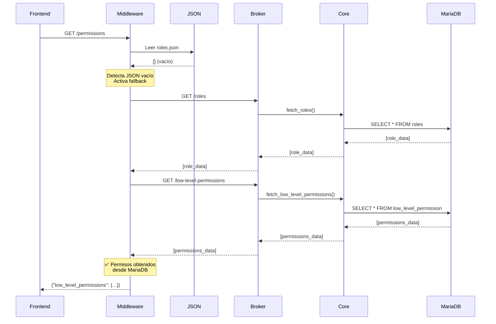

# 🔄 Mecanismo de Fallback para Permisos

**Fecha:** 2026-01-26  
**Componente:** Middleware (7_service_frontend)  
**Funcionalidad:** Consulta automática a MariaDB cuando archivos JSON están vacíos  
**Estado:** ✅ IMPLEMENTADO  

---

## 📋 Descripción

El middleware implementa un **mecanismo de fallback automático** para obtener permisos de usuarios cuando los archivos JSON locales están vacíos o incompletos. Este fallback consulta directamente la base de datos **MariaDB** a través del **broker backend**.

---

## 🎯 Problema que Resuelve

### Síntoma

Cuando los archivos de configuración de permisos están vacíos:
- `roles.json` → `[]`
- `low_level_permisions.json` → `[]`
- `basic_permissions.json` → `[]`

**Resultado:**
- ❌ Usuarios no tienen permisos asignados
- ❌ Botón "Backoffice" no aparece (requiere `training_create`)
- ❌ Funcionalidades bloqueadas sin razón aparente

### Solución: Fallback Automático

El middleware **detecta automáticamente** archivos JSON vacíos y consulta **MariaDB** como fuente alternativa de datos.

---

## 🏗️ Arquitectura del Fallback

### Flujo de Consulta de Permisos

```
┌─────────────────────────────────────────────────────────────┐
│ 1. Usuario hace login                                       │
│    ├─→ Frontend llama GET /permissions del middleware       │
│    └─→ Middleware ejecuta get_permissions(session)          │
└─────────────────────────────────────────────────────────────┘
                              ↓
┌─────────────────────────────────────────────────────────────┐
│ 2. Middleware: _get_low_level_permissions_for_role()        │
│    ├─→ Intenta cargar desde JSON local                      │
│    │   ├─→ Lee roles.json                                   │
│    │   └─→ Lee low_level_permisions.json                    │
│    └─→ ¿JSON vacío o incompleto?                            │
└─────────────────────────────────────────────────────────────┘
                              ↓
                    ┌─────────┴─────────┐
                    │   SÍ         NO   │
                    ↓                   ↓
        ┌──────────────────┐    ┌──────────────────┐
        │ 3A. FALLBACK     │    │ 3B. ÉXITO        │
        │ Consulta MariaDB │    │ Retorna permisos │
        └──────────────────┘    │ desde JSON       │
                    ↓            └──────────────────┘
┌─────────────────────────────────────────────────────────────┐
│ 3A. _get_low_level_permissions_from_broker_fallback()       │
│     ├─→ Llama broker_client.fetch_roles()                   │
│     │   └─→ Broker Backend (8_service_backend)              │
│     │       └─→ Backend Core (3_backend)                    │
│     │           └─→ MariaDB: SELECT * FROM roles            │
│     │                                                        │
│     ├─→ Llama broker_client.fetch_low_level_permissions()   │
│     │   └─→ Broker Backend (8_service_backend)              │
│     │       └─→ Backend Core (3_backend)                    │
│     │           └─→ MariaDB: SELECT * FROM low_level_permission│
│     │                                                        │
│     └─→ Retorna permisos desde MariaDB                      │
└─────────────────────────────────────────────────────────────┘
                              ↓
┌─────────────────────────────────────────────────────────────┐
│ 4. Resultado final                                          │
│    ├─→ Frontend recibe permisos (de JSON o MariaDB)         │
│    ├─→ SharedSessionState.load_user_data(permissions)       │
│    └─→ can_access_backoffice se evalúa correctamente        │
└─────────────────────────────────────────────────────────────┘
```

---

## 🔍 Jerarquía de Consulta

El middleware sigue esta jerarquía para obtener permisos:

### **Nivel 1: JSON Local (Primera Opción)**

```
1. Lee roles.json
   └─→ ¿Contiene datos? → SÍ → Continuar
       └─→ NO → Ir a Nivel 2
   
2. Lee low_level_permisions.json
   └─→ ¿Contiene datos? → SÍ → Retornar permisos
       └─→ NO → Ir a Nivel 2
```

**Ventajas:**
- ✅ Rápido (sin latencia de red)
- ✅ No depende de servicios externos
- ✅ Funciona offline

**Desventajas:**
- ❌ Puede estar desactualizado
- ❌ Puede estar vacío (error de configuración)

---

### **Nivel 2: MariaDB vía Broker (Fallback)**

```
1. Consulta broker_client.fetch_roles()
   └─→ Broker Backend
       └─→ Backend Core
           └─→ MariaDB: SELECT * FROM roles WHERE identity_type_id = ?
   
2. Consulta broker_client.fetch_low_level_permissions()
   └─→ Broker Backend
       └─→ Backend Core
           └─→ MariaDB: SELECT * FROM low_level_permission WHERE id_permissions = ?
   
3. Retorna permisos desde MariaDB
```

**Ventajas:**
- ✅ Siempre actualizado (fuente de verdad)
- ✅ Funciona cuando JSON está vacío
- ✅ Consistente con backend

**Desventajas:**
- ❌ Latencia de red (3 servicios)
- ❌ Requiere broker backend activo
- ❌ Requiere MariaDB activo

---

### **Nivel 3: Diccionario Vacío (Último Recurso)**

Si ambos niveles fallan:

```python
return {}  # Sin permisos
```

**Resultado:**
- ❌ Usuario no tiene ningún permiso
- ❌ Acceso denegado a todas las funcionalidades
- ❌ Botón "Backoffice" no aparece
- ⚠️ Error registrado en logs

---

## 📝 Logging Detallado

### **Caso 1: Éxito desde JSON (Normal)**

```log
2026-01-26 12:00:00 [DEBUG] Permisos cargados desde JSON local (identity_type_id=1, id_permissions=1, source=JSON)
```

---

### **Caso 2: JSON Vacío → Fallback a MariaDB**

```log
2026-01-26 12:00:01 [WARNING] roles.json está vacío (identity_type_id=1). Intentando fallback a MariaDB vía broker backend...
2026-01-26 12:00:01 [INFO] Fallback: Consultando roles desde MariaDB (identity_type_id=1)...
2026-01-26 12:00:02 [INFO] Fallback: Consultando low_level_permission desde MariaDB (id_permissions=1)...
2026-01-26 12:00:02 [INFO] ✅ Fallback exitoso: Permisos cargados desde MariaDB (identity_type_id=1, id_permissions=1, source=MariaDB, training_create=True, can_access_backoffice=posible)
```

---

### **Caso 3: Rol No Encontrado → Fallback**

```log
2026-01-26 12:00:03 [WARNING] Rol no encontrado en roles.json (identity_type_id=99). Intentando fallback a MariaDB vía broker backend...
2026-01-26 12:00:03 [INFO] Fallback: Consultando roles desde MariaDB (identity_type_id=99)...
2026-01-26 12:00:04 [ERROR] Fallback: Rol no encontrado en MariaDB (identity_type_id=99). Roles disponibles: [1, 2, 3, 4, 5, 10, 11, 12, 13]
```

---

### **Caso 4: Error de Comunicación con Broker**

```log
2026-01-26 12:00:05 [WARNING] low_level_permisions.json está vacío (identity_type_id=1). Intentando fallback a MariaDB vía broker backend...
2026-01-26 12:00:05 [INFO] Fallback: Consultando roles desde MariaDB (identity_type_id=1)...
2026-01-26 12:00:15 [ERROR] Fallback: Error al comunicarse con broker backend (identity_type_id=1): No se pudo contactar con el broker backend. No se pueden obtener permisos desde MariaDB.
```

---

## 🧪 Casos de Prueba

### **Test 1: JSON Vacío → Fallback Exitoso**

**Setup:**
```json
// roles.json
[]

// low_level_permisions.json
[]

// MariaDB: roles table
[
  {
    "identity_type_id": 1,
    "identity_type_name": "Superadministrador",
    "identity_type_group_permissions": [1]
  }
]

// MariaDB: low_level_permission table
[
  {
    "id_permissions": 1,
    "training_create": true,
    "user_create": true,
    ...
  }
]
```

**Resultado Esperado:**
```python
permisos = middleware.get_permissions(session)
assert permisos["low_level_permissions"]["training_create"] is True
assert "source=MariaDB" in logs
```

---

### **Test 2: JSON Completo → Sin Fallback**

**Setup:**
```json
// roles.json
[
  {
    "identity_type_id": 1,
    "identity_type_group_permissions": [1]
  }
]

// low_level_permisions.json
[
  {
    "id_permissions": 1,
    "training_create": true
  }
]
```

**Resultado Esperado:**
```python
permisos = middleware.get_permissions(session)
assert permisos["low_level_permissions"]["training_create"] is True
assert "source=JSON" in logs
assert "Fallback" not in logs
```

---

### **Test 3: JSON Incompleto → Fallback Parcial**

**Setup:**
```json
// roles.json
[
  {
    "identity_type_id": 1,
    "identity_type_group_permissions": [1]
  }
]

// low_level_permisions.json
[] // ← VACÍO

// MariaDB: low_level_permission table
[
  {
    "id_permissions": 1,
    "training_create": true
  }
]
```

**Resultado Esperado:**
```python
permisos = middleware.get_permissions(session)
assert permisos["low_level_permissions"]["training_create"] is True
assert "Fallback: Consultando low_level_permission desde MariaDB" in logs
```

---

### **Test 4: Todo Falla → Sin Permisos**

**Setup:**
```json
// roles.json
[]

// MariaDB: roles table
[] // ← VACÍO

// Broker backend: APAGADO
```

**Resultado Esperado:**
```python
permisos = middleware.get_permissions(session)
assert permisos["low_level_permissions"] == {}
assert "Error al comunicarse con broker backend" in logs
```

---

## 🔧 Implementación Técnica

### Código Modificado

**Archivo:** `src/apps/7_service_frontend/routermiddleware.py`

**Funciones Modificadas:**

1. **`_get_low_level_permissions_for_role(identity_type_id)`**
   - Agrega validaciones para detectar JSON vacío
   - Llama a `_get_low_level_permissions_from_broker_fallback()` si es necesario
   - Logging detallado de fuente de datos (JSON vs MariaDB)

2. **`_get_permissions_for_role(identity_type_id)`**
   - Mismo patrón de fallback para permisos básicos
   - Llama a `_get_basic_permissions_from_broker_fallback()` si es necesario

**Nuevas Funciones:**

3. **`_get_low_level_permissions_from_broker_fallback(identity_type_id)`**
   - Consulta `broker_client.fetch_roles()` → MariaDB
   - Consulta `broker_client.fetch_low_level_permissions()` → MariaDB
   - Manejo de errores con logging detallado
   - Retorna `{}` si todo falla

4. **`_get_basic_permissions_from_broker_fallback(identity_type_id)`**
   - Consulta `broker_client.fetch_roles()` → MariaDB
   - Consulta `broker_client.fetch_basic_permissions()` → MariaDB
   - Retorna `[]` si todo falla

---

### Diagrama de Secuencia



---

## ⚙️ Configuración

### Variables de Entorno

El fallback funciona en todos los modos de almacenamiento:

```bash
# Modo mock: JSON local primero, sin fallback necesario
STORAGE_MODE=mock

# Modo mock_and_db: JSON + replicación a MariaDB
STORAGE_MODE=mock_and_db
BROKER_BACKEND_BASE_URL=http://localhost:8008

# Modo db_only: MariaDB como fuente principal (fallback siempre activo)
STORAGE_MODE=db_only
BROKER_BACKEND_BASE_URL=http://localhost:8008
```

### Rutas de Archivos JSON

```bash
ROLES_DATA_PATH=/path/to/roles.json
LOW_LEVEL_PERMISSIONS_PATH=/path/to/low_level_permisions.json
BASIC_PERMISSIONS_PATH=/path/to/basic_permissions.json
```

---

## 🚀 Beneficios

### 1. **Resiliencia**
- ✅ Sistema funciona aunque JSON esté vacío
- ✅ No requiere intervención manual inmediata
- ✅ Degradación elegante

### 2. **Debugging Mejorado**
- ✅ Logs detallados indican fuente de datos
- ✅ Fácil identificar si problema está en JSON o MariaDB
- ✅ Warnings claros cuando se activa fallback

### 3. **Flexibilidad**
- ✅ Permite deployments sin datos iniciales en JSON
- ✅ MariaDB puede ser única fuente de verdad
- ✅ Migración gradual de JSON a DB

### 4. **Seguridad**
- ✅ Permisos siempre vienen de fuente confiable
- ✅ No hay permisos "hardcodeados" como fallback
- ✅ Si todo falla, acceso denegado por defecto

---

## ⚠️ Limitaciones y Consideraciones

### **1. Latencia Adicional**

Cuando se activa el fallback:
- **JSON local:** ~1ms
- **Fallback MariaDB:** ~50-200ms (3 servicios en cadena)

**Impacto:** Solo en el primer login después de archivos vacíos.

---

### **2. Dependencias Externas**

El fallback requiere:
- ✅ Broker backend activo (puerto 8008)
- ✅ Backend core activo (puerto 8003)
- ✅ MariaDB activo (puerto 3306)

**Si alguno falla:** Acceso denegado.

---

### **3. Logging Verboso**

El fallback genera muchos logs (INFO, WARNING, ERROR).

**Solución:** Configurar nivel de log adecuado en producción:

```python
# Producción: Solo ERROR
logging.getLogger("middlewarefe.router").setLevel(logging.ERROR)

# Development: DEBUG
logging.getLogger("middlewarefe.router").setLevel(logging.DEBUG)
```

---

### **4. No Cachea Resultado**

Cada vez que el JSON está vacío, se consulta MariaDB.

**Optimización futura:** Cachear permisos en Redis tras fallback exitoso.

---

## 📊 Monitoreo

### Métricas Recomendadas

**1. Tasa de Fallback**
```
fallback_rate = (consultas_mariadb / consultas_totales) * 100
```

**Objetivo:** < 5% (la mayoría debe usar JSON)

---

**2. Latencia de Fallback**
```
fallback_latency = tiempo_respuesta_mariadb - tiempo_respuesta_json
```

**Objetivo:** < 200ms

---

**3. Errores de Fallback**
```
fallback_errors = consultas_fallback_fallidas / consultas_fallback_totales
```

**Objetivo:** 0% (debe ser 100% confiable)

---

### Alertas Recomendadas

```yaml
- alert: HighFallbackRate
  expr: fallback_rate > 50%
  for: 5m
  severity: warning
  message: "Más del 50% de consultas usando fallback a MariaDB. Revisar sincronización de JSON."

- alert: FallbackErrors
  expr: fallback_errors > 0
  for: 1m
  severity: critical
  message: "Fallback a MariaDB está fallando. Usuarios pueden estar sin permisos."
```

---

## 🔄 Flujo Completo: Login de adminone

### Escenario: JSON Vacío

**1. Usuario hace login:**
```python
POST /login
{
  "username": "adminone",
  "password": "MyLLMPass123!",
  "otp": "9578"
}
```

**2. Middleware autentica y genera tokens**

**3. Frontend consulta permisos:**
```python
GET /permissions
Headers:
  Authorization: Bearer <access_token>
  X-Session-Token: <session_token>
```

**4. Middleware detecta JSON vacío:**
```log
[WARNING] roles.json está vacío (identity_type_id=1). Intentando fallback...
```

**5. Fallback consulta MariaDB:**
```log
[INFO] Fallback: Consultando roles desde MariaDB (identity_type_id=1)...
[INFO] Fallback: Consultando low_level_permission desde MariaDB (id_permissions=1)...
```

**6. Éxito:**
```log
[INFO] ✅ Fallback exitoso: Permisos cargados desde MariaDB (identity_type_id=1, training_create=True, source=MariaDB)
```

**7. Frontend recibe permisos:**
```json
{
  "user_id": 1,
  "organization_id": 1,
  "identity_type_id": 1,
  "low_level_permissions": {
    "training_create": true,
    "training_execute": true,
    "user_create": true,
    ...
  }
}
```

**8. Botón "Backoffice" aparece:**
```python
can_access_backoffice = is_logged_in and can_training_create
# True = True and True
# ✅ Botón renderizado
```

---

## 📚 Referencias

- **Código:** `src/apps/7_service_frontend/routermiddleware.py` (línea 1861+)
- **Broker Client:** `src/apps/7_service_frontend/broker_backend_client.py`
- **Jerarquía de permisos:** `AGENTS.md` (sección "Sincronización DB/JSON")
- **Issue relacionado:** Botón Backoffice no aparece → `docs/BACKOFFICE_BUTTON_FIX.md`

---

## ✅ Checklist de Implementación

- [x] Modificar `_get_low_level_permissions_for_role()` con fallback
- [x] Modificar `_get_permissions_for_role()` con fallback
- [x] Crear `_get_low_level_permissions_from_broker_fallback()`
- [x] Crear `_get_basic_permissions_from_broker_fallback()`
- [x] Agregar logging detallado (DEBUG, INFO, WARNING, ERROR)
- [x] Documentar mecanismo de fallback
- [ ] Crear tests unitarios para fallback
- [ ] Crear tests de integración (JSON vacío → MariaDB)
- [ ] Agregar métricas de monitoreo
- [ ] Configurar alertas en producción

---

**Implementado por:** @frontend-visionary & @backend-conductor  
**Fecha:** 2026-01-26  
**Relacionado con:** Sistema de permisos y autenticación
